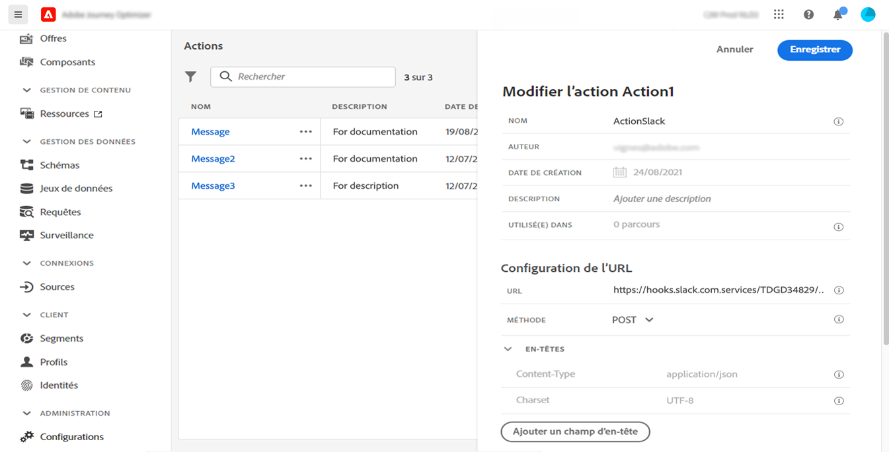
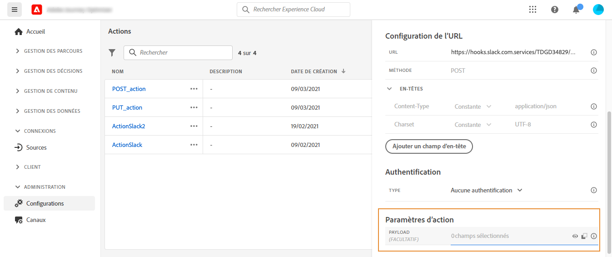
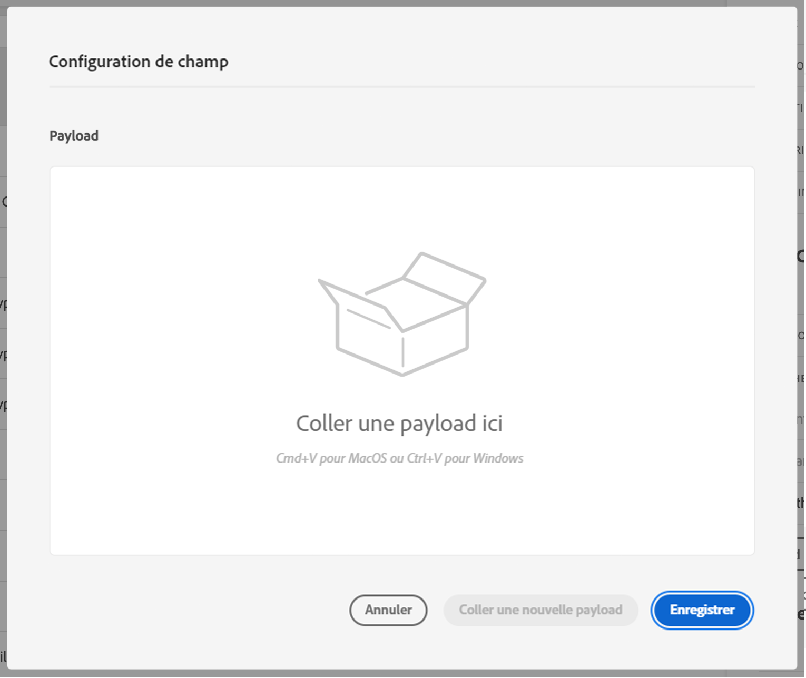

# Configurer une action personnalisée {#configure-an-action}

>[!CONTEXTUALHELP]
>id="ajo_journey_action_custom_configuration"
>title="Actions personnalisées "
>abstract="Si vous utilisez un système tiers pour envoyer des messages ou souhaitez que les parcours envoient des appels d’API à un système tiers, c’est à cet emplacement que vous configurez la connexion de ce système aux parcours. Par exemple, vous pouvez vous connecter aux systèmes suivants avec des actions personnalisées : Epsilon, Slack, [Adobe Developer](https://developer.adobe.com/), Firebase, etc."

Si vous utilisez un système tiers pour envoyer des messages ou souhaitez que les parcours envoient des appels d’API à un système tiers, c’est à cet emplacement que vous configurez la connexion de ce système aux parcours. Par exemple, vous pouvez vous connecter aux systèmes suivants avec des actions personnalisées : Epsilon, Slack, [Adobe Developer](https://developer.adobe.com){target=&quot;_blank&quot;}, Firebase, etc.

Les actions personnalisées sont des actions supplémentaires définies par les utilisateurs techniques et mises à la disposition des professionnels du marketing. Une fois configurés, elles apparaissent dans la palette gauche de votre parcours, dans la catégorie **[!UICONTROL Action]**. En savoir plus sur [cette page](../building-journeys/about-journey-activities.md#action-activities).

## Limites{#custom-actions-limitations}

Les actions personnalisées sont assorties de quelques limites répertoriées dans [cette page](../start/limitations.md).

Dans les paramètres d’action personnalisés, vous pouvez transmettre une collection simple, ainsi qu’une collection d’objets. En savoir plus au sujet de ces limites de collection sur [cette page](../building-journeys/collections.md#limitations).

Notez également qu’un format spécifique est attendu pour les paramètres d’action personnalisés (par exemple : chaîne, décimal, etc.). Vous devez veiller au respect de cette exigence. En savoir plus sur ce [cas d’utilisation](../building-journeys/collections.md).

## Étapes de configuration {#configuration-steps}

Les principales étapes nécessaires pour configurer une action personnalisée sont les suivantes :

1. Dans la section du menu ADMINISTRATION, sélectionnez **[!UICONTROL Configurations]**. Dans la section **[!UICONTROL Actions]**, cliquez sur **[!UICONTROL Gérer]**. Cliquez sur **[!UICONTROL Créer une action]** pour créer une nouvelle action. Le volet de configuration des actions s&#39;ouvre dans la droite de l&#39;écran.

   

1. Saisissez le nom de l&#39;action.

   >[!NOTE]
   >
   >N&#39;utilisez ni espaces ni caractères spéciaux. Utilisez 30 caractères au maximum.

1. Ajoutez une description à l&#39;action. Cette étape est facultative.
1. Le nombre de parcours qui font appel à cette action apparaît dans le champ **[!UICONTROL Utilisé(e) dans]**. Vous pouvez cliquer sur le bouton **[!UICONTROL Afficher les parcours]** pour faire apparaître la liste des parcours utilisant cette action.
1. Sélectionnez le canal associé à cette action personnalisée : **Email**, **SMS** ou **Notification push**. Il préremplit le champ d’action marketing requis avec l’action marketing par défaut pour le canal sélectionné. Si vous sélectionnez **other**, aucune action marketing ne sera définie.
1. Si vous souhaitez appliquer une règle de consentement à cette action personnalisée, sélectionnez la **Action marketing requise**. Consultez [cette section](../action/about-custom-action-configuration.md#consent-management).
1. Définissez les différents paramètres de **[!UICONTROL Configuration d&#39;URL]**. Consultez [cette section](../action/about-custom-action-configuration.md#url-configuration).
1. Configurez la section **[!UICONTROL Authentification]**. Cette configuration est la même que pour les sources de données.  Consultez [cette section](../datasource/external-data-sources.md#custom-authentication-mode).
1. Définissez les **[!UICONTROL paramètres d&#39;action]**. Consultez [cette section](../action/about-custom-action-configuration.md#define-the-message-parameters).
1. 
1. Cliquez sur **[!UICONTROL Enregistrer]**.

   L&#39;action personnalisée est maintenant configurée et prête à être utilisée dans vos parcours. Voir [cette page](../building-journeys/about-journey-activities.md#action-activities).

   >[!NOTE]
   >
   >Lorsqu&#39;une action personnalisée est utilisée dans un parcours, la plupart des paramètres sont en lecture seule. Vous ne pouvez modifier que les champs **[!UICONTROL Nom]**, **[!UICONTROL Description]**, **[!UICONTROL URL]** et la section **[!UICONTROL Authentification.]**

## Configuration d&#39;URL {#url-configuration}

Lors de la configuration d&#39;une action personnalisée, vous devez définir les paramètres de **[!UICONTROL configuration d&#39;URL]** suivants :

1. Dans le champ **[!UICONTROL URL]**, spécifiez l&#39;URL du service externe :

   * Si l’URL est statique, saisissez l’URL dans ce champ.

   * Si l’URL comprend un chemin dynamique, saisissez uniquement la partie statique de l’URL, c’est-à-dire le schéma, l’hôte, le port et, éventuellement, une partie statique du chemin.

      Exemple : `https://xxx.yyy.com/somethingstatic/`

      Vous spécifiez le chemin dynamique de l’URL lors de l’ajout de l’action personnalisée à un parcours. [En savoir plus](../building-journeys/using-custom-actions.md).
   >[!NOTE]
   >
   >Pour des raisons de sécurité, nous vous recommandons vivement d’utiliser le schéma HTTPS pour l’URL. L&#39;utilisation des adresses Adobe qui ne sont pas publiques et des adresses IP n&#39;est pas autorisée.
   >
   >Seuls les ports par défaut sont autorisés lors de la définition d’une action personnalisée : 80 pour http et 443 pour https.

1. Sélectionnez la **[!UICONTROL Méthode]** d&#39;appel : il peut s&#39;agir de **[!UICONTROL POST]** ou de **[!UICONTROL PUT]**.

   >[!NOTE]
   >
   > Le **DELETE** n’est pas prise en charge. Si vous devez mettre à jour une ressource existante, sélectionnez la **PUT** .

1. Dans la section **[!UICONTROL En-têtes]** , définissez les en-têtes HTTP du message de demande à envoyer au service externe :
   1. Pour ajouter un champ d’en-tête, cliquez sur **[!UICONTROL Ajouter un champ d’en-tête]**.
   1. Saisissez la clé du champ d’en-tête.
   1. Pour définir une valeur dynamique pour la paire clé-valeur, sélectionnez **[!UICONTROL Variable]**. Sinon, sélectionnez **[!UICONTROL Constante]**.

      Par exemple, pour un horodatage, vous pouvez définir une valeur dynamique.

   1. Si vous avez sélectionné **[!UICONTROL Constante]**, saisissez la valeur constante.

      Si vous avez sélectionné **[!UICONTROL Variable]**, vous spécifiez cette variable lors de l’ajout de l’action personnalisée à un parcours. [En savoir plus](../building-journeys/using-custom-actions.md).

      

   1. Pour supprimer un champ d’en-tête, pointez sur le champ d’en-tête et cliquez sur l’icône **[!UICONTROL Supprimer]** .
   Les champs d’en-tête **[!UICONTROL Type de contenu]** et **[!UICONTROL CharSet]** sont définis par défaut. Vous ne pouvez pas modifier ni supprimer ces champs.

   Après avoir ajouté l’action personnalisée à un parcours, vous pouvez toujours y ajouter des champs d’en-tête si le parcours est en état de brouillon. Si vous ne souhaitez pas que le parcours soit affecté par les modifications de configuration, dupliquez l’action personnalisée et ajoutez les champs d’en-tête à la nouvelle action personnalisée.

   >[!NOTE]
   >
   >Les en-têtes sont validés conformément à des règles d&#39;analyse. En savoir plus dans [cette documentation](https://tools.ietf.org/html/rfc7230#section-3.2.4){_blank}.

## Définition des paramètres d’action {#define-the-message-parameters}

Dans la section **[!UICONTROL Paramètres d&#39;action]**, collez un exemple de payload JSON à envoyer au service externe.

>[!NOTE]
>
>Les noms de champ de la payload ne peuvent pas contenir de caractère &quot;.&quot; . Ils ne peuvent pas commencer par le caractère &quot;$&quot;.

Vous aurez la possibilité de définir le type de paramètre (par exemple : string, integer, etc.).

Vous pourrez également préciser si le paramètre est une constante ou une variable :

* Le paramètre « Constante » signifie que la valeur du paramètre est définie dans le volet de configuration des actions par une personne ayant un rôle technique. La valeur reste identique dans tous les parcours et le marketeur ne la voit pas lors de l&#39;utilisation de l&#39;action personnalisée dans le parcours. Il peut s&#39;agir, par exemple, d&#39;un identifiant attendu par le système tiers. Dans ce cas, le champ situé à droite du bouton bascule Constante/Variable correspond à la valeur transmise.
* Le paramètre « Variable » signifie que la valeur du paramètre varie. Le marketeur qui utilise cette action personnalisée dans un parcours sera libre de transmettre la valeur de son choix ou bien d’indiquer où récupérer la valeur de ce paramètre (à partir de l’événement, d‘Adobe Experience Platform, etc.). Dans ce cas, le champ situé à droite du bouton bascule Constante/Variable correspond au libellé que le marketeur voit dans le parcours pour nommer ce paramètre.

## Gestion du consentement {#consent-management}

Les clients peuvent désormais définir des stratégies de consentement, liées à la confidentialité, pour contrôler les données sortantes lors de l’exécution de l’action. Une stratégie de consentement fonctionne comme une expression sur les attributs de profil, définissant des règles pour définir si une action peut être exécutée pour le profil donné ou non.

Consentement sur une action personnalisée, message encore Conxent a tel type de communication utilisation de tel de type de communication ou profile qui sticker ce consentement Conté AEP nuvelles regles de type policies auj gouvernance. Par exemple, Ciblage des emails réétrique. Libellé de l’association (C4/C5) a des actions marketing. Quand tu définis une destination, type d’action marketing. Ex SFTP crée une dest qui va exporter des données ce sftp, tu flague ce sftp avec une action marketing. La notion d&#39;élément de l&#39;action marketing rajoutée dans l&#39;action personnalisée, l&#39;action marketing email/SMS/push. Votre personnalisation.

Étiquettes : quand tu def data set (où tes data), data gouvernance, pr attribut tu define le type de label a cet attribut. Code de pays labellisé C3/C4. Labels ootb, tu ne pouvant pas être utile.

— Les commentaires de Jira—

décrire &quot;action marketing supplémentaire&quot; comme un moyen pour un praticien d’expliquer &quot;l’intention&quot; d’une action personnalisée, par exemple : mon action personnalisée concerne la communication sur l’entraînement, la newsletter, la communication sur la condition physique, etc.

Décrivez la portée du consentement pour cette première version :

- Les actions marketing et les attributs utilisés dans la personnalisation dans l&#39;action personnalisée sont pris en compte
- Pour les parcours déclenchés par un segment (démarrés avec un segment lu), les attributs utilisés comme critères dans ce segment sont pris en compte.
- Toutes les activités utilisées dans un parcours, autres qu’un segment de lecture ou une action personnalisée, ne sont pas prises en compte.
- La qualification de segment n’est pas prise en compte, même si elle est utilisée pour démarrer un parcours

Décrivez qu’un profil exclu par une stratégie de consentement dans une action personnalisée continuera à passer par le parcours (iso avec liste de messages et de suppression).

Pour décrire la latence attendue : https://wiki.corp.adobe.com/display/DMSArchitecture/Consent+Latency
+ correction de la latence AJO de 1h à 6h.

deux types de latence que nous devons documenter :

- La latence de l&#39;utilisateur, sur cette Carolina Infante, je ne sais pas ce que nous pouvons dire, en regardant ceci :

Pourrions-nous confirmer si nous avons besoin ou non de la &quot;projection/exportation UPS&quot;, afin de mettre à jour le champ &quot;contentTo&quot; au niveau du profil (sachant que c’est ce que nous utilisons au moment de l’exécution) ? Parce que si c&#39;est le cas, je suppose que nous devrions dire que cela prendrait jusqu&#39;à 48h, mais si ce n&#39;est pas le cas, nous parlons seulement de &quot;latence d&#39;ingestion + latence de collecte&quot; (c&#39;est-à-dire de quelques secondes à quelques heures dans le pire cas si l&#39;ingestion présente des pics ou des pannes et/ou si le client a besoin de temps pour collecter une mise à jour de l&#39;utilisateur).

- La latence de la politique de consentement, je dirais &quot;jusqu’à 6 heures&quot;, car les parcours en direct extraient les stratégies de consentement toutes les 6 heures. Carolina Infante, savez-vous si nous sommes impactés par la latence des filtres ?
