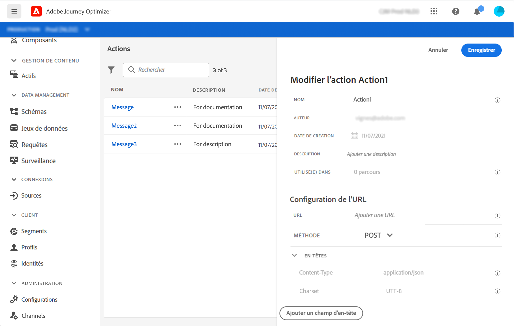
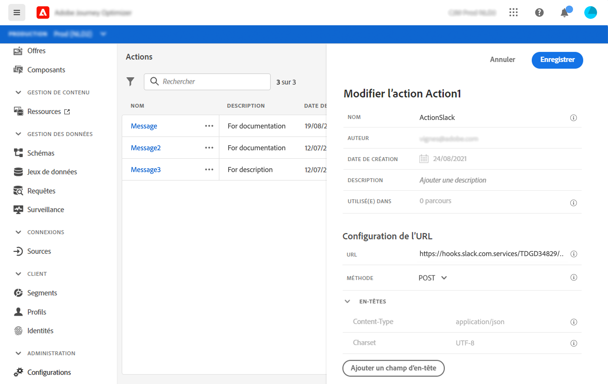
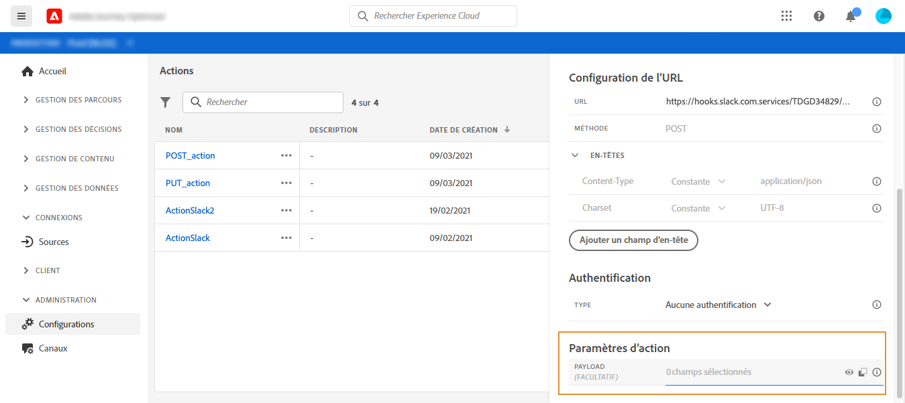
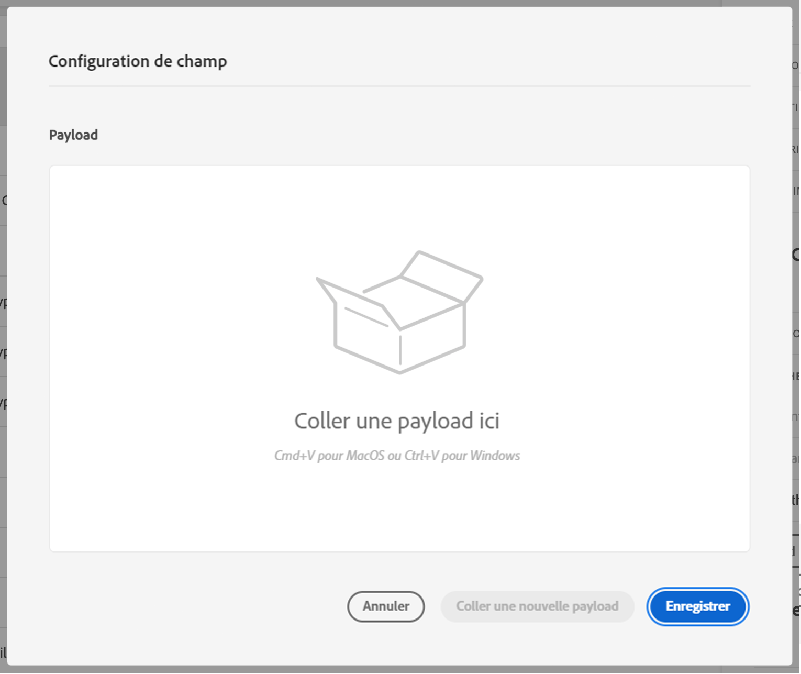
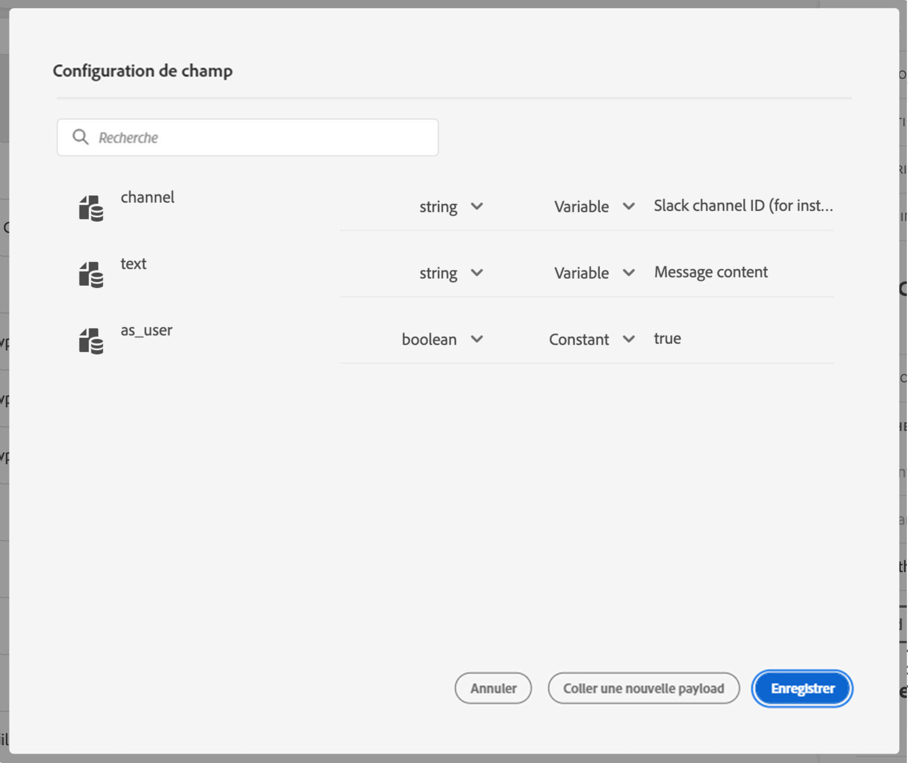

# Configurer une action {#configure-an-action}

Si vous utilisez un système tiers pour envoyer des messages ou si vous souhaitez que les parcours envoient des appels d&#39;API à un système tiers, vous devez configurer sa connexion aux parcours. L’action personnalisée définie par les utilisateurs techniques sera alors disponible dans la palette gauche du parcours, dans la catégorie **[!UICONTROL Action]** (voir [cette page](../building-journeys/about-journey-activities.md#action-activities). À titre d’exemple, Epsilon, Facebook, Adobe.io, Firebase, etc. sont des systèmes auxquels vous pouvez vous connecter à l’aide d’actions personnalisées.
Les limites sont répertoriées dans [cette page](../building-journeys/limitations.md).

Les principales étapes nécessaires pour configurer une action personnalisée sont les suivantes :

1. Dans la liste **[!UICONTROL Actions]**, cliquez sur **[!UICONTROL Ajouter]** pour créer une action. Le volet de configuration des actions s’ouvre dans la droite de l’écran.

   

1. Saisissez le nom de l’action.

   >[!NOTE]
   >
   >N’utilisez ni espaces ni caractères spéciaux. Utilisez 30 caractères au maximum.

1. Ajoutez une description à l’action. Cette étape est facultative.
1. Le nombre de parcours qui font appel à cette action apparaît dans le champ **[!UICONTROL Utilisé(e) dans]**. Vous pouvez cliquer sur le bouton **[!UICONTROL Afficher les parcours]** pour faire apparaître la liste des parcours utilisant cette action.
1. Définissez les différents paramètres de **[!UICONTROL Configuration d’URL]**. Voir [cette page](../action/about-custom-action-configuration.md#url-configuration).
1. Configurez la section **[!UICONTROL Authentification]**. Cette configuration est la même que pour les sources de données.  Consultez [cette section](../datasource/external-data-sources.md#section_wjp_nl5_nhb).
1. Définissez les **[!UICONTROL Paramètres de message]**. Voir [cette page](../action/about-custom-action-configuration.md#define-the-message-parameters).
1. Cliquez sur **[!UICONTROL Enregistrer]**.

   L’action personnalisée est maintenant configurée et prête à être utilisée dans vos parcours. Voir [cette page](../building-journeys/about-journey-activities.md#action-activities).

   >[!NOTE]
   >
   >Lorsqu’une action personnalisée est utilisée dans un parcours, la plupart des paramètres sont en lecture seule. Vous ne pouvez modifier que les champs **[!UICONTROL Nom]**, **[!UICONTROL Description]**, **[!UICONTROL URL]** et la section **[!UICONTROL Authentification.]**

## Configuration d’URL {#url-configuration}

Lors de la configuration d’une action personnalisée, vous devez définir les paramètres de **[!UICONTROL configuration d’URL]** suivants :

1. Ajoutez l’**[!UICONTROL URL]** du service externe.

   >[!NOTE]
   >
   >Nous vous recommandons vivement d’utiliser le protocole HTTPS pour des raisons de sécurité. L’utilisation des adresses Adobe qui ne sont pas publiques et des adresses IP n’est pas autorisée.

1. Sélectionnez la **[!UICONTROL Méthode]** d’appel : il peut s’agir de **[!UICONTROL POST]** ou de **[!UICONTROL PUT]**.
1. Dans la section **[!UICONTROL En-têtes]**, cliquez sur **[!UICONTROL Ajouter un champ d’en-tête]** pour définir une nouvelle paire clé/valeur. Ces en-têtes correspondent aux en-têtes HTTP de la requête adressée au service externe. Pour supprimer des paires clé/valeur, placez le curseur sur le champ **[!UICONTROL En-têtes]**, puis cliquez sur l’icône **[!UICONTROL Supprimer]**.

   Les en-têtes **[!UICONTROL Content-Type]** et **[!UICONTROL Charset]** sont définis par défaut et ne peuvent pas être supprimés ni remplacés.

   >[!NOTE]
   >
   >Les en-têtes sont validés conformément à ces [règles d’analyse](https://tools.ietf.org/html/rfc7230#section-3.2.4).

## Définir les paramètres de message {#define-the-message-parameters}

Dans la section **[!UICONTROL Paramètres de message]**, collez un exemple de payload JSON à envoyer au service externe.

Vous aurez la possibilité de définir le type de paramètre (par exemple : string, integer, etc.).

Vous pourrez également préciser si le paramètre est une constante ou une variable :

* Le paramètre « Constante » signifie que la valeur du paramètre est définie dans le volet de configuration des actions par une personne ayant un rôle technique. La valeur reste identique dans tous les parcours et le marketeur ne la voit pas lors de l’utilisation de l’action personnalisée dans le parcours. Il peut s’agir, par exemple, d’un identifiant attendu par le système tiers. Dans ce cas, le champ situé à droite du bouton bascule Constante/Variable correspond à la valeur transmise.
* Le paramètre « Variable » signifie que la valeur du paramètre varie. Le marketeur qui utilise cette action personnalisée dans un parcours peut transmettre la valeur de son choix ou bien indiquer où récupérer la valeur de ce paramètre (à partir de l’événement, d‘Adobe Experience Platform, etc.). Dans ce cas, le champ situé à droite du bouton bascule Constante/Variable correspond au libellé que le marketeur voit dans le parcours pour nommer ce paramètre.

