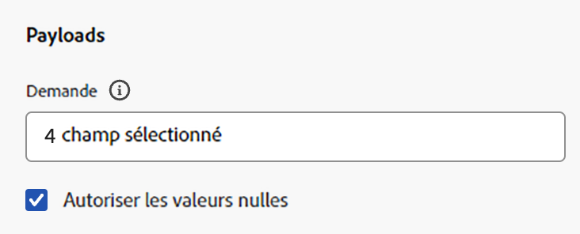

# Configurer une action personnalisée {#configure-a-custom-action}

>[!CONTEXTUALHELP]
>id="ajo_journey_action_custom_configuration"
>title="Actions personnalisées"
>abstract="Si vous utilisez un système tiers pour envoyer des messages ou souhaitez que les parcours envoient des appels API à un système tiers, utilisez des actions personnalisées pour configurer la connexion de ce système aux parcours."

Si vous utilisez un système tiers pour envoyer des messages ou souhaitez que les parcours envoient des appels API à un système tiers, utilisez des actions personnalisées pour configurer la connexion de ce système aux parcours. Par exemple, vous pouvez vous connecter aux systèmes suivants avec des actions personnalisées : Epsilon, Slack, [Adobe Developer](https://developer.adobe.com){target="_blank"}, Firebase, etc.

Les actions personnalisées sont des actions supplémentaires définies par les utilisateurs techniques et mises à la disposition des spécialistes marketing. Une fois configurés, elles apparaissent dans la palette gauche de votre parcours, dans la catégorie **[!UICONTROL Action]**. En savoir plus sur [cette page](../building-journeys/about-journey-activities.md#action-activities).

## Étapes de configuration {#configuration-steps}

Les principales étapes nécessaires pour configurer une action personnalisée sont les suivantes :

1. Dans la section du menu ADMINISTRATION, sélectionnez **[!UICONTROL Configurations]**. Dans la section **[!UICONTROL Actions]**, cliquez sur **[!UICONTROL Gérer]**. Cliquez sur **[!UICONTROL Créer une action]** pour créer une nouvelle action. Le volet de configuration des actions s&#39;ouvre dans la droite de l&#39;écran.

   

1. Saisissez le nom de l&#39;action.

   >[!NOTE]
   >
   >Seuls les caractères alphanumériques et les traits de soulignement sont autorisés. La longueur maximale est de 30 caractères.

1. Ajoutez une description à l&#39;action. Cette étape est facultative.
1. Le nombre de parcours qui font appel à cette action s’affiche dans le champ **[!UICONTROL Utilisé dans]**. Vous pouvez cliquer sur le bouton **[!UICONTROL Afficher les parcours]** pour afficher la liste des parcours utilisant cette action.
1. Définissez les différents paramètres de **[!UICONTROL Configuration d&#39;URL]**. Voir [cette page](../action/about-custom-action-configuration.md#url-configuration).
1. Configurez la section **[!UICONTROL Authentification]**. Cette configuration est la même que pour les sources de données.  Consultez [cette section](../datasource/external-data-sources.md#custom-authentication-mode).
1. Définissez les **[!UICONTROL paramètres d&#39;action]**. Voir [cette page](../action/about-custom-action-configuration.md#define-the-message-parameters).
1. Cliquez sur **[!UICONTROL Enregistrer]**.

   L&#39;action personnalisée est maintenant configurée et prête à être utilisée dans vos parcours. Voir [cette page](../building-journeys/about-journey-activities.md#action-activities).

   >[!NOTE]
   >
   >Lorsqu&#39;une action personnalisée est utilisée dans un parcours, la plupart des paramètres sont en lecture seule. Vous pouvez uniquement modifier les champs **[!UICONTROL Nom]**, **[!UICONTROL Description]**, **[!UICONTROL URL]** et la section **[!UICONTROL Authentification]**.

## Limites{#custom-actions-limitations}

Les actions personnalisées sont assorties de quelques limites répertoriées sur [cette page](../start/guardrails.md).

Dans les paramètres d’action personnalisée, vous pouvez transmettre une collection simple, ainsi qu’une collection d’objets. En savoir plus sur les limites de collection sur [cette page](../building-journeys/collections.md#limitations).

Notez également qu’un format spécifique est attendu pour les paramètres d’action personnalisés (par exemple : chaîne, décimal, etc.). Vous devez veiller au respect de cette exigence. En savoir plus sur ce [cas d’utilisation](../building-journeys/collections.md).

Les actions personnalisées prennent en charge le format JSON uniquement lors de l’utilisation de [requêtes](../action/about-custom-action-configuration.md#define-the-message-parameters) ou de [payloads de réponse](../action/action-response.md).

>[!NOTE]
>
>Lorsqu’un point d’entrée a un temps de réponse supérieur à 0,75 seconde, ses appels d’action personnalisée sont acheminés via un [service d’action personnalisée](../configuration/external-systems.md#response-time) lent dédié à la place du service par défaut.

## Bonnes pratiques{#custom-action-enhancements-best-practices}

Lorsque vous choisissez un point d’entrée à cibler à l’aide d’une action personnalisée, assurez-vous de ce qui suit :

* Ce point d’entrée peut prendre en charge le débit des parcours à l’aide de configurations de l’[API de limitation](../configuration/throttling.md) ou de l’[API de plafonnement](../configuration/capping.md) pour le limiter. Faites preuve de prudence si une configuration de limitation ne peut pas descendre sous 200 TPS. Tout point d’entrée ciblé devra prendre en charge au moins 200 TPS. En savoir plus sur les taux de traitement de parcours dans [cette section](../building-journeys/entry-management.md#journey-processing-rate).
* Ce point d’entrée doit avoir un temps de réponse aussi bas que possible. Selon le débit attendu, un temps de réponse élevé peut avoir un impact sur le débit réel.

Un plafond de 300 000 appels sur une minute est défini pour toutes les actions personnalisées. En outre, la limitation par défaut est effectuée par hôte et par sandbox. Par exemple, sur un sandbox, s’il existe deux points d’entrée avec le même hôte (par exemple, `https://www.adobe.com/endpoint1` et `https://www.adobe.com/endpoint2`), la limitation s’applique à tous les points d’entrée sous l’hôte adobe.com. Le point d’entrée 1 et le point d’entrée 2 partagent la même configuration de limitation. En outre, le fait qu’un point d’entrée atteigne la limite a un impact sur l’autre point d’entrée.

La limite par défaut de 300 000 appels par minute s’applique au niveau du domaine (c’est-à-dire example.com). Si vous avez besoin d’une limite supérieure, consultez les preuves d’utilisation du support Adobe et confirmez le débit de votre point d’entrée. Pour demander une augmentation de la limitation, fournissez des détails sur le volume d’appels et la capacité du point d’entrée attendus. Adobe peut personnaliser la limitation si le test de capacité démontre que le point d’entrée peut gérer un débit plus élevé. Pour connaître les bonnes pratiques, pensez à réduire le taux de lecture de l’audience, à restructurer les parcours ou à mettre en œuvre des activités d’attente pour échelonner les appels sortants et éviter les erreurs de limitation.

Cette limite a été définie en fonction de l’utilisation de la clientèle, afin de protéger les points d’entrée externes ciblés par des actions personnalisées. Vous devez prendre cela en compte dans vos parcours basés sur l’audience en définissant un taux de lecture approprié (5 000 profils/s lors de l’utilisation d’actions personnalisées). Si nécessaire, vous pouvez remplacer ce paramètre en définissant une limitation ou un ralentissement plus élevé via nos API de limitation/ralentissement. Consultez [cette page](../configuration/external-systems.md).

Vous ne devez pas cibler les points d’entrée publics avec des actions personnalisées pour diverses raisons :

* Sans limitation ou ralentissement approprié, il existe un risque d’envoyer trop d’appels à un point d’entrée public qui ne prend pas en charge un tel volume.
* Les données de profil peuvent être envoyées par le biais d’actions personnalisées, de sorte que le ciblage d’un point d’entrée public peut entraîner le partage accidentel d’informations personnelles en externe.
* Vous n’avez aucun contrôle sur les données renvoyées par les points d’entrée publics. Si un point d’entrée modifie son API ou commence à envoyer des informations incorrectes, celles-ci seront rendues disponibles dans les communications envoyées, avec des impacts négatifs potentiels.

## Consentement et gouvernance des données {#privacy}

Dans Journey Optimizer, vous pouvez appliquer des politiques de gouvernance des données et de consentement à vos actions personnalisées, afin d’empêcher l’exportation de champs spécifiques vers des systèmes tiers ou d’exclure les clients qui n’ont pas consenti à recevoir des communications par e-mail, push ou SMS. Pour plus d’informations, consultez les pages suivantes :

* [Gouvernance des données](../action/action-privacy.md).
* [Consentement](../action/action-privacy.md).

## Configuration du point d’entrée {#url-configuration}

Lors de la configuration d’une action personnalisée, vous devez définir les paramètres de **[!UICONTROL configuration de point d’entrée]** suivants :

{width="70%" align="left"}

1. Dans le champ **[!UICONTROL URL]**, spécifiez l&#39;URL du service externe :

   * Si l’URL est statique, saisissez l’URL dans ce champ.

   * Si l’URL comprend un chemin dynamique, saisissez uniquement la partie statique de l’URL, c’est-à-dire le schéma, l’hôte, le port et, éventuellement, une partie statique du chemin.

     Exemple : `https://xxx.yyy.com/somethingstatic/`

     Vous spécifiez le chemin dynamique de l’URL lors de l’ajout de l’action personnalisée à un parcours. [En savoir plus](../building-journeys/using-custom-actions.md).

   >[!NOTE]
   >
   >Pour des raisons de sécurité, nous vous recommandons vivement d’utiliser le schéma HTTPS pour l’URL. L’utilisation des adresses Adobe qui ne sont pas publiques et des adresses IP n’est pas autorisée.
   >
   >Seuls les ports par défaut sont autorisés lors de la définition d’une action personnalisée : 80 pour http et 443 pour https.

1. Sélectionnez la **[!UICONTROL Méthode]** d’appel : il peut s’agir de **[!UICONTROL POST]**, **[!UICONTROL GET]** ou **[!UICONTROL PUT]**.

   >[!NOTE]
   >
   > Le méthode **DELETE** n’est pas prise en charge. Si vous devez mettre à jour une ressource existante, sélectionnez la méthode **PUT**.

1. Gérer les redirections potentielles (réponses 302). Les **actions personnalisées** suivent automatiquement les redirections HTTP 302, demande par demande.

1. Définissez les en-têtes et les paramètres de requête :

   * Dans la section **[!UICONTROL En-têtes]**, cliquez sur **[!UICONTROL Ajouter un champ d’en-tête]** pour définir les en-têtes HTTP du message de requête à envoyer au service externe. Les champs d’en-tête **[!UICONTROL Type de contenu]** et **[!UICONTROL Charset]** sont définis par défaut. Vous ne pouvez pas supprimer ces champs. Seul l’en-tête **[!UICONTROL Content-Type]** peut être modifié. Sa valeur doit respecter le format JSON. Voici la valeur par défaut :

   

   * Dans la section **[!UICONTROL Paramètres de requête]**, cliquez sur **[!UICONTROL Ajouter un champ de paramètre de requête]** pour définir les paramètres à ajouter à l’URL.

   

1. Saisissez le libellé ou le nom du champ.

1. Sélectionnez le type : **[!UICONTROL Constant]** ou **[!UICONTROL Variable]**. Si vous avez sélectionné **[!UICONTROL Constant]**, saisissez la valeur constante dans le champ **[!UICONTROL Valeur]**. Si vous avez sélectionné **[!UICONTROL Variable]**, vous spécifiez cette variable lors de l’ajout de l’action personnalisée à un parcours. [En savoir plus](../building-journeys/using-custom-actions.md).

   

   >[!NOTE]
   >
   >Après avoir ajouté l’action personnalisée à un parcours, vous pouvez toujours y ajouter des champs d’en-tête si le parcours a le statut de brouillon. Si vous ne souhaitez pas que le parcours soit affecté par les modifications de configuration, dupliquez l’action personnalisée et ajoutez les champs d’en-tête à la nouvelle action personnalisée.
   >
   >Les en-têtes sont validés conformément à des règles d’analyse. Pour plus d’informations, consultez [cette documentation](https://tools.ietf.org/html/rfc7230#section-3.2.4){_blank}.

## Couche de sécurité du transport {#tls}

### Prise en charge du protocole TLS {#tls-protocol-support}

Adobe Journey Optimizer prend en charge TLS 1.3 par défaut pour les actions personnalisées. Si un client prend également en charge TLS 1.3, la communication s’effectue via TLS 1.3. Sinon, le processus de négociation TLS peut revenir à TLS 1.2.

### Prise en charge du protocole mTLS {#mtls-protocol-support}

Vous pouvez utiliser le protocole mTLS (Mutual Transport Layer Security) pour améliorer la sécurité des connexions sortantes aux actions personnalisées Adobe Journey Optimizer. Le protocole mTLS est une méthode de sécurité de bout en bout pour une authentification mutuelle qui garantit que les deux parties qui partagent des informations sont celles qu’elles prétendent être avant que les données ne soient partagées. Le protocole mTLS inclut une étape supplémentaire par rapport à TLS, dans laquelle le serveur demande également le certificat du client et le vérifie de son côté.

L’authentification TLS mutuelle (mTLS) est prise en charge dans les actions personnalisées. Aucune configuration supplémentaire n’est requise dans l’action personnalisée ou le parcours pour activer mTLS. Cela se produit automatiquement lorsqu’un point d’entrée compatible avec mTLS est détecté. [En savoir plus](https://experienceleague.adobe.com/fr/docs/experience-platform/landing/governance-privacy-security/encryption#mtls-protocol-support).

## Définir les paramètres de payload {#define-the-message-parameters}

Vous pouvez définir le paramètre de payload comme décrit ci-dessous :

1. Dans la section **[!UICONTROL Requête]**, collez un exemple de payload JSON à envoyer au service externe. Ce champ est facultatif et disponible uniquement pour les méthodes d’appel POST et PUT.

   Activez l’option **[!UICONTROL Autoriser les valeurs nulles]** pour conserver les valeurs nulles dans l’appel externe. Notez que l’envoi de tableaux d’entiers, de chaînes, etc. avec des valeurs nulles n’est pas entièrement pris en charge. Par exemple, le tableau suivant d’entiers `[1, null, 2, 3]` est envoyé en tant que `[1, 2, 3]` même si cette option est cochée. En outre, si ce tableau est nul, il est envoyé en tant que tableau vide.

   {width="70%" align="left"}

1. Dans la section **[!UICONTROL Réponse]**, collez un exemple de payload renvoyée par l’appel. Ce champ est facultatif et disponible pour toutes les méthodes d’appel. Pour plus d’informations sur l’utilisation des réponses d’appel API dans les actions personnalisées, reportez-vous à [cette page](../action/action-response.md).

>[!NOTE]
>
>Les noms de champ dans le payload ne peuvent pas contenir de caractère de point (`.`) ni commencer par un caractère `$`.
>

Dans la configuration des champs, vous devez procédez comme suit :

* Sélectionnez le type de paramètre, par exemple : chaîne, entier, etc.

* Définissez une constante ou un paramètre de variable :

   * Le paramètre « **Constant** » signifie que la valeur du paramètre est définie dans le volet de configuration des actions par une persona ayant un rôle technique. La valeur reste identique dans tous les parcours Cet élément ne varie pas et les spécialistes du marketing ne le voient pas lors de l’utilisation de l’action personnalisée dans le parcours. Il peut s’agir, par exemple, d’un identifiant attendu par le système tiers. Dans ce cas, la valeur constante est définie sur le champ à droite du bouton (bascule) Constante/Variable.

   * Le paramètre « **Variable** » signifie que la valeur du paramètre peut varier. Les spécialistes marketing qui utilisent cette action personnalisée dans un parcours sont libres de transmettre la valeur de leur choix ou bien d’indiquer où récupérer la valeur de ce paramètre (à partir de l’événement, d‘Adobe Experience Platform, etc.). Dans ce cas, le champ situé à droite du bouton (bascule) Constante/Variable correspond au libellé que la personne spécialisée dans le marketing voit dans le parcours pour nommer ce paramètre.

  Pour les paramètres facultatifs, activez l’option **[!UICONTROL Est facultatif]** à la fin de la ligne. En cochant cette option, vous marquez le paramètre comme non obligatoire et laissez les personnes praticiennes du parcours choisir de le remplir ou non lors de la création de cette action personnalisée dans un parcours.

>[!NOTE]
>
>Si vous configurez des paramètres facultatifs tout en autorisant des valeurs nulles, les paramètres non renseignés par une personne praticienne de parcours sont envoyés comme valeurs nulles.
>

* [Résolution des problèmes liés aux actions personnalisées](../action/troubleshoot-custom-action.md) : découvrez comment résoudre les problèmes liés à une action personnalisée.

## Ressources supplémentaires

Parcourez les sections suivantes pour en savoir plus sur la configuration des actions personnalisées, l’utilisation de celles-ci et la résolution des problèmes liés à celles-ci :

* [Prise en main des actions personnalisées](../action/action.md) : découvrez en quoi consiste une action personnalisée et comment elle permet de vous connecter à vos systèmes tiers.
* [Utiliser des actions personnalisées](../building-journeys/using-custom-actions.md) : découvrez comment utiliser des actions personnalisées dans vos parcours.
* [Résolution des problèmes liés aux actions personnalisées](../action/troubleshoot-custom-action.md) : découvrez comment résoudre les problèmes liés à une action personnalisée.
* [Transmettre des collections dans des paramètres d’action personnalisés](../building-journeys/collections.md) : découvrez comment transmettre une collection dans des paramètres d’action personnalisés qui est renseignée dynamiquement au moment de l’exécution.

