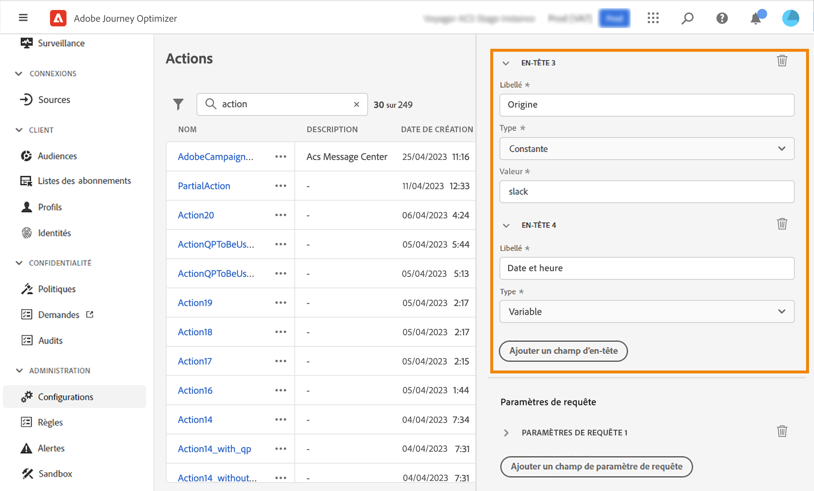

# Configuration d’une action personnalisée {#configure-an-action}

>[!CONTEXTUALHELP]
>id="ajo_journey_action_custom_configuration"
>title="Actions personnalisées"
>abstract="Si vous utilisez un système tiers pour envoyer des messages ou si vous souhaitez que les parcours envoient des appels d’API à un système tiers, utilisez des actions personnalisées pour configurer sa connexion à votre parcours. Par exemple, vous pouvez vous connecter aux systèmes suivants avec des actions personnalisées : Epsilon, Slack, [Adobe Developer](https://developer.adobe.com), Firebase, etc."

Si vous utilisez un système tiers pour envoyer des messages ou si vous souhaitez que les parcours envoient des appels d’API à un système tiers, utilisez des actions personnalisées pour configurer sa connexion à votre parcours. Par exemple, vous pouvez vous connecter aux systèmes suivants avec des actions personnalisées : Epsilon, Slack, [Adobe Developer](https://developer.adobe.com){target=&quot;_blank&quot;}, Firebase, etc.

Les actions personnalisées sont des actions supplémentaires définies par les utilisateurs techniques et mises à la disposition des marketeurs. Une fois configurés, ils apparaissent dans la palette gauche de votre parcours, dans la **[!UICONTROL Action]** catégorie. En savoir plus dans [cette page](../building-journeys/about-journey-activities.md#action-activities).

## Limites{#custom-actions-limitations}

Les actions personnalisées sont assorties de quelques limites répertoriées dans la section [cette page](../start/guardrails.md).

Dans les paramètres d’action personnalisés, vous pouvez transmettre une collection simple, ainsi qu’une collection d’objets. En savoir plus sur les limites des collections dans [cette page](../building-journeys/collections.md#limitations).

Notez également que les paramètres des actions personnalisées ont un format attendu (exemple : string, decimal, etc.). Vous devez veiller à respecter ces formats attendus. En savoir plus à ce sujet [cas pratique](../building-journeys/collections.md).

## Consentement et gouvernance des données {#privacy}

Dans Journey Optimizer, vous pouvez appliquer des stratégies de gouvernance des données et de consentement à vos actions personnalisées pour empêcher l’exportation de champs spécifiques vers des systèmes tiers ou exclure les clients qui n’ont pas consenti à recevoir des communications par courrier électronique, push ou SMS. Pour plus d&#39;informations, consultez les pages suivantes :

* [Gouvernance des données](../action/action.md).
* [Consentement](../action/action.md).

## Etapes de configuration {#configuration-steps}

Voici les principales étapes requises pour configurer une action personnalisée :

1. Dans la section du menu ADMINISTRATION, sélectionnez **[!UICONTROL Configurations]**. Dans le  **[!UICONTROL Actions]** , cliquez sur **[!UICONTROL Manage]**. Cliquez sur **[!UICONTROL Create Action]** pour créer une action. Le volet de configuration des actions s’ouvre sur le côté droit de l’écran.

   

1. Saisissez le nom de votre action.

   >[!NOTE]
   >
   >N’utilisez ni espaces ni caractères spéciaux. N’utilisez pas plus de 30 caractères.

1. Ajoutez une description à votre action. Cette étape est facultative.
1. Le nombre de parcours qui utilisent cette action s’affiche dans la variable **[!UICONTROL Used in]** champ . Vous pouvez cliquer sur le bouton **[!UICONTROL View journeys]** pour afficher la liste des parcours utilisant cette action.
1. Définir les différentes **[!UICONTROL URL Configuration]** paramètres. Voir [cette page](../action/about-custom-action-configuration.md#url-configuration).
1. Configurez la variable **[!UICONTROL Authentication]** . Cette configuration est la même que pour les sources de données.  Voir [cette section](../datasource/external-data-sources.md#custom-authentication-mode).
1. Définissez la variable **[!UICONTROL Action parameters]**. Voir [cette page](../action/about-custom-action-configuration.md#define-the-message-parameters).
1. Cliquez sur **[!UICONTROL Save]**.

   L’action personnalisée est maintenant configurée et prête à être utilisée dans vos parcours. Voir [cette page](../building-journeys/about-journey-activities.md#action-activities).

   >[!NOTE]
   >
   >Lorsqu’une action personnalisée est utilisée dans un parcours, la plupart des paramètres sont en lecture seule. Vous pouvez uniquement modifier la variable **[!UICONTROL Name]**, **[!UICONTROL Description]**, **[!UICONTROL URL]** et le champ **[!UICONTROL Authentication]** .

## Configuration d’URL {#url-configuration}

Lors de la configuration d’une action personnalisée, vous devez définir ce qui suit : **[!UICONTROL URL Configuration]** parameters:

1. Dans le **[!UICONTROL URL]** , indiquez l’URL du service externe :

   * Si l’URL est statique, saisissez l’URL dans ce champ.

   * Si l’URL comprend un chemin dynamique, saisissez uniquement la partie statique de l’URL, c’est-à-dire le schéma, l’hôte, le port et, éventuellement, une partie statique du chemin.

      Exemple : `https://xxx.yyy.com/somethingstatic/`

      Vous spécifiez le chemin dynamique de l’URL lors de l’ajout de l’action personnalisée à un parcours. [En savoir plus](../building-journeys/using-custom-actions.md).
   >[!NOTE]
   >
   >Pour des raisons de sécurité, nous vous recommandons vivement d’utiliser le schéma HTTPS pour l’URL. Nous n’autorisons pas l’utilisation d’adresses Adobe qui ne sont pas publiques et d’adresses IP.
   >
   >Seuls les ports par défaut sont autorisés lors de la définition d’une action personnalisée : 80 pour http et 443 pour https.

1. Sélectionner l’appel **[!UICONTROL Method]**: peut être soit **[!UICONTROL POST]** ou **[!UICONTROL PUT]**.

   >[!NOTE]
   >
   > Le **DELETE** n’est pas prise en charge. Si vous devez mettre à jour une ressource existante, sélectionnez la **PUT** .

1. Dans le **[!UICONTROL Headers]** , définissez les en-têtes HTTP du message de requête à envoyer au service externe :
   1. Pour ajouter un champ d’en-tête, cliquez sur **[!UICONTROL Add a header field]**.
   1. Saisissez la clé du champ d’en-tête.
   1. Pour définir une valeur dynamique pour la paire clé-valeur, sélectionnez **[!UICONTROL Variable]**. Sinon, sélectionnez **[!UICONTROL Constant]**.

      Par exemple, pour un horodatage, vous pouvez définir une valeur dynamique.

   1. Si vous avez sélectionné **[!UICONTROL Constant]**, puis saisissez la valeur constante.

      Si vous avez sélectionné **[!UICONTROL Variable]**, vous devez ensuite spécifier cette variable lors de l’ajout de l’action personnalisée à un parcours. [En savoir plus](../building-journeys/using-custom-actions.md).

      

   1. Pour supprimer un champ d’en-tête, pointez sur le champ d’en-tête et cliquez sur le bouton **[!UICONTROL Delete]** icône .
   Le **[!UICONTROL Content-Type]** et **[!UICONTROL Charset]** les champs d’en-tête sont définis par défaut. Vous ne pouvez pas modifier ni supprimer ces champs.

   Après avoir ajouté l’action personnalisée à un parcours, vous pouvez toujours y ajouter des champs d’en-tête si le parcours est à l’état de brouillon. Si vous ne souhaitez pas que le parcours soit affecté par les modifications de configuration, dupliquez l’action personnalisée et ajoutez les champs d’en-tête à la nouvelle action personnalisée.

   >[!NOTE]
   >
   >Les en-têtes sont validés conformément aux règles d’analyse des champs. En savoir plus dans [cette documentation](https://tools.ietf.org/html/rfc7230#section-3.2.4){_blank}.

## Définition des paramètres d’action {#define-the-message-parameters}

Dans le **[!UICONTROL Action parameters]** collez un exemple de payload JSON à envoyer au service externe.

>[!NOTE]
>
>L’exemple de payload ne peut pas contenir de valeurs null. Les noms de champ de la payload ne peuvent pas contenir de &quot;.&quot; caractère. Ils ne peuvent pas commencer par un caractère &quot;$&quot;.

Vous pourrez définir le type de paramètre (par exemple : string, integer, etc.).

Vous aurez également la possibilité de spécifier si un paramètre est une constante ou une variable :

* Constante signifie que la valeur du paramètre est définie dans le volet de configuration des actions par un personnage technique. La valeur sera toujours la même dans tous les parcours. Elle ne varie pas et le marketeur ne la voit pas lors de l’utilisation de l’action personnalisée dans le parcours. Il peut s’agir, par exemple, d’un identifiant attendu par le système tiers. Dans ce cas, le champ situé à droite du bouton bascule Constante/Variable est la valeur transmise.
* Variable signifie que la valeur du paramètre varie. Les marketeurs qui utilisent cette action personnalisée dans un parcours peuvent transmettre la valeur de leur choix ou indiquer où récupérer la valeur de ce paramètre (à partir de l’événement, d’Adobe Experience Platform, etc.). Dans ce cas, le champ situé à droite du bouton bascule Constante/Variable correspond au libellé que les marketeurs verront dans le parcours pour nommer ce paramètre.

