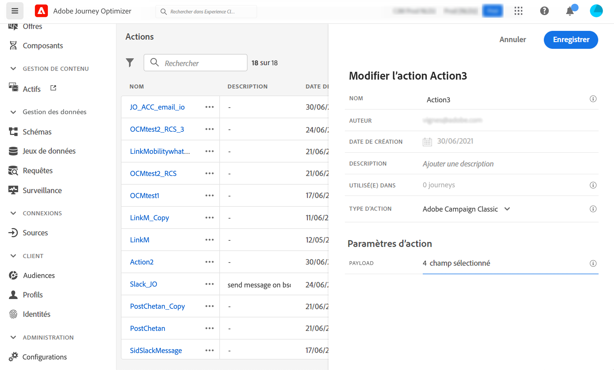

# Intégration à Adobe Campaign v7/v8 {#integrating-with-adobe-campaign-v7-v8}

>[!CONTEXTUALHELP]
>id="ajo_journey_action_acc"
>title="Actions d&#39;Adobe Campaign v7/v8"
>abstract="Cette intégration est disponible pour Adobe Campaign v7 et v8. Elle permet d&#39;envoyer des e-mails, des notifications push et des SMS à l&#39;aide des fonctionnalités de messagerie transactionnelle d&#39;Adobe Campaign. La connexion entre les instances Journey Optimizer et Campaign est configurée par Adobe au moment de l’approvisionnement."

Si vous utilisez Adobe Campaign Classic v7 ou Campaign v8, une action personnalisée spécifique est disponible dans vos parcours afin d’intégrer Adobe Journey Optimizer à Adobe Campaign. Cette intégration vous permet d’envoyer des e-mails, des notifications push et des SMS à l’aide des fonctionnalités de messagerie transactionnelle d’Adobe Campaign. En savoir plus dans ce [cas d’utilisation complet](../building-journeys/ajo-ac.md).

Pour chaque action configurée, une [activité d’action Campaign](../building-journeys/using-adobe-campaign-v7-v8.md) est disponible dans la palette du concepteur de parcours.

## Activation {#access}

En cas de demande, la connexion entre les environnements Journey Optimizer et Adobe Campaign est configurée par Adobe au moment de l’approvisionnement. Si vous n’avez pas demandé la connexion lors de l’approvisionnement, contactez l’assistance Adobe Journey Optimizer pour en demander l’activation. Vous devez fournir les informations suivantes :

>[!BEGINTABS]

>[!TAB Pour Adobe Journey Optimizer]

* ID d’organisation (OrgID Adobe)
* Nom du sandbox

>[!TAB Pour Adobe Campaign]

* URL du serveur Campaign
* URL du serveur temps réel
* Votre version d’Adobe Campaign

>[!ENDTABS]


## Mécanismes de sécurisation et limitations {#important-notes}

* Il n’y a pas de limitation des messages. Le système limite à 4 000 le nombre de messages pouvant être envoyés toutes les 5 minutes, en fonction du contrat SLA Campaign actuel. C’est la raison pour laquelle Journey Optimizer ne devrait être utilisé que dans des cas d’utilisation unitaires (événements individuels, pas d’audiences).

* Vous devez configurer une action sur la zone de travail pour chaque modèle à utiliser. Vous devez configurer une action dans Journey Optimizer pour chaque modèle que vous souhaitez utiliser dans Adobe Campaign.

* Nous vous recommandons d’utiliser une instance Message Center hébergée ou Managed Services dédiée pour cette intégration afin d’éviter d’impacter les autres opérations de Campaign en cours. Le serveur marketing peut être hébergé ou On-Premise.<!--The build required is 21.1 Release Candidate or greater. -->

* Il n’existe aucune validation indiquant le caractère correct du message Campaign ou de la payload.

* Vous ne pouvez pas utiliser une action de campagne avec un événement de qualification d’audience.

## Conditions préalables {#prerequisites}

Dans Adobe Campaign, vous devez créer et publier un message transactionnel ainsi que l’événement associé. Reportez-vous à la [documentation d’Adobe Campaign ](https://experienceleague.adobe.com/fr/docs/campaign/campaign-v8/send/real-time/transactional){target="_blank"}.

Vous pouvez créer la payload JSON correspondant à chaque message selon le modèle ci-dessous. Vous devrez ensuite coller cette payload lors de la configuration de l’action dans Journey Optimizer (voir ci-dessous).

+++ Exemple

```json
{
    "channel": "email",
    "eventType": "welcome",
    "email": "Email address",
    "ctx": {
        "firstName": "First name"
    }
}
```

* **channel** : le canal défini pour votre modèle transactionnel Campaign
* **eventType** : le nom interne de votre événement Campaign
* **ctx** : variable basée sur la personnalisation contenue dans votre message

+++

## Configurer l’action {#configure-action}

Dans Journey Optimizer, vous devez configurer une action par message transactionnel.

Pour créer une action Campaign, procédez comme suit :

1. Créez une action. [Découvrez comment créer des actions personnalisées](../action/action.md).
1. Saisissez un nom et une description.
1. Dans le champ **[!UICONTROL Type d’action]**, sélectionnez **[!UICONTROL Adobe Campaign Classic]**.
   
1. Cliquez dans le champ **[!UICONTROL Payload]** et collez un exemple de payload JSON correspondant au message Campaign Contactez Adobe pour obtenir cette payload.
1. Définissez chaque champ comme statique ou variable selon que vous souhaitez le mapper ou non sur la zone de travail du parcours. Par exemple, les champs tels que les paramètres de canal e-mail et les champs de personnalisation (`ctx`) doivent généralement être définis en tant que variables afin de pouvoir s’adapter dynamiquement au sein du parcours.
1. Cliquez sur **[!UICONTROL Enregistrer]**.

## Mettre à jour une action existante {#update-action}

Si vous devez mettre à jour une action personnalisée Campaign v7/v8 existante, par exemple lorsque le point d’entrée en temps réel (RT) change après la configuration initiale, procédez comme suit :

1. Dans le menu **[!UICONTROL Administration]**, sélectionnez **[!UICONTROL Configurations]**, puis accédez à **[!UICONTROL Actions]**.
1. Recherchez et sélectionnez l’action Campaign à mettre à jour dans la liste des actions.
1. Cliquez sur **[!UICONTROL Modifier]** pour ouvrir la configuration de l’action.
1. Mettez à jour le champ **[!UICONTROL URL]** avec la nouvelle URL du point d’entrée RT. Assurez-vous que le format du point d’entrée est correct et accessible.
1. Si nécessaire, mettez à jour la configuration **[!UICONTROL Payload]** pour qu’elle corresponde à toutes les modifications apportées à la structure du message transactionnel Campaign.
1. Cliquez sur **[!UICONTROL Tester]** pour valider la connexion au nouveau point d’entrée. Vérifiez que le test renvoie une réponse réussie avant de continuer.
1. Une fois la validation effectuée, cliquez sur **[!UICONTROL Enregistrer]** pour appliquer vos modifications.

>[!NOTE]
>
>Tous les parcours qui utilisent cette action utiliseront automatiquement la configuration mise à jour. Si des parcours en direct utilisent cette action, surveillez-les étroitement après la mise à jour du point d’entrée pour assurer une diffusion correcte des messages.

