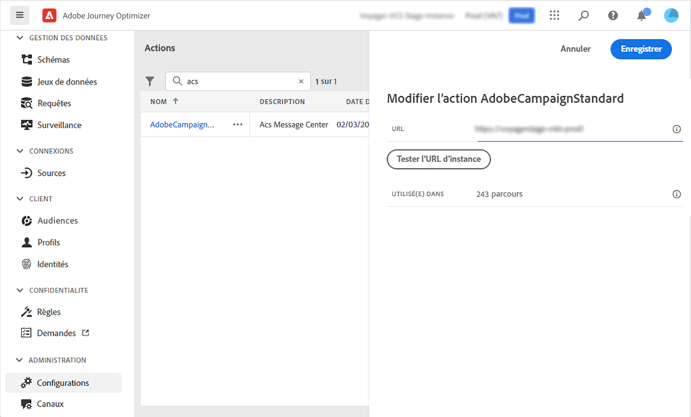

# Intégration à Adobe Campaign Standard {#using_adobe_campaign_standard}

Si vous disposez d’Adobe Campaign Standard, une action intégrée est disponible pour permettre la connexion à Adobe Campaign Standard. Vous pouvez envoyer des e-mails, des notifications push et des SMS à l’aide des fonctionnalités de messagerie transactionnelle d’Adobe Campaign Standard.

Le message transactionnel Campaign Standard et son événement associé doivent être publiés pour être utilisés dans Journey Optimizer. Si l’événement est publié mais que le message ne l’est pas, il ne sera pas visible dans l’interface de Journey Optimizer. Si le message est publié mais que son événement associé ne l’est pas, il sera visible dans l’interface de Journey Optimizer, mais il ne sera pas utilisable.

## Mécanismes de sécurisation et limitations {#important-notes}

* Une règle de limitation de 4 000 appels toutes les 5 minutes est automatiquement définie pour les actions Adobe Campaign Standard. Pour en savoir plus sur les SLA de messagerie transactionnelle, consultez la [description du produit Adobe Campaign Standard](https://helpx.adobe.com/fr/legal/product-descriptions/campaign-standard.html){target="_blank"}.

* L’intégration d’Adobe Campaign Standard est configurée par le biais d’une action intégrée dédiée dans la liste d’actions. Cela doit être configuré pour chaque sandbox.

* Vous ne pouvez pas utiliser une action de Campaign Standard avec une activité de qualification d’audience ou de lecture d’audience.

* Un parcours ne peut pas utiliser à la fois des [actions de canal intégrées](../building-journeys/journey-action.md) et des [actions de Campaign Standard](../building-journeys/using-adobe-campaign-standard.md).

## Configurer l’action {#configure-action}

Dans Journey Optimizer, vous devez configurer une action par message transactionnel.

Pour configurer une action Campaign Standard, procédez comme suit :

1. Sélectionnez **[!UICONTROL Configurations]** dans la section du menu ADMINISTRATION.

1. Dans la section **[!UICONTROL Actions]**, cliquez sur **[!UICONTROL Gérer]**. La liste des actions s&#39;affiche.

1. Sélectionnez l’action **[!UICONTROL AdobeCampaignStandard]** intégrée. Le volet de configuration des actions s’ouvre sur le côté droit de l’écran.

   

1. Copiez l’URL de votre instance Adobe Campaign Standard et collez-la dans le champ **[!UICONTROL URL]**.

1. Cliquez sur **[!UICONTROL Tester l’URL d’instance]** pour tester la validité de l’instance.

   >[!NOTE]
   >
   >Ce test vérifie que les conditions suivantes sont remplies :
   >
   >* L’hôte est « .campaign.adobe.com », « .campaign-sandbox.adobe.com », « .campaign-demo.adobe.com », « .ats.adobe.com » ou « .adls.adobe.com ».
   >
   >* L’URL commence par https.
   >
   >* L’organisation associée à cette instance d’Adobe Campaign Standard est identique à l’organisation de Journey Optimizer.

Une fois cette configuration terminée, trois actions sont disponibles dans la catégorie **[!UICONTROL Action]** lors de la conception d’un parcours : **[!UICONTROL E-mail]**, **[!UICONTROL Push]**, **[!UICONTROL SMS]**. [Découvrez comment les utiliser](../building-journeys/using-adobe-campaign-standard.md).

Vous pouvez utiliser un événement **Réactions** pour réagir aux données de suivi liées à un message Campaign Standard envoyé dans le même parcours :

* Dans le cas des notifications push, les parcours peuvent réagir aux messages envoyés, aux messages en échec et à ceux sur lesquels une personne a cliqué.

* Pour les SMS, les parcours peuvent réagir aux messages envoyés ou en échec.

* Dans le cas des e-mails, les parcours peuvent réagir aux messages envoyés, ouverts et en échec, ainsi qu’à ceux sur lesquels une personne a cliqué. [En savoir plus sur les événements de réaction](../building-journeys/reaction-events.md).

Si vous utilisez un système tiers pour l’envoi de messages, vous devez ajouter et configurer une action personnalisée. [En savoir plus sur la configuration des actions personnalisées](../action/about-custom-action-configuration.md).