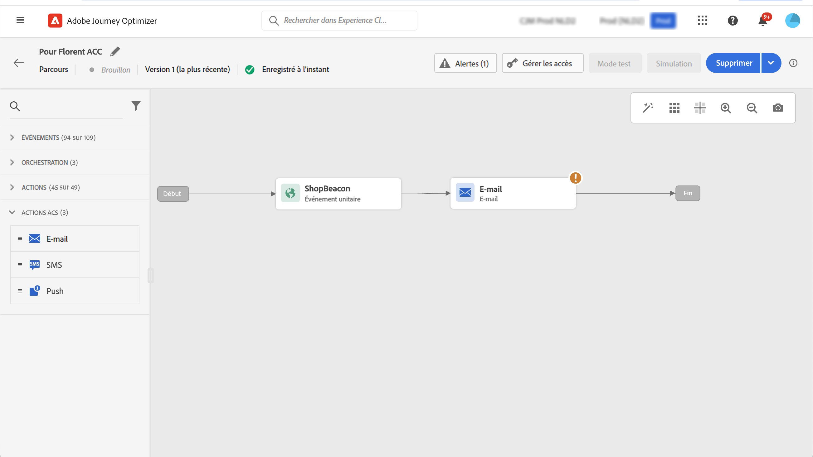

# Intégration à Adobe Campaign Standard {#using_adobe_campaign_standard}

Vous pouvez envoyer des emails, des notifications push et des SMS à l’aide des fonctionnalités de messagerie transactionnelle d’Adobe Campaign Standard.

Si vous disposez d’Adobe Campaign Standard, une action intégrée est disponible pour permettre la connexion à Adobe Campaign Standard.

Le message transactionnel Campaign Standard et son événement associé doivent être publiés pour être utilisés dans Journey Optimizer. Si l’événement est publié mais que le message ne l’est pas, il ne sera pas visible dans l’interface de Journey Optimizer. Si le message est publié mais que son événement associé ne l’est pas, il sera visible dans l’interface Journey Optimizer, mais il ne sera pas utilisable.

## Remarques importantes {#important-notes}

* Une règle de limitation de 4 000 appels par 5 minutes est automatiquement définie pour les actions Adobe Campaign Standard. Cela correspond à l’échelle officielle des messages transactionnels d’Adobe Campaign Standard. En savoir plus sur les contrats de niveau de service des messages transactionnels dans [Description du produit Adobe Campaign Standard](https://helpx.adobe.com/legal/product-descriptions/campaign-standard.html).

* L’intégration d’Adobe Campaign Standard est configurée par le biais d’une action intégrée dédiée dans la liste d’actions. Cela doit être configuré pour chaque environnement de test.

* Vous ne pouvez pas utiliser une action Campaign Standard avec une qualification de segment ou une activité Lecture de segment .

* Un parcours ne peut pas utiliser les actions Messages et Campaign Standard.

## Configuration de l’action {#configure-action}

Pour la configurer, procédez comme suit :

1. Sélectionner **[!UICONTROL Configurations]** dans la section du menu ADMINISTRATION . Dans le  **[!UICONTROL Actions]** , cliquez sur **[!UICONTROL Manage]**. La liste des actions s’affiche.

1. Sélection de l’intégration **[!UICONTROL AdobeCampaignStandard]** action. Le volet de configuration des actions s’ouvre sur le côté droit de l’écran.

   

1. Copiez l’URL de votre instance Adobe Campaign Standard et collez-la dans la zone **[!UICONTROL URL]** champ .

1. Cliquez sur le bouton **[!UICONTROL Test the instance URL]** pour tester la validité de l’instance.

   >[!NOTE]
   >
   >Ce test vérifie que :
   >
   >L’hôte est &quot;.campaign.adobe.com&quot;, &quot;.campaign-sandbox.adobe.com&quot;, &quot;.campaign-demo.adobe.com&quot;, &quot;.ats.adobe.com&quot; ou &quot;.adls.adobe.com&quot;.
   >
   >L&#39;URL commence par https,
   >
   >L’organisation associée à cette instance d’Adobe Campaign Standard est identique à l’organisation de Journey Optimizer.

Lors de la conception de votre parcours, trois actions sont disponibles dans la variable **[!UICONTROL Action]** catégorie : **[!UICONTROL Email]**, **[!UICONTROL Push]**, **[!UICONTROL SMS]** (voir [Utilisation d’actions Adobe Campaign](../building-journeys/using-adobe-campaign-standard.md)).

Vous pouvez utiliser une **Réactions** pour réagir aux données de suivi liées à un message Campaign Standard envoyé dans le même parcours. Pour les notifications push, vous pouvez réagir aux messages sur lesquels l’utilisateur a cliqué, envoyés ou qui ont échoué. Pour les SMS, vous pouvez réagir aux messages envoyés ou en échec. Pour les emails, vous pouvez réagir aux messages sur lesquels vous avez cliqué, envoyés, ouverts ou en échec. Voir [Événements Réactions](../building-journeys/reaction-events.md).

Si vous utilisez un système tiers pour envoyer des messages, vous devez ajouter et configurer une action personnalisée. Voir [À propos de la configuration des actions personnalisées](../action/about-custom-action-configuration.md).
