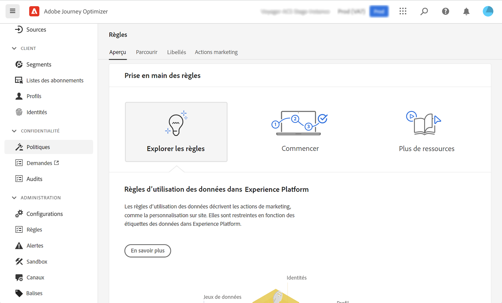
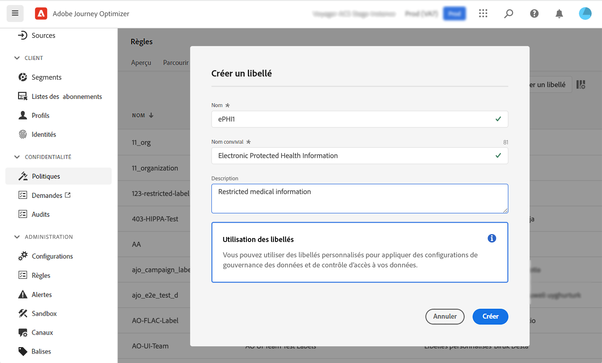

# Gouvernance des données {#restrict-fields}

>[!IMPORTANT]
>
>L’utilisation de l’outil DULE (Data Usage Labelling and Enforcement) est actuellement limitée à certains clients et sera déployée dans tous les environnements dans une prochaine version.

Grâce à son cadre de gouvernance DULE (Data Usage Labelling and Enforcement), Journey Optimizer peut désormais tirer parti des stratégies de gouvernance de Adobe Experience Platform pour empêcher l’exportation de champs sensibles vers des systèmes tiers au moyen d’actions personnalisées. Si le système identifie un champ restreint dans les paramètres d’action personnalisée, une erreur s’affiche vous empêchant de publier le parcours.

Adobe Experience Platform vous permet d’étiqueter vos champs et de créer des actions marketing pour chaque canal. Vous définissez ensuite une stratégie de gouvernance associée à un libellé et à une action marketing.

Dans Journey Optimizer, vous pouvez appliquer ces stratégies à vos actions personnalisées afin d’empêcher l’exportation de champs spécifiques vers des systèmes tiers.

## Remarques importantes {#important-notes}

* La gouvernance des données s’applique uniquement aux actions personnalisées dans parcours. Les actions de Campaign Classic et de Campaign Standard ne sont pas prises en charge.
* Les stratégies de gouvernance ne s’appliquent que lorsqu’une action marketing (requise ou supplémentaire) est définie au niveau de l’action personnalisée.
* Les attributs qui font partie d’un groupe de champs à l’aide du schéma d’union d’usine ne sont pas pris en charge. Ces attributs seront masqués dans l’interface. Vous devez créer un autre groupe de champs à l’aide d’un autre schéma.

## Définition des stratégies de gouvernance {#governance-policies}

Vous pouvez utiliser des libellés, des actions marketing et des stratégies existants. Voici les principales étapes de configuration pour en créer de nouvelles :

* Ajoutez un libellé et appliquez-le à des champs spécifiques que vous ne souhaitez pas exporter vers des systèmes tiers, par exemple le groupe sanguin d&#39;une personne.
* Définissez une action marketing pour chaque action personnalisée tierce utilisée dans vos parcours.
* Créez une stratégie de gouvernance et associez-la au libellé et à l’action marketing.

Pour plus d’informations sur la gestion des stratégies, reportez-vous à cette section [documentation](https://experienceleague.adobe.com/docs/experience-platform/data-governance/policies/user-guide.html?lang=fr#consent-policy)

Prenons l’exemple du champ de type sanguin que vous devez étiqueter comme sensible et limiter l’exportation vers un tiers. Les différentes étapes sont les suivantes :

1. Dans le menu de gauche, sous **Confidentialité**, cliquez sur **Stratégies**.
   
1. Sélectionnez la **Étiquettes** et cliquez sur **Créer une étiquette**.
   
1. Définissez un nom et un nom convivial pour ce libellé. Par exemple : _ePHI1_.
   
1. Dans le menu de gauche, sous **Gestion des données**, cliquez sur **Schémas**, puis cliquez sur le bouton **Appliquer les étiquettes d’accès et de gouvernance des données** bouton . Sélectionnez votre schéma et votre champ (groupe sanguin) et sélectionnez le libellé précédemment créé, _ePHI1_ dans notre exemple.
   
1. Revenez au **Stratégies** , sélectionnez **Action marketing** et cliquez sur **Création d’une action marketing**. Nous vous recommandons de créer une action marketing pour chaque action personnalisée tierce utilisée dans vos parcours. Par exemple, créons une _Action marketing Slack_ qui sera utilisé pour votre action personnalisée de Slack.
   
1. Sélectionnez la **Parcourir** , cliquez sur **Création d’une stratégie** et sélectionnez **Politique de gouvernance des données**. Sélectionnez votre libellé (_ePHI1_) et l’action marketing (_Action marketing Slack_).
   

Lorsque vous utiliserez, dans un parcours, votre action personnalisée de Slack configurée avec la variable _Action marketing Slack_, la stratégie associée sera utilisée.

## Configuration de l’action personnalisée {#consent-custom-action}

Dans le menu de gauche, sous **Administration**, cliquez sur **Configurations** et sélectionnez **Actions**. Ouvrez votre action personnalisée Slack. Lors de la configuration d’une action personnalisée, deux champs peuvent être utilisés pour la gouvernance des données.

* Le **Canal** vous permet de sélectionner le canal associé à cette action personnalisée : **E-mail**, **SMS** ou **Notification push**. Elle préremplit le champ **Action marketing requise** avec l’action marketing par défaut pour le canal sélectionné. Si vous sélectionnez **autre**, aucune action marketing ne sera définie par défaut. Dans notre exemple, nous sélectionnons le canal **other**.

* L’**Action marketing requise** vous permet de définir l’action marketing associée à votre action personnalisée. Par exemple, si vous utilisez cette action personnalisée pour envoyer des emails à l’aide d’un tiers, vous pouvez sélectionner **Ciblage des emails**. Dans notre exemple, nous sélectionnons le _Action marketing Slack_. Les stratégies de gouvernance associées à cette action marketing sont récupérées et exploitées.

Les autres étapes de configuration d’une action personnalisée sont présentées dans [cette section](../action/about-custom-action-configuration.md#consent-management).

## Création du parcours {#consent-journey}

Dans le menu de gauche, sous **Gestion des parcours**, cliquez sur **Parcours**. Créez votre parcours et ajoutez votre action personnalisée.  Lors de l’ajout de l’action personnalisée dans un parcours, plusieurs options vous permettent de gérer la gouvernance des données. Cliquez sur le bouton **Afficher les champs en lecture seule** pour afficher tous les paramètres.

Le **Canal** et l’**Action marketing requise**, définis lors de la configuration de l’action personnalisée, s’affichent en haut de l’écran. Vous ne pouvez pas modifier ces champs.

Vous pouvez définir une **Action marketing supplémentaire** pour définir le type d’action personnalisée. Vous pouvez ainsi définir l’objectif de l’action personnalisée dans ce parcours. Outre l’action marketing requise, généralement spécifique à un canal, vous pouvez définir une action marketing supplémentaire qui sera spécifique à l’action personnalisée dans ce parcours particulier. Par exemple : une communication relative à un entraînement, une newsletter, une communication sur la condition physique, etc. L’action marketing requise et l’action marketing supplémentaire s’appliqueront toutes deux.

Dans notre exemple, nous n’utilisons pas d’action marketing supplémentaire.

Si l’un des champs étiquetés _ePHI1_ (le champ de type sang dans notre exemple) sont détectés dans les paramètres d’action, une erreur s’affiche, vous empêchant de publier le parcours.

Les autres étapes de configuration d’une action personnalisée dans un parcours sont présentées dans [cette section](../building-journeys/using-custom-actions.md).
