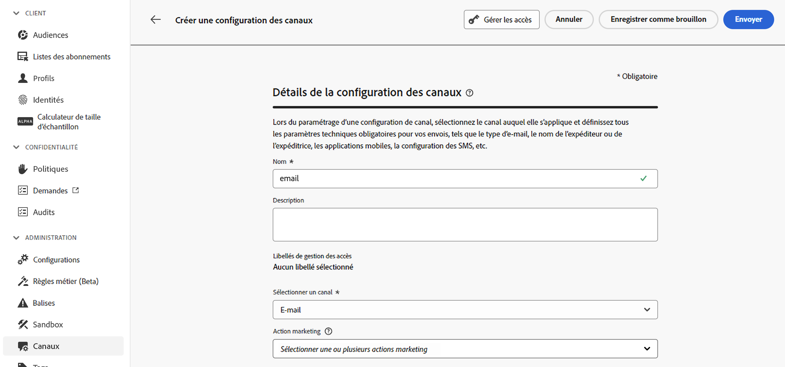
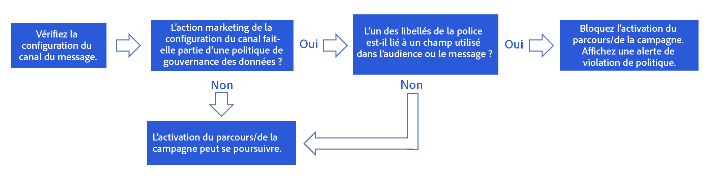
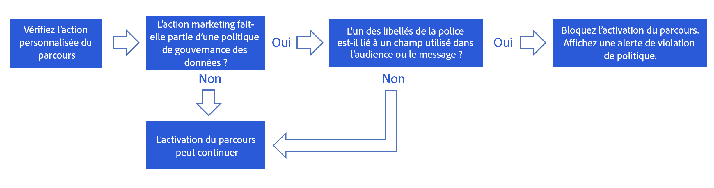

# Gouvernance des données {#restrict-fields}

>[!CONTEXTUALHELP]
>id="ajo_data_governance_policy_violation"
>title="Violations de la politique de gouvernance des données"
>abstract="Si le système identifie un champ restreint dans un parcours ou une campagne, ou une action personnalisée, une erreur s’affiche empêchant sa publication. Utilisez le diagramme de lignage des données de cette boîte de dialogue pour comprendre les autres modifications de configuration qui doivent être apportées avant de pouvoir activer votre parcours ou campagne."

## Commencer avec les politiques de gouvernance des données {#gs}

Avec son cadre de gouvernance [Data Usage Labelling and Enforcement(DULE)](https://experienceleague.adobe.com/docs/experience-platform/data-governance/home.html?lang=fr){target="_blank"}, Adobe Experience Platform vous permet de gérer et d’appliquer des politiques de gouvernance des données sur vos canaux en **étiquetant vos champs** et en créant des **actions marketing** pour chaque canal.

Une fois les actions marketing et les libellés définis, vous pouvez créer des **politiques de gouvernance des données** qui lient ces deux éléments. Par exemple, vous pouvez configurer une politique qui associe un libellé « ePHI » à une action marketing de « ciblage e-mail », en veillant à ce que les champs étiquetés « ePHI » ne soient pas utilisés pour personnaliser les e-mails. [Découvrir comment créer des politiques de gouvernance des données](#governance-policies)

Après avoir créé les politiques de gouvernance, vous pouvez appliquer les actions marketing à vos actions parcours/campagnes actions personnalisées sur les parcours.
[Découvrir comment appliquer des actions marketing dans Journey Optimizer](#apply-marketing-actions)

Lors de la création d’un parcours ou d’une campagne, après avoir sélectionné une configuration de canal ou ajouté une action personnalisée, le système vérifie si l’action marketing dans la configuration du canal de message ou l’action personnalisée fait partie d’une politique de gouvernance des données. Si tel est le cas, le système vérifie si les champs de l’audience ciblée ou de la personnalisation des messages sont libellés et restreints par la politique. Si un libellé est détecté, la publication du parcours ou de la campagne est bloquée. [Découvrir comment détecter une violation de politique de gouvernance des données](#violation)

## Créer des libellés et des actions marketing{#labels-marketing-actions}

La première étape de l’application de la politique de gouvernance des données consiste à créer un libellé et à le joindre à des champs pour lesquels vous souhaitez limiter l’utilisation et à des actions marketing pour chacun de vos canaux.

1. Dans le menu de gauche, sous **Confidentialité**, cliquez sur **Politiques**.

1. Sélectionnez l’onglet **Étiquettes** et cliquez sur **Créer une étiquette**.

1. Définissez un nom et un nom convivial pour ce libellé. Par exemple : _ePHI1_.

1. Dans le menu de gauche, sous **Gestion des données**, cliquez sur **Schémas**, puis cliquez sur le bouton **Appliquer l’accès et les étiquettes de gouvernance des données**. Sélectionnez votre schéma et votre champ (par exemple, « groupe sanguin »), puis sélectionnez le libellé précédemment créée, _ePHI1_ dans notre exemple.

   

1. Revenez au menu **Politiques**, sélectionnez l’onglet **Action marketing** et cliquez sur **Créer une action marketing**. Nous vous recommandons de créer une action marketing pour chaque canal et chaque action personnalisée tierce utilisée dans vos parcours. Par exemple, créons une _action marketing Slack_ qui sera utilisée pour votre action personnalisée Slack.

   

## Créer une politique de gouvernance des données {#policy}

Maintenant que des libellés et des actions marketing ont été créés, vous pouvez les associer à des politiques de gouvernance des données. Sélectionnez l’onglet **Parcourir**, cliquez sur **Créer une politique** et sélectionnez **Politique de gouvernance des données**. Sélectionnez votre étiquette (_ePHI1_) et l’action marketing (_Action marketing Slack_).

Lorsque vous utiliserez, dans un parcours, votre action personnalisée Slack configurée avec l’_action marketing Slack_, la politique associée sera utilisée.

## Appliquer des actions marketing dans Journey Optimizer{#apply-marketing-actions}

Pour que les politiques de gouvernance des données soient appliquées dans Journey Optimizer, vous devez appliquer des actions marketing à vos parcours, campagnes ou actions personnalisées.

### Appliquer des actions marketing aux parcours et aux campagnes{#journeys-campaigns}

Après avoir créé des politiques de gouvernance, vous devez appliquer les actions marketing appropriées dans vos **configurations de canal** Journey Optimizer. Pour ce faire, procédez comme suit :

1. Accédez au menu **[!UICONTROL Canaux]** > **[!UICONTROL Paramètres généraux]** > **[!UICONTROL Configurations de canal]**.

1. Ouvrez une configuration de canal existante ou créez-en une.

1. Dans le champ **[!UICONTROL Action marketing]**, sélectionnez la ou les actions marketing à associer aux parcours/campagnes utilisant cette configuration. Toutes les politiques de consentement et de gouvernance des données associées à l’action marketing sont exploitées afin de respecter les préférences de votre clientèle et les restrictions configurées pour les champs sensibles. [En savoir plus](../action/consent.md#surface-marketing-actions)

   

1. Terminez la configuration du canal, puis enregistrez-la. [Découvrez comment configurer les canaux](../configuration/channel-surfaces.md).

1. Lors de la création d’un message dans votre parcours ou campagne, sélectionnez la configuration de canal appropriée. Configurez votre parcours ou campagne et enregistrez la configuration.

Avant d’activer le parcours ou la campagne, le système vérifie si l’action marketing dans la configuration de canal sélectionnée fait partie d’une politique de gouvernance des données. Si tel est le cas, le système vérifie si les champs de l’audience ciblée ou de la personnalisation des messages sont libellés et restreints par la politique.

Si le système identifie un champ restreint, une erreur s’affiche vous empêchant de publier le parcours ou la campagne. [Découvrir comment détecter une violation de politique de gouvernance](#violation)

{zoomable="yes"}

*Étapes d’analyse des violations de politique pour les parcours et les campagnes*

### Application d’une action marketing à des actions personnalisées {#custom-actions}

>[!NOTE]
>
>Les actions de Campaign v7/v8 et de Campaign Standard sur les parcours ne sont pas prises en charge.

Prenons l’exemple du champ de groupe sanguin dont vous devez restreindre l’export vers un tiers à l’aide d’actions personnalisées. Pour ce faire, vous devez appliquer l’action marketing à votre action personnalisée, puis créer votre parcours et y ajouter votre action personnalisée.

1. Dans le menu de gauche, sous **Administration**, cliquez sur **Configurations** et sélectionnez **Actions**.

1. Ouvrez votre action personnalisée Slack. Lors de la configuration d’une action personnalisée, deux champs peuvent être utilisés pour la gouvernance des données.

   

   * Le champ **Canal** vous permet de sélectionner le canal associé à cette action personnalisée. Il préremplit le champ **Action marketing requise** avec l’action marketing par défaut pour le canal sélectionné. Si vous sélectionnez **Autre**, aucune action marketing n’est définie par défaut. Dans notre exemple, nous sélectionnons le canal **Autre**.

   * L’**Action marketing requise** vous permet de définir l’action marketing associée à votre action personnalisée. Par exemple, si vous utilisez cette action personnalisée pour envoyer des e-mails à l’aide d’un tiers, vous pouvez sélectionner **Ciblage e-mail**. Dans notre exemple, nous sélectionnons l’_action marketing Slack_. Les politiques de gouvernance associées à cette action marketing sont récupérées et exploitées.

   Les autres étapes de configuration d’une action personnalisée sont présentées dans [cette section](../action/about-custom-action-configuration.md#consent-management).

1. Dans le menu de gauche, sous **Gestion des parcours**, cliquez sur **Parcours**.

1. Créez votre parcours et ajoutez votre action personnalisée. Lors de l’ajout de l’action personnalisée dans un parcours, plusieurs options vous permettent de gérer la gouvernance des données. Cliquez sur le bouton **Afficher les champs en lecture seule** pour afficher tous les paramètres.

   

   * Le **Canal** et l’**Action marketing requise**, définis lors de la configuration de l’action personnalisée, s’affichent en haut de l’écran. Vous ne pouvez pas modifier ces champs.

   * Vous pouvez définir une **Action marketing supplémentaire** pour définir le type d’action personnalisée. Vous pouvez ainsi définir l’objectif de l’action personnalisée dans ce parcours. Outre l’action marketing requise, généralement spécifique à un canal, vous pouvez définir une action marketing supplémentaire qui sera spécifique à l’action personnalisée dans ce parcours particulier. Par exemple : une communication relative à un entraînement, une newsletter, une communication sur la condition physique, etc. L’action marketing requise et l’action marketing supplémentaire s’appliquent toutes deux. Dans notre exemple, nous n’utilisons pas d’action marketing supplémentaire.

Si l’un des champs étiquetés _ePHI1_ (dans notre exemple, le champ de groupe sanguin) est détecté dans les paramètres d’action, une erreur s’affiche, vous empêchant de publier le parcours. [Découvrir comment détecter une violation de politique de gouvernance](#violation)

{zoomable="yes"}

*Étapes d’analyse des violations de politique pour les actions personnalisées sur les parcours*

## Détecter une violation de politique {#violation}

Si le système identifie un champ restreint dans un parcours ou une campagne, ou encore une action personnalisée, une erreur s’affiche empêchant sa publication.

Les erreurs sont visibles à partir du bouton **[!UICONTROL Alertes]**. Cliquez sur l’erreur pour afficher des informations détaillées sur la violation de la politique de gouvernance des données qui s’est produite.

Cette boîte de dialogue indique que la configuration de parcours/campagne actuelle enfreint une politique de gouvernance des données existante. Utilisez le diagramme de lignage des données pour comprendre les autres modifications de configuration qui doivent être apportées avant de pouvoir activer votre parcours ou campagne.

Des informations détaillées sont disponibles dans la [documentation sur les violations de politique d’utilisation des données](https://experienceleague.adobe.com/fr/docs/experience-platform/data-governance/enforcement/auto-enforcement#data-usage-violation){_blank}.
