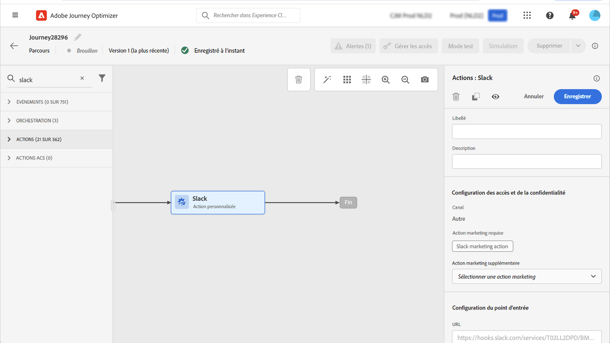

# Gouvernance des données {#restrict-fields}

>[!IMPORTANT]
>
>L’utilisation de l’outil DULE (Data Usage Labelling and Enforcement) est actuellement limitée à certains clients et sera déployée dans tous les environnements dans une prochaine version.

Grâce à son cadre de gouvernance DULE (Data Usage Labelling and Enforcement), Journey Optimizer peut désormais tirer parti des politiques de gouvernance d’Adobe Experience Platform pour empêcher l’exportation de champs sensibles vers des systèmes tiers au moyen d’actions personnalisées. Si le système identifie un champ restreint dans les paramètres d’action personnalisée, une erreur s’affiche, vous empêchant de publier le parcours.

Adobe Experience Platform vous permet d’étiqueter vos champs et de créer des actions marketing pour chaque canal. Vous pouvez ensuite définir une politique de gouvernance associée à une étiquette et à une action marketing.

Dans Journey Optimizer, vous pouvez appliquer ces politiques à vos actions personnalisées afin d’empêcher l’exportation de champs spécifiques vers des systèmes tiers.

Pour plus d’informations sur le cadre de gouvernance des données et sur l’utilisation des libellés et des politiques, consultez la documentation d’Adobe Experience Platform :

* [Présentation du service de gouvernance des données](https://experienceleague.adobe.com/docs/experience-platform/data-governance/home.html?lang=fr)
* [Présentation des libellés d’utilisation des données](https://experienceleague.adobe.com/docs/experience-platform/data-governance/labels/overview.html?lang=fr)
* [Politiques d’utilisation des données](https://experienceleague.adobe.com/docs/experience-platform/data-governance/policies/overview.html?lang=fr)

## Remarques importantes {#important-notes}

* La gouvernance des données s’applique uniquement aux actions personnalisées dans les parcours. Les actions de Campaign v7/v8 et de Campaign Standard ne sont pas prises en charge.
* Les politiques de gouvernance s’appliquent uniquement lorsqu’une action marketing (requise ou supplémentaire) est définie au niveau de l’action personnalisée.

## Définir les politiques de gouvernance {#governance-policies}

Vous pouvez utiliser des actions marketing, des politiques et des étiquettes existantes. Voici les principales étapes de configuration pour en créer de nouvelles :

* Ajoutez une étiquette et appliquez-la à des champs spécifiques que vous ne souhaitez pas exporter vers des systèmes tiers, par exemple le groupe sanguin d’une personne.
* Définissez une action marketing pour chaque action personnalisée tierce utilisée dans vos parcours.
* Créez une politique de gouvernance et associez-la à l’étiquette et à l’action marketing.

Pour en savoir plus sur la gestion des politiques, consultez cette [documentation](https://experienceleague.adobe.com/docs/experience-platform/data-governance/policies/user-guide.html?lang=fr#consent-policy).

Prenons l’exemple du champ correspondant au groupe sanguin, que vous devez étiqueter comme sensible et dont vous devez limiter l’exportation vers un tiers. Voici la procédure à suivre :

1. Dans le menu de gauche, sous **Confidentialité**, cliquez sur **Politiques**.
1. Sélectionnez l’onglet **Étiquettes** et cliquez sur **Créer une étiquette**.
   
1. Définissez un nom et un nom convivial pour cette étiquette. Par exemple : _ePHI1_.
1. Dans le menu de gauche, sous **Gestion des données**, cliquez sur **Schémas**, puis cliquez sur le bouton **Appliquer l’accès et les étiquettes de gouvernance des données**. Sélectionnez votre schéma ainsi que votre champ (groupe sanguin), puis sélectionnez l’étiquette précédemment créée, _ePHI1_ dans notre exemple.
   
1. Revenez au menu **Politiques**, sélectionnez l’onglet **Action marketing** et cliquez sur **Créer une action marketing**. Nous vous recommandons de créer une action marketing pour chaque action personnalisée tierce utilisée dans vos parcours. Par exemple, créons une _action marketing Slack_ qui sera utilisée pour votre action personnalisée Slack.
   
1. Sélectionnez l’onglet **Parcourir**, cliquez sur **Créer une politique** et sélectionnez **Politique de gouvernance des données**. Sélectionnez votre étiquette (_ePHI1_) et l’action marketing (_Action marketing Slack_).
   

Lorsque vous utiliserez, dans un parcours, votre action personnalisée Slack configurée avec l’_action marketing Slack_, la politique associée sera utilisée.

## Configurer l’action personnalisée {#consent-custom-action}

Dans le menu de gauche, sous **Administration**, cliquez sur **Configurations** et sélectionnez **Actions**. Ouvrez votre action personnalisée Slack. Lors de la configuration d’une action personnalisée, deux champs peuvent être utilisés pour la gouvernance des données.

* Le **Canal** vous permet de sélectionner le canal associé à cette action personnalisée : **E-mail**, **SMS** ou **Notification push**. Elle préremplit le champ **Action marketing requise** avec l’action marketing par défaut pour le canal sélectionné. Si vous sélectionnez **Autre**, aucune action marketing n’est définie par défaut. Dans notre exemple, nous sélectionnons le canal **Autre**.

* L’**Action marketing requise** vous permet de définir l’action marketing associée à votre action personnalisée. Par exemple, si vous utilisez cette action personnalisée pour envoyer des e-mails à l’aide d’un tiers, vous pouvez sélectionner **Ciblage e-mail**. Dans notre exemple, nous sélectionnons l’_action marketing Slack_. Les politiques de gouvernance associées à cette action marketing sont récupérées et exploitées.

Les autres étapes de configuration d’une action personnalisée sont présentées dans [cette section](../action/about-custom-action-configuration.md#consent-management).

## Créer le parcours {#consent-journey}

Dans le menu de gauche, sous **Gestion des parcours**, cliquez sur **Parcours**. Créez votre parcours et ajoutez votre action personnalisée.  Lors de l’ajout de l’action personnalisée dans un parcours, plusieurs options vous permettent de gérer la gouvernance des données. Cliquez sur le bouton **Afficher les champs en lecture seule** pour afficher tous les paramètres.

Le **Canal** et l’**Action marketing requise**, définis lors de la configuration de l’action personnalisée, s’affichent en haut de l’écran. Vous ne pouvez pas modifier ces champs.

Vous pouvez définir une **Action marketing supplémentaire** pour définir le type d’action personnalisée. Vous pouvez ainsi définir l’objectif de l’action personnalisée dans ce parcours. Outre l’action marketing requise, généralement spécifique à un canal, vous pouvez définir une action marketing supplémentaire qui sera spécifique à l’action personnalisée dans ce parcours particulier. Par exemple : une communication relative à un entraînement, une newsletter, une communication sur la condition physique, etc. L’action marketing requise et l’action marketing supplémentaire s’appliqueront toutes deux.

Dans notre exemple, nous n’utilisons pas d’action marketing supplémentaire.

Si l’un des champs étiquetés _ePHI1_ (dans notre exemple, le champ de groupe sanguin) sont détectés dans les paramètres d’action, une erreur s’affiche, vous empêchant de publier le parcours.

Les autres étapes de configuration d’une action personnalisée dans un parcours sont présentées dans [cette section](../building-journeys/using-custom-actions.md).
