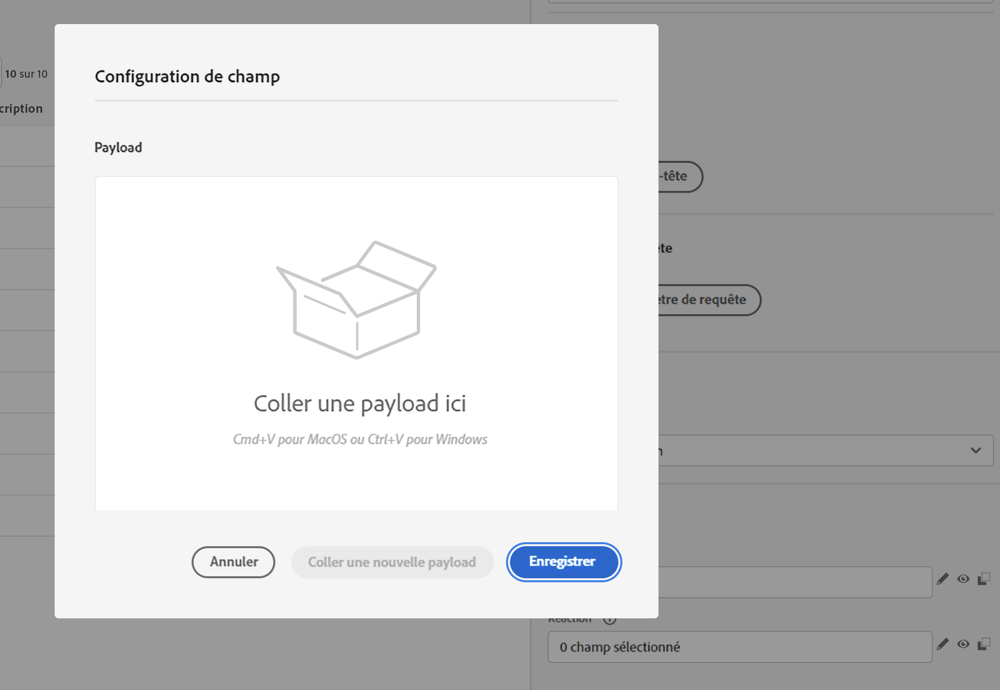

# Améliorations des actions personnalisées {#custom-action-enhancements}

Vous pouvez désormais utiliser les réponses d’appel API dans des actions personnalisées et orchestrer vos parcours en fonction de ces réponses.

Auparavant, cette fonctionnalité n’était disponible que lors de l’utilisation de sources de données. Vous pouvez désormais l’utiliser avec des actions personnalisées.

>[!AVAILABILITY]
>
>Cette fonctionnalité est publiée sous forme de version Beta privée.

>[!WARNING]
>
>Les actions personnalisées ne doivent être utilisées qu’avec des points d’entrée privés ou internes et avec une limitation ou un capping de la fréquence approprié. Consultez [cette page](../configuration/external-systems.md).

## Définir l’action personnalisée {#define-custom-action}

Pour la définition de l’action personnalisée, deux améliorations ont été apportées : l’ajout de la méthode GET et le nouveau champ de réponse de payload. Les autres options et paramètres restent inchangés. Consultez [cette page](../action/about-custom-action-configuration.md).

### Configuration du point d’entrée {#endpoint-configuration}

La section **Configuration de l’URL** a été renommée **Configuration du point d’entrée**.

Dans le menu déroulant **Méthode**, vous pouvez maintenant sélectionner **GET**.

{width="70%" align="left"}

### Payloads {#payloads-new}

La section **Paramètres d’action** a été renommée **Payloads**. Deux champs sont disponibles :

* Le champ **Requête** : ce champ n&#39;est disponible que pour les méthodes d’appel POST et PUT.
* Le champ **Réponse** : il s’agit de la nouvelle fonctionnalité. Ce champ est disponible pour toutes les méthodes d’appel.

>[!NOTE]
> 
>Ces deux champs sont facultatifs.

{width="70%" align="left"}

1. Cliquez dans le champ **Réponse**.

   {width="80%" align="left"}

1. Collez un exemple de la payload renvoyée par l’appel. Vérifiez que les types de champ sont corrects (chaîne, entier, etc.). Voici un exemple de payload de réponse capturée lors de l’appel. Notre point d’entrée local envoie le nombre de points de fidélité et le statut d’un profil.

   ```
   {
   "customerID" : "xY12hye",    
   "status":"gold",
   "points": 1290 }
   ```

   {width="80%" align="left"}

   À chaque appel de l’API, le système récupère tous les champs contenus dans l’exemple de payload.

1. Ajoutons également l’ID de client comme paramètre de requête.

   {width="80%" align="left"}

1. Cliquez sur **Enregistrer**.

## Utiliser la réponse dans un parcours {#response-in-journey}

Il vous suffit d’ajouter l’action personnalisée à un parcours. Vous pouvez ensuite exploiter les champs de payload de réponse dans des conditions, dans d’autres actions et dans la personnalisation des messages.

Par exemple, vous pouvez ajouter une condition pour vérifier le nombre de points de fidélité. Lorsque la personne entre dans le restaurant, votre point d’entrée local envoie un appel avec les informations de fidélité du profil. Vous pouvez envoyer une notification push si le profil est un client Gold. Et si une erreur est détectée dans l’appel, envoyez une action personnalisée pour en informer l’administrateur ou l’administratrice système.


1. Ajoutez votre événement et l’action personnalisée Fidélité créée précédemment.

1. Dans l’action personnalisée Fidélité, associez le paramètre de requête de l’ID de client à l’identifiant du profil. Cochez l’option **Ajouter un autre chemin en cas d’expiration ou d’erreur**.

   

1. Dans la première branche, ajoutez une condition et utilisez l’éditeur avancé pour exploiter les champs de réponse de l’action, sous le nœud **Contexte**.

   

1. Ajoutez ensuite votre notification push et personnalisez votre message à l’aide des champs de réponse. Dans notre exemple, nous personnalisons le contenu à l’aide du nombre de points de fidélité et du statut du client. Les champs de réponse de l’action sont disponibles sous **Attributs contextuels** > **Orchestration de parcours** > **Actions**.

   

   >[!NOTE]
   >
   >Chaque profil qui entre dans l’action personnalisée déclenche un appel. Même si la réponse est toujours la même, Journey effectue toujours un appel par profil.

1. Dans la branche Délai d’expiration et erreur, ajoutez une condition et utilisez le champ **jo_status_code** intégré. Dans notre exemple, nous utilisons le
   type d’erreur **http_400**. Consultez [cette section](#error-status).

   ```
   @action{ActionLoyalty.jo_status_code} == "http_400"
   ```

   

1. Ajoutez une action personnalisée qui sera envoyée à votre organisation.

   

## Statut de l’erreur {#error-status}

Le champ **jo_status_code** est toujours disponible même lorsqu’aucune payload de réponse n’est définie.

Voici les valeurs possibles pour ce champ :

* code d’état http : http_`<HTTP API call returned code>`, par exemple, http_200 ou http_400
* erreur de temporisation : **expiré**
* erreur de limitation : **limité**
* erreur interne : **erreurInterne**

Un appel d’action est considéré comme une erreur lorsque le code http renvoyé est supérieur à 2xx ou en cas d’erreur. Dans ce cas, le parcours est dirigé vers la branche Délai d’expiration ou erreur dédiée.

>[!WARNING]
>
>Seules les actions personnalisées nouvellement créées incluent le champ **jo_status_code** prêt à l’emploi. Si vous souhaitez l’utiliser avec une action personnalisée existante, vous devez mettre à jour l’action. Vous pouvez par exemple mettre à jour la description et l’enregistrer.

## Syntaxe des expressions {#exp-syntax}

Voici la syntaxe :

```json
#@action{myAction.myField} 
```

Voici quelques exemples :

```json
 // action response field
 @action{<action name>.<path to the field>}
 @action{ActionLoyalty.status}
```

```json
 // action response field
 @action{<action name>.<path to the field>, defaultValue: <default value expression>}
 @action{ActionLoyalty.points, defaultValue: 0}
 @action{ActionLoyalty.points, defaultValue: @{myEvent.newPoints}}
```

Pour plus d’informations sur les références de champs, consultez [cette section](../building-journeys/expression/field-references.md).

