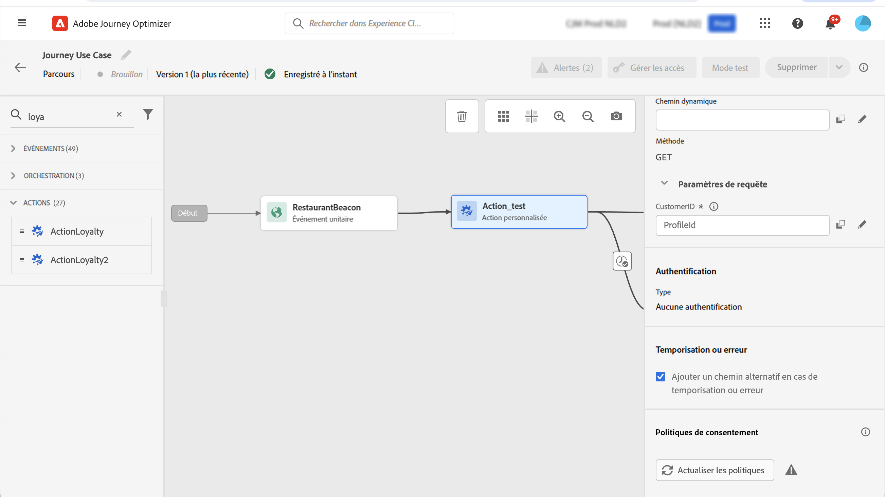
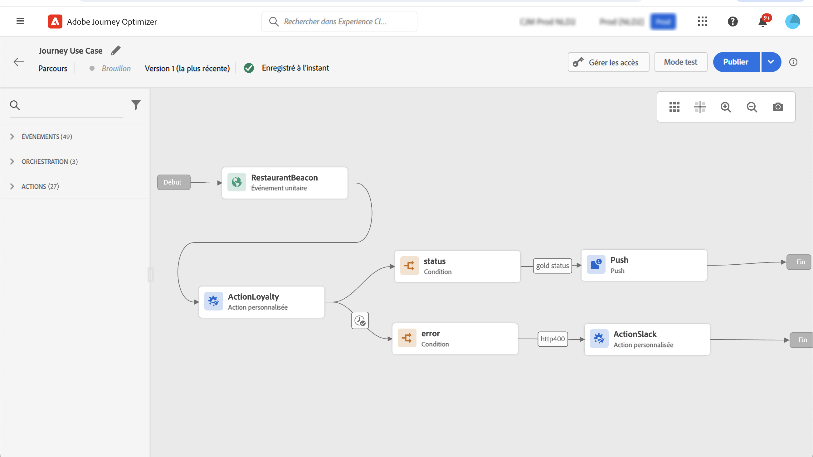

# Utiliser des réponses d’appel API dans des actions personnalisées {#custom-action-enhancements}

Vous pouvez utiliser les réponses d’appel API dans des actions personnalisées et orchestrer vos parcours en fonction de ces réponses.

<!--
You can now leverage API call responses in custom actions and orchestrate your journeys based on these responses.

This capability was previously only available when using data sources. You can now use it with custom actions. 
-->

## Remarques importantes{#custom-action-enhancements-notes}

<!--
* Custom actions should only be used with private or internal endpoints, and used with an appropriate capping or throttling limit. See [this page](../configuration/external-systems.md). 
-->

* Les tableaux scalaires sont pris en charge dans la payload de réponse :

  ```
  "dummyScalarArray": [
  "val1",
  "val2"
  ]
  ```

* Les tableaux hétérogènes ne sont pas pris en charge dans la payload de réponse :

  ```
  "dummyRandomArray": [
  20,
  "aafw",
  false
  ]
  ```

<!--
## Best practices{#custom-action-enhancements-best-practices}

A capping limit of 5000 calls/s is defined for all custom actions. This limit has been set based on customers usage, to protect external endpoints targeted by custom actions. You need to take this into account in your audience-based journeys by defining an appropriate reading rate (5000 profiles/s when custom actions are used). If needed, you can override this setting by defining a greater capping or throttling limit through our Capping/Throttling APIs. See [this page](../configuration/external-systems.md).

You should not target public endpoints with custom actions for various reasons:

* Without proper capping or throttling, there is a risk of sending too many calls to a public endpoint that may not support such volume.
* Profile data can be sent through custom actions, so targeting a public endpoint could lead to inadvertently sharing personal information externally.
* You have no control on the data being returned by public endpoints. If an endpoint changes its API or starts sending incorrect information, those will be made available in communications sent, with potential negative impacts.
-->

<!--
## Define the custom action {#define-custom-action}

When defining the custom action, two enhancements have been made available: the addition of the GET method and the new payload response field. The other options and parameters are unchanged. See [this page](../action/about-custom-action-configuration.md).

### Endpoint configuration {#endpoint-configuration}

The **URL configuration** section has been renamed **Endpoint configuration**.

In the **Method** drop-down, you can now select **GET**.

{width="70%" align="left"}

### Payloads {#payloads-new}

The **Action parameters** section has been renamed **Payloads**. Two fields are available:

* The **Request** field: this field is only available for POST and PUT calling methods.
* The **Response** field: this is the new capability. This field as available for all calling methods.

>[!NOTE]
> 
>Both these fields are optional.

{width="70%" align="left"}
-->

## Configurer l’action personnalisée {#config-response}

1. Créez l’action personnalisée. Voir [cette page](../action/about-custom-action-configuration.md).

1. Cliquez dans le champ **Réponse** (réponse de succès).

   {width="80%" align="left"}

1. Collez un exemple de la payload renvoyée par l’appel. Vérifiez que les types de champ sont corrects (chaîne, entier, etc.). Voici un exemple de payload de réponse capturée lors de l’appel. Notre point d’entrée local envoie le nombre de points de fidélité et le statut d’un profil.

   ```
   {
   "customerID" : "xY12hye",    
   "status":"gold",
   "points": 1290 }
   ```

   {width="80%" align="left"}

   À chaque appel de l’API, le système récupère tous les champs contenus dans l’exemple de payload.

1. (Facultatif) Activez une payload de réponse d’erreur pour capturer le format renvoyé lorsque l’appel échoue, puis collez un exemple de payload. Pour ce faire, sélectionnez **Définir un payload de réponse d’échec** dans la configuration d’une action personnalisée. Pour en savoir plus sur la configuration des champs de payload, consultez [Configuration d’une action personnalisée](../action/about-custom-action-configuration.md).

   ```
   {
   "errorResponse" : "customer not found"
   }
   ```

   La payload de réponse d’erreur n’est disponible que si vous l’activez dans la configuration de l’action personnalisée.

1. Ajoutons également l’ID de client comme paramètre de requête.

   {width="80%" align="left"}

1. Cliquez sur **Enregistrer**.

## Utiliser la réponse dans un parcours {#response-in-journey}

Il vous suffit d’ajouter l’action personnalisée à un parcours. Vous pouvez ensuite exploiter les champs de payload de réponse dans des conditions, dans d’autres actions et dans la personnalisation des messages.

Si vous avez défini une payload de réponse d’erreur, elle est exposée sous **Attributs contextuels** > **Journey Orchestration** > **Actions** > `<action name>` > **errorResponse**. Vous pouvez l’utiliser dans la branche Temporisation et erreur pour piloter la logique de secours et la gestion des erreurs.

Par exemple, vous pouvez ajouter une condition pour vérifier le nombre de points de fidélité. Lorsque la personne entre dans le restaurant, votre point d’entrée local envoie un appel avec les informations de fidélité du profil. Vous pouvez envoyer une notification push si le profil est un client Gold. Et si une erreur est détectée dans l’appel, envoyez une action personnalisée pour en informer l’administrateur ou l’administratrice système.


1. Ajoutez votre événement et l’action personnalisée Fidélité créée précédemment.

1. Dans l’action personnalisée Fidélité, associez le paramètre de requête de l’ID de client à l’identifiant du profil. Cochez l’option **Ajouter un autre chemin en cas de temporisation ou d’erreur**.

   

1. Dans la première branche, ajoutez une condition et utilisez l’éditeur avancé pour exploiter les champs de réponse de l’action, sous le nœud **Contexte**.

   

1. Ajoutez ensuite votre notification push et personnalisez votre message à l’aide des champs de réponse. Dans notre exemple, nous personnalisons le contenu à l’aide du nombre de points de fidélité et du statut du client. Les champs de réponse de l’action sont disponibles sous **Attributs contextuels** > **Orchestration de parcours** > **Actions**.

   

   >[!NOTE]
   >
   >Chaque profil qui entre dans l’action personnalisée déclenche un appel. Même si la réponse est toujours la même, Journey effectue toujours un appel par profil.

1. Dans la branche Délai d’expiration et erreur, ajoutez une condition et utilisez le champ **jo_status_code** intégré. Dans notre exemple, nous utilisons le
   type d’erreur **http_400**. Consultez [cette section](#error-status).

   ```
   @action{ActionLoyalty.jo_status_code} == "http_400"
   ```

   Si une payload de réponse d’erreur a été définie, vous pouvez également cibler ses champs, par exemple :

   ```
   @action{ActionLoyalty.errorResponse.errorResponse} == "customer not found"
   ```

   

1. Ajoutez une action personnalisée qui sera envoyée à votre organisation.

   

## Journaux du mode test {#test-mode-logs}

Vous pouvez accéder, via le mode test, aux journaux de statut liés aux réponses d’action personnalisée. Si vous avez défini des actions personnalisées avec des réponses dans votre parcours, une section **actionsHistory** sur ces journaux affiche la payload renvoyée par le point d’entrée externe (en réponse à cette action personnalisée). Lorsqu’une payload de réponse d’erreur est définie, elle est incluse pour les appels ayant échoué. Cela peut être très utile en termes de débogage.


## Statut de l’erreur {#error-status}

Le champ **jo_status_code** est toujours disponible même lorsqu’aucune payload de réponse n’est définie.

Voici les valeurs possibles pour ce champ :

* code d’état http : http_`<HTTP API call returned code>`, par exemple, http_200 ou http_400
* erreur de temporisation : **expiré**
* erreur de limitation : **limité**
* erreur interne : **erreurInterne**

Un appel d’action est considéré comme une erreur lorsque le code http renvoyé est supérieur à 2xx ou en cas d’erreur. Dans ce cas, le parcours est dirigé vers la branche Délai d’expiration ou erreur dédiée.

Si une payload de réponse d’erreur a été configurée pour l’action personnalisée, ses champs sont exposés sous le nœud **errorResponse** pour les appels ayant échoué. Si aucune payload de réponse d’erreur n’est configurée, ce nœud n’est pas disponible.

>[!WARNING]
>
>Seules les actions personnalisées nouvellement créées incluent le champ **jo_status_code** prêt à l’emploi. Si vous souhaitez l’utiliser avec une action personnalisée existante, vous devez mettre à jour l’action. Vous pouvez par exemple mettre à jour la description et l’enregistrer.

## Syntaxe des expressions {#exp-syntax}

Voici la syntaxe :

```json
#@action{myAction.myField} 
```

Voici quelques exemples :

```json
 // action response field
 @action{<action name>.<path to the field>}
 @action{ActionLoyalty.status}
```

```json
 // action response field
 @action{<action name>.<path to the field>, defaultValue: <default value expression>}
 @action{ActionLoyalty.points, defaultValue: 0}
 @action{ActionLoyalty.points, defaultValue: @event{myEvent.newPoints}}
```

Lors de la manipulation de collections dans une réponse d’action personnalisée, vous pouvez vous appuyer sur `currentActionField` pour accéder à l’élément actif :

```json
count(
@action{MyAction.MyCollection.all(
currentActionField.description == "abc"
)}
)
```

### Utiliser des réponses d’action personnalisée dans les canaux natifs {#response-in-channels}

Les champs de payload de réponse des actions personnalisées peuvent être utilisés dans les canaux natifs (e-mail, notification push ou SMS) à des fins de personnalisation des messages. Cela inclut la possibilité d’effectuer une itération sur des tableaux et des structures de données imbriquées renvoyés par des API externes.

Pour obtenir des exemples détaillés et la syntaxe pour effectuer une itération sur les données de réponse d’action personnalisée dans les messages, voir [Itérer sur les données contextuelles avec Handlebars](../personalization/iterate-contextual-data.md#custom-action-responses).

## Ressources supplémentaires

Pour plus d’informations, veuillez consulter les pages suivantes :

* [Références de champ](../building-journeys/expression/field-references.md)
* [Fonctions de gestion des collections](../building-journeys/expression/collection-management-functions.md)
