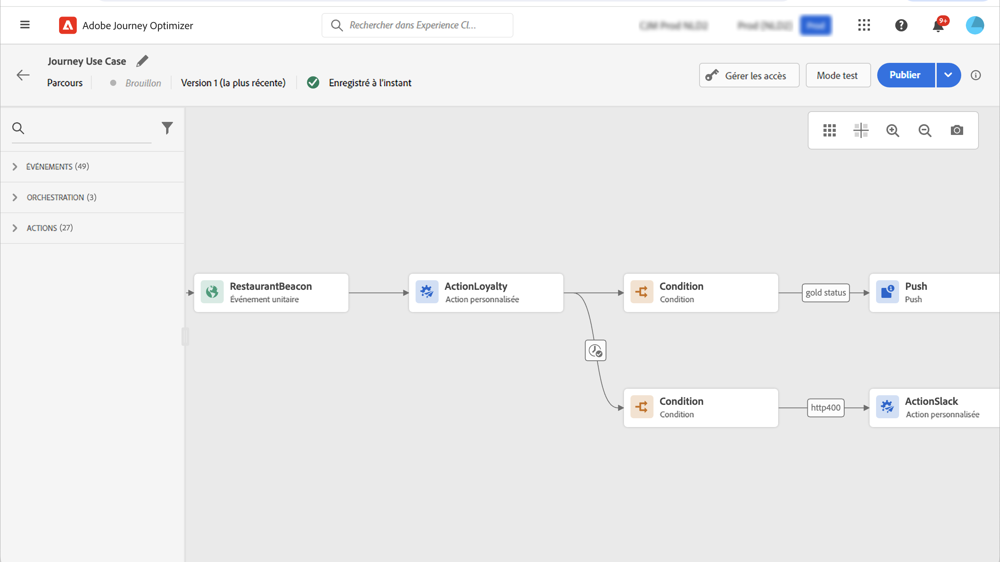

# Améliorations des actions personnalisées {#configure-an-action}

Vous pouvez désormais utiliser les réponses d’appel API dans des actions personnalisées et orchestrer votre parcours en fonction de ces réponses.

Cette fonctionnalité n’était disponible que lors de l’utilisation de sources de données. Vous pouvez désormais l’utiliser avec des actions personnalisées.

> [!AVAILABILITY]
>
> Cette fonctionnalité est actuellement disponible en version bêta privée.

## Définition de l’action personnalisée

Lors de la définition de l’action personnalisée, deux améliorations ont été apportées : l’ajout de la méthode GET et le nouveau champ de réponse de payload. Les autres options et paramètres restent inchangés. Consultez [cette page](../action/about-custom-action-configuration.md).

### Configuration du point d’entrée {#url-configuration}

La variable **Configuration d’URL** a été renommée **Configuration des points d’entrée**.

Dans le **Méthode** , vous pouvez maintenant sélectionner **GET**.

{width="70%" align="left"}

### Payloads {#url-configuration}

La variable **Paramètres d’action** a été renommée **Payloads**. Deux champs sont disponibles :

* La variable **Requête** field : ce champ n&#39;est disponible que pour les méthodes d&#39;appel POST et PUT.
* La variable **Réponse** champ : il s’agit de la nouvelle fonctionnalité. Ce champ est disponible pour toutes les méthodes d&#39;appel.

> [!NOTE]
> 
> Ces deux champs sont facultatifs.

{width="70%" align="left"}

1. Cliquez dans le **Réponse** champ .

   {width="70%" align="left"}

1. Collez un exemple de la payload renvoyée par l’appel . Vérifiez que les types de champ sont corrects (chaîne, entier, etc.).

   {width="70%" align="left"}

1. Cliquez sur **Enregistrer**.

À chaque appel de l’API, le système récupère tous les champs contenus dans l’exemple de payload. Notez que vous pouvez cliquer sur **Coller une nouvelle payload** si vous souhaitez modifier la payload actuellement transmise.

Voici un exemple de payload de réponse capturée lors de l’appel à un service API météorologique :

```
{
    "coord": {
        "lon": 2.3488,
        "lat": 48.8534
    },
    "weather": [
        {
            "id": 800,
            "main": "Clear",
            "description": "clear sky",
            "icon": "01d"
        }
    ],
    "base": "stations",
    "main": {
        "temp": 29.78,
        "feels_like": 29.78,
        "temp_min": 29.92,
        "temp_max": 30.43,
        "pressure": 1016,
        "humidity": 31
    },
    "visibility": 10000,
    "wind": {
        "speed": 5.66,
        "deg": 70
    },
    "clouds": {
        "all": 0
    },
    "dt": 1686066467,
    "sys": {
        "type": 1,
        "id": 6550,
        "country": "FR",
        "sunrise": 1686023350,
        "sunset": 1686080973
    },
    "timezone": 7200,
    "id": 2988507,
    "name": "Paris",
    "cod": 200
}
```

## Utilisation de la réponse dans un parcours

Il vous suffit d’ajouter l’action personnalisée à un parcours. Vous pouvez ensuite exploiter les champs de payload de réponse dans des conditions, d’autres actions et la personnalisation des messages.

### Conditions et actions

Par exemple, vous pouvez ajouter une condition pour vérifier la vitesse du vent. Lorsque la personne entre dans la boutique de surf, vous pouvez envoyer une notification push si le temps est trop venteux.

{width="70%" align="left"}

Dans la condition, vous devez utiliser l’éditeur avancé pour exploiter les champs de réponse de l’action, sous la propriété **Contexte** noeud .

{width="70%" align="left"}

Vous pouvez également utiliser la variable **jo_status** pour créer un chemin d’accès en cas d’erreur.

{width="70%" align="left"}

> [!WARNING]
>
> Seules les actions personnalisées nouvellement créées comprennent ce champ prêt à l’emploi. Si vous souhaitez l’utiliser avec une action personnalisée existante, vous devez mettre à jour l’action. Par exemple, vous pouvez mettre à jour la description et enregistrer.

Voici les valeurs possibles pour ce champ :

* code d’état http : par exemple **http_200** ou **http_400**
* timeout error : **timedout**
* erreur de limitation : **limité**
* Erreur interne : **internalError**

### Personnalisation des messages

Vous pouvez personnaliser vos messages à l’aide des champs de réponse. Dans notre exemple, dans la notification push, nous personnalisons le contenu à l&#39;aide de la valeur de vitesse.

{width="70%" align="left"}

> [!NOTE]
>
> L’appel n’est effectué qu’une seule fois par profil dans un parcours donné. Plusieurs messages ne déclencheront pas de nouveaux appels.

## Syntaxe des expressions

Voici la syntaxe :

```json
#@action{myAction.myField} 
```

Voici quelques exemples :

```json
// action response field
@action{<action name>.<path to the field>}
@action{OpenWeatherMap.main.temp}
```

```json
// action response field
@action{<action name>.<path to the field>, defaultValue: <default value expression>}
@action{OpenWeatherMap.main.temp, defaultValue: 273.15}
@action{OpenWeatherMap.main.temp, defaultValue: @{myEvent.temperature}} 
```


