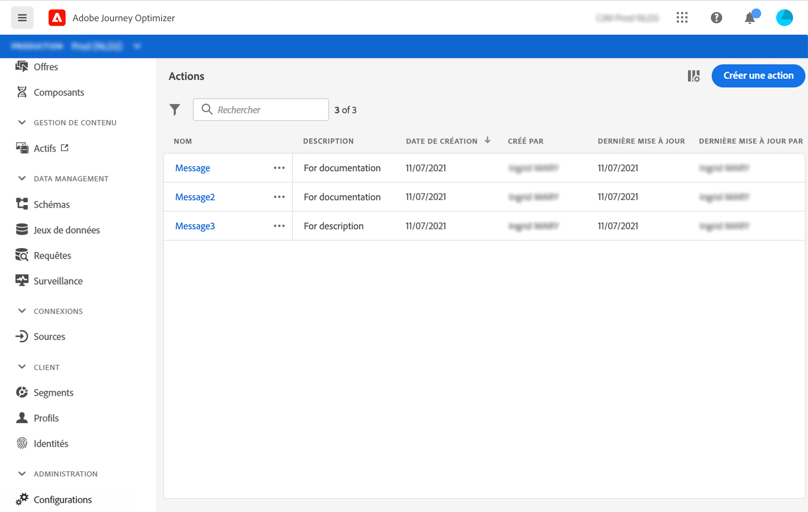

# À propos des actions {#about_actions}

>[!CONTEXTUALHELP]
>id="jo_actions"
>title="À propos des actions"
>abstract="C’est à ce niveau qu’est définie la connexion au système qui enverra les messages. Les actions définies ici seront ensuite disponibles dans la palette de gauche de votre parcours, dans la catégorie Action. "

Les actions sont des connexions par le biais desquelles vous proposez des expériences en temps réel personnalisées aux clients, telles que des notifications Push, des e-mails, des SMS ou tout autre moyen d’engagement numérique utilisé dans votre entreprise.

[!DNL Journey Optimizer] est fourni avec une fonctionnalité de message intégrée. Consultez [cette section](../get-started-content.md).

Si vous utilisez un système tiers pour envoyer des messages tels que Epsilon, Facebook, Adobe.io, Firebase, etc., vous devez ajouter et configurer une action personnalisée. Voir [cette page](../action/about-custom-action-configuration.md).

Les actions personnalisées vous permettent de configurer la connexion d’un système tiers pour envoyer des messages ou des appels d’API. Une action peut être configurée avec n’importe quel service de n’importe quel fournisseur qui peut être appelé via une API REST avec un payload au format JSON.

>[!CAUTION]
>
>La configuration des actions personnalisées doit être effectuée par un **utilisateur technique**.

Les actions sont disponibles dans la palette gauche de votre parcours, dans la catégorie **[!UICONTROL Action]** Voir [cette page](../building-journeys/about-journey-activities.md#action-activities).

Dans la liste des **Actions**, vous pouvez appuyer sur la touche c pour créer un parcours, une action, une source de données ou un événement. Pour plus d&#39;informations sur les raccourcis, voir [cette section](../user-interface.md#cjm-accessibility).

Pour vue de la liste d’actions ou configurer une nouvelle action, cliquez sur **[!UICONTROL Admin]** / **[!UICONTROL Actions]** dans les menus de gauche. La liste des actions s’affiche. Pour plus d’informations sur l’interface, voir [cette page](../user-interface.md)

