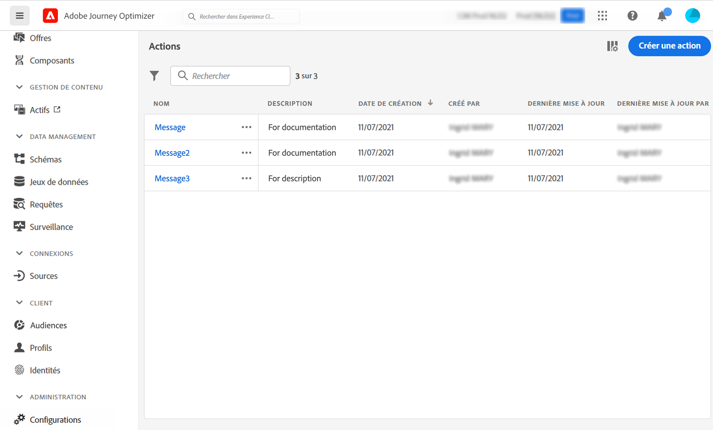

# Commencer avec les actions personnalisées {#about_actions}

>[!CONTEXTUALHELP]
>id="ajo_journey_action_list"
>title="Actions personnalisées"
>abstract="Les actions sont des connexions par lesquelles vous proposez des expériences personnalisées et en temps réel aux clients ou aux clientes, telles que des notifications push, des e-mails, des SMS ou tout autre moyen d’engagement numérique utilisé dans votre entreprise."

Les actions sont des connexions par lesquelles vous proposez des expériences personnalisées et en temps réel aux clients ou aux clientes, telles que des notifications push, des e-mails, des SMS ou tout autre moyen d’engagement numérique utilisé dans votre entreprise.

➡️ [Découvrez cette fonctionnalité en vidéo.](#video)

[!DNL Journey Optimizer] est fourni avec une fonctionnalité de message intégrée. Les actions personnalisées vous permettent de configurer la connexion d&#39;un système tiers pour envoyer des messages ou des appels d&#39;API. Une action peut être configurée avec n’importe quel service de n’importe quel fournisseur qui peut être appelé via une API REST avec une payload au format JSON.

* Si vous utilisez Adobe Campaign v7 ou v8, une intégration est disponible sur demande. Voir [cette page](../action/acc-action.md).

* Si vous utilisez un système tiers pour envoyer des messages tels qu’Epsilon, Facebook, Adobe Developer, Firebase, etc., vous devez créer et configurer une action personnalisée. Voir [cette page](../action/about-custom-action-configuration.md).

>[!CAUTION]
>
>La configuration des actions personnalisées doit être effectuée par un **utilisateur ou une utilisatrice technique**.

Les actions personnalisées sont des actions supplémentaires définies par le personnel technique et mises à la disposition des équipes marketing : une fois configurées, elles apparaissent dans la palette gauche de votre parcours, dans la catégorie **[!UICONTROL Action]**. En savoir plus sur [cette page](../building-journeys/about-journey-activities.md#action-activities).

Pour afficher la liste des actions ou configurer une nouvelle action, sélectionnez **[!UICONTROL Configurations]** dans la section du menu ADMINISTRATION. Dans la section **[!UICONTROL Actions]**, cliquez sur **[!UICONTROL Gérer]**. La liste des actions s&#39;affiche. Pour plus d&#39;informations sur l&#39;interface, voir [cette page](../start/user-interface.md)

Découvrez comment résoudre les problèmes liés à une action personnalisée [dans cette page dédiée](../action/troubleshoot-custom-action.md).

## Vidéo pratique {#video}

Découvrez comment configurer des actions personnalisées.

>[!VIDEO](https://video.tv.adobe.com/v/3428396?quality=12)

## Ressources supplémentaires

Parcourez les sections ci-dessous pour en savoir plus sur la configuration et l’utilisation de vos actions personnalisées :

* [Configurer vos actions personnalisées](../action/about-custom-action-configuration.md) : découvrez comment créer et configurer une action personnalisée.
* [Utiliser des actions personnalisées](../building-journeys/using-custom-actions.md) : découvrez comment utiliser des actions personnalisées dans vos parcours.
* [Transmettre des collections dans des paramètres d’action personnalisés](../building-journeys/collections.md) : découvrez comment transmettre une collection dans des paramètres d’action personnalisés qui est renseignée dynamiquement au moment de l’exécution.
* [Résolution des problèmes liés aux actions personnalisées](../action/troubleshoot-custom-action.md) : découvrez comment résoudre les problèmes liés à une action personnalisée.

