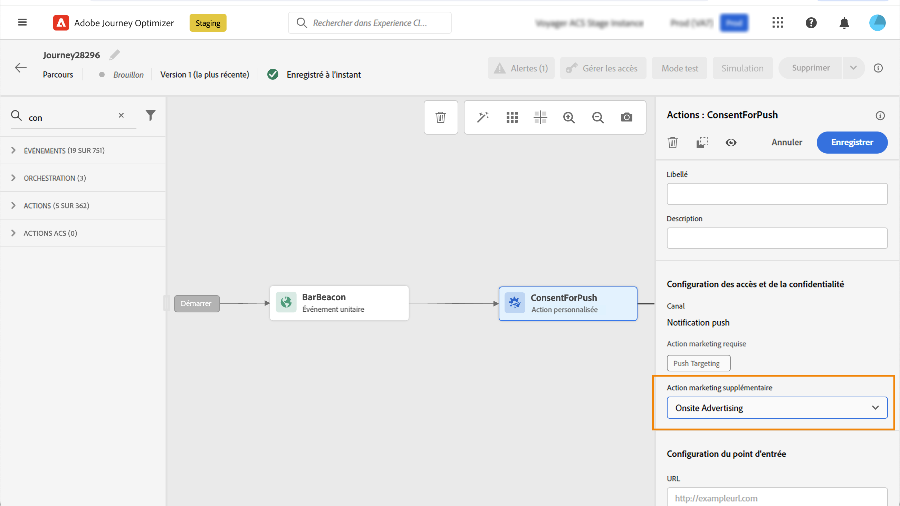

# Utiliser les politiques de consentement {#consent-management}

Vos données peuvent être soumises à des restrictions d’utilisation définies par votre organisation ou par des réglementations juridiques. Il est donc important de s’assurer que vos opérations de données dans Journey Optimizer sont conformes aux [politiques d’utilisation des données](https://experienceleague.adobe.com/docs/experience-platform/data-governance/policies/overview.html?lang=fr){target="_blank"}. These policies are Adobe Experience Platform rules defining which [marketing actions](https://experienceleague.adobe.com/docs/experience-platform/data-governance/policies/overview.html?lang=fr#marketing-actions){target="_blank"} que vous avez le droit d’appliquer les données.

Les **politiques de consentement** constituent un type de politiques d’utilisation des données disponible. Elles vous permettent d’adopter et d’appliquer facilement des politiques marketing afin de respecter les préférences de consentement de vos clientes et clients. [En savoir plus sur l’application des politiques](https://experienceleague.adobe.com/docs/experience-platform/data-governance/enforcement/auto-enforcement.html?lang=fr){target="_blank"}

>[!IMPORTANT]
>
>Les politiques de consentement ne sont actuellement disponibles que pour les organisations qui ont acheté les offres complémentaires Adobe **Healthcare Shield** et **Privacy and Security Shield**.

Par exemple, vous pouvez [créer des politiques de consentement](https://experienceleague.adobe.com/docs/experience-platform/data-governance/policies/user-guide.html?lang=fr#consent-policy){target="_blank"} dans Experience Platform pour exclure les clientes et clients qui n’ont pas consenti à recevoir des communications par e-mail, notification push ou SMS.

<!--* For the native outbound channels (Email, Push, SMS, Direct mail), the logic is as follows:

    * By default, if a profile has opted out from receiving communications from you, the corresponding profile is excluded from subsequent deliveries.

    * If you have the Adobe **Healthcare Shield** or **Privacy and Security Shield**, you can create a custom consent policy that overrides the default logic. For example, you can define a policy to only send email messages to all individuals who have opted in. In the absence of a custom policy, the default policy applies.
    
    To apply a custom policy, you need to define a marketing action in that policy and associate it to a channel surface. [Learn more](#marketing-actions)-->

Au niveau du parcours, vous pouvez appliquer des politiques de consentement à vos actions personnalisées :

* Lors de la **configuration d’une action personnalisée**, vous pouvez définir un canal et une action marketing. [En savoir plus](#consent-custom-action)
* Lors de l’ajout de l’**action personnalisée dans un parcours**, vous pouvez définir une action marketing supplémentaire. [En savoir plus](#consent-journey)

<!--

## Leverage consent policies through channel surfaces {#marketing-actions}

In [!DNL Journey Optimizer], consent is handled by the Experience Platform [Consent schema](https://experienceleague.adobe.com/docs/experience-platform/xdm/field-groups/profile/consents.html){target="_blank"}. By default, the value for the consent field is empty and treated as consent to receive your communications. You can modify this default value while onboarding to one of the possible values listed [here](https://experienceleague.adobe.com/docs/experience-platform/xdm/data-types/consents.html#choice-values){target="_blank"}.

To modify the consent field value, you can create a custom consent policy in which you define a marketing action and the conditions under which that action is performed. [Learn more on marketing actions](https://experienceleague.adobe.com/docs/experience-platform/data-governance/policies/overview.html#marketing-actions){target="_blank"}

For example, if you want to create a consent policy to target only profiles who have consented to receive email communications, follow the steps below.

1. Make sure your organization has purchased the Adobe **Healthcare Shield** or **Privacy and Security Shield** add-on offerings. [Learn more](https://experienceleague.adobe.com/docs/events/customer-data-management-voices-recordings/governance/healthcare-shield.html){target="_blank"}

1. In Adobe Experience Platform, create a custom policy (from the **[!UICONTROL Privacy]** > **[!UICONTROL Policies]** menu). [Learn how](https://experienceleague.adobe.com/docs/experience-platform/data-governance/policies/user-guide.html#create-policy){target="_blank"}

    

1. Choose the **[!UICONTROL Consent policy]** type and configure a condition as follows. [Learn how to configure consent policies](https://experienceleague-review.corp.adobe.com/docs/experience-platform/data-governance/policies/user-guide.html#consent-policy){target="_blank"}

    1. Under the **[!UICONTROL If]** section, select the **[!UICONTROL Email Targeting]** default marketing action.

        

        >[!NOTE]
        >
        >The core marketing actions provided out-of-the-box by Adobe are listed in [this table](https://experienceleague.adobe.com/docs/experience-platform/data-governance/policies/overview.html?lang=en#core-actions){target="_blank"}. The steps to create a custom marketing action are listed in [this section](https://experienceleague.adobe.com/docs/experience-platform/data-governance/policies/user-guide.html#create-marketing-action){target="_blank"}.

    1. Select what happens when the marketing action applies. In this example, select **[!UICONTROL Email Marketing Consent]**.

    

1. Save and [enable](https://experienceleague.adobe.com/docs/experience-platform/data-governance/policies/user-guide.html#enable){target="_blank"} this policy.

1. In Journey Optimizer, create an email surface. [Learn how](../configuration/channel-surfaces.md#create-channel-surface)

1. In the email surface details, select the **[!UICONTROL Email Targeting]** marketing action.

    

All consent policies associated with that marketing action are automatically leveraged in order to respect the preferences of your customers.

Therefore, in this example, any [email](../email/create-email.md) using that surface in a campaign or a journey is only sent to the profiles who have consented to receive emails from you. Profiles who have not consented to receive email communications are excluded.-->

## Utiliser des politiques de consentement par le biais d’actions personnalisées {#journey-custom-actions}

### Remarques importantes {#important-notes}

Dans Journey Optimizer, le consentement peut être <!--also -->utilisé dans des actions personnalisées. Si vous souhaitez l’utiliser avec les fonctionnalités de message intégré, vous devez utiliser une activité de condition pour filtrer les clients dans votre parcours.

Avec la gestion du consentement, deux activités de parcours sont analysées :

* Lecture d’audience : l’audience récupérée est prise en compte.
* Action personnalisée : la gestion du consentement prend en compte les attributs utilisés ([paramètres d’action](../action/about-custom-action-configuration.md#define-the-message-parameters)) ainsi que la ou les actions marketing définies (action marketing requise et action marketing supplémentaire).
* Les attributs qui font partie d’un groupe de champs utilisant le schéma d’union prêt à l’emploi ne sont pas pris en charge. Ces attributs seront masqués dans l’interface. Vous devez créer un autre groupe de champs utilisant un autre schéma.
* Les politiques de consentement s’appliquent uniquement lorsqu’une action marketing (requise ou supplémentaire) est définie au niveau de l’action personnalisée.

Toutes les autres activités utilisées dans un parcours ne sont pas prises en compte. Si vous commencez votre parcours avec une qualification d’audience, l’audience n’est pas prise en compte.

Dans un parcours, si un profil est exclu par une politique de consentement dans une action personnalisée, le message ne lui est pas envoyé, mais il continue le parcours. Le profil n’atteint pas le chemin de délai d’expiration et erreur lors de l’utilisation d’une condition.

Avant d’actualiser les politiques dans une action personnalisée placée dans un parcours, assurez-vous que votre parcours ne comporte aucune erreur.

<!--
There are two types of latency regarding the use of consent policies:

* **User latency**: the delay from the time a profile changes a consent settings to the moment it is applied in Experience Platform. This can take up to 48h. 
* **Consent policy latency**: the delay from the time a consent policy is created or updated to the moment it is applied. This can take up to 6 hours
-->

### Configurer l’action personnalisée {#consent-custom-action}

>[!CONTEXTUALHELP]
>id="ajo_consent_required_marketing_action"
>title="Définition d’une action marketing requise"
>abstract="L’action marketing requise vous permet de définir l’action marketing associée à votre action personnalisée. Par exemple, si vous utilisez cette action personnalisée pour envoyer des e-mails, vous pouvez sélectionner Ciblage des e-mails. Lorsqu’elles sont utilisées dans un parcours, toutes les politiques de consentement associées à cette action marketing sont récupérées et exploitées. Elle ne peut pas être modifiée dans la zone de travail."

Lors de la configuration d’une action personnalisée, deux champs peuvent être utilisés pour la gestion du consentement.

Le **Canal** vous permet de sélectionner le canal associé à cette action personnalisée : **E-mail**, **SMS** ou **Notification push**. Il préremplit le champ **Action marketing requise** avec l’action marketing par défaut pour le canal sélectionné. Si vous sélectionnez **Autre**, aucune action marketing n’est définie par défaut.

L’**Action marketing requise** vous permet de définir l’action marketing associée à votre action personnalisée. Par exemple, si vous utilisez cette action personnalisée pour envoyer des e-mails, vous pouvez sélectionner **Ciblage des e-mails**. Lorsqu’elles sont utilisées dans un parcours, toutes les politiques de consentement associées à cette action marketing sont récupérées et utilisées. Une action marketing par défaut est sélectionnée, mais vous pouvez cliquer sur la flèche vers le bas pour sélectionner n’importe quelle action marketing disponible dans la liste.

Pour certains types de communications importantes, par exemple un message transactionnel envoyé pour réinitialiser le mot de passe du client, vous pouvez ne pas appliquer de politique de consentement. Vous pouvez ensuite sélectionner **Aucune** dans le champ **Action marketing requise**.

Les autres étapes de configuration d’une action personnalisée sont présentées dans [cette section](../action/about-custom-action-configuration.md#consent-management).

### Création du parcours {#consent-journey}

>[!CONTEXTUALHELP]
>id="ajo_consent_required_marketing_action_canvas"
>title="Action marketing requise"
>abstract="Une action marketing requise est définie lors de la création d’une action personnalisée. Cette action marketing requise ne peut pas être supprimée de l’action ou modifiée."

>[!CONTEXTUALHELP]
>id="ajo_consent_additional_marketing_action_canvas"
>title="Action marketing supplémentaire"
>abstract="Ajoutez une autre action marketing en plus de celle requise. Les règles de consentement liées aux deux actions marketing seront appliquées."

>[!CONTEXTUALHELP]
>id="ajo_consent_refresh_policies_canvas"
>title="Visualiser les politiques de consentement qui s’appliqueront au moment de l’exécution"
>abstract="Les actions marketing apportent des politiques de consentement qui combinent des paramètres d’action et des valeurs de consentement de profil individuel pour filtrer les utilisateurs. Obtenez la dernière définition de ces politiques en cliquant sur le bouton pour l’actualiser."

Lors de l’ajout de l’action personnalisée dans un parcours, plusieurs options vous permettent de gérer le consentement. Cliquez sur le bouton **Afficher les champs en lecture seule** pour afficher tous les paramètres.

Le **Canal** et l’**Action marketing requise**, définis lors de la configuration de l’action personnalisée, s’affichent en haut de l’écran. Vous ne pouvez pas modifier ces champs.

Vous pouvez définir une **Action marketing supplémentaire** pour définir le type d’action personnalisée. Vous pouvez ainsi définir l’objectif de l’action personnalisée dans ce parcours. Outre l’action marketing requise, généralement spécifique à un canal, vous pouvez définir une action marketing supplémentaire qui est spécifique à l’action personnalisée dans ce parcours particulier. Par exemple : une communication relative à un entraînement, une newsletter, une communication sur la condition physique, etc. L’action marketing requise et l’action marketing supplémentaire s’appliquent toutes deux.

Cliquez sur le bouton **Actualiser les politiques**, en bas de l’écran, pour mettre à jour et vérifier la liste des politiques prises en compte pour cette action personnalisée. Elle est fournie à titre d’information uniquement, lors de la création d’un parcours. Avec les parcours en direct, les politiques de consentement sont récupérées et mises à jour automatiquement toutes les 6 heures.

<!--
The following data is taken into account for consent:

* marketing actions and additional marketing actions defined in the custom action
* action parameters defined in the custom action, see this [section](../action/about-custom-action-configuration.md#define-the-message-parameters) 
* attributes used as criteria in a segment when the journey starts with a Read segment, see this [section](../building-journeys/read-audience.md) 

>[!NOTE]
>
>Please note that there can be a latency when updating the list of policies applied, refer to this [this section](../action/consent.md#important-notes).
-->

Les autres étapes de configuration d’une action personnalisée dans un parcours sont présentées dans [cette section](../building-journeys/using-custom-actions.md).
