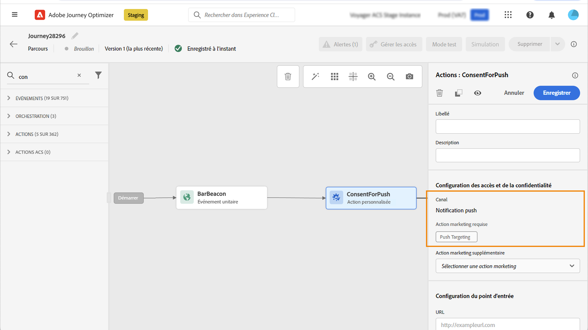

# Utiliser les politiques de consentement {#consent-management}

Vos données peuvent être soumises à des restrictions d’utilisation définies par votre organisation ou par des réglementations juridiques. Il est donc important de s’assurer que vos opérations de données au sein de Journey Optimizer sont conformes aux [politiques d’utilisation des données](https://experienceleague.adobe.com/docs/experience-platform/data-governance/policies/overview.html?lang=fr){target="_blank"}. Ces politiques sont des règles Adobe Experience Platform qui définissent les actions marketing que vous avez l’autorisation d’effectuer sur les données.

Par défaut, si un profil s’est désabonné de la réception des communications de votre part, le profil correspondant est exclu des prochaines diffusions. Vous pouvez créer une **politique de consentement** qui remplace cette logique par défaut. Par exemple, vous pouvez créer une politique de consentement dans Experience Platform pour exclure les clientes et clients qui n’ont pas consenti à recevoir des communications sur un canal donné. En l’absence de politique personnalisée, la politique par défaut s’applique.

>[!IMPORTANT]
>
>Les politiques de consentement ne sont actuellement disponibles que pour les organisations qui ont acheté les offres complémentaires Adobe **Healthcare Shield** et **Privacy and Security Shield**.

Les principales étapes pour appliquer des politiques de consentement sont les suivantes :

1. Créez une politique de consentement dans Adobe Experience Platform avec une action marketing associée. [Découvrir comment créer une politique de consentement](https://experienceleague.adobe.com/docs/experience-platform/data-governance/policies/user-guide.html?lang=fr#consent-policy){target="_blank"}

2. Appliquez des politiques de consentement dans Adobe Journey Optimizer à l’aide de configurations de canal ou d’actions personnalisées de parcours.

   * Créez une configuration des canaux avec une action marketing associée. Si vous créez une communication à l’aide de la configuration des canaux, elle hérite de l’action marketing associée et applique les politiques de consentement correspondantes définies dans Adobe Experience Platform. [Découvrir comment tirer parti des politiques de consentement par le biais de configurations de canal](#surface-marketing-actions)

   * Au niveau du parcours, vous pouvez effectuer l’une des opérations suivantes :

      * Associer un canal et une action marketing à une action personnalisée lors de sa configuration. [Découvrir comment tirer parti des politiques de consentement lors de la configuration d’une action personnalisée](#consent-custom-action)
      * Définir une action marketing supplémentaire lors de l’ajout d’une action personnalisée dans un parcours. [Découvrir comment tirer parti des politiques de consentement lors de l’ajout d’une action personnalisée dans un parcours](#consent-journey)

## Exploiter les politiques de consentement par le biais de configurations de canal {#surface-marketing-actions}

Dans [!DNL Journey Optimizer], le consentement est géré par le [Schéma de consentement](https://experienceleague.adobe.com/docs/experience-platform/xdm/field-groups/profile/consents.html?lang=fr){target="_blank"} d’Experience Platform. Par défaut, la valeur du champ de consentement est vide et traitée comme un consentement pour recevoir vos communications. Vous pouvez modifier cette valeur par défaut lors de l’intégration à l’une des valeurs possibles répertoriées [ici](https://experienceleague.adobe.com/docs/experience-platform/xdm/data-types/consents.html?lang=fr#choice-values){target="_blank"}.

Pour modifier la valeur du champ de consentement, vous pouvez créer une politique de consentement personnalisée dans laquelle vous définissez une action marketing et les conditions dans lesquelles cette action est effectuée. [En savoir plus sur les actions marketing](https://experienceleague.adobe.com/docs/experience-platform/data-governance/policies/overview.html?lang=fr#marketing-actions){target="_blank"}

Par exemple, si vous souhaitez créer une politique de consentement pour ne cibler que les profils ayant consenti à recevoir des communications par e-mail, procédez comme suit.

1. Assurez-vous que votre organisation a acheté les offres complémentaires **Healthcare Shield** ou **Privacy and Security Shield** d’Adobe. [En savoir plus](https://experienceleague.adobe.com/docs/events/customer-data-management-voices-recordings/governance/healthcare-shield.html?lang=fr){target="_blank"}

1. Dans Adobe Experience Platform, créez une politique personnalisée (à partir du menu **[!UICONTROL Confidentialité]** > **[!UICONTROL Politiques]**). [Voici comment procéder](https://experienceleague.adobe.com/docs/experience-platform/data-governance/policies/user-guide.html?lang=fr#create-policy){target="_blank"}

   <!---->

1. Choisissez le type de **[!UICONTROL Politique de consentement]** et configurez une condition comme suit. [Découvrir comment configurer des politiques de consentement](https://experienceleague.adobe.com/docs/experience-platform/data-governance/policies/user-guide.html?lang=fr#consent-policy){target="_blank"}

   1. Dans la section **[!UICONTROL If]**, sélectionnez l’action marketing par défaut **[!UICONTROL Ciblage par e-mail]**.

      <!---->

      >[!NOTE]
      >
      >Les principales actions marketing prêtes à l’emploi proposées par Adobe sont répertoriées dans [ce tableau](https://experienceleague.adobe.com/docs/experience-platform/data-governance/policies/overview.html?lang=fr#core-actions){target="_blank"}. Les étapes de création d’une action marketing personnalisée sont répertoriées dans [cette section](https://experienceleague.adobe.com/docs/experience-platform/data-governance/policies/user-guide.html?lang=fr#create-marketing-action){target="_blank"}.

   1. Sélectionnez ce qui se passe lorsque l’action marketing s’applique. Dans cet exemple, sélectionnez **[!UICONTROL Consentement au marketing par e-mail]**.

   

1. Enregistrez et [activez](https://experienceleague.adobe.com/docs/experience-platform/data-governance/policies/user-guide.html?lang=fr#enable){target="_blank"} cette politique.

1. Dans Journey Optimizer, créez une configuration de canal d’e-mail. [Voici comment procéder](../configuration/channel-surfaces.md#create-channel-surface)

1. Dans les détails de la configuration du canal e-mail, sélectionnez l’action marketing **[!UICONTROL Ciblage par e-mail]**.

   

Toutes les politiques de consentement associées à cette action marketing sont utilisées afin de respecter les préférences de vos clientes et clients.

Dans cet exemple, tout [e-mail](../email/create-email.md) utilisant cette configuration dans une campagne ou un parcours n’est donc envoyé qu’aux profils qui ont consenti à recevoir des e-mails de votre part. Les profils qui n’ont pas consenti à recevoir des communications par e-mail sont exclus.

## Utiliser des politiques de consentement par le biais d’actions personnalisées {#journey-custom-actions}

### Remarques importantes {#important-notes}

Dans Journey Optimizer, le consentement peut également être utilisé dans des actions personnalisées. Si vous souhaitez l’utiliser avec les fonctionnalités de message intégré, vous devez utiliser une activité de condition pour filtrer les clients dans votre parcours.

Avec la gestion du consentement, deux activités de parcours sont analysées :

* Lecture d’audience : l’audience récupérée est prise en compte.
* Action personnalisée : la gestion du consentement prend en compte les attributs utilisés ([paramètres d’action](../action/about-custom-action-configuration.md#define-the-message-parameters)) ainsi que la ou les actions marketing définies (action marketing requise et action marketing supplémentaire).
* Les attributs qui font partie d’un groupe de champs utilisant le schéma d’union prêt à l’emploi ne sont pas pris en charge. Ces attributs seront masqués dans l’interface. Vous devez créer un autre groupe de champs utilisant un autre schéma.
* Les politiques de consentement s’appliquent uniquement lorsqu’une action marketing (requise ou supplémentaire) est définie au niveau de l’action personnalisée.

Toutes les autres activités utilisées dans un parcours ne sont pas prises en compte. Si vous commencez votre parcours avec une qualification d’audience, l’audience n’est pas prise en compte.

Dans un parcours, si un profil est exclu par une politique de consentement dans une action personnalisée, le message ne lui est pas envoyé, mais il continue le parcours. Le profil n’atteint pas le chemin de délai d’expiration et erreur lors de l’utilisation d’une condition.

Avant d’actualiser les politiques dans une action personnalisée placée dans un parcours, assurez-vous que votre parcours ne comporte aucune erreur.

<!--
There are two types of latency regarding the use of consent policies:

* **User latency**: the delay from the time a profile changes a consent settings to the moment it is applied in Experience Platform. This can take up to 48h. 
* **Consent policy latency**: the delay from the time a consent policy is created or updated to the moment it is applied. This can take up to 6 hours
-->

### Tirer parti des politiques de consentement lors de la configuration d’une action personnalisée{#consent-custom-action}

Lors de la configuration d’une action personnalisée, deux champs peuvent être utilisés pour la gestion du consentement.

Le champ **Canal** vous permet de sélectionner le canal associé à cette action personnalisée. Il préremplit le champ **Action marketing requise** avec l’action marketing par défaut pour le canal sélectionné. Si vous sélectionnez **Autre**, aucune action marketing n’est définie par défaut.

L’**Action marketing requise** vous permet de définir l’action marketing associée à votre action personnalisée. Par exemple, si vous utilisez cette action personnalisée pour envoyer des e-mails, vous pouvez sélectionner **Ciblage des e-mails**. Lorsqu’elles sont utilisées dans un parcours, toutes les politiques de consentement associées à cette action marketing sont récupérées et utilisées. Une action marketing par défaut est sélectionnée, mais vous pouvez cliquer sur la flèche vers le bas pour sélectionner n’importe quelle action marketing disponible dans la liste.

Pour certains types de communications importantes, par exemple un message transactionnel envoyé pour réinitialiser le mot de passe du client, vous pouvez ne pas appliquer de politique de consentement. Vous pouvez ensuite sélectionner **Aucune** dans le champ **Action marketing requise**.

Les autres étapes de configuration d’une action personnalisée sont présentées dans [cette section](../action/about-custom-action-configuration.md#consent-management).

### Tirer parti des politiques de consentement lors de l’ajout d’une action personnalisée dans un parcours {#consent-journey}

Lors de l’ajout de l’action personnalisée dans un parcours, plusieurs options vous permettent de gérer le consentement. Cliquez sur le bouton **Afficher les champs en lecture seule** pour afficher tous les paramètres.

Le **Canal** et l’**Action marketing requise**, définis lors de la configuration de l’action personnalisée, s’affichent en haut de l’écran. Vous ne pouvez pas modifier ces champs.

Vous pouvez définir une **Action marketing supplémentaire** pour définir le type d’action personnalisée. Vous pouvez ainsi définir l’objectif de l’action personnalisée dans ce parcours. Outre l’action marketing requise, généralement spécifique à un canal, vous pouvez définir une action marketing supplémentaire qui est spécifique à l’action personnalisée dans ce parcours particulier. Par exemple : une communication relative à un entraînement, une newsletter, une communication sur la condition physique, etc. L’action marketing requise et l’action marketing supplémentaire s’appliquent toutes deux.

Cliquez sur le bouton **Actualiser les politiques**, en bas de l’écran, pour mettre à jour et vérifier la liste des politiques prises en compte pour cette action personnalisée. Elle est fournie à titre d’information uniquement, lors de la création d’un parcours. Avec les parcours en direct, les politiques de consentement sont récupérées et mises à jour automatiquement toutes les 6 heures.

<!--
The following data is taken into account for consent:

* marketing actions and additional marketing actions defined in the custom action
* action parameters defined in the custom action, see this [section](../action/about-custom-action-configuration.md#define-the-message-parameters) 
* attributes used as criteria in a segment when the journey starts with a Read segment, see this [section](../building-journeys/read-audience.md) 

>[!NOTE]
>
>Please note that there can be a latency when updating the list of policies applied, refer to this [this section](../action/consent.md#important-notes).
-->

Les autres étapes de configuration d’une action personnalisée dans un parcours sont présentées dans [cette section](../building-journeys/using-custom-actions.md).
