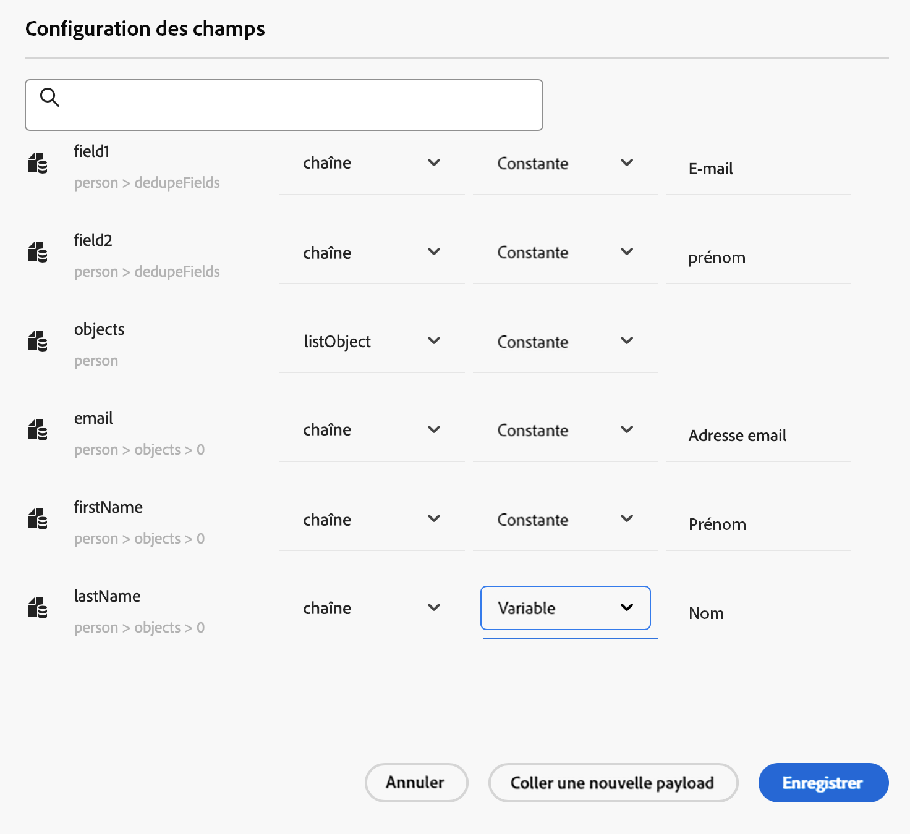
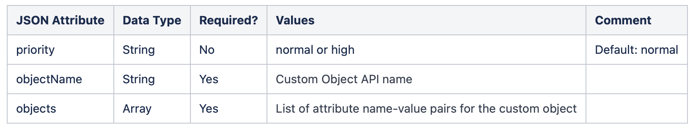
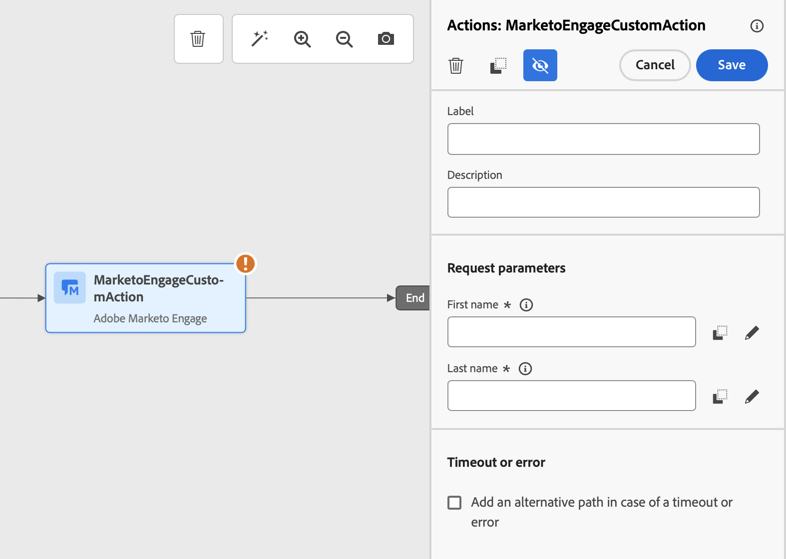

# Intégration à Marketo Engage {#integrating-with-marketo-engage}

Optez pour une intégration transparente des données avec Marketo Engage. Une action personnalisée spécifique est disponible dans vos parcours pour intégrer Adobe Journey Optimizer et Marketo Engage. Cette action personnalisée prend en charge l’ingestion de deux types de données clés :

* **Personnes** (profils) : Marketo transforme les profils en informations exploitables.
* **Objets personnalisés** : personnalisez vos données avec des objets personnalisés tels que des produits, pour une approche marketing qui vous est propre.

## Conditions préalables {#prerequisites}

Les conditions préalables suivantes s’appliquent à cette intégration :

* L’instance cliente de Marketo Engage doit être compatible avec IMS.
* L’instance Marketo Engage et l’instance Adobe Experience Platform/Journey Optimizer doivent se trouver dans la même organisation.
* Le client ou la cliente doit recevoir un accès **MktoSync : service d’ingestion**.

## Configurer l’action {#configure-marketo-action}


Dans Journey Optimizer, vous devez configurer une action personnalisée pour Marketo Engage. Procédez comme suit :

1. Sélectionnez **[!UICONTROL Configurations]** dans la section du menu ADMINISTRATION.
1. Dans la section **[!UICONTROL Actions]**, cliquez sur **[!UICONTROL Créer une action]**. Le volet de configuration des actions s’ouvre sur le côté droit de l’écran.
1. Saisissez Nom, Description et sélectionnez **&#x200B;**&#x200B;comme **Type d&#39;action**
   {width="40%" align="left"}
1. Cliquez sur **Modifier la payload** pour les payloads **Requête** et **Réponse**.
1. Dans les deux cas, composez votre payload et collez-la dans la fenêtre contextuelle dédiée.
   {width="70%" align="left"}
1. Inspecter et configurer des valeurs de payload

   Remarque : pour transmettre des valeurs dynamiquement, remplacez **Constante** par **Variable** pour chaque champ.

   {width="70%" align="left"}

1. Cliquez sur **Enregistrer** dans l’écran de configuration du champ, puis sur **Enregistrer** pour votre action personnalisée.

Vous pouvez désormais utiliser votre action personnalisée dans la votre zone de travail de votre parcours.

## Syntaxe du payload {#payload-syntax}

### Personne


### CustomObject




**Exemple de payload pour une personne**

```json
{
   "munchkinID": "388-KKG-245",  
   "person": {
    "priority": "normal",
    "partitionName": "XYZ",
    "dedupeFields": {
      "field1": "email",
      "field2": "firstName"
    },
    "objects": [
      {
        "email": "Email address",
        "firstName": "First name",
        "lastName": "Last name"
      }
    ]
  }
}
```

**Exemple de payload pour un objet personnalisé**

```json
{
  "munchkinID": "388-KKG-245", 
  "customObject": {
    "priority": "normal",
    "objectName": "products",
    "objects": [
      {
        "email": "Email Address",
        "productName": "Product Name",
        "productQty": "Product Quantity",
        "priceTotal": "Price Total"
      }
    ]
  }
}
```


## Utiliser l’action {#engage-using}

Pour chaque action configurée, une activité d’action Marketo Engage est disponible dans la palette du concepteur de parcours.

Pour l’utiliser, procédez comme suit :

1. Faites glisser l’action personnalisée sur la zone de travail de parcours.

1. Saisissez le libellé et la description de cette action.

1. Dans la section **Paramètres de requête**, cliquez sur l’icône **Modifier** pour chaque paramètre et sélectionnez les valeurs dynamiques que vous avez configurées dans la payload.

{width="70%" align="left"}
