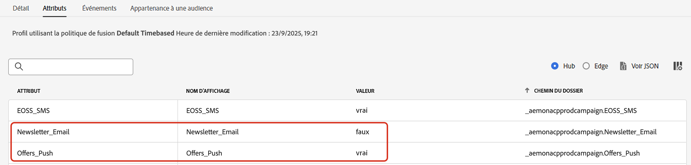
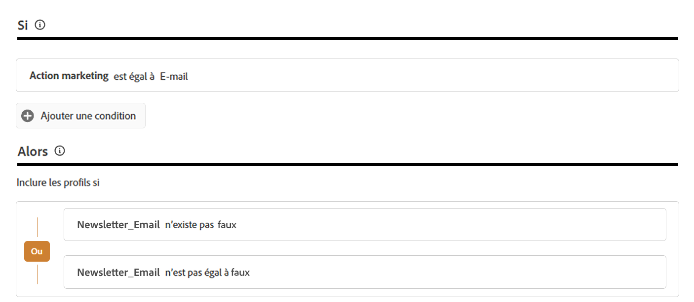

# Gérer les préférences de vos clients {#preference-center}

>[!AVAILABILITY]
>
>Actuellement, cette fonctionnalité n’est disponible que pour les organisations qui ont acheté les offres complémentaires Adobe **Healthcare Shield** ou **Privacy and Security Shield**.

Dans un écosystème moderne d’automatisation du marketing, les marques interagissent avec les clients à travers différents points de contact, ce qui les expose au risque de communications non pertinentes ou excessives, qui entraînent leur désengagement, des plaintes pour spam et des risques de non-conformité. C’est pourquoi ils doivent gérer les préférences de leurs clients afin d’obtenir des informations en temps réel sur leur audience et de diffuser une communication personnalisée et respectueuse.

Avec [!DNL Adobe Journey Optimizer], en utilisant des [politiques de consentement](consent.md), vous pouvez respecter les préférences de vos clients<!-- in terms of **channels** and **topics**-->. Cela permet de s’assurer que [!DNL Journey Optimizer] ne cible que les clients et clientes en fonction de leurs choix<!-- their preferred channels and on the subscription topics--> tout en respectant leur consentement.

Pour gérer les préférences des utilisateurs avec [!DNL Journey Optimizer], vous pouvez :

* Récupérez le consentement de vos clients pour s’inscrire/se désinscrire pour tout canal sortant natif. Par exemple, créez une politique de consentement dans [!DNL Experience Platform] pour exclure les clients qui n’ont pas consenti à recevoir des communications pour un canal donné. Appliquez ensuite cette politique de consentement dans [!DNL Journey Optimizer] à l’aide d’une configuration de canal e-mail. [Voici comment procéder](consent.md#surface-marketing-actions)

  >[!NOTE]
  >
  >Les canaux pris en charge sont E-mail, Push, SMS et InApp.<!--To check-->

* Demandez à vos clients à quels sujets ils souhaitent s’abonner (par exemple le type de communications qu’ils acceptent ou non de recevoir). [Voici comment procéder](#manage-preferences)

>[!IMPORTANT]
>
>Le consentement prévaut sur les préférences. Par exemple, l’un de vos clients a indiqué que son canal préféré est le courrier électronique et qu’il a accepté de recevoir des newsletters<!-- they are interested in yoga--> mais que s’il s’est opposé à toute communication de votre part, il ne peut pas être ciblé par un courrier électronique que vous envoyez<!-- on yoga-->.

## Enregistrer et honorer les préférences {#manage-preferences}

Grâce aux politiques de consentement dans [!DNL Journey Optimizer], vous pouvez gérer les préférences de vos clients de manière centralisée. Vous pouvez ainsi vous assurer de cibler uniquement les clients et clientes en fonction des sujets qu’ils ou elles ont sélectionnés, tout en respectant leurs choix de consentement. Pour ce faire, suivez les étapes ci-après.

Supposons que vous souhaitiez cibler vos clients par le biais de parcours et de campagnes en fonction de leurs préférences de communication sur plusieurs sujets d’abonnement (*Newsletters*, *Offres* et *Lancements de nouveaux produits*).

1. Définissez les attributs de préférence avec l’opérateur booléen au niveau du profil<!--how??-->. Par exemple, vous pouvez spécifier les éléments suivants :

   * *Newsletter_Email* - Booléen (true/false)
   * *Offers_Push* - Booléen (Vrai/Faux)
   * *Lancements De Nouveaux Produits* - Booléen (Vrai/Faux)

   Ces attributs sont capturés dans le schéma d’un [jeu de données](../data/get-started-datasets.md) activé pour Profile et mappés au [profil client unifié](../audience/get-started-profiles.md).

   >[!NOTE]
   >
   >Le consentement du client et les préférences de contact sont des sujets complexes. Pour découvrir comment les préférences de consentement et de contexte peuvent être collectées, traitées et filtrées dans [!DNL Experience Platform], nous vous recommandons de lire les documents suivants :
   >
   >* Pour en savoir plus sur les groupes de champs de schéma requis pour collecter les données de consentement, consultez [cette page](https://experienceleague.adobe.com/fr/docs/experience-platform/landing/governance-privacy-security/consent/adobe/overview){target="_blank"}. Il décrit comment traiter les données de consentement que vous avez collectées auprès de vos clients et les intégrer dans vos profils clients stockés.
   >* Pour en savoir plus sur le groupe de champs Consentement et Préférence, consultez [cette page](https://experienceleague.adobe.com/fr/docs/experience-platform/xdm/field-groups/profile/consents#ingest){target="_blank"}.
   >* Pour ajouter des champs de préférence personnalisés au schéma, suivez les étapes de [cette section](https://experienceleague.adobe.com/fr/docs/experience-platform/landing/governance-privacy-security/consent/adobe/dataset#custom-consent){target="_blank"}.

1. Créez une page pour capturer les préférences de vos clients. Utilisez l’une des méthodes suivantes :

   * Créez une page web pour enregistrer les préférences de vos clients à l’aide de [Adobe Experience Platform Web SDK](https://experienceleague.adobe.com/fr/docs/experience-platform/web-sdk/home){target="_blank"}.

   * Utilisez une [!DNL Journey Optimizer] [page de destination](../landing-pages/create-lp.md) qui comprend des formulaires pour capturer les préférences de vos clients par le biais des données de profil.  [En savoir plus sur les formulaires](../landing-pages/lp-forms.md) <!--Forms not released/announced yet - TBC-->

     >[!NOTE]
     >
     >Assurez-vous que le domaine de la page de destination utilisée appartient à la marque supérieure et non à une sous-marque. En effet, les préférences collectées sont stockées dans les données de profil qui sont au niveau de la marque supérieure.

1. Sur cette page, les clients peuvent mettre à jour leurs préférences, telles que les abonnements par rubrique, en cochant ou décochant des cases.

   Chaque action déclenche un événement de consentement enregistré par rapport aux attributs de profil correspondants (`true` pour l’opt-in, `false` pour l’opt-out) en ingérant les données dans le schéma de jeu de données activé pour le profil<!-- that contains the corresponding preference fields-->.

   <!--Record your users' preferences through the web page or landing page that you created. The data is saved against the corresponding profile, meaning that the preference data is ingested into a Profile-enabled dataset whose schema contains consent/preference fields.-->

   Par exemple, un utilisateur <!--whose email address is john.black@lumamail.com--> accepté de recevoir des offres push mais ne souhaite pas recevoir de newsletters par e-mail. Le profil correspondant est mis à jour comme suit :

   {width=80%}

<!--The corresponding profile dataset is updated as follows:

|Attribute = Email id | Attribute = Offers_Push | Attribute = Newsletters_Email |
|---------|----------|---------|
| john.black@lumamail.com | Y | N |-->

    >[ !REMARQUE]
    >
    >Les événements de consentement entrants sont intégrés au profil client, ce qui garantit des mises à jour en temps réel. Chaque profil reflète ses choix les plus récents dans les préférences d’abonnement.

1. Dans Adobe Experience Platform, créez une politique personnalisée (à partir du menu **[!UICONTROL Confidentialité]** > **[!UICONTROL Politiques]**). [Voici comment procéder](https://experienceleague.adobe.com/docs/experience-platform/data-governance/policies/user-guide.html?lang=fr#create-policy){target="_blank"}

   >[!AVAILABILITY]
   >
   >Actuellement, les politiques de consentement ne sont disponibles que pour les organisations qui ont acheté les offres complémentaires Adobe **Healthcare Shield** ou **Privacy and Security Shield**. [En savoir plus sur les politiques de consentement](consent.md)

   Pour utiliser des politiques de consentement, les attributs de préférence doivent être présents dans les données de profil. C’est pourquoi vous devez définir ces attributs au niveau du profil (comme décrit à l’étape 1).

1. Choisissez le type de **[!UICONTROL Politique de consentement]** et configurez une condition comme suit. [Découvrez comment configurer des politiques de consentement](https://experienceleague.adobe.com/docs/experience-platform/data-governance/policies/user-guide.html?lang=fr#consent-policy){target="_blank"}

<!--Consent policies are comprised of two logical components:

* **If**: The condition that will trigger the policy check, based on a certain marketing action (email, SMS, push, custom action, etc.) being performed, the presence of certain data usage labels, or a combination of the two.

* **Then**: The consent attribute must be present for a profile to be included in the action that triggered the policy. More than one field can also be selected.-->

    Par exemple, pour envoyer des communications uniquement à vos clients qui ne se sont pas désinscrits de la réception de newsletters par e-mail, créez une politique personnalisée et définissez la condition suivante :
    
    * Si **[!UICONTROL Action marketing]** est égal à **[!UICONTROL E-mail]**
    
    * Alors **[!UICONTROL Newsletter_E-mail]** n’existe pas **[!UICONTROL false]** Ou **[!UICONTROL Newsletter_E-mail]** n’est pas égal à **&#x200B;**
    
    {width=80%}
    
    >[!TIP]
    >
    >Le jeu de données activé pour le profil doit inclure l’attribut de profil **[!UICONTROL Newsletter_Email]** avec la valeur définie sur « true » (comme décrit à l’étape 1) 

1. Une fois la politique de consentement créée, exploitez-la dans [!DNL Journey Optimizer] à l’aide de [configurations de canal](consent.md#surface-marketing-actions) ou d’actions personnalisées de parcours [&#128279;](consent.md#journey-custom-actions).

1. Vous pouvez désormais utiliser ces configurations de canal ou actions personnalisées dans vos parcours et campagnes pour vous assurer que les préférences de vos clients <!--targeted--> sont respectées.
