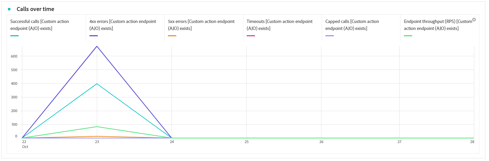

# Surveiller vos actions personnalisées {#reporting}

>[!CONTEXTUALHELP]
>id="ajo_campaigns_custom_actions_monitor"
>title="Surveiller vos actions personnalisées"
>abstract="La page de rapports **[!UICONTROL Action personnalisée]** vous permet de suivre les performances et la fiabilité des appels API que vos parcours effectuent à des systèmes tiers."

La page de rapports **[!UICONTROL Action personnalisée]** vous permet de surveiller la fiabilité et les performances des appels API effectués depuis vos parcours vers des systèmes tiers. Ces rapports vous aident à identifier rapidement les problèmes d’intégration, les goulots d’étranglement de latence ou les limites/limitations qui peuvent avoir un impact sur la diffusion.

La page de rapports sur les actions personnalisées fonctionne comme d’autres rapports complets dans Journey Optimizer. Pour en savoir plus sur les fonctionnalités des tableaux de bord, consultez [cette documentation](../reports/report-cja-manage.md).

Pour accéder à la page de rapports **[!UICONTROL Action personnalisée]**, cliquez sur  sur la page d’accueil **[!UICONTROL Actions]**.

➡️ [En savoir plus sur la configuration des actions personnalisées](../action/about-custom-action-configuration.md)

Outre la page de rapports **[!UICONTROL Action personnalisée]**, vous pouvez utiliser **[!DNL Adobe Experience Platform Query Service]** pour créer des requêtes afin de générer des rapports sur les mesures de performances des actions personnalisées. Vous pouvez consulter des exemples de requête dans [cette section](../reports/query-examples.md).

## KPI {#kpis}

Les indicateurs clés de performance (KPI) sur les **[!UICONTROL actions personnalisées]** servent de tableau de bord centralisé, fournissant une vue consolidée de l’intégrité opérationnelle et de la fiabilité de vos appels d’action personnalisée. Ces mesures vous permettent d’évaluer les performances, d’identifier les goulots d’étranglement et d’assurer des intégrations stables à des systèmes externes.

+++ En savoir plus sur les KPI des actions personnalisées

* **[!UICONTROL Appels réussis]** : nombre total d’appels HTTP ayant renvoyé une réponse valide sans erreur.

* **[!UICONTROL Erreurs 4xx/5xx]** : nombre d’appels ayant échoué en raison d’erreurs côté client (4xx) ou côté serveur (5xx), mettant en évidence des problèmes de configuration ou des échecs de point d’entrée.

* **[!UICONTROL Délais d’expiration]** : nombre d’appels ayant échoué, car ils ont dépassé le temps de réponse maximal. Cela permet de faire apparaître des problèmes de latence ou de performances avec les points d’entrée externes.

* **[!UICONTROL Appels limités]** : nombre d’appels bloqués en raison de limitations, ce qui permet de s’assurer que les systèmes en aval ne sont pas surchargés.

* **[!UICONTROL RPS moyenne]** : nombre de requêtes par seconde traitées par l’action personnalisée sur la période sélectionnée.

* **[!UICONTROL Latence moyenne]** : temps de réponse moyen de bout en bout (en millisecondes) pour tous les appels HTTP, y compris les appels réussis, les erreurs et les délais d’expiration.

* **[!UICONTROL Latence moyenne réussie]** : temps de réponse moyen de bout en bout (en millisecondes) pour les appels réussis uniquement, à l’exclusion des requêtes en échec et des délais d’expiration.

* **[!UICONTROL Temps moyen dans la file d’attente]** : temps moyen (en millisecondes) passé les appels à attendre dans la file d’attente d’exécution avant d’être envoyés. Cela s’applique uniquement aux points d’entrée limités, où Journey Optimizer met les appels en file d’attente lorsque la limite de débit est atteinte.

+++

## Appels dans le temps {#calls}

Le graphique **[!UICONTROL Appels au fil du temps]** affiche la tendance de l’indicateur de performance clé des appels HTTP sur la période sélectionnée pour le rapport. La granularité de la série temporelle dépend de la période sélectionnée. Par exemple :

* Pour un rapport sur 7 jours, chaque point de données affiche les KPI pour une journée.
* Si vous sélectionnez une période d’un jour, le graphique affiche les KPI par heure.
* Si vous sélectionnez une période d’une heure, le graphique affiche les KPI par minute.

➡️[Voir la section KPI pour une description des mesures d’appel HTTP](#kpis)

## Latence dans le temps {#latency-overtime}

Le graphique **[!UICONTROL Latence au fil du temps]** permet de visualiser la tendance des mesures de latence sur la période sélectionnée. Cette vue de série temporelle vous permet de suivre les modèles de performances, d’identifier les périodes de latence de pointe et de surveiller l’impact des optimisations ou des modifications du système au fil du temps.

➡️[Voir la section KPI pour une description des mesures de latence](#kpis)

## Répartition des appels {#breakdown}

Le tableau **[!UICONTROL Répartition des appels]** fournit une répartition hiérarchique des mesures d’appels HTTP, des mesures globales par point d’entrée au niveau supérieur aux mesures par action personnalisée à l’aide de chaque point d’entrée jusqu’aux parcours qui en dépendent au niveau inférieur.

➡️[Voir la section KPI pour une description des mesures d’appel HTTP](#kpis)

## Répartition de la latence {#latency-breakdown}

Le tableau **[!UICONTROL Répartition de la latence]** fournit une répartition détaillée des mesures de latence entre vos actions personnalisées. Cette vue vous permet d’identifier les points d’entrée ou actions spécifiques qui rencontrent des problèmes de performances, ce qui vous permet d’identifier et de résoudre les goulots d’étranglement de latence de manière efficace.

➡️[Voir la section KPI pour une description des mesures de latence](#kpis)

## Vidéo pratique {#video}

La vidéo ci-dessous montre comment surveiller la fiabilité et les performances des appels API effectués depuis vos parcours vers des systèmes tiers.

+++Regarder la vidéo

>[!VIDEO](https://video.tv.adobe.com/v/3479543?captions=fre_fr&quality=12&learn=on)

+++
