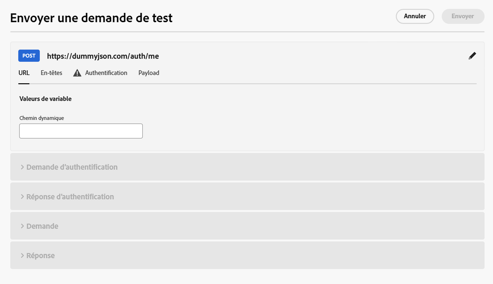
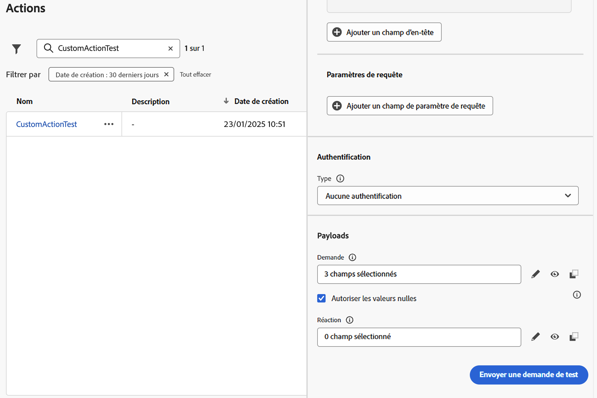

# Résoudre les problèmes liés aux actions personnalisées {#troubleshoot-a-custom-action}

Vous pouvez tester vos actions personnalisées en envoyant des appels API à partir de la section administration de l’interface d’utilisation de Journey Optimizer. Cette fonctionnalité vous permet de résoudre les problèmes liés à vos actions personnalisées avant ou après leur utilisation dans un parcours.

En tant qu’administrateur ou administratrice, utilisez la fonctionnalité **[!UICONTROL Envoyer une demande de test]** pour valider vos configurations d’actions personnalisées en effectuant des appels API réels directement depuis Adobe Journey Optimizer. Cette fonctionnalité permet de s’assurer que la structure de la demande, les en-têtes, l’authentification et la payload sont correctement formatés avant leur utilisation dans un parcours.

{width="70%" align="left"}

L’utilisation de cette fonctionnalité simplifie le processus de test et de validation, en veillant au bon déroulement des actions personnalisées dans les parcours actifs.

>[!NOTE]
>
>Si le proxy IP (sortie) est activé pour votre organisation, l’appel **[!UICONTROL Envoyer la requête de test]** le contourne. Pour confirmer le routage du proxy, exécutez un test ou un parcours en direct. En savoir plus sur le proxy IP (sortie) et son activation dans [Intégration à des systèmes externes](../configuration/external-systems.md#faq).

## Conditions préalables {#troubleshoot-custom-action-prereq}

Pour utiliser la fonctionnalité **[!UICONTROL Envoyer une demande de test]**, une **action personnalisée** doit être préconfigurée avec une URL, des en-têtes et des paramètres d’authentification.

Pour que l’administration puisse utiliser cette fonctionnalité, les autorisations suivantes sont requises :

* Les utilisateurs et utilisatrices doivent disposer de l’autorisation **[!DNL Manage journeys events, data sources and actions]**.
* Cette autorisation est incluse dans le rôle *Administrateurs et administratrices de parcours*.
* L’autorisation **[!DNL View journeys events]** seule n’est pas suffisante.

En savoir plus sur les autorisations de parcours dans [cette section](../administration/high-low-permissions.md#journey-capability).

## Utiliser la fonctionnalité Envoyer une demande de test {#troubleshoot-custom-action-use}

Pour tester une action personnalisée, procédez comme suit :

1. Accédez à l’écran de configuration **Actions** et sélectionnez une action personnalisée.
1. Cliquez sur le bouton **[!UICONTROL Envoyer une demande de test]** en bas de l’écran de configuration de l’action.
   {width="70%" align="left"}
1. Dans la fenêtre contextuelle qui s’affiche, spécifiez les paramètres de la demande :

   * Si la **méthode d’action personnalisée est GET**, aucune payload n’est requise.
   * Si la **méthode d’action personnalisée est POST**, vous devez fournir une payload JSON.

     >[!NOTE]
     >
     >Adobe Journey Optimizer génère une erreur si la structure de ce fichier JSON est incorrecte, mais pas en cas d’incohérence avec un type de données. Par exemple, il n’y aura aucune erreur si un paramètre entier est utilisé au lieu d’une chaîne.

   * Si l’authentification est définie, il vous est demandé de saisir les détails de l’authentification.

1. Cliquez sur **Envoyer** pour exécuter la demande.
1. La réponse de l’API, y compris les en-têtes et les codes d’état, s’affiche dans l’interface.

## Gestion de l’authentification {#troubleshoot-custom-action-auth}

Lorsqu’une action personnalisée comprend une authentification, Adobe Journey Optimizer exige que la personne saisisse les détails d’authentification pour chaque demande de test :

* **Authentification de base :** la personne doit fournir le *mot de passe*.
* **Authentification par clé API :** la personne doit saisir la *valeur* de la clé API.
* **Authentification personnalisée :** la personne doit fournir les paramètres d’authentification dans la demande *bodyParam*. Deux sections sont ajoutées dans ce cas : **Demande d’authentification** et **Réponse d’authentification**.

## Avantages clés {#troubleshoot-custom-action-benefits}

En tant qu’administrateur ou administratrice de Journey Optimizer, vous pouvez également utiliser des outils externes (par exemple, Postman) pour tester vos actions personnalisées. Les principaux avantages de la fonctionnalité de dépannage intégrée au produit par rapport à un test externe sont répertoriés ci-dessous :

* La demande de test est exécutée par le **Parcours AJO**, ce qui offre les avantages suivants :

   * La structure exacte de la requête (y compris les en-têtes spécifiques à Adobe Journey Optimizer) est utilisée.
   * L’adresse IP source et les en-têtes correspondent à ceux utilisés dans les parcours actifs.

* La fonctionnalité **[!UICONTROL Envoyer une demande de test]** permet de résoudre les problèmes liés aux **parcours actifs**, car l’action personnalisée est déjà déployée.

* Cette fonctionnalité de test intégrée au produit élimine la nécessité de copier manuellement les informations de configuration entre les outils, ce qui réduit le risque d’erreurs.

## Résolution des problèmes {#troubleshoot-custom-action-check}

Si la demande échoue, vous pouvez vérifier les éléments suivants :

* Les informations d’authentification saisies dans le test.
* La méthode de la demande (GET ou POST) et la payload correspondante.
* Le point d’entrée de l’API et les en-têtes définis dans l’action personnalisée.
* Utilisez les données de réponse pour identifier les erreurs de configuration potentielles.

## Ressources supplémentaires

Parcourez les sections ci-dessous pour en savoir plus sur la configuration et l’utilisation de vos actions personnalisées :

* [Commencer avec les actions personnalisées](../action/action.md) : découvrez en quoi consiste une action personnalisée et comment elle vous permet de vous connecter à vos systèmes tiers.
* [Configurer vos actions personnalisées](../action/about-custom-action-configuration.md) : découvrez comment créer et configurer une action personnalisée.
* [Utiliser des actions personnalisées](../building-journeys/using-custom-actions.md) : découvrez comment utiliser des actions personnalisées dans vos parcours.
* [Transmettre des collections dans des paramètres d’action personnalisés](../building-journeys/collections.md) : découvrez comment transmettre une collection dans des paramètres d’action personnalisés qui est renseignée dynamiquement au moment de l’exécution.

