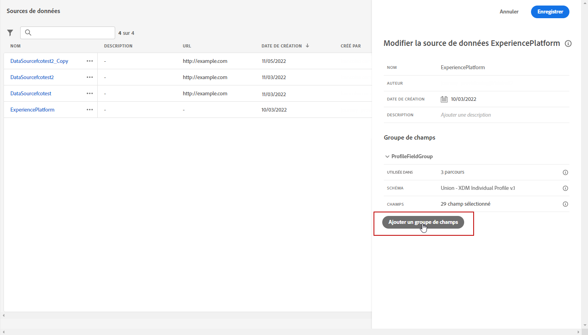

# Contrôle d’accès basé sur les attributs {#attribute-based-access}

La fonctionnalité de contrôle d’accès basé sur les attributs vous permet de définir des autorisations pour gérer l’accès aux données pour des équipes ou des groupes d’utilisateurs spécifiques. Son objectif est de protéger les ressources numériques sensibles contre les utilisateurs et utilisatrices non autorisés, ce qui permet une protection supplémentaire des données personnelles.

Utilisez le contrôle d’accès basé sur les attributs dans Adobe Journey Optimizer pour protéger les données et accorder un accès spécifique à des éléments de champ spécifiques, y compris des schémas de modèle de données d’expérience (XDM), des attributs de profil et des audiences.

Pour obtenir une liste plus détaillée de la terminologie utilisée avec le contrôle d’accès basé sur les attributs, consultez la documentation de [Adobe Experience Platform](https://experienceleague.adobe.com/docs/experience-platform/access-control/abac/overview.html?lang=fr){target="_blank"}.

Dans cet exemple, nous allons ajouter un libellé au champ de schéma **Nationalité** pour empêcher des utilisateurs non autorisés de l’utiliser. Pour que cela fonctionne, vous devez effectuer les étapes suivantes :

1. Créez un **[!UICONTROL Rôle]** et attribuez-le à l’aide du **[!UICONTROL Libellé]** correspondant pour que les utilisateurs puissent accéder au champ de schéma et l’utiliser.

1. Attribuez un **[!UICONTROL Libellé]** au champ de schéma **Nationalité** dans Adobe Experience Platform.

1. Utilisez le **[!UICONTROL Champ de schéma]** dans Adobe Journey Optimizer.

Notez que les **[!UICONTROL Rôles]**, **[!UICONTROL Politiques]** et **[!UICONTROL Produits]** sont également accessibles avec l’API de contrôle d’accès basé sur les attributs. Pour plus d’informations, consultez cette [documentation](https://experienceleague.adobe.com/docs/experience-platform/access-control/abac/abac-api/overview.html?lang=fr){target="_blank"}.

## Création d’un rôle et attribution de libellés {#assign-role}

>[!IMPORTANT]
>
>Avant de gérer les autorisations d’un rôle, vous devez créer une politique. Pour plus d’informations, consultez la [documentation d’Adobe Experience Platform](https://experienceleague.adobe.com/docs/experience-platform/access-control/abac/permissions-ui/policies.html?lang=fr){target="_blank"}.

Les **[!UICONTROL rôles]** sont un ensemble d’utilisateurs qui partagent les mêmes autorisations, libellés et sandbox au sein de votre organisation. Chaque utilisateur appartenant à un **[!UICONTROL rôle]** a droit aux applications et services d&#39;Adobe contenus dans le produit.
Vous pouvez également créer vos propres **[!UICONTROL Rôles]** si vous souhaitez affiner l’accès de vos utilisateurs et utilisatrices à certaines fonctionnalités ou objets de l’interface.

Nous voulons maintenant accorder aux utilisateurs sélectionnés l’accès au champ **Nationalité**, libellé C2. Pour ce faire, nous devons créer un nouveau **[!UICONTROL rôle]** avec un ensemble spécifique d’utilisateurs et leur attribuer le libellé C2 leur permettant d’utiliser les détails de **Nationalité** dans un **[!UICONTROL parcours]**.

1. Dans le produit [!DNL Permissions], sélectionnez le **[!UICONTROL rôle]** dans le menu du volet de gauche, puis cliquez sur **[!UICONTROL Créer un rôle]**. Notez que vous pouvez également ajouter un **[!UICONTROL libellé]** aux rôles intégrés.

   

1. Ajoutez un **[!UICONTROL nom]** et une **[!UICONTROL description]** à votre nouveau **[!UICONTROL rôle]**, ici : Rôle démographique limité.

1. Dans la liste déroulante, sélectionnez votre **[!UICONTROL sandbox]**.

   

1. Dans le menu **[!UICONTROL Ressources]**, cliquez sur **[!UICONTROL Adobe Experience Platform]** pour ouvrir les différentes fonctionnalités. Ici, nous sélectionnons **[!UICONTROL Parcours]**.

   

1. Dans la liste déroulante, sélectionnez les **[!UICONTROL autorisations]** liées à la fonctionnalité sélectionnée, telles que **[!UICONTROL Afficher les parcours]** ou **[!UICONTROL Publier les parcours]**.

   

1. Après avoir enregistré votre **[!UICONTROL rôle]** nouvellement créé, cliquez sur **[!UICONTROL Propriétés]** pour configurer plus en détail l’accès à votre rôle.

   

1. Dans l&#39;onglet **[!UICONTROL Utilisateurs]**, cliquez sur **[!UICONTROL Ajouter des utilisateurs]**.

   

1. Dans l’onglet **[!UICONTROL Libellés]**, sélectionnez **[!UICONTROL Ajouter une étiquette]**.

   

1. Sélectionnez les **[!UICONTROL libellés]** que vous souhaitez ajouter à votre rôle, puis cliquez sur **[!UICONTROL Enregistrer]**. Pour cet exemple, nous attribuons le libellé C2 pour que les utilisateurs aient accès au champ du schéma précédemment restreint.

   

Les utilisateurs de la variable **Rôle démographique limité** ont désormais accès aux objets libellés C2.

## Attribution de libellés à un objet dans Adobe Experience Platform {#assign-label}

>[!WARNING]
>
>Une utilisation incorrecte des libellés peut interrompre l’accès aux personnes et déclencher des violations de politique.

Les **[!UICONTROL libellés]** peuvent être utilisé pour attribuer des zones de fonctionnalités spécifiques à l’aide du contrôle d’accès basé attribut.
Dans cet exemple, nous allons restreindre l’accès au champ **Nationalité**. Ce champ est accessible uniquement aux utilisateurs qui disposent du **[!UICONTROL Libellé]** correspondant à leur **[!UICONTROL Rôle]**.

Notez que vous pouvez également ajouter un **[!UICONTROL libellé]** à un **[!UICONTROL schéma]**, à des **[!UICONTROL jeux de données]** et à des **[!UICONTROL audiences]**.

1. Créez votre **[!UICONTROL Schéma]**. Voir à ce propos [cette documentation](https://experienceleague.adobe.com/docs/experience-platform/xdm/schema/composition.html?lang=fr){target="_blank"}.

   

1. Dans le **[!UICONTROL schéma]** nouvellement créé, nous ajoutons tout d’abord le groupe de champs **[!UICONTROL Détails démographiques]** contenant le champ **Nationalité**.

   

1. Dans l’onglet **[!UICONTROL Libellés]**, vérifiez le nom du champ restreint, ici **Nationalité**. Ensuite, dans le menu du volet de droite, sélectionnez **[!UICONTROL Modifier les libellés de gouvernance]**.

   

1. Sélectionnez le **[!UICONTROL libellé]** correspondant, dans ce cas, le C2 - Les données ne peuvent pas être exportées vers un tiers. Pour obtenir la liste détaillée des libellés disponibles, reportez-vous à [cette page](https://experienceleague.adobe.com/docs/experience-platform/data-governance/labels/reference.html?lang=fr#contract-labels){target="_blank"}.

   

1. Personnalisez davantage votre schéma si nécessaire, puis activez-le. Pour obtenir les étapes détaillées afin d’activer votre schéma, consultez cette [page](https://experienceleague.adobe.com/docs/experience-platform/xdm/ui/resources/schemas.html?lang=fr#profile){target="_blank"}.

Le champ de votre schéma sera désormais uniquement visible et ne peut désormais être utilisé que par les utilisateurs qui font partie d’un jeu de rôles avec le libellé C2.
En appliquant un **[!UICONTROL Libellé]** à votre **[!UICONTROL Nom du champ]**, notez que le **[!UICONTROL libellé]** s’applique automatiquement au champ **Nationalité** dans chaque schéma créé.

## Accès aux objets libellés dans Adobe Journey Optimizer {#attribute-access-ajo}

Après avoir libellé notre nom de champ **Nationalité** dans un nouveau schéma et notre nouveau rôle, nous pouvons maintenant voir l’impact de cette restriction dans Adobe Journey Optimizer.
Dans notre exemple, un premier utilisateur X ayant accès aux objets libellés C2 crée un parcours avec une condition ciblant le **[!UICONTROL Nom du champ]** limité. Un second utilisateur Y sans accès aux objets libellés C2 devra alors publier le parcours.

1. À partir de Adobe Journey Optimizer, vous devez d’abord configurer la variable **[!UICONTROL Source de données]** avec votre nouveau schéma.

   

1. Ajoutez un nouveau **[!UICONTROL Groupe de champs]** de votre **[!UICONTROL Schéma]** nouvelle créé à la **[!UICONTROL Source de données intégrée]**. Vous pouvez également créer une nouvelle **[!UICONTROL source de données]** externe et des **[!UICONTROL Groupes de champs]** associés.

   

1. Après avoir sélectionné le **[!UICONTROL schéma]** précédemment créé, cliquez sur **[!UICONTROL Modifier]** à partir de la catégorie **[!UICONTROL Champs]**.

   

1. Sélectionnez le **[!UICONTROL Nom du champ]** que vous voulez cibler. Ici, nous sélectionnons le champ **Nationalité** limité.

   

1. Créez ensuite un parcours qui enverra un e-mail aux utilisateurs ayant une nationalité spécifique. Ajoutez un **[!UICONTROL événement]** puis un **[!UICONTROL condition]**.

   

1. Sélectionnez le champ **Nationalité** limité pour commencer à créer votre expression.

   

1. Modifiez votre **[!UICONTROL condition]** pour cibler une population spécifique avec le champ **Nationalité** limité.

   

1. Personnalisez votre parcours selon vos besoins. Nous ajoutons ici une action **[!UICONTROL E-mail]**.

   

Si l’utilisateur Y sans accès aux objets libellés C2 doit accéder à ce parcours avec ce champ restreint :

* L’utilisateur Y ne pourra pas utiliser le nom de champ restreint, car il ne sera pas visible.

* L’utilisateur Y ne pourra pas modifier l’expression avec le nom de champ restreint en mode avancé. L’erreur suivante s’affiche `The expression is invalid. Field is no longer available or you don't have enough permission to see it`.

* L’utilisateur Y peut supprimer l’expression.

* L’utilisateur Y ne pourra pas tester le parcours.

* L’utilisateur Y ne pourra pas publier le parcours.
