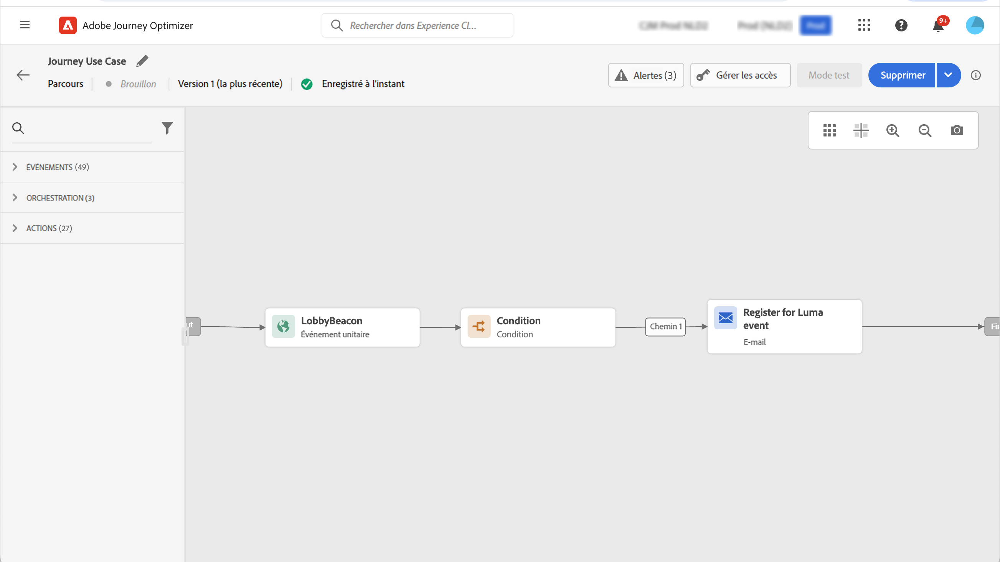

# Contrôle d’accès basé sur les attributs {#attribute-based-access}

>[!IMPORTANT]
>
>L’utilisation du contrôle d’accès basé sur les attributs est actuellement disponible en accès anticipé pour certains utilisateurs uniquement. Si vous souhaitez utiliser cette fonctionnalité, contactez votre gestionnaire de compte Adobe.

Le contrôle d’accès basé sur les attributs (ABAC) permet de définir des autorisations pour gérer l’accès aux données pour des équipes ou des groupes d’utilisateurs spécifiques. Son objectif est de protéger les ressources numériques sensibles contre les utilisateurs non autorisés qui autorisent une protection supplémentaire des données personnelles.

Dans Adobe Journey Optimizer, ABAC vous permet de protéger les données et d’accorder un accès spécifique à des éléments de champ spécifiques, y compris des schémas de modèle de données d’expérience (XDM), des attributs de profil et des segments.

<!--For a more detailed list of the terminology used with ABAC, refer to Adobe Experience Platform documentation.-->

Dans cet exemple, nous allons ajouter un libellé au **Nationalité** pour empêcher des utilisateurs non autorisés de l’utiliser. Pour que cela fonctionne, vous devez effectuer les étapes suivantes :

1. Attribuer une  **[!UICONTROL Libellé]** au **Nationalité** champ de schéma dans Adobe Experience Platform.

2. Créer  **[!UICONTROL Rôle]** et l’affecter à l’aide de la propriété  **[!UICONTROL Libellé]** pour que les utilisateurs puissent accéder au champ de schéma et l’utiliser.

3. Utilisez la variable  **[!UICONTROL Champ de schéma]** dans Adobe Journey Optimizer.

## Attribution de libellés à un objet dans Adobe Experience Platform {#assign-label}

>[!WARNING]
>
>Une utilisation incorrecte des étiquettes peut interrompre l’accès aux personnes et déclencher des violations de stratégie.

**[!UICONTROL Étiquettes]** peut être utilisé pour affecter des zones de fonctionnalités spécifiques à l’aide du contrôle d’accès basé sur les attributs.
Dans cet exemple, nous allons restreindre l’accès à la variable **Nationalité** champ . Ce champ est accessible uniquement aux utilisateurs qui ont **[!UICONTROL Libellé]** à  **[!UICONTROL Rôle]**.

Notez que vous pouvez également ajouter  **[!UICONTROL Libellé]** to  **[!UICONTROL Schéma]**,  **[!UICONTROL Jeux de données]** et  **[!UICONTROL Segments]**.

1. Créez votre **[!UICONTROL Schéma]**. Voir à ce sujet la section [cette documentation](https://experienceleague.adobe.com/docs/experience-platform/xdm/schema/composition.html?lang=fr).

   

1. Dans le **[!UICONTROL Schéma]**, nous ajoutons tout d’abord la variable **[!UICONTROL Détails démographiques]** groupe de champs contenant le **Nationalité** champ .

   

1. Dans la **[!UICONTROL Étiquettes]** , vérifiez le nom du champ restreint, ici **Nationalité**. Ensuite, dans le menu du volet de droite, sélectionnez **[!UICONTROL Modification des étiquettes de gouvernance]**.

   

1. Sélectionnez la **[!UICONTROL Libellé]**, dans ce cas, le C2 - Data ne peut pas être exporté vers un tiers. Pour obtenir la liste détaillée des libellés disponibles, reportez-vous à la section [cette page](https://experienceleague.adobe.com/docs/experience-platform/data-governance/labels/reference.html#contract-labels).

   

1. Personnalisez davantage votre schéma si nécessaire, puis activez-le. Pour obtenir les étapes détaillées afin d’activer votre schéma, reportez-vous à cette section [page](https://experienceleague.adobe.com/docs/experience-platform/xdm/ui/resources/schemas.html#profile).

Le champ de votre schéma sera désormais uniquement visible et ne peut désormais être utilisé que par les utilisateurs qui font partie d’un jeu de rôles avec l’étiquette C2.
En appliquant une **[!UICONTROL Libellé]** à **[!UICONTROL Nom du champ]**, notez que la variable **[!UICONTROL Libellé]** s’applique automatiquement à la variable **Nationalité** dans chaque schéma créé.

## Création d’un rôle et affectation de libellés {#assign-role}

**[!UICONTROL Rôles]** sont un ensemble d’utilisateurs qui partagent les mêmes autorisations, étiquettes et environnements de test au sein de votre organisation. Chaque utilisateur appartenant à un **[!UICONTROL Rôle]** est autorisé avec les applications et services d’Adobe contenus dans le produit.
Vous pouvez également créer les vôtres **[!UICONTROL Rôles]** si vous souhaitez affiner l’accès de vos utilisateurs à certaines fonctionnalités ou à certains objets de l’interface.

Nous voulons maintenant accorder aux utilisateurs sélectionnés l’accès au **Nationalité** champ, intitulé C2. Pour ce faire, nous devons créer une nouvelle **[!UICONTROL Rôle]** avec un ensemble spécifique d’utilisateurs et attribuez-leur l’étiquette C2 leur permettant d’utiliser la variable **Nationalité** détails dans un **[!UICONTROL Message]** ou **[!UICONTROL Parcours]**.

1. Dans la [!DNL Permissions] produit, sélectionnez **[!UICONTROL Rôle]** dans le menu du volet de gauche, puis cliquez sur **[!UICONTROL Création d’un rôle]**. Notez que vous pouvez également ajouter **[!UICONTROL Libellé]** aux rôles intégrés.

   

1. Ajouter un **[!UICONTROL Nom]** et **[!UICONTROL Description]** à votre nouvelle **[!UICONTROL Rôle]**, ici : Rôle démographique limité.

1. Dans la liste déroulante, sélectionnez votre **[!UICONTROL Sandbox]**.

   

1. Dans la **[!UICONTROL Ressources]** , cliquez sur **[!UICONTROL Adobe Experience Platform]** pour ouvrir les différentes fonctionnalités. Ici, nous sélectionnons **[!UICONTROL Messages]**.

   

1. Dans la liste déroulante, sélectionnez la variable **[!UICONTROL Autorisations]** liée à la fonction sélectionnée, telle que **[!UICONTROL Affichage des messages]** ou **[!UICONTROL Publication de parcours]**.

   

1. Après avoir enregistré votre **[!UICONTROL Rôle]**, cliquez sur **[!UICONTROL Propriétés]** pour configurer plus en détail l’accès à votre rôle.

   

1. Dans la **[!UICONTROL Utilisateurs]** , cliquez sur **[!UICONTROL Ajout d’utilisateurs]**.

   

1. Dans la **[!UICONTROL Étiquettes]** onglet, sélectionnez **[!UICONTROL Ajouter une étiquette]**.

   

1. Sélectionnez la **[!UICONTROL Étiquettes]** vous souhaitez ajouter à votre rôle, puis cliquez sur **[!UICONTROL Enregistrer]**. Pour cet exemple, nous attribuons le libellé C2 pour que les utilisateurs aient accès au champ du schéma précédemment restreint.

   

Les utilisateurs de la variable **Rôle démographique limité** ont désormais accès aux objets étiquetés C2.

## Accès aux objets étiquetés dans Adobe Journey Optimizer {#attribute-access-ajo}

Après avoir étiqueté notre **Nationalité** nom de champ dans un nouveau schéma et notre nouveau rôle, nous pouvons maintenant voir l’impact de cette restriction dans Adobe Journey Optimizer.
Dans notre exemple, un premier utilisateur X ayant accès aux objets intitulés C2 crée un Parcours avec une condition ciblant la variable **[!UICONTROL Nom du champ]**. Un second utilisateur Y sans accès aux objets étiquetés C2 devra alors publier le Parcours.

1. À partir de Adobe Journey Optimizer, vous devez d’abord configurer la variable **[!UICONTROL Source de données]** avec votre nouveau schéma.

   

1. Ajouter un nouveau **[!UICONTROL Groupe de champs]** de votre **[!UICONTROL Schéma]** à l’intégration **[!UICONTROL Source de données]**. Vous pouvez également créer un nouveau externe **[!UICONTROLDsource de données]** et associée **[!UICONTROL Groupes de champs]**.

   

1. Après avoir sélectionné le **[!UICONTROL Schéma]**, cliquez sur **[!UICONTROL Modifier]** de la **[!UICONTROL Champs]** catégorie.

   

1. Sélectionnez la **[!UICONTROL Nom du champ]** vous voulez cibler. Ici, nous sélectionnons les **Nationalité** champ .

   

1. Créez ensuite un Parcours qui enverra un message aux utilisateurs ayant une nationalité spécifique. Ajoutez un **[!UICONTROL Événement]** puis un **[!UICONTROL Condition]**.

   

1. Sélectionnez la restriction **Nationalité** pour commencer à créer votre expression.

   

1. Modifiez votre **[!UICONTROL Condition]** pour cibler une population spécifique avec des restrictions **Nationalité** champ .

   

1. Personnalisez votre parcours selon vos besoins, nous ajoutons ici une **[!UICONTROL Message]** action.

   

Si l’utilisateur Y sans accès aux objets label C2 doit accéder à ce parcours ou à tout message avec ce champ restreint :

* L’utilisateur Y ne pourra pas utiliser le nom de champ restreint, car il ne sera pas visible.

* L’utilisateur Y ne pourra pas modifier l’expression avec le nom de champ restreint en mode Avancé. L’erreur suivante s’affiche. `The expression is invalid. Field is no longer available or you don't have enough permission to see it`.

* L’utilisateur Y peut supprimer l’expression.

* L’utilisateur Y ne pourra pas tester le Parcours ou le message.

* L’utilisateur Y ne pourra pas publier le Parcours ou le message.

