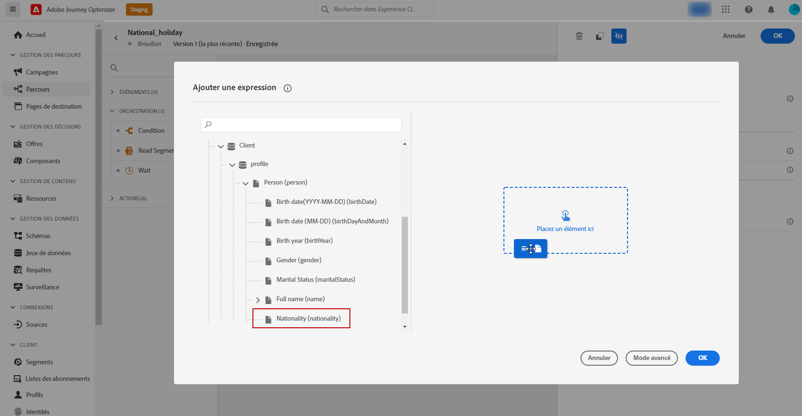
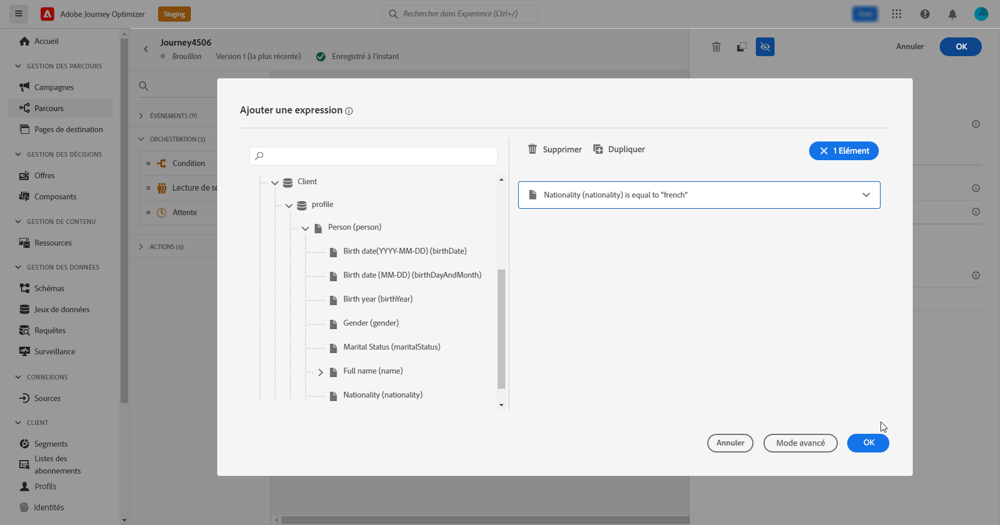

# Contrôle d’accès basé sur les attributs {#attribute-based-access}

La fonctionnalité de contrôle d’accès basé sur les attributs permet de définir des autorisations pour gérer l’accès aux données pour des équipes ou groupes d’utilisateurs et d’utilisatrices spécifiques. Elle a pour objectif de protéger les ressources numériques sensibles des utilisateurs et utilisatrices non autorisés, renforçant ainsi la protection des données personnelles.

Dans Adobe Journey Optimizer, le contrôle d’accès basé sur les attributs vous permet de protéger les données et d’accorder un accès spécifique à des éléments de champ particuliers, notamment des schémas de modèle de données d’expérience (XDM), des attributs de profil et des audiences.

Pour consulter une liste détaillée de la terminologie associée au contrôle d’accès basé sur les attributs, reportez-vous à la [documentation d’Adobe Experience Platform](https://experienceleague.adobe.com/docs/experience-platform/access-control/abac/overview.html?lang=fr){target="_blank"}.

Dans cet exemple, un libellé est ajouté au champ de schéma **Nationalité** afin d’empêcher son utilisation par des personnes non autorisées. Pour que cela fonctionne, procédez comme suit :

1. Créez un **[!UICONTROL Rôle]** et attribuez-le à l’aide du **[!UICONTROL Libellé]** correspondant pour que les utilisateurs puissent accéder au champ de schéma et l’utiliser.

1. Attribuez un **[!UICONTROL Libellé]** au champ de schéma **Nationalité** dans Adobe Experience Platform.

1. Utilisez le **[!UICONTROL Champ de schéma]** dans Adobe Journey Optimizer.

Remarque : les **[!UICONTROL Rôles]**, les **[!UICONTROL Politiques]** et les **[!UICONTROL Produits]** sont également accessibles via l’API de contrôle d’accès basé sur les attributs. Pour plus d’informations, consultez cette [documentation](https://experienceleague.adobe.com/docs/experience-platform/access-control/abac/abac-api/overview.html?lang=fr){target="_blank"}.

## Créer un rôle et attribuer des libellés {#assign-role}

>[!IMPORTANT]
>
>&#x200B;>Avant de gérer les autorisations pour un rôle, créez une politique. Pour plus d’informations, consultez la [documentation Adobe Experience Platform](https://experienceleague.adobe.com/docs/experience-platform/access-control/abac/permissions-ui/policies.html?lang=fr){target="_blank"}.

Les **[!UICONTROL rôles]** représentent un ensemble d’utilisateurs ou d’utilisatrices partageant les mêmes autorisations, libellés et sandbox au sein de votre organisation. Chaque utilisateur ou utilisatrice appartenant à un **[!UICONTROL rôle]** bénéficie des applications et services Adobe associés au produit concerné. Vous pouvez également créer vos propres **[!UICONTROL rôles]** afin d’affiner l’accès des utilisateurs ou utilisatrices à certaines fonctionnalités ou à certains objets dans l’interface.

Pour accorder à des personnes sélectionnées l’accès au champ **Nationalité** libellé C2, créez un nouveau **[!UICONTROL rôle]** regroupant un ensemble défini de personnes, et affectez-lui le libellé C2 afin de permettre l’utilisation des données de **Nationalité** dans un **[!UICONTROL parcours]**.

1. Dans le produit [!DNL Permissions], sélectionnez le **[!UICONTROL rôle]** dans le menu du volet de gauche, puis cliquez sur **[!UICONTROL Créer un rôle]**. Notez que vous pouvez également ajouter un **[!UICONTROL libellé]** aux rôles intégrés.

   

1. Ajoutez un **[!UICONTROL nom]** et une **[!UICONTROL description]** à votre nouveau **[!UICONTROL rôle]**, ici : Rôle démographique limité.

1. Dans la liste déroulante, sélectionnez votre **[!UICONTROL sandbox]**.

   

1. Dans le menu **[!UICONTROL Ressources]**, cliquez sur **[!UICONTROL Adobe Experience Platform]** pour ouvrir les différentes fonctionnalités. Ici, nous sélectionnons **[!UICONTROL Parcours]**.

   

1. Dans la liste déroulante, sélectionnez les **[!UICONTROL autorisations]** liées à la fonctionnalité sélectionnée, telles que **[!UICONTROL Afficher les parcours]** ou **[!UICONTROL Publier les parcours]**.

   

1. Après avoir enregistré votre **[!UICONTROL rôle]** nouvellement créé, cliquez sur **[!UICONTROL Propriétés]** pour configurer plus en détail l’accès à votre rôle.

   

1. Dans l&#39;onglet **[!UICONTROL Utilisateurs]**, cliquez sur **[!UICONTROL Ajouter des utilisateurs]**.

   

1. Dans l’onglet **[!UICONTROL Libellés]**, sélectionnez **[!UICONTROL Ajouter une étiquette]**.

   

1. Sélectionnez les **[!UICONTROL libellés]** que vous souhaitez ajouter à votre rôle, puis cliquez sur **[!UICONTROL Enregistrer]**. Dans cet exemple, affectez l’étiquette C2 pour que les personnes puissent accéder au champ de schéma précédemment restreint.

   

Les personnes appartenant au **rôle Démographie restreint** ont désormais accès aux objets libellés C2.

## Attribuer des libellés à un objet dans Adobe Experience Platform {#assign-label}

>[!WARNING]
>
>Une mauvaise utilisation des libellés peut entraîner une perte d’accès et déclencher des violations de politique.

Les **[!UICONTROL libellés]** peuvent être utilisés pour attribuer des zones de fonctionnalités spécifiques à l’aide du contrôle d’accès basé sur les attributs. Dans cet exemple, l’accès au champ **Nationalité** est restreint. Ce champ ne sera accessible qu’aux utilisateurs ou aux utilisatrices dont le **[!UICONTROL libellé]** correspondant a été affecté à leur **[!UICONTROL rôle]**.

Notez que vous pouvez également ajouter un **[!UICONTROL libellé]** à un **[!UICONTROL schéma]**, à des **[!UICONTROL jeux de données]** et à des **[!UICONTROL audiences]**.

1. Créez votre **[!UICONTROL schéma]**. Pour plus d’informations, consultez [cette documentation](https://experienceleague.adobe.com/docs/experience-platform/xdm/schema/composition.html?lang=fr){target="_blank"}.

   

1. Dans le **[!UICONTROL schéma]** nouvellement créé, nous ajoutons tout d’abord le groupe de champs **[!UICONTROL Détails démographiques]** contenant le champ **Nationalité**.

   

1. Dans l’onglet **[!UICONTROL Libellés]**, vérifiez le nom du champ restreint, ici **Nationalité**. Ensuite, dans le menu du volet de droite, sélectionnez **[!UICONTROL Modifier les libellés de gouvernance]**.

   

1. Sélectionnez le **[!UICONTROL libellé]** correspondant, dans ce cas, le C2 - Les données ne peuvent pas être exportées vers un tiers. Pour obtenir la liste détaillée des libellés disponibles, reportez-vous à [cette page](https://experienceleague.adobe.com/docs/experience-platform/data-governance/labels/reference.html?lang=fr#contract-labels){target="_blank"}.

   

1. Personnalisez davantage votre schéma si nécessaire, puis activez-le. Pour obtenir les étapes détaillées d’activation du schéma, reportez-vous à cette [page](https://experienceleague.adobe.com/docs/experience-platform/xdm/ui/resources/schemas.html?lang=fr#profile){target="_blank"}.

Le champ de votre schéma ne sera désormais visible et exploitable que par les utilisateurs ou utilisatrices appartenant à un rôle comportant le libellé C2. Si vous appliquez un **[!UICONTROL libellé]** à votre **[!UICONTROL nom de champ]**, ce **[!UICONTROL libellé]** s’appliquera automatiquement au champ **Nationalité** dans chaque schéma créé.

## Accéder aux objets libellés dans Adobe Journey Optimizer {#attribute-access-ajo}

Après avoir libellé le nom de champ **Nationalité** dans un nouveau schéma et un nouveau rôle, vous pourrez observer l’impact de cette restriction dans Adobe Journey Optimizer. Dans cet exemple :

* L’utilisateur ou l’utilisatrice X, ayant accès aux objets libellés C2, crée un parcours avec une condition ciblant le **[!UICONTROL nom de champ]** restreint.
* L’utilisateur ou l’utilisatrice Y, n’ayant pas accès aux objets libellés C2, tente de publier le parcours.

1. Dans Adobe Journey Optimizer, configurez la **[!UICONTROL source de données]** avec votre nouveau schéma.

   

1. Ajoutez un nouveau **[!UICONTROL Groupe de champs]** de votre **[!UICONTROL Schéma]** nouvelle créé à la **[!UICONTROL Source de données intégrée]**. Vous pouvez également créer une nouvelle **[!UICONTROL source de données]** externe et des **[!UICONTROL Groupes de champs]** associés.

   

1. Après avoir sélectionné le **[!UICONTROL schéma]** précédemment créé, cliquez sur **[!UICONTROL Modifier]** à partir de la catégorie **[!UICONTROL Champs]**.

   

1. Sélectionnez le **[!UICONTROL Nom du champ]** que vous voulez cibler. Ici, nous sélectionnons le champ **Nationalité** limité.

   

1. Créez un parcours qui envoie un e-mail aux utilisateurs ou aux utilisatrices ayant une nationalité spécifique. Ajoutez un **[!UICONTROL événement]** et une **[!UICONTROL condition]**.

   

1. Sélectionnez le champ **Nationalité** limité pour commencer à créer votre expression.

   

1. Modifiez votre **[!UICONTROL condition]** pour cibler une population spécifique avec le champ **Nationalité** limité.

   

1. Personnalisez votre parcours selon vos besoins. Nous ajoutons ici une action **[!UICONTROL E-mail]**.

   

Si l’utilisateur ou l’utilisatrice Y, sans accès aux objets libellés C2, a besoin d’accéder à ce parcours contenant le champ restreint :

* L’utilisateur ou l’utilisatrice Y ne pourra pas utiliser le nom de champ restreint, car il ne sera pas visible.
* L’utilisateur ou l’utilisatrice Y ne pourra pas modifier l’expression contenant le champ restreint en mode avancé. L’erreur suivante s’affiche : `The expression is invalid. Field is no longer available or you do not have enough permission to see it`.
* L’utilisateur ou l’utilisatrice Y peut supprimer l’expression.
* L’utilisateur ou l’utilisatrice Y ne pourra pas tester le parcours.
* L’utilisateur ou l’utilisatrice Y ne pourra pas publier le parcours.