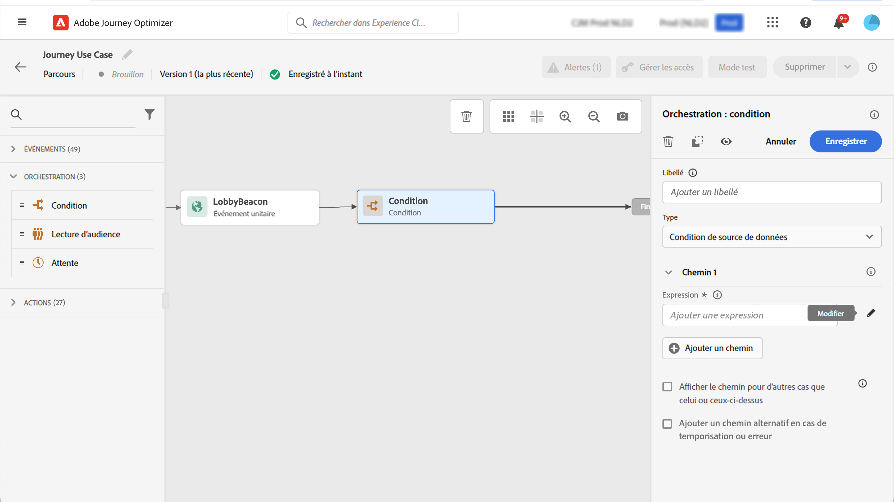

# Contrôle d’accès basé sur les attributs {#attribute-based-access}

>[!IMPORTANT]
>
>L’utilisation du contrôle d’accès basé sur les attributs est actuellement limitée à certains clients et sera déployée dans tous les environnements dans une prochaine version.

Le contrôle d’accès basé sur les attributs (ABAC) permet de définir des autorisations pour gérer l’accès aux données pour des équipes ou des groupes d’utilisateurs spécifiques. Son objectif est de protéger les ressources numériques sensibles contre les utilisateurs non autorisés qui autorisent une protection supplémentaire des données personnelles.

Dans Adobe Journey Optimizer, ABAC vous permet de protéger les données et d’accorder un accès spécifique à des éléments de champ spécifiques, y compris des schémas de modèle de données d’expérience (XDM), des attributs de profil et des segments.

Pour une liste plus détaillée de la terminologie utilisée avec ABAC, reportez-vous à la section [Documentation d’Adobe Experience Platform](https://experienceleague.adobe.com/docs/experience-platform/access-control/abac/overview.html).

Dans cet exemple, nous allons ajouter un libellé au **Nationalité** pour empêcher des utilisateurs non autorisés de l’utiliser. Pour que cela fonctionne, vous devez effectuer les étapes suivantes :

1. Créer  **[!UICONTROL Role]** et l’affecter à l’aide de la propriété  **[!UICONTROL Label]** pour que les utilisateurs puissent accéder au champ de schéma et l’utiliser.

1. Attribuer une  **[!UICONTROL Label]** au **Nationalité** champ de schéma dans Adobe Experience Platform.

1. Utilisez la variable  **[!UICONTROL Schema field]** dans Adobe Journey Optimizer.

Notez que **[!UICONTROL Roles]**, **[!UICONTROL Policies]** et **[!UICONTROL Products]** est également accessible avec l’API de contrôle d’accès basé sur les attributs. Voir à ce sujet la section [documentation](https://experienceleague.adobe.com/docs/experience-platform/access-control/abac/abac-api/overview.html).

## Création d’un rôle et affectation de libellés {#assign-role}

>[!IMPORTANT]
>
>Avant de gérer les autorisations d’un rôle, vous devez d’abord créer une stratégie. Voir à ce sujet la section [Documentation d’Adobe Experience Platform](https://experienceleague.adobe.com/docs/experience-platform/access-control/abac/permissions-ui/policies.html).

**[!UICONTROL Roles]** sont un ensemble d’utilisateurs qui partagent les mêmes autorisations, étiquettes et environnements de test au sein de votre organisation. Chaque utilisateur appartenant à un **[!UICONTROL Role]** est autorisé avec les applications et services Adobe contenus dans le produit.
Vous pouvez également créer les vôtres **[!UICONTROL Roles]** si vous souhaitez affiner l’accès de vos utilisateurs à certaines fonctionnalités ou à certains objets de l’interface.

Nous voulons maintenant accorder aux utilisateurs sélectionnés l’accès au **Nationalité** champ, intitulé C2. Pour ce faire, nous devons créer une nouvelle **[!UICONTROL Role]** avec un ensemble spécifique d’utilisateurs et attribuez-leur l’étiquette C2 leur permettant d’utiliser la variable **Nationalité** détails dans un **[!UICONTROL Journey]**.

1. Dans la [!DNL Permissions] produit, sélectionnez **[!UICONTROL Role]** dans le menu du volet de gauche, puis cliquez sur **[!UICONTROL Create role]**. Notez que vous pouvez également ajouter **[!UICONTROL Label]** aux rôles intégrés.

   

1. Ajouter un **[!UICONTROL Name]** et **[!UICONTROL Description]** à votre nouvelle **[!UICONTROL Role]**, ici : Rôle démographique limité.

1. Dans la liste déroulante, sélectionnez votre **[!UICONTROL Sandbox]**.

   

1. Dans la **[!UICONTROL Resources]** , cliquez sur **[!UICONTROL Adobe Experience Platform]** pour ouvrir les différentes fonctionnalités. Ici, nous sélectionnons **[!UICONTROL Journeys]**.

   

1. Dans la liste déroulante, sélectionnez la variable **[!UICONTROL Permissions]** liée à la fonction sélectionnée, telle que **[!UICONTROL View journeys]** ou **[!UICONTROL Publish journeys]**.

   

1. Après avoir enregistré votre **[!UICONTROL Role]**, cliquez sur **[!UICONTROL Properties]** pour configurer plus en détail l’accès à votre rôle.

   

1. Dans la **[!UICONTROL Users]** , cliquez sur **[!UICONTROL Add users]**.

   

1. Dans la **[!UICONTROL Labels]** onglet, sélectionnez **[!UICONTROL Add label]**.

   

1. Sélectionnez la **[!UICONTROL Labels]** vous souhaitez ajouter à votre rôle, puis cliquez sur **[!UICONTROL Save]**. Pour cet exemple, nous attribuons le libellé C2 pour que les utilisateurs aient accès au champ du schéma précédemment restreint.

   

Les utilisateurs de la variable **Rôle démographique limité** ont désormais accès aux objets étiquetés C2.

## Affectation de libellés à un objet dans Adobe Experience Platform {#assign-label}

>[!WARNING]
>
>Une utilisation incorrecte des étiquettes peut interrompre l’accès aux personnes et déclencher des violations de stratégie.

**[!UICONTROL Labels]** peut être utilisé pour affecter des zones de fonctionnalités spécifiques à l’aide du contrôle d’accès basé sur les attributs.
Dans cet exemple, nous allons restreindre l’accès à la variable **Nationalité** champ . Ce champ est accessible uniquement aux utilisateurs qui ont **[!UICONTROL Label]** à  **[!UICONTROL Role]**.

Notez que vous pouvez également ajouter  **[!UICONTROL Label]** to  **[!UICONTROL Schema]**,  **[!UICONTROL Datasets]** et  **[!UICONTROL Segments]**.

1. Créez votre **[!UICONTROL Schema]**. Voir à ce sujet la section [cette documentation](https://experienceleague.adobe.com/docs/experience-platform/xdm/schema/composition.html?lang=en).

   

1. Dans le **[!UICONTROL Schema]**, nous ajoutons tout d’abord la variable **[!UICONTROL Demographic details]** groupe de champs contenant le **Nationalité** champ .

   

1. Dans la **[!UICONTROL Labels]** , vérifiez le nom du champ restreint, ici **Nationalité**. Ensuite, dans le menu du volet de droite, sélectionnez **[!UICONTROL Edit governance labels]**.

   

1. Sélectionnez la **[!UICONTROL Label]**, dans ce cas, le C2 - Data ne peut pas être exporté vers un tiers. Pour obtenir la liste détaillée des libellés disponibles, reportez-vous à la section [cette page](https://experienceleague.adobe.com/docs/experience-platform/data-governance/labels/reference.html#contract-labels).

   

1. Personnalisez davantage votre schéma si nécessaire, puis activez-le. Pour obtenir les étapes détaillées afin d’activer votre schéma, reportez-vous à cette section [page](https://experienceleague.adobe.com/docs/experience-platform/xdm/ui/resources/schemas.html#profile).

Le champ de votre schéma sera désormais uniquement visible et ne peut désormais être utilisé que par les utilisateurs qui font partie d’un jeu de rôles avec l’étiquette C2.
En appliquant une **[!UICONTROL Label]** à **[!UICONTROL Field name]**, notez que la variable **[!UICONTROL Label]** s’applique automatiquement à la variable **Nationalité** dans chaque schéma créé.

## Accès aux objets étiquetés dans Adobe Journey Optimizer {#attribute-access-ajo}

Après avoir étiqueté notre **Nationalité** nom de champ dans un nouveau schéma et notre nouveau rôle, nous pouvons désormais voir l’impact de cette restriction dans Adobe Journey Optimizer.
Dans notre exemple, un premier utilisateur X ayant accès aux objets intitulés C2 crée un parcours avec une condition ciblant la variable **[!UICONTROL Field name]**. Un deuxième utilisateur Y sans accès aux objets étiquetés C2 devra alors publier le parcours.

1. Dans Adobe Journey Optimizer, vous devez d’abord configurer la variable **[!UICONTROL Data source]** avec votre nouveau schéma.

   

1. Ajouter un nouveau **[!UICONTROL Field group]** de votre **[!UICONTROL Schema]** à l’intégration **[!UICONTROL Data source]**. Vous pouvez également créer un nouveau externe **[!UICONTROL data source]** et associée **[!UICONTROL Field groups]**.

   

1. Après avoir sélectionné le **[!UICONTROL Schema]**, cliquez sur **[!UICONTROL Edit]** de la **[!UICONTROL Fields]** catégorie.

   

1. Sélectionnez la **[!UICONTROL Field name]** vous voulez cibler. Ici, nous sélectionnons les **Nationalité** champ .

   

1. Créez ensuite un parcours qui enverra un email aux utilisateurs ayant une nationalité spécifique. Ajoutez un **[!UICONTROL Event]** puis un **[!UICONTROL Condition]**.

   

1. Sélectionnez la restriction **Nationalité** pour commencer à créer votre expression.

   

1. Modifiez votre **[!UICONTROL Condition]** pour cibler une population spécifique avec des restrictions **Nationalité** champ .

   

1. Personnalisez votre parcours selon vos besoins. Nous ajoutons ici une **[!UICONTROL Email]** action.

   

Si l’utilisateur Y sans accès aux objets de libellé C2 doit accéder à ce parcours avec ce champ restreint :

* L’utilisateur Y ne pourra pas utiliser le nom de champ restreint, car il ne sera pas visible.

* L’utilisateur Y ne pourra pas modifier l’expression avec le nom de champ restreint en mode Avancé. L’erreur suivante s’affiche. `The expression is invalid. Field is no longer available or you don't have enough permission to see it`.

* L’utilisateur Y peut supprimer l’expression.

* L’utilisateur Y ne pourra pas tester le parcours.

* L’utilisateur Y ne pourra pas publier le parcours.
