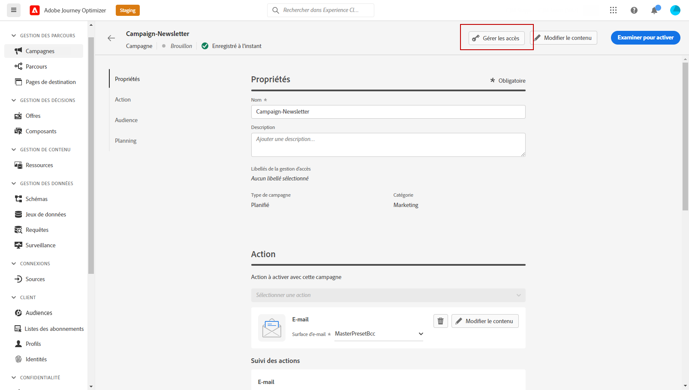
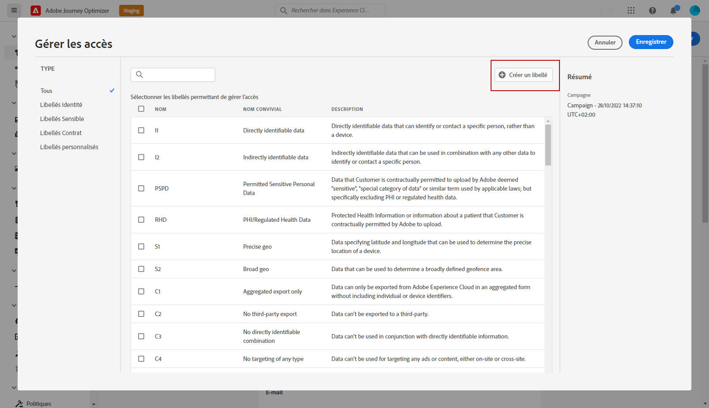
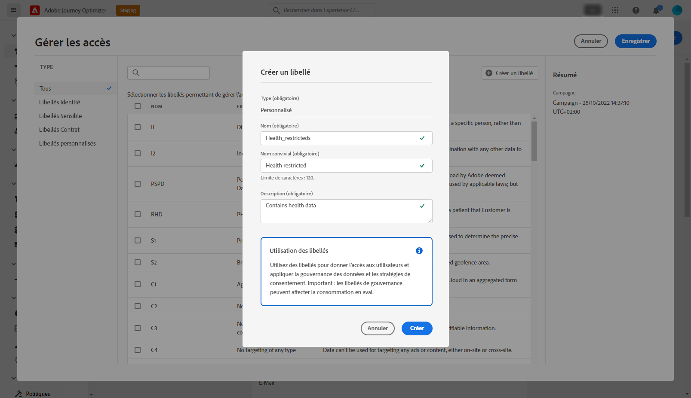

# Contrôle d’accès au niveau des objets {#object-level-access}

>[!CONTEXTUALHELP]
>id="ajo_olac_manage_access"
>title="Libellés de gestion des accès"
>abstract="Vous pouvez limiter l’accès à un objet en fonction des libellés d’accès. Cette approche protège les ressources numériques sensibles contre les utilisateurs et les utilisatrices non autorisés, permettant ainsi de renforcer la protection des données personnelles. **Sélectionnez uniquement les libellés pour lesquels vous disposez d’autorisations.**"

Vous pouvez limiter l’accès à un objet en fonction des libellés d’accès. Cette approche protège les ressources numériques sensibles contre les utilisateurs et les utilisatrices non autorisés, permettant ainsi de renforcer la protection des données personnelles.

La fonctionnalité de contrôle d’accès au niveau de l’objet (OLAC) vous permet de définir des autorisations pour gérer l’accès aux données d’une sélection d’objets :

* Parcours
* Campagne
* Modèle
* Fragment
* Page de destination
* Offre
* Collection d’offres statique
* Décision d’offres
* Configuration des canaux
* Plan de préchauffage des adresses IP

## Conditions préalables {#prereq-labels}

Pour pouvoir [créer des libellés](#create-labels), vous devez disposer d’un rôle avec l’autorisation **[!UICONTROL Gérer les libellés d’utilisation]**.

Pour pouvoir [attribuer des libellés](#assign-labels), vous devez disposer d’un rôle avec une autorisation **Gérer**, c’est-à-dire [!DNL Manage journeys], [!DNL Manage Campaigns] ou [!DNL Manage decisions]. Sans cette autorisation, le bouton **[!UICONTROL Gérer l’accès]** sera grisé.

Pour en savoir plus sur les autorisations, consultez [cette section](../administration/permissions.md).

## Créer des libellés {#create-labels}

Les **[!UICONTROL libellés]** vous permettent de classer les jeux de données et les champs en fonction des politiques d’utilisation qui s’appliquent à ces données. Vous pouvez appliquer des **[!UICONTROL libellés]** à tout moment, ce qui vous offre une certaine flexibilité quant à la manière dont vous choisissez de gérer les données.

Utilisez des étiquettes pour accorder l’accès aux utilisateurs et aux utilisatrices, ainsi que pour appliquer la gouvernance des données et les politiques de consentement. Ces libellés de gouvernance peuvent affecter la consommation en aval.

Vous pouvez créer des libellés dans le produit [!DNL Permissions]. Pour plus d’informations, consultez la [documentation Adobe Experience Platform](https://experienceleague.adobe.com/docs/experience-platform/access-control/abac/permissions-ui/labels.html?lang=fr){target="_blank"}.

Vous pouvez également créer des **[!UICONTROL libellés]** directement dans Journey Optimizer. Pour créer un libellé, procédez comme suit :

1. Depuis un objet Adobe Journey Optimizer, comme une nouvelle **[!UICONTROL campagne]**, cliquez sur le bouton **[!UICONTROL Gérer l’accès]**.

   

1. Dans la fenêtre **[!UICONTROL Gérer l’accès]**, cliquez sur **[!UICONTROL Créer une étiquette]**.

   

1. Configurez votre étiquette. Vous devez indiquer les informations suivantes :

   * **[!UICONTROL Nom]**
   * **[!UICONTROL Nom convivial]**
   * **[!UICONTROL Description]**

   

1. Cliquez sur **[!UICONTROL Créer]** pour enregistrer votre **[!UICONTROL Libellé]**.

Votre nouveau **[!UICONTROL Libellé]** est désormais disponible dans la liste. Si nécessaire, vous pouvez la modifier dans le produit [!DNL Permissions].

## Attribuer des libellés {#assign-labels}

Pour attribuer des étiquettes d’utilisation des données personnalisées ou de base à vos objets Journey Optimizer, procédez comme suit :

1. Depuis un objet Adobe Journey Optimizer, comme une nouvelle **[!UICONTROL campagne]**, cliquez sur le bouton **[!UICONTROL Gérer l’accès]**.

   

1. Dans la fenêtre **[!UICONTROL Gérer l’accès]**, sélectionnez votre ou vos libellés d’utilisation des données de base ou personnalisés pour gérer l’accès à cet objet.

   Pour plus d’informations sur les libellés d’utilisation des données de base, reportez-vous à [cette page](https://experienceleague.adobe.com/docs/experience-platform/data-governance/labels/reference.html?lang=fr){target="_blank"}.

   

1. Cliquez sur **[!UICONTROL Enregistrer]** pour appliquer cette restriction de libellé.

Pour accéder à cet objet, les utilisateurs et les utilisatrices doivent disposer de l’**[!UICONTROL étiquette]** spécifique dans leur **[!UICONTROL rôle]**. Par exemple, un utilisateur ou une utilisatrice avec l’étiquette C1 n’aura accès qu’aux objets avec l’étiquette C1 ou sans étiquette.

Pour plus d’informations sur la manière d’attribuer une **[!UICONTROL étiquette]** à un **[!UICONTROL rôle]**, consultez [cette page](https://experienceleague.adobe.com/docs/experience-platform/access-control/abac/permissions-ui/permissions.html?lang=fr#manage-labels-for-a-role){target="_blank"}.
