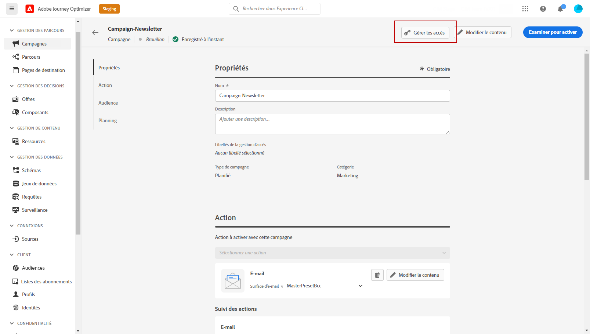
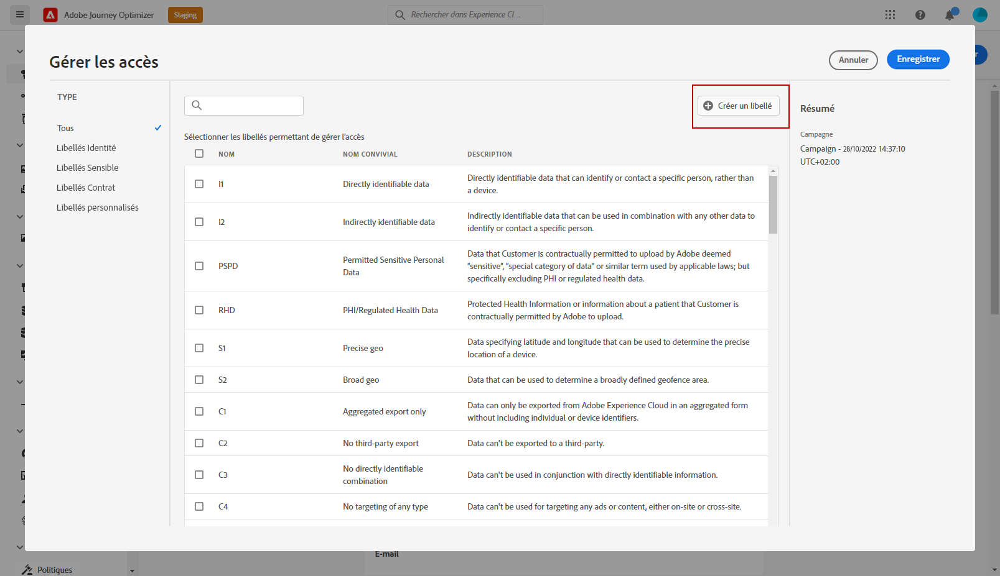
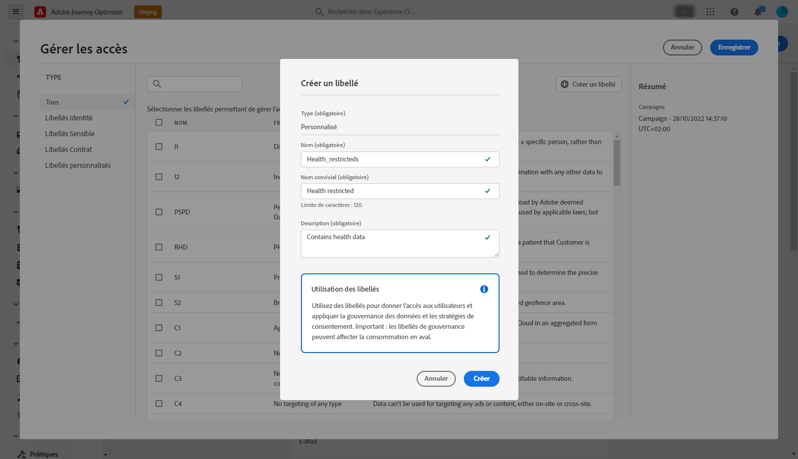
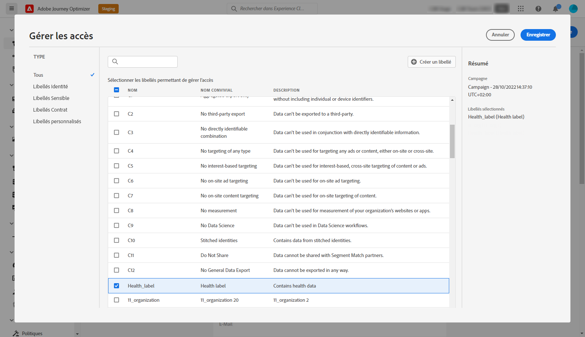

# Contrôle d’accès au niveau des objets {#object-level-access}

>[!BEGINSHADEBOX]

**Sur cette page :** utilisez le contrôle d’accès au niveau de l’objet pour restreindre les objets individuels tels que les parcours, les campagnes et les offres avec des libellés d’accès, afin que vous puissiez limiter le contenu sensible et les données personnelles aux utilisateurs autorisés.

>[!ENDSHADEBOX]

>[!CONTEXTUALHELP]
>id="ajo_olac_manage_access"
>title="Libellés de gestion des accès"
>abstract="Vous pouvez limiter l’accès à un objet en fonction des libellés d’accès. Cette approche protège les ressources numériques sensibles contre les utilisateurs et les utilisatrices non autorisés, permettant ainsi de renforcer la protection des données personnelles. **Sélectionnez uniquement les libellés pour lesquels vous disposez d’autorisations.**"

Vous pouvez limiter l’accès à un objet en fonction des libellés d’accès. Cette approche protège les ressources numériques sensibles contre les utilisateurs et les utilisatrices non autorisés, permettant ainsi de renforcer la protection des données personnelles.

La fonctionnalité de contrôle d’accès au niveau de l’objet (OLAC) vous permet de définir des autorisations pour gérer l’accès aux données d’une sélection d’objets :

* Parcours
* Campaign
* Modèle
* Fragment
* Page de destination
* Offre
* Collection d’offres statique
* Décision d’offres
* Configuration des canaux
* Plan de préchauffage des adresses IP

## Conditions préalables {#prereq-labels}

Pour pouvoir [créer des libellés](#create-labels), vous devez disposer d’un rôle avec l’autorisation **[!UICONTROL Gérer les libellés d’utilisation]**.

Pour pouvoir [attribuer des libellés](#assign-labels), vous devez disposer d’un rôle avec une autorisation **Gérer**, c’est-à-dire [!DNL Manage journeys], [!DNL Manage Campaigns] ou [!DNL Manage decisions]. Sans cette autorisation, le bouton **[!UICONTROL Gérer l’accès]** sera grisé.

Pour en savoir plus sur les autorisations, consultez [cette section](../administration/permissions.md).

## Créer des libellés {#create-labels}

Les **[!UICONTROL libellés]** vous permettent de classer les jeux de données et les champs en fonction des politiques d’utilisation qui s’appliquent à ces données. Vous pouvez appliquer des **[!UICONTROL libellés]** à tout moment, ce qui vous offre une certaine flexibilité quant à la manière dont vous choisissez de gérer les données.

Utilisez des étiquettes pour accorder l’accès aux utilisateurs et aux utilisatrices, ainsi que pour appliquer la gouvernance des données et les politiques de consentement. Ces libellés de gouvernance peuvent affecter la consommation en aval.

Vous pouvez créer des libellés dans le produit [!DNL Permissions]. Pour plus d’informations, consultez la [documentation Adobe Experience Platform](https://experienceleague.adobe.com/docs/experience-platform/access-control/abac/permissions-ui/labels.html?lang=fr){target="_blank"}.

Vous pouvez également créer des **[!UICONTROL libellés]** directement dans Journey Optimizer. Pour créer un libellé, procédez comme suit :

1. Depuis un objet Adobe Journey Optimizer, comme une nouvelle **[!UICONTROL campagne]**, cliquez sur le bouton **[!UICONTROL Gérer l’accès]**.

   

1. Dans la fenêtre **[!UICONTROL Gérer l’accès]**, cliquez sur **[!UICONTROL Créer une étiquette]**.

   

1. Configurez votre étiquette. Vous devez indiquer les informations suivantes :

   * **[!UICONTROL Nom]**
   * **[!UICONTROL Nom convivial]**
   * **[!UICONTROL Description]**

   

1. Cliquez sur **[!UICONTROL Créer]** pour enregistrer votre **[!UICONTROL Libellé]**.

Votre nouveau **[!UICONTROL Libellé]** est désormais disponible dans la liste. Si nécessaire, vous pouvez la modifier dans le produit [!DNL Permissions].

## Attribuer des libellés {#assign-labels}

Pour attribuer des étiquettes d’utilisation des données personnalisées ou de base à vos objets Journey Optimizer, procédez comme suit :

1. Depuis un objet Adobe Journey Optimizer, comme une nouvelle **[!UICONTROL campagne]**, cliquez sur le bouton **[!UICONTROL Gérer l’accès]**.

   

1. Dans la fenêtre **[!UICONTROL Gérer l’accès]**, sélectionnez votre ou vos libellés d’utilisation des données de base ou personnalisés pour gérer l’accès à cet objet.

   Pour plus d’informations sur les libellés d’utilisation des données de base, reportez-vous à [cette page](https://experienceleague.adobe.com/docs/experience-platform/data-governance/labels/reference.html?lang=fr){target="_blank"}.

   

1. Cliquez sur **[!UICONTROL Enregistrer]** pour appliquer cette restriction de libellé.

Pour accéder à cet objet, les utilisateurs et les utilisatrices doivent disposer de l’**[!UICONTROL étiquette]** spécifique dans leur **[!UICONTROL rôle]**. Par exemple, un utilisateur ou une utilisatrice avec l’étiquette C1 n’aura accès qu’aux objets avec l’étiquette C1 ou sans étiquette.

Pour plus d’informations sur la manière d’attribuer une **[!UICONTROL étiquette]** à un **[!UICONTROL rôle]**, consultez [cette page](https://experienceleague.adobe.com/docs/experience-platform/access-control/abac/permissions-ui/permissions.html?lang=fr#manage-labels-for-a-role){target="_blank"}.

+++ Référence des connaissances sur l’IA

Cette section contient des connaissances structurées destinées à soutenir l’interprétation, la récupération et la réponse aux questions liées à ce sujet.

Pour une compréhension totale, ces informations doivent être combinées avec la documentation de cette page. Aucune des sources n’est conçue pour être autonome. La page décrit la fonctionnalité, tandis que cette section fournit un contexte supplémentaire qui permet de clarifier la terminologie, l’intention, l’applicabilité et les contraintes.

* **TL;DR:** Le contrôle d’accès au niveau de l’objet (OLAC) vous permet d’appliquer des libellés d’accès à des objets Journey Optimizer spécifiques, tels que des parcours, des campagnes et des offres, de sorte que seuls les utilisateurs dont le rôle inclut le libellé correspondant puissent afficher ces objets ou interagir avec eux.

**Intentions:**

* Créez un libellé d’accès personnalisé directement dans Journey Optimizer ou via le produit Autorisations .
* Attribuez des libellés d’accès aux objets Journey Optimizer (parcours, campagnes, offres, etc.)
* Limiter le contenu sensible aux utilisateurs autorisés uniquement
* Identifiez les autorisations requises pour créer et attribuer des libellés

**Glossaire:**

* **OLAC (contrôle d’accès au niveau de l’objet)** : permet de définir des autorisations pour gérer l’accès aux données pour une sélection d’objets Journey Optimizer spécifiques *(spécifiques au produit)*
* **Libellé** : balise appliquée à un objet pour le classer par politique d’utilisation et restreindre l’accès en fonction des *d’appartenance à un rôle (spécifiques au produit)*
* **Gérer l’accès** : bouton ou interface disponible sur les objets Journey Optimizer pris en charge pour la création et l’attribution de libellés d’accès *(spécifiques au produit)*
* **Libellés d’utilisation des données de base** : libellés prédéfinis fournis par Adobe Experience Platform, par opposition aux libellés personnalisés créés par l’organisation *(spécifiques aux produits)*

**Mécanismes de sécurisation :**

* La création de libellés nécessite l’autorisation **Gérer les libellés d’utilisation** (prérequis)
* L’attribution de libellés nécessite une autorisation **Gérer** pour le type d’objet (par exemple, Gérer les parcours, Gérer les campagnes ou Gérer les décisions) ; sans cette autorisation, le bouton **Gérer l’accès** est grisé (prérequis)
* Objets pris en charge pour les libellés OLAC : Parcours, Campagne, Modèle, Fragment, Page de destination, Offre, Collection d’offres statique, Décision d’offre, Configuration du canal, Plan de préchauffage d’adresses IP

**Terminologie:**

* Nom canonique : Contrôle d’accès au niveau de l’objet — Acronyme : OLAC — Variantes : contrôle d’accès basé sur l’objet, gestion d’accès basée sur l’objet
* Ne les confondez pas : OLAC (restreint l’accès à des objets AJO spécifiques tels que des parcours et des campagnes à l’aide de libellés) ≠ ABAC (applique des politiques de libellé basées sur les attributs aux champs de schéma, aux jeux de données et aux audiences au niveau de la plateforme)
* Ne les confondez pas : « libellés d’utilisation des données de base » (libellés préconfigurés de Adobe Experience Platform) ≠ « libellés personnalisés » (libellés créés par l’organisation)

**FAQ:**

* **Q : Puis-je créer un libellé directement dans Journey Optimizer sans accéder au produit Autorisations ?** — Oui ; utilisez la fenêtre Gérer l&#39;accès sur n&#39;importe quel objet pris en charge et cliquez sur Créer une étiquette.
* **Q : Quels types d’objets prennent en charge les libellés OLAC ?** : Parcours, campagne, modèle, fragment, page de destination, offre, collection d’offres statique, décision d’offre, configuration de canal et plan de préchauffage d’adresses IP.
* **Q : Quelle autorisation est nécessaire pour attribuer un libellé à un parcours ?** — Autorisation Gérer les parcours ; en l&#39;absence d&#39;autorisation Gérer, le bouton Gérer l&#39;accès est grisé.
* **Q : Si un utilisateur dispose uniquement du libellé C1 dans son rôle, à quels objets peut-il accéder ?** — Uniquement objets étiquetés C1 ou non étiquetés.

+++
<!-- ai-accordion-version: 1 | source-hash: 4e9b2577 -->
