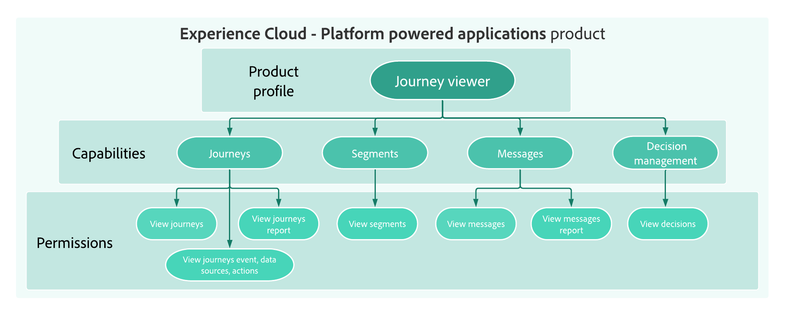

# Gestion des utilisateurs - Aperçu {#permissions-overview}

[!DNL Journey Optimizer] vous permet de définir et de gérer les autorisations attribuées à différents utilisateurs. Les autorisations sont un ensemble de droits et de restrictions qui autorisent ou refusent l’accès aux fonctionnalités et fonctionnalités du produit.

La gestion des utilisateurs dans [!DNL Journey Optimizer] repose sur trois concepts :

* **[!UICONTROL Profil]** de produit : Ensemble de droits unitaires qui permet aux utilisateurs d’accéder à certaines fonctionnalités ou à certains objets de l’interface. Consultez la section [Profils de produits d’usine](ootb-product-profiles.md)

* **[!UICONTROL Autorisations]** : Droits unitaires qui permettent de définir les autorisations attribuées au profil **** Produit. Chaque autorisation est regroupée sous des fonctionnalités, par exemple Parcours, Messages ou Offres, qui représente les différentes fonctionnalités ou objets dans [!DNL Journey Optimizer]. Reportez-vous à la section [Niveaux d’autorisation](high-low-permissions.md) .

* **[!UICONTROL Sandbox]** : Environnements de test virtuels qui divisent les instances en environnements virtuels distincts et isolés. Reportez-vous à la section [Utilisation des environnements de test](sandboxes.md)

Chaque concept peut être géré par les **[!UICONTROL administrateurs de produit]** ayant accès à la console d’administration. [En savoir plus sur Adobe Admin Console](https://helpx.adobe.com/fr/enterprise/managing/user-guide.html).

