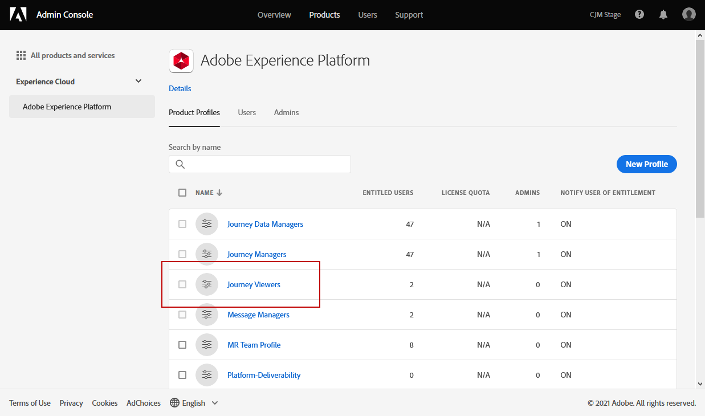
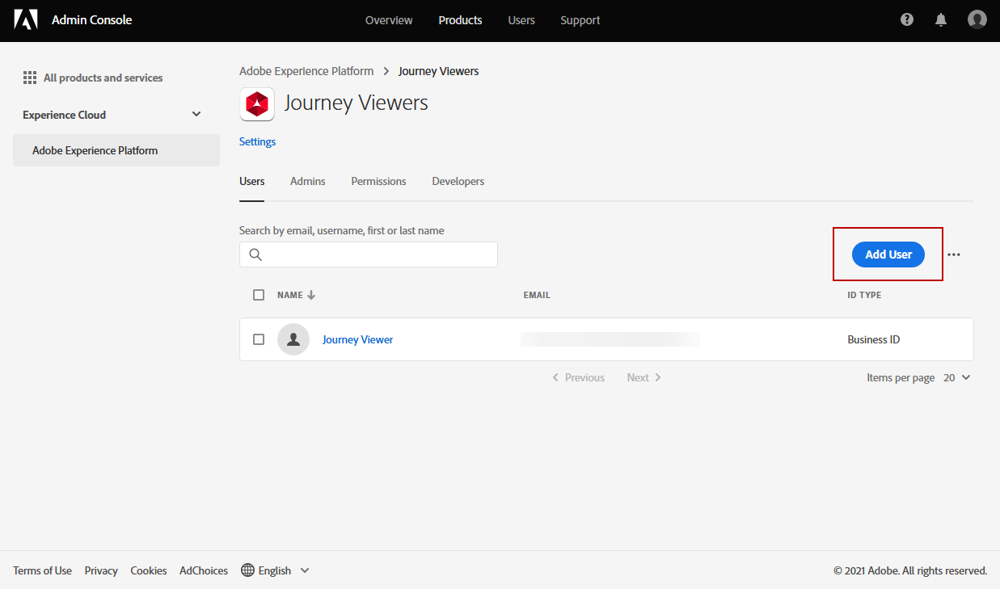

# Gestion des utilisateurs et des profils de produits {#manage-permissions}

>[!IMPORTANT]
>
> Chacune des procédures présentées ci-dessous ne peut être réalisée que par un administrateur **[!UICONTROL Product]** ou **[!UICONTROL System]**. Pour plus d’informations à ce sujet, consultez la [documentation de la console d’administration](https://helpx.adobe.com/enterprise/admin-guide.html/enterprise/using/admin-roles.ug.html).

**[!UICONTROL Les]** profils de produit sont des ensembles d’utilisateurs qui partagent les mêmes autorisations et environnements de test au sein de votre organisation.

Le produit [!DNL Journey Optimizer] vous permet de choisir parmi différents **[!UICONTROL profils de produit]** prêts à l’emploi avec différents niveaux d’autorisations à affecter à vos utilisateurs. Pour plus d’informations sur les **[!UICONTROL profils de produits]** disponibles, consultez cette [page](ootb-product-profiles.md).

Chaque utilisateur appartenant à un **[!UICONTROL profil de produit]** a droit aux applications et services d’Adobe contenus dans le produit.

Vous pouvez également créer vos propres **[!UICONTROL profils de produit]** si vous souhaitez affiner l’accès de vos utilisateurs à certaines fonctionnalités ou objets de l’interface.

## Attribution d’un profil de produit {#assigning-product-profile}

Vous pouvez choisir d’attribuer un **[!UICONTROL profil de produit]** personnalisé ou d’usine à vos utilisateurs.

La liste de tous les profils de produit d’usine avec les autorisations attribuées se trouve dans la section [Profils de produit intégrés](ootb-product-profiles.md) .

Pour attribuer un **[!UICONTROL profil de produit]** :

1. Dans l’onglet [!DNL Admin Console] **[!UICONTROL Produits]**, sélectionnez le produit **[!UICONTROL Experience Cloud - Applications de plateforme]**.

1. Sélectionnez un **[!UICONTROL Profil de produit]**.

   

1. Dans l’onglet **[!UICONTROL Utilisateurs]**, cliquez sur **[!UICONTROL Ajouter un utilisateur]**.

   

1. Saisissez le nom ou l’adresse email de votre utilisateur et sélectionnez-le.

   Si l’utilisateur n’a pas été précédemment créé dans le [!DNL Admin Console], reportez-vous à la [documentation Ajouter des utilisateurs](https://helpx.adobe.com/enterprise/admin-guide.html/enterprise/using/manage-users-individually.ug.html#add-users).

   

1. Procédez comme ci-dessus pour ajouter d’autres utilisateurs à votre **[!UICONTROL profil de produit]**. Cliquez ensuite sur **[!UICONTROL Enregistrer]**.

L’utilisateur doit alors recevoir un email le redirigeant vers votre instance.

Pour plus d’informations sur la gestion des utilisateurs, consultez la [documentation du Admin Console](https://helpx.adobe.com/fr/enterprise/admin-guide.html/enterprise/using/manage-users-individually.ug.html).

Lors de l’accès à l’instance, l’utilisateur voit une vue spécifique en fonction des autorisations attribuées dans le **[!UICONTROL profil de produit]**. Si l’utilisateur ne dispose pas du droit d’accès à une fonctionnalité, l’écran suivant s’affiche.

## Modification d’un profil de produit existant {#edit-product-profile}

Pour les **[!UICONTROL profils de produit]** personnalisés ou prêts à l’emploi, vous pouvez décider à tout moment d’ajouter ou de supprimer des autorisations.

Dans cet exemple, nous souhaitons ajouter **[!UICONTROL Autorisations]** liées à la fonctionnalité **[!UICONTROL Message]** pour les utilisateurs affectés à la visionneuse de Parcours **[!UICONTROL Profil de produit]**. Les utilisateurs pourront alors publier des messages.

Notez que si vous modifiez un **[!UICONTROL profil de produit]** personnalisé ou d’usine, il aura un impact sur chaque utilisateur affecté à ce **[!UICONTROL profil de produit]**.

1. Dans l’onglet [!DNL Admin Console] **[!UICONTROL Produits]**, sélectionnez le produit **[!UICONTROL Experience Cloud - Applications de plateforme]**.

1. Sélectionnez la visionneuse de Parcours **[!UICONTROL Profil produit]**.

1. Sélectionnez l’onglet **[!UICONTROL Autorisations]** .

   L’onglet **[!UICONTROL Autorisations]** affiche la liste des fonctionnalités qui s’appliquent au produit **[!UICONTROL Experience Cloud - Applications Platform]** .

   

1. Sélectionnez la fonctionnalité **[!UICONTROL Messages]** .

   

1. Dans la liste **[!UICONTROL Éléments d’autorisation disponibles]**, sélectionnez les autorisations à attribuer à votre **[!UICONTROL profil de produit]** en cliquant sur l’icône plus (+).

   Ici, nous ajoutons l’autorisation **[!UICONTROL Publier les messages]** .

   

1. Si nécessaire, dans **[!UICONTROL Éléments d’autorisations disponibles]**, cliquez sur l’icône X la plus proche pour supprimer les autorisations de votre profil de produit.

1. Lorsque vous avez terminé, cliquez sur **[!UICONTROL Enregistrer]**.

   

Si nécessaire, vous pouvez également créer un profil de produit avec des autorisations spécifiques. Voir à ce propos la section [Création d’un profil de produit](#create-product-profile).

## Création d’un profil de produit {#create-product-profile}

[!DNL Journey Optimizer] vous permet de créer vos propres  **** profils de produit et d’attribuer un ensemble d’autorisations et d’environnements Sandbox à vos utilisateurs. Avec **[!UICONTROL Profils de produit]**, vous pouvez autoriser ou refuser l’accès à certaines fonctionnalités ou objets de l’interface.

Pour plus d’informations sur la création et la gestion des environnements Sandbox, consultez la [documentation d’Adobe Experience Platform](https://experienceleague.adobe.com/docs/experience-platform/sandbox/ui/user-guide.html?lang=fr).

Dans cet exemple, nous allons créer un profil de produit nommé **Parcours en lecture seule** où nous accorderons des droits en lecture seule à la fonction de Parcours. Les utilisateurs ne pourront accéder qu’aux parcours et les afficher. Ils ne pourront pas accéder à d’autres fonctionnalités telles que **[!UICONTROL Gestion des décisions]** ou **[!UICONTROL Messages]** dans [!DNL Journey Optimizer].

Pour créer nos **Parcours en lecture seule** **[!UICONTROL profils de produit]** :

1. Accédez à [!DNL Admin Console].

1. Dans l’onglet **[!UICONTROL Produits]**, sélectionnez le produit **[!UICONTROL Experience Cloud - Applications de plateforme]** .

1. Cliquez sur **[!UICONTROL Nouveau profil]**.

   

1. Ajoutez un **[!UICONTROL Nom du profil de produit]**, **[!UICONTROL Nom d’affichage]** et **[!UICONTROL Description]** pour vos nouveaux **[!UICONTROL profils de produit]**.

   

1. Dans la catégorie **[!UICONTROL Notifications]** , indiquez si les utilisateurs seront avertis par e-mail lorsqu’ils seront ajoutés ou supprimés de ce profil de produit.

1. Lorsque vous avez terminé, cliquez sur **[!UICONTROL Enregistrer]** et sélectionnez les **[!UICONTROL profils de produit]** que vous venez de créer.

1. Pour ajouter des autorisations permettant aux utilisateurs d’accéder à différentes fonctionnalités, sélectionnez l’onglet **[!UICONTROL Autorisations]** .

1. Choisissez entre les différentes fonctionnalités telles que **[!UICONTROL Messages]**, **[!UICONTROL Segments]** ou **[!UICONTROL Gestion des décisions]** disponibles dans [!DNL Journey Optimizer] dans le menu de gauche.

   Nous sélectionnons ici la fonctionnalité **[!UICONTROL Parcours]**.

   

1. Dans la liste **[!UICONTROL Éléments d’autorisation disponibles]**, sélectionnez les autorisations à attribuer à votre **[!UICONTROL profil de produit]** en cliquant sur l’icône plus (+).

   Ici, nous sélectionnons **[!UICONTROL Afficher les parcours]** et **[!UICONTROL Afficher les parcours, les sources de données, les actions]**.

   

1. Sélectionnez la fonctionnalité **[!UICONTROL Accès aux environnements de test]** pour choisir quel(s) environnement de test affecter à votre **[!UICONTROL profil de produit]**.

   

1. Dans **[!UICONTROL Éléments d’autorisations disponibles]**, cliquez sur l’icône plus (+) pour affecter des environnements Sandbox à votre profil. [En savoir plus sur les environnements Sandbox](https://experienceleague.adobe.com/docs/experience-platform/sandbox/home.html?lang=fr).

1. Lorsque vous avez terminé, cliquez sur **[!UICONTROL Enregistrer]**.

Votre **[!UICONTROL profil de produit]** est maintenant créé et configuré. Vous devez maintenant l’affecter aux utilisateurs.

Pour plus d’informations sur la création et la gestion des profils de produits, consultez la [documentation du Admin Console](https://helpx.adobe.com/enterprise/admin-guide.html/enterprise/using/manage-product-profiles.ug.html).
