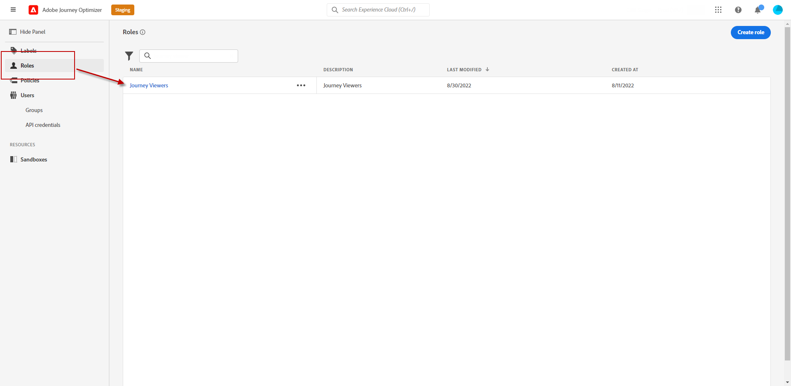
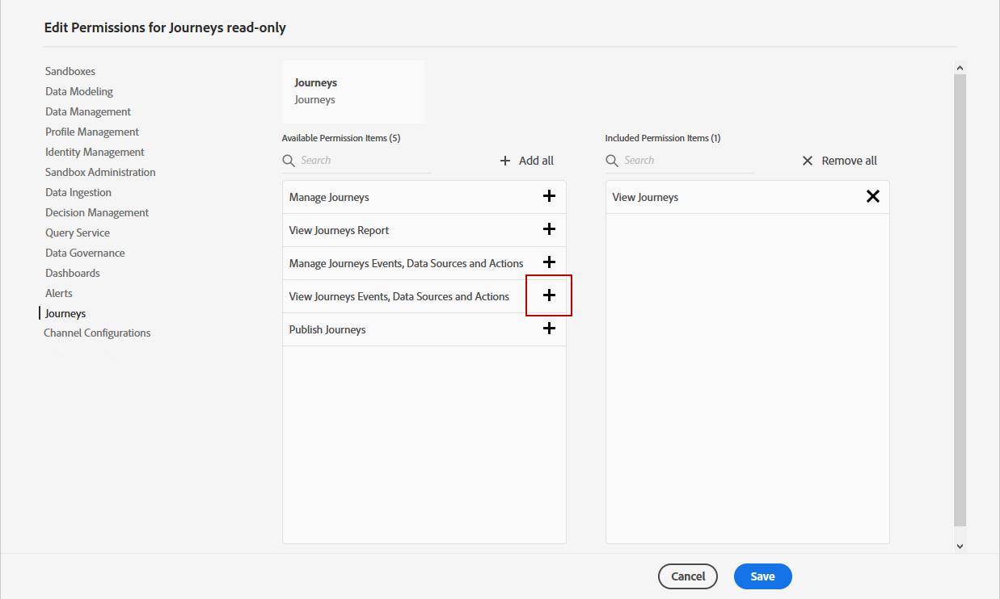

# Gérer les utilisateurs et les rôles {#manage-permissions}

>[!IMPORTANT]
>
> Chacune des procédures présentées ci-dessous ne peut être réalisée que par un administrateur ou une administratrice **[!UICONTROL Produit]** ou **[!UICONTROL Système]**.

Les **[!UICONTROL rôles]** se rapportent à un ensemble d’utilisateurs et d’utilisatrices qui partagent les mêmes autorisations et sandbox. Ces rôles vous permettent de gérer facilement les accès et les autorisations pour différents groupes d’utilisateurs et d’utilisatrices au sein de votre organisation.

Avec le produit [!DNL Journey Optimizer], vous avez la possibilité de choisir parmi une gamme de **[!UICONTROL rôles]** préexistants, chacun disposant de différents niveaux d’autorisation, à attribuer à vos utilisateurs et utilisatrices. Pour plus d’informations sur les **[!UICONTROL rôles]** disponibles, consultez cette [page](ootb-product-profiles.md).

Lorsqu’un utilisateur ou une utilisatrice appartient à un **[!UICONTROL Rôle]**, l’accès aux applications et services Adobe contenus dans le produit lui est accordé.

Si les rôles préexistants ne répondent pas aux besoins spécifiques de votre organisation, vous pouvez également créer des **[!UICONTROL rôles]** personnalisés pour affiner l’accès à certaines fonctionnalités ou à certains objets de l’interface. Ainsi, vous pouvez vous assurer que chaque utilisateur et utilisatrice n’a accès qu’aux ressources et outils nécessaires pour exécuter ses tâches efficacement.

## Attribuer un rôle {#assigning-role}

Vous pouvez choisir d’attribuer un **[!UICONTROL rôle]** personnalisé ou prêt à l’emploi à vos utilisateurs et utilisatrices.

Vous trouverez dans la section [Rôles intégrés](ootb-product-profiles.md), la liste de tous les rôles prêts à l’emploi avec les autorisations associées.

Pour attribuer un **[!UICONTROL rôle]** :

1. Pour attribuer un rôle à un utilisateur ou une utilisatrice dans le produit [!DNL Permissions], accédez à l’onglet **[!UICONTROL Rôles]** et sélectionnez le rôle de votre choix.

   

1. Dans l’onglet **[!UICONTROL Utilisateurs]**, cliquez sur **[!UICONTROL Ajouter un utilisateur]**.

   

1. Saisissez le nom ou l’adresse e-mail de votre utilisateur ou utilisatrice, ou sélectionnez l’utilisateur ou l’utilisatrice dans la liste, puis cliquez sur **[!UICONTROL Enregistrer]**.

   Si la personne utilisatrice n’a pas été créée auparavant dans [!DNL Admin Console], consultez la [documentation relative à l’ajout d’utilisateurs et d’utilisatrices](https://experienceleague.adobe.com/docs/experience-platform/access-control/ui/users.html?lang=fr).

   

L’utilisateur ou l’utilisatrice doit alors recevoir un e-mail le ou la redirigeant vers votre instance.

Pour plus d’informations sur la gestion des utilisateurs et utilisatrices, consultez la [documentation relative au contrôle d’accès](https://experienceleague.adobe.com/docs/experience-platform/access-control/home.html?lang=fr).

Lors de l’accès à l’instance, une vue spécifique s’affiche pour l’utilisateur ou l’utilisatrice en fonction des autorisations attribuées dans le **[!UICONTROL rôle]**. Si l’utilisateur ou l’utilisatrice ne dispose pas du droit d’accès à une fonctionnalité, le message suivant s’affiche :

`You don't have permission to access this feature. Permission needed: XX.`

## Modifier un rôle existant {#edit-product-profile}

Pour les **[!UICONTROL rôles]** personnalisés ou prêts à l’emploi, vous pouvez décider à tout moment d’ajouter ou de supprimer des autorisations.

Dans cet exemple, nous souhaitons ajouter des **[!UICONTROL autorisations]** liées à la ressource **[!UICONTROL Parcours]** pour les utilisateurs et utilisatrices affectés au **[!UICONTROL rôle]** Observateur de parcours. Les utilisateurs et utilisatrices pourront alors publier des parcours.

Notez que si vous modifiez un **[!UICONTROL rôle]** personnalisé ou prêt à l’emploi, cela aura un effet sur chaque personne utilisatrice affectée à ce **[!UICONTROL rôle]**.

1. Pour attribuer un rôle à un utilisateur ou une utilisatrice dans le produit [!DNL Permissions], accédez à l’onglet **[!UICONTROL Rôles]** et sélectionnez le rôle de votre choix. Dans ce cas, le **[!UICONTROL rôle]** Observateur de parcours.
   

1. À partir du tableau de bord **[!UICONTROL Rôle]**, cliquez sur **[!UICONTROL Modifier]**.

   

1. Le menu **[!UICONTROL Ressources]** affiche la liste des ressources qui s’appliquent au produit **[!UICONTROL Experience Cloud - Applications proposées par Platform]**. Effectuez un glisser-déposer des ressources pour attribuer une autorisation.

   Dans la liste déroulante de ressources **[!UICONTROL Parcours]**, nous choisissons ici l’**[!UICONTROL autorisation]** Publier le parcours.

   

1. Si nécessaire, dans **[!UICONTROL Éléments d’autorisation inclus]**, cliquez sur l’icône X la plus proche pour supprimer les autorisations ou les ressources de votre rôle.

1. Lorsque vous avez terminé, cliquez sur **[!UICONTROL Enregistrer]**.

Si nécessaire, vous pouvez également créer un rôle avec des autorisations spécifiques. Pour plus d’informations à ce sujet, consultez la section [Création d’un rôle](#create-product-profile).

## Créer un rôle {#create-product-profile}

[!DNL Journey Optimizer] vous permet de créer vos propres **[!UICONTROL rôles]** et d’attribuer un ensemble d’autorisations et de sandbox à vos utilisateurs et utilisatrices. Avec les **[!UICONTROL rôles]**, vous pouvez autoriser ou refuser l’accès à certaines fonctionnalités ou à certains éléments de l’interface.

Pour plus d’informations sur la création et la gestion des sandbox, consultez la [documentation d’Adobe Experience Platform](https://experienceleague.adobe.com/docs/experience-platform/sandbox/ui/user-guide.html?lang=fr){target="_blank"}.

Dans cet exemple, nous allons créer un rôle nommé **Parcours en lecture seule** dans lequel nous accorderons des droits en lecture seule à la fonctionnalité Parcours. Les utilisateurs et utilisatrices pourront uniquement accéder aux parcours et les afficher. Ils ne pourront pas accéder à dʼautres fonctionnalités telles que **[!DNL  Decision management]** dans [!DNL Journey Optimizer].

Pour créer notre **[!UICONTROL rôle]** **Parcours en lecture seule** :

1. Pour attribuer un rôle à un utilisateur ou une utilisatrice dans le produit [!DNL Permissions], accédez à l’onglet **[!UICONTROL Rôles]** et cliquez sur **[!UICONTROL Créer un rôle]**.

   

1. Ajoutez un **[!UICONTROL nom]** et une **[!UICONTROL description]** à votre nouveau **[!UICONTROL rôle]**. Cliquez ensuite sur **[!UICONTROL Confirmer]**.

   

1. Dans le menu déroulant des ressources **[!UICONTROL Sandbox]**, choisissez la ou les sandbox à attribuer à votre **[!UICONTROL Rôle]**. [En savoir plus sur les sandbox](sandboxes.md).

   

1. Choisissez entre les différentes ressources telles que **[!DNL Journeys]**, **[!DNL Segments]** ou **[!DNL Decision management]** disponibles dans [!DNL Journey Optimizer] dans le menu de gauche.

   Nous sélectionnons ici la ressource **[!UICONTROL Parcours]**.

   

1. Dans le menu déroulant **[!UICONTROL Parcours]**, sélectionnez les autorisations à attribuer à votre **[!UICONTROL Rôle]**.

   Nous sélectionnons ici **[!DNL View journeys]**, **[!DNL View journeys report]** et **[!DNL View journeys event, data sources, actions]**.

   

1. Lorsque vous avez terminé, cliquez sur **[!UICONTROL Enregistrer]**.

Votre **[!UICONTROL rôle]** est désormais créé et configuré. Vous devez à présent l’affecter aux utilisateurs et utilisatrices.

Pour plus d’informations sur la création et la gestion des rôles, consultez la [documentation relative à Admin Console](https://experienceleague.adobe.com/docs/experience-platform/access-control/abac/permissions-ui/roles.html?lang=fr).
