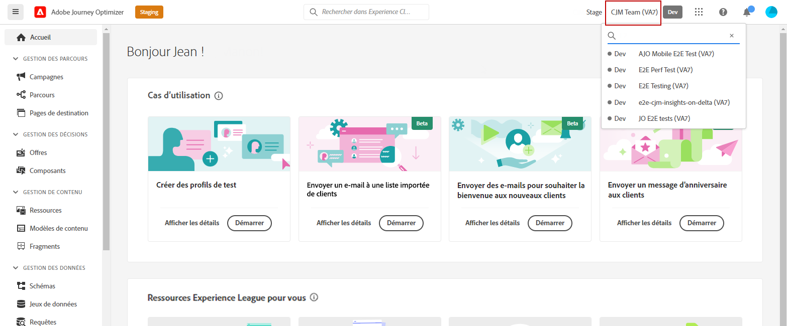
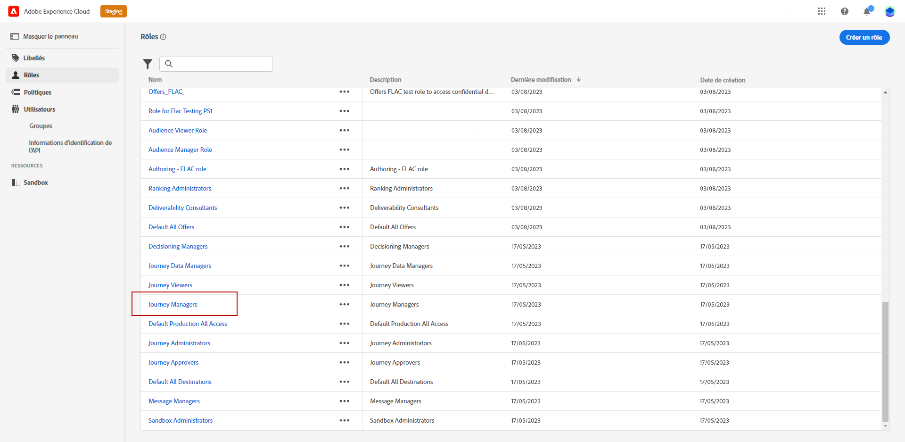
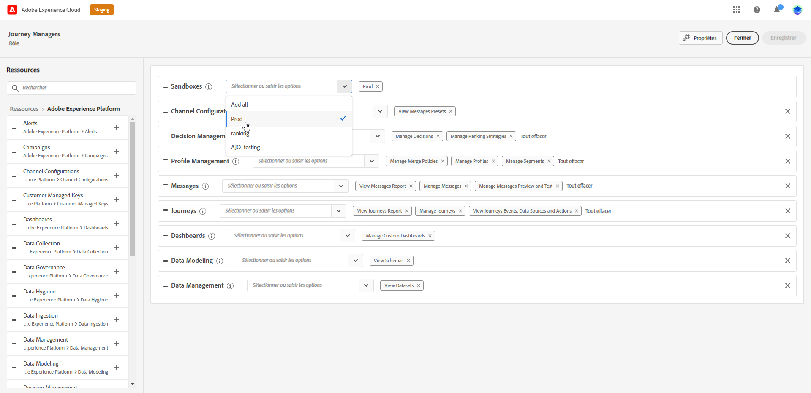
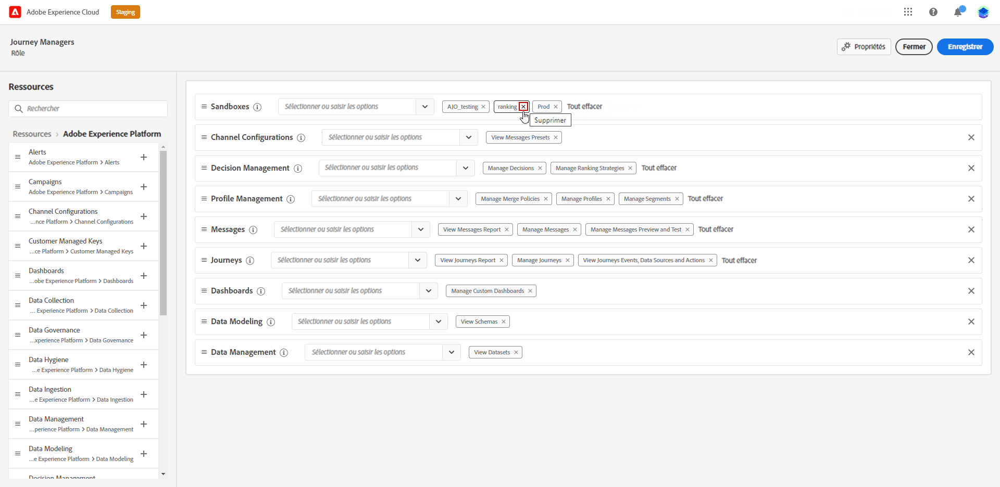

# Utiliser et attribuer des sandbox {#sandboxes}

Les **sandbox** sont des environnements virtuels qui divisent votre instance Adobe Journey Optimizer en espaces de travail distincts et isolés, à des fins de développement, de test ou de production. Vous trouverez la gestion des sandbox sous **Administration** > **Canaux** > **Connecter vos systèmes et environnements** (ou via le sélecteur de sandbox en haut à droite de l’interface). Les sandbox vous permettent de tester en toute sécurité, d’attribuer des accès différents par rôle et de maintenir le contenu organisé. Cette page explique comment utiliser et affecter des sandbox, configurer l’accès au contenu et, dans l’article [Exporter des objets vers un autre sandbox](../configuration/copy-objects-to-sandbox.md), comment copier des parcours et des modèles entre des sandbox.

## Utiliser des sandbox {#using-sandbox}

[!DNL Journey Optimizer] vous permet de partitionner votre instance en environnements virtuels distincts appelés sandbox. Les sandbox sont affectés via les rôles dans les autorisations. [Découvrez comment affecter des sandbox](permissions.md#create-product-profile).

[!DNL Journey Optimizer] reflète les sandbox Adobe Experience Platform créées pour une organisation donnée. Vous pouvez créer ou réinitialiser des sandbox Adobe Experience Platform à partir de votre instance Adobe Experience Platform. [Pour en savoir plus, consultez le guide d’utilisation des sandbox](https://experienceleague.adobe.com/docs/experience-platform/sandbox/ui/user-guide.html?lang=fr){target="_blank"}.

Le sélecteur de sandbox se trouve en haut à droite de votre écran, à côté du nom de votre organisation. Pour passer d’un sandbox à un autre, cliquez sur le sandbox actif dans le sélecteur et sélectionnez-en un autre dans la liste déroulante.

➡️ [En savoir plus sur les sandbox dans cette vidéo](#video)

## Affectation de sandbox {#assign-sandboxes}

>[!IMPORTANT]
>
> La gestion des sandbox ne peut être effectuée que par un **[!UICONTROL administrateur ou une administratrice produit]** ou un **[!UICONTROL administrateur ou une administratrice système]**.

Vous pouvez choisir d’affecter différentes sandbox aux **[!UICONTROL Rôles]** prêts à l’emploi ou personnalisés.

Pour affecter des sandbox :

1. Dans [!DNL Permissions], dans l’onglet **[!UICONTROL Rôles]**, sélectionnez un **[!UICONTROL Rôle]**.

   

1. Cliquez sur **[!UICONTROL Modifier]**.

1. Dans le menu déroulant des ressources **[!UICONTROL Sandbox]**, sélectionnez la sandbox qui sera affectée à votre rôle.

   

1. Si nécessaire, cliquez sur l’icône X en regard de celui-ci pour supprimer l’accès au sandbox de votre **[!UICONTROL Rôle]**.

   

1. Cliquez sur **[!UICONTROL Enregistrer]**.

## Accès au contenu {#content-access}

Pour configurer l’accessibilité au contenu, affectez un dossier partagé de contenu à chaque sandbox. Vous pouvez créer et configurer des dossiers partagés dans l’onglet **[!UICONTROL Stockage]**, affiché dans [!DNL Admin Console] pour les administrateurs et administratrices. Si vous avez accès à [!DNL Admin Console] en tant qu’administrateur ou administratrice système, vous pouvez créer des dossiers partagés et ajouter des personnes déléguées ayant des niveaux d’accès différents à ceux-ci.

Remarque : pour que votre contenu soit synchronisé avec le sandbox approprié, vous devez respecter exactement la même syntaxe que celle du sandbox. Par exemple, si votre sandbox s’appelle « développement », votre dossier partagé doit porter le même nom.

[Découvrez comment gérer les dossiers partagés](https://helpx.adobe.com/fr/enterprise/admin-guide.html/enterprise/using/manage-adobe-storage.ug.html){target="_blank"} .

## Vidéo pratique{#video}

Découvrez ce que sont les sandbox et comment faire la distinction entre les sandbox de développement et de production. Découvrez comment créer, réinitialiser et supprimer des sandbox.

>[!VIDEO](https://video.tv.adobe.com/v/334355?quality=12)