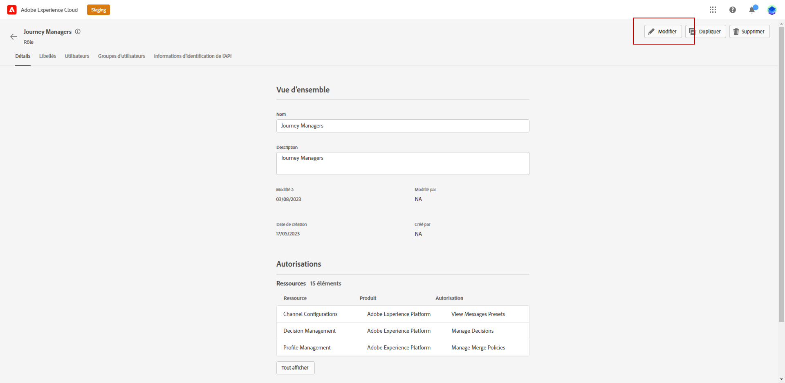

# Gestion des environnements Sandbox {#sandboxes}

## Utilisation des environnements Sandbox {#using-sandbox}

[!DNL Journey Optimizer] vous permet de partitionner votre instance en environnements virtuels séparés appelés Sandbox.
Les environnements Sandbox sont affectés par le biais des profils de produit dans Admin console. [Découvrez comment affecter des environnements Sandbox](permissions.md#create-product-profile).

[!DNL Journey Optimizer] reflète les environnements Sandbox Adobe Experience Platform qui ont été créés pour une organisation donnée.
Vous pouvez créer ou réinitialiser des environnements Sandbox Adobe Experience Platform à partir de votre instance Adobe Experience Platform. [Pour en savoir plus, consultez le guide d&#39;utilisation des environnements Sandbox](https://experienceleague.adobe.com/docs/experience-platform/sandbox/ui/user-guide.html?lang=fr){target=&quot;_blank&quot;}.

Le sélecteur d’environnement Sandbox se trouve dans le coin supérieur droit de votre écran, à côté du nom de votre organisation. Pour passer d’un environnement Sandbox à un autre, cliquez sur l’environnement Sandbox actif dans le sélecteur et sélectionnez-en un autre dans la liste déroulante.

➡️ [En savoir plus sur les environnements de test dans cette vidéo](#video)

## Affectation d&#39;environnements Sandbox {#assign-sandboxes}

>[!IMPORTANT]
>
> La gestion des environnements Sandbox peut uniquement être effectuée par un administrateur **[!UICONTROL Produit]** ou **[!UICONTROL Système]**. Pour plus d&#39;informations à ce sujet, consultez la [documentation relative à Admin Console](https://helpx.adobe.com/fr/enterprise/admin-guide.html/enterprise/using/admin-roles.ug.html){target=&quot;_blank&quot;}.

Vous pouvez choisir d&#39;affecter différents environnements Sandbox aux **[!UICONTROL profils de produit]** prêts à l&#39;emploi ou personnalisés.

Pour affecter des environnements Sandbox :

1. Dans l&#39;onglet **[!UICONTROL Produits]** de [!DNL Admin Console], sélectionnez le produit **[!UICONTROL Adobe Experience Platform Apps]**.

1. Sélectionnez un **[!UICONTROL profil de produit]**.

   

1. Sélectionnez l&#39;onglet **[!UICONTROL Autorisations]**.

1. Sélectionnez la fonctionnalité **[!UICONTROL Environnements Sandbox]**.

   

1. Dans **[!UICONTROL Éléments d&#39;autorisations disponibles]**, cliquez sur l&#39;icône plus (+) pour affecter des environnements Sandbox à votre profil. [En savoir plus sur les environnements Sandbox](https://experienceleague.adobe.com/docs/experience-platform/sandbox/home.html?lang=fr){target=&quot;_blank&quot;}.

   

1. Si nécessaire, dans **[!UICONTROL Éléments d&#39;autorisations disponibles]**, cliquez sur l&#39;icône X pour supprimer l&#39;accès des environnements Sandbox à votre **[!UICONTROL profil de produit]**.

   

1. Cliquez sur **[!UICONTROL Enregistrer]**.

## Accès au contenu {#content-access}

Pour configurer l&#39;accessibilité de votre contenu, vous devez affecter un dossier de contenu partagé à chacun de vos environnements Sandbox. Vous pouvez créer et configurer votre dossier partagé dans l&#39;onglet **[!UICONTROL Stockage]** affiché dans [!DNL Admin Console] pour les administrateurs. Si vous avez accès à [!DNL Admin Console] en tant qu&#39;administrateur système, vous pouvez créer des dossiers partagés et ajouter des délégués ayant un niveau d&#39;accès différent à ceux-ci.

Notez que pour que votre contenu soit synchronisé avec l&#39;environnement Sandbox correct, vous devez suivre la même syntaxe que cet environnement. Par exemple, si votre environnement Sandbox est appelé développement, votre dossier partagé doit porter le même nom.

[Découvrez comment gérer les dossiers partagés](https://helpx.adobe.com/fr/enterprise/admin-guide.html/enterprise/using/manage-adobe-storage.ug.html){target=&quot;_blank&quot;}.

## Vidéo pratique{#video}

Découvrez ce que sont les environnements Sandbox et comment faire la distinction entre les environnements Sandbox de développement et de production. Découvrez comment créer, réinitialiser et supprimer des environnements Sandbox.

>[!VIDEO](https://video.tv.adobe.com/v/334355?quality=12)
