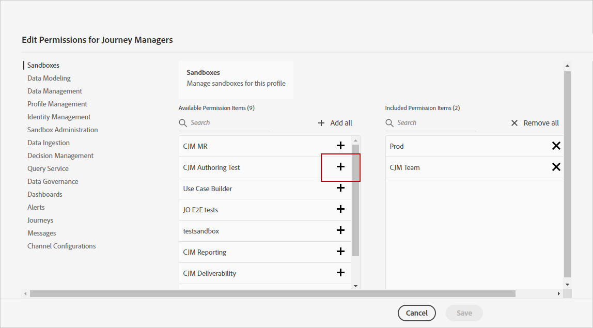

# Gestion des environnements de test {#sandboxes}

## Utilisation des environnements de test {#using-sandbox}

[!DNL Journey Optimizer] vous permet de partitionner votre instance en environnements virtuels séparés appelés Sandbox.
Les environnements Sandbox sont affectés par le biais des profils de produit dans Admin console. [Découvrez comment affecter des environnements Sandbox](permissions.md#create-product-profile).

[!DNL Journey Optimizer] reflète les environnements Sandbox Adobe Experience Platform qui ont été créés pour une organisation donnée.
Vous pouvez créer ou réinitialiser des environnements Sandbox Adobe Experience Platform à partir de votre instance Adobe Experience Platform. [Pour en savoir plus, consultez le guide d’utilisation des environnements Sandbox](https://experienceleague.adobe.com/docs/experience-platform/sandbox/ui/user-guide.html?lang=fr).

La commande de sélecteur des environnements Sandbox se trouve dans la partie supérieure gauche de votre écran. Pour passer d’un environnement Sandbox à un autre, cliquez sur l’environnement Sandbox actif dans le sélecteur et sélectionnez-en un autre dans la liste déroulante.

## Affectation d’environnements de test {#assign-sandboxes}

>[!IMPORTANT]
>
> La gestion des environnements de test ne peut être effectuée que par un administrateur **[!UICONTROL Produit]** ou **[!UICONTROL Système]**. Pour plus d’informations à ce sujet, consultez la [documentation de la console d’administration](https://helpx.adobe.com/enterprise/admin-guide.html/enterprise/using/admin-roles.ug.html).

Vous pouvez choisir d’affecter différents environnements de test aux **[!UICONTROL profils de produit]** prêts à l’emploi ou personnalisés.

Pour affecter des environnements de test :

1. Dans l’onglet [!DNL Admin Console], dans **[!UICONTROL Produits]**, sélectionnez le produit **[!UICONTROL Adobe Experience Platform Apps]**.

1. Sélectionnez un **[!UICONTROL Profil de produit]**.

   

1. Sélectionnez l’onglet **[!UICONTROL Autorisations]** .

1. Sélectionnez la fonctionnalité **[!UICONTROL Environnements de test]** .

   

1. Dans **[!UICONTROL Éléments d’autorisations disponibles]**, cliquez sur l’icône plus (+) pour affecter des environnements Sandbox à votre profil. [En savoir plus sur les environnements Sandbox](https://experienceleague.adobe.com/docs/experience-platform/sandbox/home.html?lang=fr).

   

1. Si nécessaire, sous **[!UICONTROL Éléments d’autorisation inclus]**, cliquez sur l’icône X en regard de pour supprimer l’accès des environnements de test à votre **[!UICONTROL profil de produit]**.

   

1. Cliquez sur **[!UICONTROL Enregistrer]**.

## Accès au contenu {#content-access}

Pour configurer l’accessibilité de votre contenu, vous devez affecter un dossier de contenu partagé à chacun de vos environnements Sandbox. Vous pouvez créer et configurer votre dossier partagé dans l’onglet **[!UICONTROL Stockage]** affiché dans [!DNL Admin Console] pour les administrateurs. Si vous avez accès à [!DNL Admin Console] en tant qu’administrateur système, vous pouvez créer des dossiers partagés et ajouter des délégués ayant un niveau d’accès différent à ceux-ci.

Notez que pour que votre contenu soit synchronisé avec l’environnement Sandbox correct, vous devez suivre la même syntaxe que cet environnement. Par exemple, si votre environnement Sandbox est appelé développement, votre dossier partagé doit porter le même nom.

[Découvrez comment gérer les dossiers partagés](https://helpx.adobe.com/enterprise/admin-guide.html/enterprise/using/manage-adobe-storage.ug.html) .
