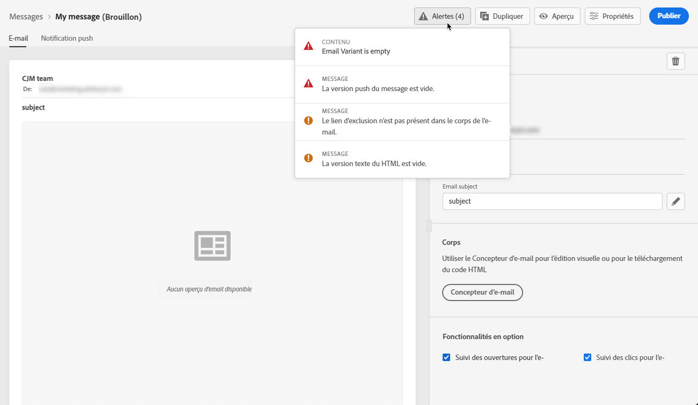

# Alertes sur vos messages {#publish-manage-messages}

## Vérifications avant publication {#message-alerting}

Lorsque vous créez votre message, des alertes vous avertissent lorsque vous devez prendre des mesures importantes avant de le publier.

Les alertes s’affichent en haut à droite de l’écran, comme illustré ci-dessous :

>[!NOTE]
>
>Si ce bouton ne s’affiche pas, aucune alerte n’a été détectée.

Deux types d’alertes peuvent survenir :

* **Les** avertissements se rapportent aux recommandations et aux meilleures pratiques. Par exemple, un message s’affiche si le lien d’exclusion est manquant.

* **Vous** empêchez de publier le message tant qu’il n’est pas résolu. Par exemple, un message vous avertit que l’objet est manquant.

Tous les avertissements et erreurs possibles sont détaillés [ci-dessous](#alerts-and-warnings).

>[!CAUTION]
>
> Vous devez résoudre toutes les alertes **error** avant la publication.

## Liste des avertissements et des erreurs {#alerts-and-warnings}

Les paramètres et éléments contrôlés par le système sont répertoriés ci-dessous. Vous trouverez également des informations sur la façon d&#39;adapter votre configuration pour résoudre les problèmes correspondants.

**Avertissements**:

* **[!UICONTROL opt-out lien absent du corps]** du courrier électronique : il est recommandé d’ajouter un lien de désinscription dans votre corps de courriel. Découvrez comment le configurer dans [cette section](consent.md).

* **[!UICONTROL La version de texte de html est vide]** : n&#39;oubliez pas de définir une version textuelle de votre corps de courriel, car elle sera utilisée lorsque le contenu HTML ne peut pas être affiché. Découvrez comment créer la version de texte dans [cette section](create-email-content.md#generate-text-version).

* **[!UICONTROL Le lien vide est présent dans le corps]** du courrier électronique : vérifiez que tous les liens de votre courrier électronique sont corrects. Découvrez comment gérer le contenu et les liens dans [cette section](create-email-content.md).

* **[!UICONTROL La taille du courrier électronique a dépassé la limite de 100 Ko]** : pour une diffusion optimale, veillez à ce que la taille de votre courrier électronique ne dépasse pas 100 Ko. Découvrez comment modifier le contenu du courrier électronique dans [cette section](create-email-content.md).

**Erreurs**:

* **[!UICONTROL Objet non présent]** : l’objet du courrier électronique est obligatoire. Découvrez comment le définir et le personnaliser dans [cette section](configure-email.md).

   <!--HTML is empty when Amp HTML is present-->

* **[!UICONTROL La variable Push est vide]** : cette erreur s’affiche lorsque le titre ou l’organisme de notification Push est manquant. Découvrez comment définir le contenu des notifications Push dans [cette section](configure-push.md).

* **[!UICONTROL La variable de courriel est vide]** : cette erreur s’affiche lorsque le contenu du courrier électronique n’a pas été configuré. Découvrez comment concevoir du contenu de courriel dans [cette section](design-emails.md).

* **[!UICONTROL Le paramètre prédéfini n’existe]** pas : vous ne pouvez pas publier votre message si le paramètre prédéfini sélectionné est supprimé après la création du message. Si cette erreur se produit, sélectionnez un autre paramètre prédéfini dans le message **[!UICONTROL Propriétés]**. Pour en savoir plus sur l&#39;identité graphique, consultez [cette section](administration.md#cjm-branding).

* **[!UICONTROL La charge utile Push iOS/Android a dépassé la limite de 4 Ko]** : la taille de notification Push ne peut pas dépasser 4 Ko. Pour respecter cette limite, essayez de réduire l&#39;utilisation des images ou des émoticônes. Découvrez comment gérer votre contenu de notification Push dans [cette section](configure-push.md).

>[!CAUTION]
>
> Pour pouvoir publier votre message, vous devez résoudre toutes les **alertes d&#39;erreur**.

<!--Other issues can stop publication such as:
* The push notification title is empty-->
