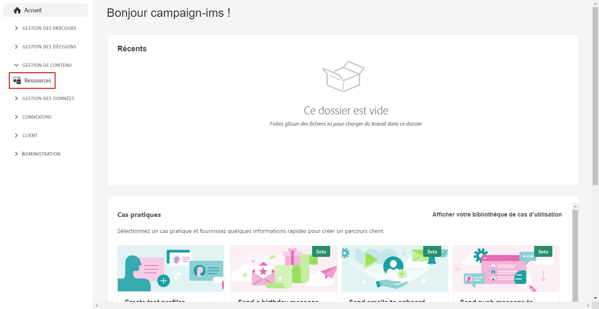
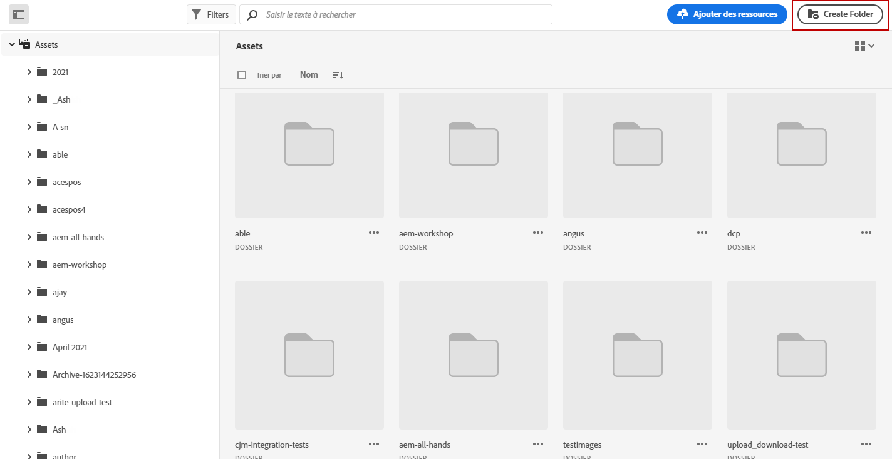
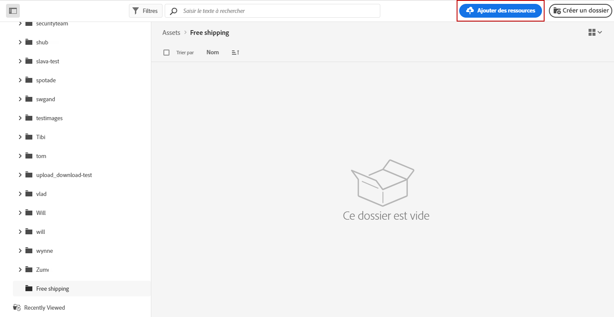
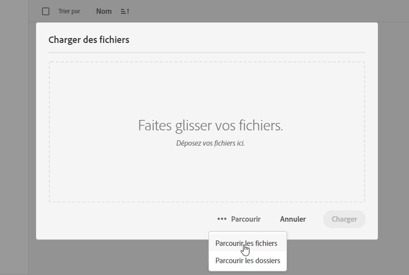
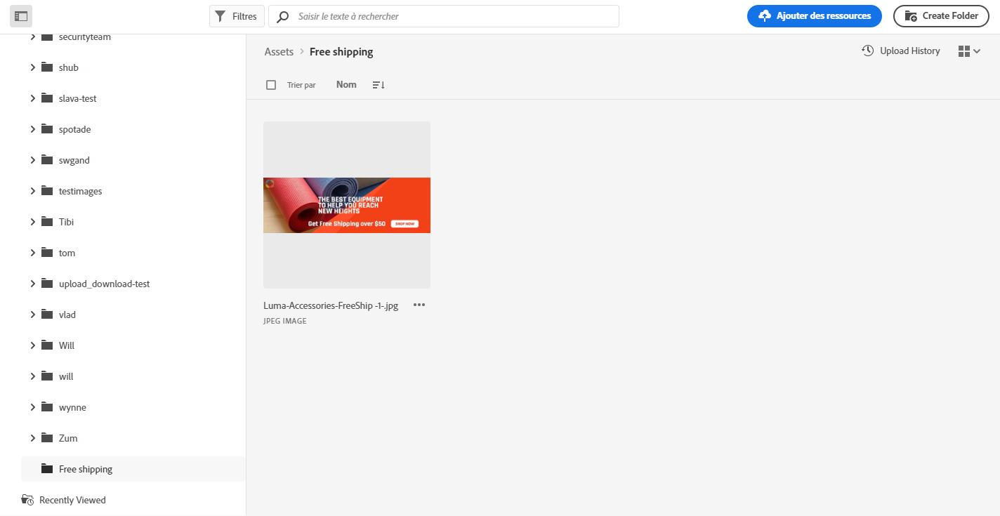
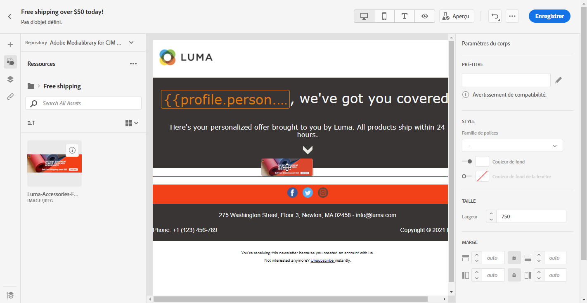

# Utiliser [!DNL Adobe Experience Manager Assets Essentials] {#experience-manager-assets}

## Commencer avec [!DNL Assets Essentials] {#get-started-assets-essentials}

[!DNL Adobe Experience Manager Assets Essentials] fournit un référentiel unique et centralisé de ressources que vous pouvez utiliser pour renseigner vos messages. Vous pouvez y accéder directement à partir de [!DNL Adobe Journey Optimizer] via la section **[!UICONTROL Assets]**. Vous pouvez également accéder aux fichiers et aux dossiers lors de la conception d’un contenu de courrier électronique. [En savoir plus sur la conception](design-emails.md) des courriels.

Vous avez besoin d&#39;autorisations spécifiques pour accéder à [!DNL Adobe Experience Manager Assets Essentials]. [En savoir plus sur les autorisations pour le Adobe Experience Manager Assets Essentials](permissions.md#assets-permissions).

## Télécharger des ressources{#add-asset}

Pour télécharger des fichiers dans [!DNL Assets Essentials], vous devez d&#39;abord parcourir ou créer le dossier dans lequel ils seront stockés :

1. Dans la page d&#39;accueil [!DNL Adobe Journey Optimizer], sélectionnez l&#39;onglet **[!UICONTROL Actifs]** pour accéder à [!DNL Assets Essentials].

   

1. Cliquez avec le doublon sur un dossier de la section centrale ou de la vue de l&#39;arborescence pour l&#39;ouvrir.

   Vous pouvez également cliquer sur **[!UICONTROL Créer un dossier]** pour créer un dossier.

   

1. Une fois dans le dossier sélectionné ou créé, cliquez sur **[!UICONTROL Ajouter les ressources]** pour télécharger une nouvelle ressource dans votre dossier.

   

1. Dans **[!UICONTROL Télécharger les fichiers]**, cliquez sur **[!UICONTROL Parcourir]** et choisissez si vous souhaitez **[!UICONTROL Parcourir les fichiers]** ou **[!UICONTROL Parcourir les dossiers]**.

   

1. Sélectionnez le fichier à télécharger. Lorsque vous avez terminé, cliquez sur **[!UICONTROL Télécharger]**.

1. Une fois votre fichier téléchargé, vous pouvez le gérer à l’aide de différentes options détaillées dans cette [section](#manage-asset). Votre fichier peut également être modifié avec le mode **Modifier** de [!DNL Assets Essentials]. Pour plus d&#39;informations à ce sujet, consultez cette [page](#edit-assets).

   

## Gérer les ressources{#manage-asset}

Vous pouvez gérer les ressources disponibles dans [!DNL Adobe Experience Manager Assets Essentials]. Cliquez sur votre fichier pour accéder à d’autres options.

Les actions suivantes sont disponibles dans la barre d’outils :

* **[!UICONTROL Informations]** détaillées pour accéder à d’autres détails sur vos fichiers.
* **[!UICONTROL Téléchargez]** vers le début directement en local.
* **[!UICONTROL Supprimez]** la ressource pour la supprimer de  [!DNL Assets Essentials].
* **** Copie pour copier/coller la ressource dans un autre dossier.
* **** Moveto déplace votre fichier vers d’autres dossiers.

## Insérer des actifs dans les messages {#use-assets}

Vous pouvez insérer des fichiers dans l’un de vos messages par l’intermédiaire du concepteur de messages électroniques. [En savoir plus sur la conception](design-emails.md) des courriels.

Pour insérer une ressource à partir de [!DNL Adobe Experience Manager Assets Essentials] :

1. Dans le concepteur de courrier électronique, sélectionnez **[!UICONTROL Sélecteur de ressources]** dans le volet de gauche.

   

1. Sélectionnez le dossier de fichiers. Vous pouvez également rechercher votre fichier ou votre dossier dans la barre de recherche.

1. Faites glisser et déposez votre fichier dans un composant de structure ****.

   

Vous pouvez personnaliser davantage vos ressources, par exemple en ajoutant un lien externe ou un texte avec les paramètres **[!UICONTROL Composants]**. [En savoir plus sur les paramètres des composants](content-components.md)

<!--

## Edit and modify assets {#edit-assets}

Your assets can be edited through the **[!UICONTROL Edit mode]** in [!DNL Assets Essentials]. Through this mode, you can crop, resize and rotate your asset. Click the **[!UICONTROL Edit]** button to access the editing mode of your asset.

Following actions are available in the toolbar:

* **[!UICONTROL Start crop]** to focus on only the content you want in your asset.
* **[!UICONTROL Rotate left]** to rotate your asset counter-clockwise by 90 degrees.
* **[!UICONTROL Rotate right]** to rotate your asset clockwise by 90 degrees.
* **[!UICONTROL Flip vertically]** to vertically mirror your asset.
* **[!UICONTROL Flip horizontally]** to horizontally mirror your asset.
* **[!UICONTROL Launch map]** to insert an image map. For more on this, refer to the [Add image maps](https://experienceleague.adobe.com/docs/experience-manager-65/assets/using/image-maps.html?lang=en#using) documentation.

## Share assets {#share-assets}

When using the Media library, each asset is saved in folders or sub-folders. You can choose to share your folders and which level of access to assign.

For more information on how to share access to your folders, refer to this [page](permissions.md#assets-permissions).

-->
