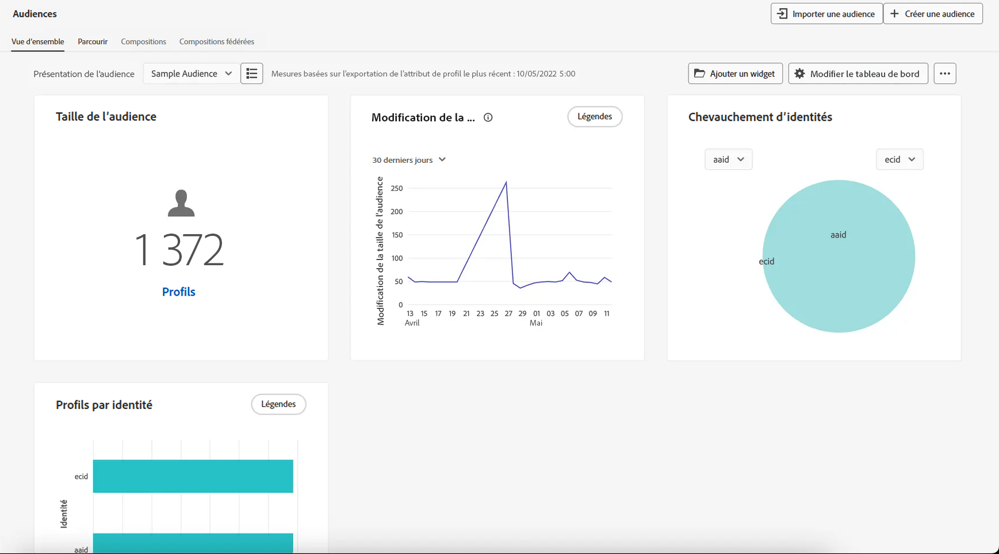

# Commencer avec les audiences {#about-segments}

>[!CONTEXTUALHELP]
>id="ajo_campaigns_content_experiment_segment"
>title="Audience"
>abstract="En utilisant les données du profil client en temps réel, Adobe Experience Platform vous permet de créer facilement des définition de segment pour créer des audiences ciblées qui capturent les comportements et préférences uniques de vos clientes et clients."

>[!CONTEXTUALHELP]
>id="ajo_campaigns_audience"
>title="Sélectionner l’audience de la campagne"
>abstract="Cette liste affiche toutes les audiences Adobe Experience Platform disponibles. Sélectionnez l’audience à cibler avec votre campagne. Le message configuré dans l’opération sera envoyé à toutes les personnes appartenant à l’audience sélectionnée. [En savoir plus sur les audiences](../audience/about-audiences.md)."

Les audiences sont des groupes de personnes qui partagent des comportements et/ou des caractéristiques similaires. Les audiences sont configurées et conservées de manière centralisée dans Adobe Experience Platform à l’aide du service de segmentation d’Adobe Experience Platform et sont facilement accessibles dans Journey Optimizer pour être activées dans vos parcours et campagnes.

Adobe Journey Optimizer propose des outils fiables pour créer, gérer et enrichir les audiences afin d’améliorer les efforts marketing. Associé à Adobe Real-Time Customer Data Platform, Journey Optimizer vous permet de superposer des audiences pour une segmentation plus complexe et de partager les audiences de manière bidirectionnelle avec d’autres solutions Adobe Experience Cloud.

Lorsque les données en temps réel sont diffusées ou chargées par lots, les jeux de données sont mis à jour et Journey Optimizer déplace dynamiquement et en temps réel les personnes vers les audiences et les parcours ou en dehors de ceux-ci.

>[!BEGINSHADEBOX]

Cette documentation fournit des informations sur l’utilisation des audiences dans [!DNL Adobe Journey Optimizer]. Des informations détaillées sur le portail Audience et les audiences sont disponibles dans la documentation du service de segmentation Adobe Experience Platform. Pour plus d’informations, reportez-vous à ces sections :

* [Guide de l’interface d’utilisation du Service de segmentation](https://experienceleague.adobe.com/fr/docs/experience-platform/segmentation/ui/overview){target="_blank"}

* [Service de segmentation - Questions fréquentes](https://experienceleague.adobe.com/fr/docs/experience-platform/segmentation/faq){target="_blank"}

>[!ENDSHADEBOX]

## Parcourir les audiences {#browse}

Les audiences sont disponibles à partir du menu **[!UICONTROL Client ou cliente]** > **[!UICONTROL Audiences]**.

Un tableau de bord montre visuellement les points communs entre les audiences importantes et facilite l’exploration des tendances essentielles des audiences. Par exemple, des modifications de la taille de l’audience sur une période donnée ou des pics soudains d’audiences peuvent mettre en évidence des événements ou des actions qui ont provoqué un rétrécissement ou une croissance de l’audience, comme une offre réussie. 

À partir du portail Audience, vous pouvez facilement gérer, rechercher et explorer des audiences avec un étiquetage normalisé, des contrôles de gouvernance, des dossiers pouvant faire l’objet de recherches et des balises.

Pour plus d’informations sur l’utilisation des audiences dans le portail Audience, consultez la [documentation du Service de segmentation d’Adobe Experience Platform](https://experienceleague.adobe.com/docs/experience-platform/segmentation/home.html?lang=fr){target="_blank"}.

## Types d’audiences {#types}

Les audiences peuvent être générées à l’aide de différentes méthodes :

* **Définitions de segment** : créez une définition d’audience à l’aide du Service de segmentation d’Adobe Experience Platform. Les audiences sont générées à partir des définitions de segment et actualisées à différents moments en fonction de leur type d’évaluation :

   * Segmentation du streaming : les audiences sont mises à jour en temps réel au fur et à mesure que de nouvelles données affluent, assurant ainsi une pertinence continue basée sur l’activité des utilisateurs et utilisatrices.
   * Segmentation par lots : les audiences sont actualisées toutes les 24 heures, capturant un instantané des profils à un intervalle fixe.
   * Segmentation Edge : les audiences sont évaluées instantanément à la périphérie, ce qui permet une personnalisation en temps réel.

  [Découvrir comment créer des définitions de segment](creating-a-segment-definition.md)

* **Chargement personnalisé** : importez une audience à l’aide d’un fichier CSV. [Découvrir comment créer des audiences de chargement personnalisé](custom-upload.md)

* **Composition d’audiences** : créez un workflow de composition pour combiner les audiences existantes en une zone de travail visuelle et appliquer des actions telles que le classement, le partage et la jonction pour créer des audiences. [Découvrir comment utiliser la composition d’audiences](get-started-audience-orchestration.md)

* **Composition d’audiences fédérées** : fédérez directement les jeux de données de votre entrepôt de données existant pour créer et enrichir les audiences et les attributs Adobe Experience Platform dans un seul système. [Découvrir comment utiliser la composition d’audiences fédérées](federated-audience-composition.md).

## Cibler les audiences dans les parcours et les campagnes {#target-audiences}

Une fois vos audiences prêtes, vous pouvez les sélectionner lors de la création de parcours ou de campagnes, ce qui vous permet d’atteindre les bonnes personnes au bon moment avec les messages pertinents. [En savoir plus sur l’activation des audiences dans Journey Optimizer](target-audiences.md).

## Vidéo pratique {#video}

Découvrez les audiences et profils clientèle unifiés dans Journey Optimizer.

>[!VIDEO](https://video.tv.adobe.com/v/3432671?quality=12)
