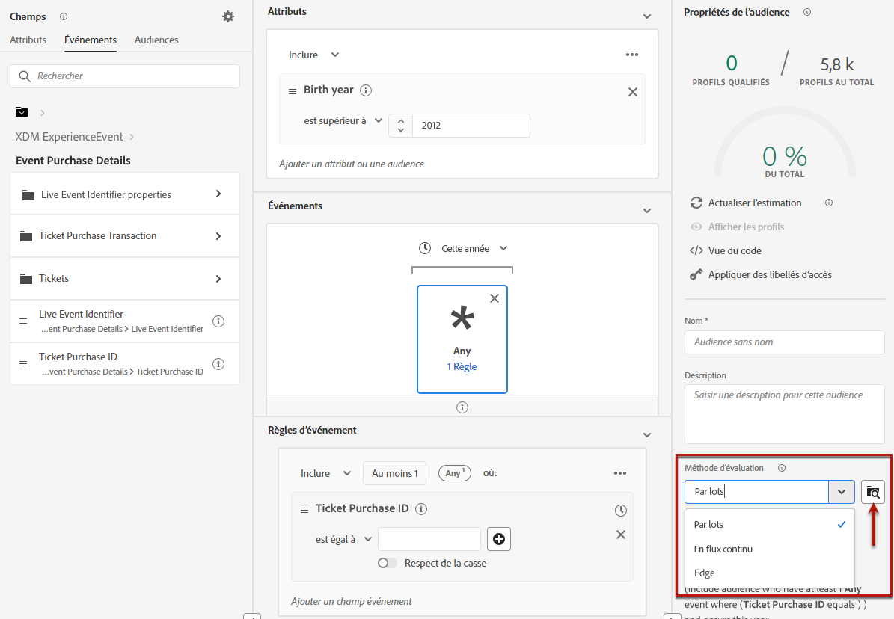
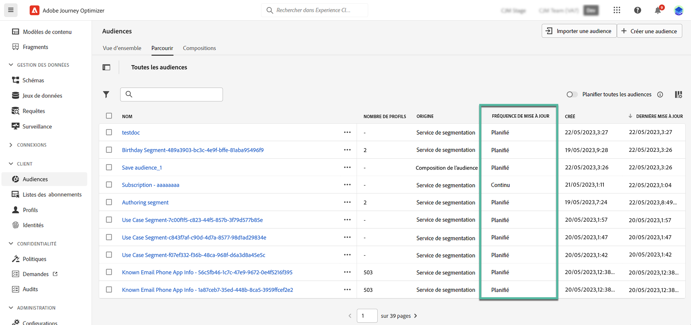

# Commencer avec les audiences Adobe Experience Platform {#about-segments}

>[!CONTEXTUALHELP]
>id="ajo_campaigns_content_experiment_segment"
>title="Audience"
>abstract="En utilisant les données du profil client en temps réel, Adobe Experience Platform vous permet de créer facilement des définition de segment pour créer des audiences ciblées qui capturent les comportements et préférences uniques de vos clientes et clients."

>[!CONTEXTUALHELP]
>id="ajo_campaigns_audience"
>title="Sélectionner l’audience de la campagne"
>abstract="Cette liste affiche toutes les audiences Adobe Experience Platform disponibles. Sélectionnez l’audience à cibler avec votre campagne. Le message configuré dans l’opération sera envoyé à toutes les personnes appartenant à l’audience sélectionnée. [En savoir plus sur les audiences](../audience/about-audiences.md)."

Une audience est un ensemble de personnes qui partagent des comportements et/ou des caractéristiques similaires. Pour en savoir plus sur les audiences, consultez la [documentation du service de segmentation d’Adobe Experience Platform](https://experienceleague.adobe.com/docs/experience-platform/segmentation/home.html?lang=fr){target="_blank"}.

[!DNL Journey Optimizer] vous permet de créer des audiences Adobe Experience Platform directement à partir du menu **[!UICONTROL Audiences]** et de les utiliser dans vos parcours ou campagnes.

Les audiences peuvent être générées à l’aide de différentes méthodes :

* **Définitions de segment** : créez une définition d’audience à l’aide du Service de segmentation d’Adobe Experience Platform. [Découvrir comment créer des définitions de segment](creating-a-segment-definition.md)

* **Chargement personnalisé** : importez une audience à l’aide d’un fichier CSV. Découvrez comment importer des audiences dans la [documentation du service de segmentation](https://experienceleague.adobe.com/fr/docs/experience-platform/segmentation/ui/audience-portal#import-audience){target="_blank"} d’Adobe Experience Platform.

* **Composition d’audiences** : créez un workflow de composition afin de combiner les audiences d’Adobe Experience Platform existantes dans une zone de travail visuelle et d’exploiter diverses activités (telles que le partage, l’exclusion, etc.) pour créer de nouvelles audiences. [Prise en main de la composition d’audiences](get-started-audience-orchestration.md)

* **Composition d’audiences fédérées** : fédérez directement les jeux de données de votre entrepôt de données existant pour créer et enrichir les audiences et les attributs Adobe Experience Platform dans un seul système. Veuillez lire le guide sur la [Composition d’audiences fédérées](https://experienceleague.adobe.com/fr/docs/federated-audience-composition/using/home).

Pour plus d’informations sur l’utilisation d’audiences avec chargement personnalisé et d’audiences avec composition d’audiences fédérées dans [!DNL Journey Optimizer], consultez [cette section](custom-upload-fac.md).

## Cibler des audiences dans [!DNL Journey Optimizer] {#segments-in-journey-optimizer}

Vous pouvez sélectionner dans des campagnes et des parcours n’importe quelle audience générée à l’aide de définitions de segment, de chargement personnalisé, de workflows de composition ou de composition d’audiences fédérées.

>[!AVAILABILITY]
>
>L’utilisation des audiences et des attributs de la composition d’audiences est actuellement indisponible avec Healthcare Shield ou Privacy and Security Shield. [Découvrez comment utiliser les attributs d’enrichissement d’audiences dans Journey Optimizer](../audience/about-audiences.md#enrichment)

Vous pouvez utiliser les audiences dans **[!DNL Journey Optimizer]** de différentes manières :

* Choisissez une audience d’une **campagne**, où le message est envoyé à toutes les personnes appartenant à l’audience sélectionnée. [Découvrez comment définir l’audience d’une campagne](../campaigns/create-campaign.md#define-the-audience-audience).

* Utilisez une activité d’orchestration **Lecture d’audience** dans un parcours pour faire en sorte que toutes les personnes de l’audience rejoignent le parcours et reçoivent les messages inclus dans votre parcours. Supposons que vous ayez une audience « cliente ou cliente Silver ». Avec cette activité, vous pouvez faire en sorte que tous les clientes et clients Silver rejoignent un parcours et leur envoyer une série de messages personnalisés. [Découvrez comment configurer une activité Lecture d’audience](../building-journeys/read-audience.md#configuring-segment-trigger-activity).

* Utilisez l’activité **Condition** dans un parcours afin de créer des conditions basées sur l’appartenance à une audience. [Découvrez comment utiliser des audiences dans des conditions](../building-journeys/condition-activity.md#using-a-segment).

* Utilisez l’activité d’événement **Qualification de l’audience** dans un parcours pour faire en sorte que des personnes rejoignent le parcours ou y progressent en fonction des entrées et des sorties d’audiences Adobe Experience Platform. Par exemple, vous pouvez faire en sorte que tous les nouveaux clientes et clients Silver rejoignent un parcours et leur envoyer des messages. Pour plus d’informations sur l’utilisation de cette activité, reportez-vous à la section [Découvrez comment configurer une activité de qualification d’audience](../building-journeys/audience-qualification-events.md).

  >[!NOTE]
  >
  >En raison de la nature par lots des audiences créées à l’aide de workflows de composition, du chargement personnalisé et de la composition d’audiences fédérées, vous ne pouvez pas cibler ces audiences dans une activité « Qualification de l’audience ». Seules les audiences créées à l’aide de définitions de segment peuvent être utilisées dans cette activité.

## Utiliser les attributs d’enrichissement d’audiences {#enrichment}

Lors du ciblage d’une audience générée à l’aide de workflows de composition, d’une audience personnalisée (fichier CSV) ou d’une composition d’audiences fédérées, vous pouvez utiliser les attributs d’enrichissement de ces audiences pour créer votre parcours et personnaliser vos messages.

>[!NOTE]
>
>Les audiences créées par le chargement personnalisé d’un fichier CSV avant le 1er octobre 2024 ne peuvent pas être personnalisées. Pour utiliser les attributs de ces audiences et tirer pleinement parti de cette fonctionnalité, créez et chargez à nouveau toute audience CSV externe importée avant cette date.
>
>Les politiques de consentement ne prennent pas en charge les attributs d’enrichissement. Par conséquent, toutes les règles de politique de consentement doivent être basées uniquement sur les attributs trouvés dans le profil.

Voici les actions que vous pouvez effectuer à l’aide des attributs d’enrichissement des audiences :

* **Créez plusieurs chemins dans un parcours** en fonction de règles qui utilisent les attributs d’enrichissement de l’audience ciblée. Pour ce faire, ciblez l’audience à l’aide d’une activité [Lecture d’audience](../building-journeys/read-audience.md), puis créez des règles dans une activité [Condition](../building-journeys/condition-activity.md) basée sur les attributs d’enrichissement de l’audience.

  {width="70%" zoomable="yes"}

* **Personnalisez vos messages** dans les parcours ou les campagnes en ajoutant les attributs d’enrichissement de l’audience ciblée dans l’éditeur de personnalisation. [Découvrir comment utiliser l’éditeur de personnalisation](../personalization/personalization-build-expressions.md)

  {width="70%" zoomable="yes"}

>[!IMPORTANT]
>
>Pour utiliser les attributs d’enrichissement des audiences créées à l’aide de workflows de composition, assurez-vous qu’ils sont ajoutés à un groupe de champs dans la source de données « ExperiencePlatform ».
>
+++ Découvrez comment ajouter des attributs d’enrichissement à un groupe de champs.>
>
1. Accédez à « Administration » > « Configuration » > « Sources de données ».
1. Sélectionnez « Experience Platform » et créez ou modifiez un groupe de champs.
1. Dans le sélecteur de schéma, sélectionnez le schéma approprié. Le nom du schéma sera au format suivant : « Schéma pour audienceId: » + identifiant de l’audience. L’identifiant de l’audience se trouve dans l’écran des détails de l’audience de l’inventaire de l’audience.
1. Ouvrez le sélecteur de champ, recherchez les attributs d’enrichissement que vous souhaitez ajouter, puis cochez la case en regard de ces attributs.
1. Enregistrez vos modifications.
1. Une fois les attributs d’enrichissement ajoutés à un groupe de champs, vous pouvez les utiliser dans Journey Optimizer aux emplacements répertoriés ci-dessus.
>
Des informations détaillées sur les sources de données sont disponibles dans les sections suivantes :
>
* [Utiliser la source de données Adobe Experience Platform](../datasource/adobe-experience-platform-data-source.md)
* [Configurer une source de données](../datasource/configure-data-sources.md)
>
+++

## Méthodes d’évaluation d’audience {#evaluation-method-in-journey-optimizer}

Dans Adobe Journey Optimizer, les audiences sont générées à partir des définitions de segment à l’aide de l’une des trois méthodes d’évaluation ci-dessous :

+++ Segmentation par streaming

La liste des profils de l’audience est actualisée en temps réel pendant que de nouvelles données affluent dans le système.

La segmentation par flux est un processus continu de sélection des données qui met à jour vos audiences en réponse à l’activité des utilisateurs et utilisatrices. Une fois qu’une définition de segment a été créée et que l’audience obtenue a été enregistrée, la définition du segment s’applique aux données entrantes dans Journey Optimizer. Cela signifie que des personnes sont ajoutées ou supprimées de l’audience au fur et à mesure que leurs données de profil changent, permettant de toujours assurer la pertinence de votre audience cible. [En savoir plus](https://experienceleague.adobe.com/docs/experience-platform/segmentation/ui/streaming-segmentation.html?lang=fr){target="_blank"}.

>[!NOTE]
>
Veillez à utiliser les événements appropriés comme critères de segmentation par streaming. [En savoir plus](#streaming-segmentation-events-guardrails)

+++

+++ Segmentation par lots

L’évaluation de la liste des profils de l’audience se fait toutes les 24 heures.

La segmentation par lots est une alternative à la segmentation par flux qui traite toutes les données de profil à la fois par le biais de définitions de segment. Cela crée un instantané de l’audience qui peut être enregistré et exporté pour utilisation. Cependant, contrairement à la segmentation par streaming, la segmentation par lots ne met pas à jour la liste des audiences en temps réel, et les nouvelles données qui entrent après le traitement par lots ne seront pas répercutées dans l’audience avant le traitement par lots suivant. [En savoir plus](https://experienceleague.adobe.com/docs/experience-platform/segmentation/home.html?lang=fr#batch){target="_blank"}.

+++

+++ Segmentation Edge

La segmentation Edge permet d’évaluer les segments dans Adobe Experience Platform de manière instantanée [sur Edge](https://experienceleague.adobe.com/docs/experience-platform/edge/home.html?lang=fr){target="_blank"}, ce qui permet d’obtenir des cas d’utilisation de personnalisation de même page et de page suivante. Actuellement, seuls certains types de requête peuvent être évalués avec la segmentation Edge. [En savoir plus](https://experienceleague.adobe.com/docs/experience-platform/segmentation/ui/edge-segmentation.html?lang=fr#query-types){target="_blank"}

+++

Si vous savez quelle méthode d’évaluation utiliser, sélectionnez-la à l’aide de la liste déroulante. Vous pouvez également cliquer sur l’icône Parcourir du dossier (loupe) pour afficher la liste des méthodes d’évaluation de la définition de segment disponibles. [En savoir plus](https://experienceleague.adobe.com/docs/experience-platform/segmentation/ui/segment-builder.html?lang=fr#segment-properties){target="_blank"}.

<!--The determination between batch segmentation and streaming segmentation is made by the system for each audience, based on the complexity and the cost of evaluating the segment definition rule. You can view the evaluation method for each audience in the **[!UICONTROL Evaluation method]** column of the audience list.
    

>[!NOTE]
>
>If the **[!UICONTROL Evaluation method]** column does not display, you  need to add it using configuration button on the top right of the list.-->

Une fois que vous avez défini une audience pour la première fois, les profils sont ajoutés à l’audience lorsqu’ils remplissent les critères.

Le renvoi de l’audience à partir de données antérieures peut prendre jusqu’à 24 heures. Une fois l’audience renvoyée, elle est constamment tenue à jour et toujours prête pour le ciblage.

### [!BADGE Disponibilité limitée]{type=Informative} Évaluation des audiences flexibles {#flexible}

>[!AVAILABILITY]
>
L’évaluation flexible des audiences n’est disponible que pour un ensemble d’organisations (disponibilité limitée). Pour en bénéficier, contactez votre représentant ou représentante Adobe.

Adobe Experience Platform Audience Portal vous permet d’exécuter une tâche de segmentation à la demande pour des audiences sélectionnées, en vous assurant de toujours disposer des données d’audience les plus récentes avant de les cibler dans les parcours et campagnes Journey Optimizer.

Grâce à l’évaluation d’audience flexible, vous pouvez :

1. Créez un nouveau segment en fonction de vos dernières données.
1. Évaluez l’audience en temps réel pour garantir sa précision. Pour ce faire, choisissez les audiences que vous souhaitez évaluer et sélectionnez « Évaluer les audiences », à condition qu’elles répondent à des critères spécifiques (par exemple, basé sur les personnes, origine du service de segmentation).
1. Utiliser l’audience évaluée dans Adobe Journey Optimizer
des campagnes ou des parcours pour un ciblage précis.

Vous pouvez évaluer jusqu’à 20 audiences à la fois. Les audiences inéligibles seront automatiquement exclues. Pour plus d’informations, consultez la [documentation d’Audience Portal](https://experienceleague.adobe.com/en/docs/experience-platform/segmentation/ui/audience-portal#flexible-audience-evaluation).

### Utilisation des événements avec la segmentation par streaming {#streaming-segmentation-events-guardrails}

La segmentation par streaming est utile pour la personnalisation en temps réel avec des cas d’utilisation à forte valeur ajoutée. Cependant, il est important de choisir les bons [événements](https://experienceleague.adobe.com/docs/experience-platform/segmentation/ui/segment-builder.html?lang=fr#events){target="_vide"}

Par conséquent, pour obtenir des performances optimales en matière de segmentation par streaming, évitez d’utiliser les événements suivants :

* Événement Type d’interaction **Message ouvert**

  Lors de la création d’une audience, l’utilisation d’événements d’interaction **Message ouvert** est peu fiable, car ces derniers ne sont pas des indicateurs réels de l’activité des personnes et peuvent avoir un impact négatif sur les performances de segmentation. Découvrez pourquoi dans cet [article de blog](https://blog.adobe.com/en/publish/2021/06/24/what-apples-mail-privacy-protection-means-for-email-marketers){target="_blank"}. Par conséquent, Adobe recommande de ne pas utiliser les événements d’interaction **Message ouvert** avec la segmentation par streaming. Utilisez plutôt les signaux d’activité des utilisateurs et utilisatrices, tels que les clics, les achats ou les données de balise.

* Événement Statut des commentaires **Message envoyé**

  L’événement de commentaire **Message envoyé** est souvent utilisé pour la vérification de la fréquence ou de la suppression avant l’envoi d’un e-mail. Adobe recommande de l’éviter du fait de la pression engendrée sur les performances et la dégradation du système qui peut s’en suivre. Par conséquent, pour la logique de fréquence ou de suppression, utilisez des règles métier plutôt que les événements de commentaire **Message envoyé**. Notez que des limites de fréquence quotidiennes pour les profils individuels seront bientôt disponibles, en complément de la cadence mensuelle existante des règles métier.

>[!NOTE]
>
Vous pouvez utiliser les événements **Message ouvert** et **Message envoyé** dans la segmentation par lots sans souci de performances.

## Questions fréquentes sur la composition d’audience et le chargement personnalisé {#faq}

La section suivante répertorie les questions fréquemment posées sur l’utilisation dans Journey Optimizer d’audiences créées avec des workflows de composition et le chargement personnalisé (fichiers CSV).

+++ Où puis-je utiliser des audiences provenant de la composition d’audience et du chargement personnalisé dans Journey Optimizer ?

Les audiences issues de la composition d’audience et du chargement personnalisé peuvent être ciblées à partir de campagnes et de parcours. [Découvrir comment cibler des audiences dans  [!DNL Journey Optimizer]](#segments-in-journey-optimizer)

* Dans **Campagnes**, ces audiences s’affichent dans le sélecteur d’audience après avoir cliqué sur le bouton « Sélectionner une audience ».

* Dans **Parcours**, vous pouvez utiliser ces audiences dans une activité « Lecture d’audience » lors de la sélection de l’audience et dans une activité « Condition » pour les vérifications d’appartenance à l’audience. Cependant, en raison de leur nature par lots, ces audiences n’apparaissent pas dans l’activité « Qualification de l’audience ».

  >[!NOTE]
  >
  Pour les audiences de chargement personnalisé, si l’option « Lecture incrémentielle » est activée dans un parcours récurrent, les profils ne sont récupérés que lors de la première périodicité, car ces audiences sont fixes.

Ces audiences peuvent également être utilisées dans l’éditeur de personnalisation pour personnaliser vos messages dans les parcours et les campagnes. [Découvrir comment utiliser l’éditeur de personnalisation](../personalization/personalization-build-expressions.md)

+++

+++ Que sont les attributs d’enrichissement ?

Les attributs d’enrichissement sont des attributs supplémentaires qui sont contextuels et spécifiques à une audience. Ils ne sont pas associés au profil et sont généralement utilisés à des fins de personnalisation.

Les attributs d’enrichissement sont liés à une audience via une activité [Enrichir](composition-canvas.md#enrich) dans la composition de l’audience ou par le biais du processus de chargement personnalisé.

+++

+++ Où puis-je utiliser les attributs d’enrichissement dans Journey Optimizer ?

Les attributs d’enrichissement provenant de la composition de l’audience peuvent être utilisés dans les zones suivantes. [Découvrir comment utiliser les attributs d’enrichissement des audiences](#enrichment)

* Activité de condition (parcours)
* Attributs d’action personnalisée (parcours)
* Personnalisation des messages (parcours et campagnes)

+++

+++ Comment activer les attributs d’enrichissement dans des parcours ?

Pour utiliser les attributs d’enrichissement d’audiences créés à l’aide de workflows de composition, assurez-vous qu’ils sont ajoutés à un groupe de champs dans la source de données « ExperiencePlatform ». Vous trouverez des informations sur l’ajout d’attributs d’enrichissement à un groupe de champs dans [cette section](#enrichment).

+++

+++ Quel est le délai pour utiliser dans Journey Optimizer une audience provenant de la composition d’audiences après sa publication ?

Les audiences issues de la **composition d’audiences** sont exécutées tous les jours ; il se peut donc que vous deviez attendre jusqu’à 24 heures pour les utiliser dans Journey Optimizer.

+++

+++ Les valeurs d’attribut d’enrichissement sont-elles mises à jour après le démarrage d’un parcours ?

Actuellement, non. Même après des nœuds d’attente ou d’événement, les valeurs d’attributs d’enrichissement restent identiques à ce qu’elles étaient au début du parcours.

+++

+++ Comment associer des audiences de chargement personnalisé à des profils ?

Pendant le processus de chargement personnalisé, spécifiez l’attribut CSV à utiliser comme identité et l’identité de profil à laquelle il correspond. Cela établit un lien entre les données de l’audience et le profil. Si le fichier CSV contient une valeur d’identité introuvable dans le profil, un nouveau profil est créé avec cette valeur d’identité.

Des informations détaillées sur le processus de chargement personnalisé sont disponibles dans Adobe Experience Platform, dans la [Documentation de Segmentation Service](https://experienceleague.adobe.com/docs/experience-platform/segmentation/ui/overview.html?lang=fr#import-audience){target="_blank"}.

+++

+++ Dans quelle mesure mes données sont-elles récentes dans Journey Optimizer ?

Les données d’audiences provenant de la composition d’audience et du chargement personnalisé sont renseignées par Audience Export Service (AES). AES lit les attributs de profil et l’appartenance à l’audience, qu’il met à la disposition de ces audiences dans les délais suivants :

* **Composition de l’audience** : export quotidien (~24 heures)
* **Chargement personnalisé** : traitement d’export dédié (~2 heures)

Tout parcours qui utilise une audience provenant de la composition d’audience ou du chargement personnalisé dans l’activité « Lecture d’audience » disposera d’attributs de profil aussi récents que la dernière évaluation par lots. Cela inclut le consentement/les suppressions dans le parcours.

En outre, les attributs enrichis dans les audiences issues de la composition d’audience sont aussi récents que la dernière exécution de la composition, qui peut aller jusqu’à 24 heures dans le passé.

+++

## Vidéo pratique {#video}

Découvrez les audiences et profils clientèle unifiés dans Journey Optimizer.

>[!VIDEO](https://video.tv.adobe.com/v/3432671?quality=12)
