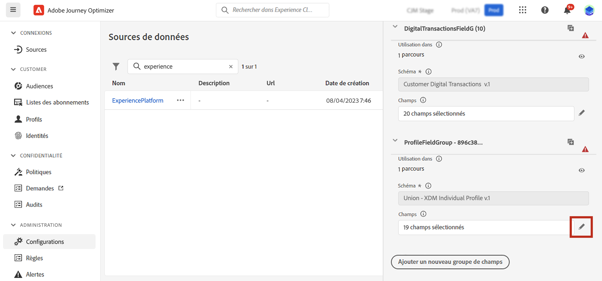
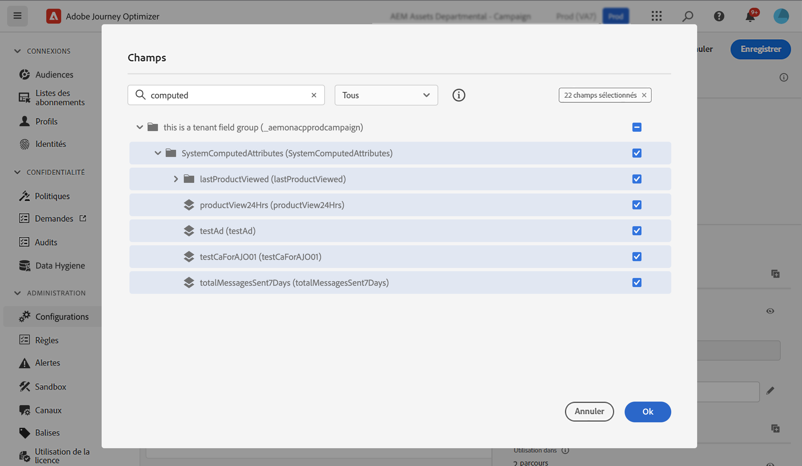
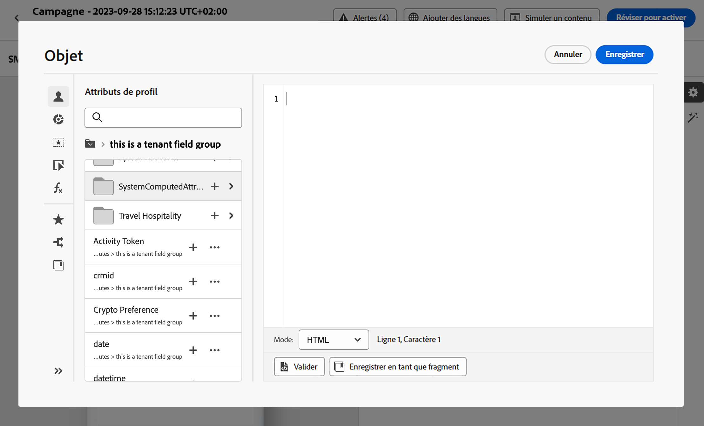

# Utiliser des attributs calculés {#computed-attributes}

Les attributs calculés résument les événements comportementaux individuels en attributs de profil calculés disponibles sur Adobe Experience Platform. Ces attributs sont basés sur des jeux de données d’événements d’expérience activés pour Profile ingérés dans Adobe Experience Platform et servent de points de données agrégés stockés dans les profils clients.

Chaque attribut calculé est un attribut de profil que vous pouvez exploiter pour la segmentation, la personnalisation et l’activation dans les parcours et les campagnes. Cette simplification permet à vos clientes et clients d’offrir des expériences personnalisées pertinentes et opportunes.

>[!NOTE]
>
>Pour accéder aux attributs calculés, vérifiez que vous disposez des autorisations appropriées (**Afficher les attributs calculés** et **Gérer les attributs calculés**).

## Créer des attributs calculés {#manage}

Pour créer des attributs calculés, accédez à l’onglet **[!UICONTROL Attributs calculés]** dans le menu **[!UICONTROL Profils]** situé sur le côté gauche.

Dans cet écran, vous pouvez créer des attributs calculés en créant des règles qui combinent des attributs d’événement, des fonctions d’agrégat, ainsi qu’une période de recherche en amont spécifiée. Par exemple, vous pouvez calculer la somme des achats effectués au cours des trois derniers mois, identifier l’article le plus récent consulté par un profil qui n’a effectué aucun achat au cours de la dernière semaine ou calculer le total des points de récompense cumulés par chaque profil.

Une fois votre règle prête, publiez l’attribut calculé pour le rendre disponible dans d’autres services en aval, y compris dans Journey Optimizer.

Vous trouverez des informations détaillées sur la création et la gestion des attributs calculés dans la documentation [Attributs calculés](https://experienceleague.adobe.com/docs/experience-platform/profile/computed-attributes/overview.html?lang=fr)

## Ajouter des attributs calculés à la source de données Adobe Experience Platform {#source}

Pour exploiter les attributs calculés dans Journey Optimizer, ajoutez-les à la source de données Journey Optimizer **Experience Platform**.

La source de données Adobe Experience Platform définit la connexion au profil client en temps réel d’Adobe. Cette source de données récupère les données de profil et les données d’événements d’expérience du service de profil client en temps réel.

Pour ajouter des attributs calculés à la source de données, procédez comme suit :

1. Accédez au menu de gauche **[!UICONTROL Configurations]**, puis cliquez sur la vignette **[!UICONTROL Sources de données]**.

1. Sélectionnez la source de données **[!UICONTROL Experience Platform]**.

   

1. Ajoutez le groupe de champs **[!UICONTROL Attributs calculés sytème]** contenant tous les attributs calculés créés.

   

Les attributs calculés peuvent désormais être utilisés dans Journey Optimizer. [Découvrez comment utiliser les attributs calculés dans Journey Optimizer.](#use)

Vous trouverez des informations détaillées sur l’ajout de groupes de champs à la source de données Adobe Experience Platform dans [cette section](../datasource/adobe-experience-platform-data-source.md).

## Utiliser les attributs calculés dans Journey Optimizer {#use}

>[!NOTE]
>
>Avant de commencer, assurez-vous d’avoir ajouté vos attributs calculés à la source de données Adobe Experience Platform. [Découvrez comment dans cette section](#source).

Les attributs calculés offrent des fonctionnalités polyvalentes dans Journey Optimizer. Utilisez-les à diverses fins, par exemple pour personnaliser le contenu des messages, créer de nouvelles audiences ou fractionner les parcours en fonction d’un attribut calculé spécifique. Par exemple, fractionnez le chemin d’accès d’un parcours en fonction du nombre total d’achats d’un profil au cours des trois dernières semaines en ajoutant un seul attribut calculé dans une activité Condition . Vous pouvez également personnaliser un e-mail en affichant l’article le plus récemment consulté pour chaque profil.

Puisque les attributs calculés sont des champs d’attribut de profil créés sur votre schéma d’union des profils, accédez-y à partir de l’éditeur de personnalisation dans le groupe de champs **SystemComputedAttributes**. À partir de là, ajoutez des attributs calculés à vos expressions, en les traitant comme n’importe quel autre attribut de profil afin d’effectuer les opérations souhaitées.

