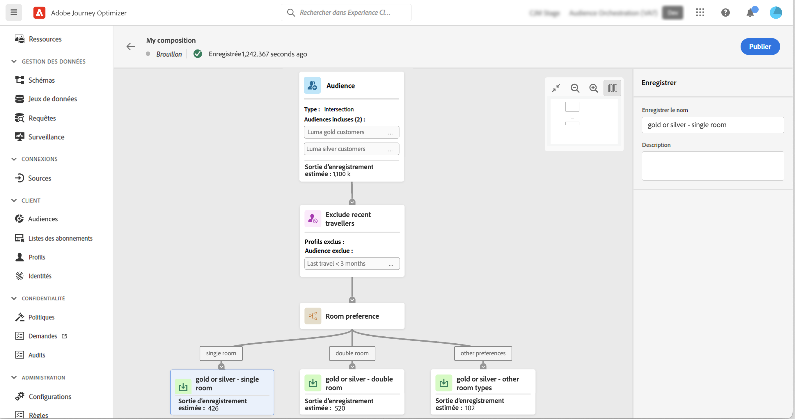

# Créer votre premier workflow de composition {#create-compositions}

>[!BEGINSHADEBOX]

Cette documentation fournit des informations détaillées sur l’utilisation de la composition de l’audience dans Adobe Journey Optimizer. Si vous n’utilisez pas Adobe Journey Optimizer, [cliquez ici](https://experienceleague.adobe.com/docs/experience-platform/segmentation/ui/audience-composition.html?lang=fr){target="_blank"}.

>[!ENDSHADEBOX]

## Créer un workflow de composition {#create}

Pour créer un workflow de composition, procédez comme suit :

1. Accédez au menu **[!UICONTROL Audiences]** et sélectionnez **[!UICONTROL Créer une audience]**.

1. Sélectionnez **[!UICONTROL Composer l’audience]**.

   

   >[!NOTE]
   >
   >La méthode de création **[!UICONTROL Créer une règle]** vous permet de créer une définition de nouveau segment à l’aide de la méthode [Segmentation Service](https://experienceleague.adobe.com/docs/experience-platform/segmentation/ui/overview.html?lang=fr).

1. Le canevas de composition s’affiche avec deux activités par défaut :

   * **[!UICONTROL Audience]** : le point de départ de votre composition. Cette activité permet de sélectionner une ou plusieurs audiences comme base de votre workflow,

   * **[!UICONTROL Enregistrer]** : la dernière étape de votre composition. Cette activité permet d&#39;enregistrer le résultat de votre workflow dans une nouvelle audience.

   Pour plus d’informations sur la configuration des activités dans la zone de travail du workflow de composition, reportez-vous à la section [Utiliser la zone de travail de composition](composition-canvas.md).

1. Ouvrez les propriétés de composition pour spécifier un titre et une description.

   Si aucun titre n’est défini dans les propriétés, le libellé de la composition comporte le terme « Composition », suivi de sa date et de son heure de création.

   

1. Configurez votre composition en ajoutant autant d’activités que nécessaire entre les **[!UICONTROL Audience]** et **[!UICONTROL Enregistrer]** activités. [Découvrez comment utiliser la zone de travail de composition](composition-canvas.md)

   

1. Une fois votre composition prête, cliquez sur le bouton **[!UICONTROL Publier]** pour publier la composition et enregistrez les audiences obtenues dans Adobe Experience Platform.

   >[!IMPORTANT]
   >
   >Vous pouvez publier jusqu’à 10 compositions dans une sandbox donnée. Si vous avez atteint ce seuil, vous devez supprimer une composition pour libérer de l’espace et en publier une nouvelle.

   Si une erreur se produit lors de la publication, des alertes s’affichent avec des informations sur la façon de résoudre le problème.

   

1. La composition est publiée. Les audiences qui en résultent sont enregistrées dans Adobe Experience Platform et sont prêtes à être ciblées dans Journey Optimizer. [Découvrir comment cibler des audiences dans Journey Optimizer](../audience/about-audiences.md#segments-in-journey-optimizer)

## Accéder aux compositions {#access}

>[!CONTEXTUALHELP]
>id="ajo_ao_publish"
>title="Publier votre audience"
>abstract="Publiez votre composition pour enregistrer les audiences obtenues dans Adobe Experience Platform."

Toutes les compositions créées sont accessibles à partir de l’onglet **[!UICONTROL Compositions]** . Vous pouvez dupliquer ou supprimer une composition existante à tout moment à l’aide du bouton représentant des points de suspension dans la liste.

Les compositions peuvent avoir plusieurs statuts :

* **[!UICONTROL Brouillon]** : la composition est en cours et n’a pas été publiée.
* **[!UICONTROL Publié]** : la composition a été publiée, les audiences qui en résultent ont été enregistrées et peuvent être utilisées.

>[!NOTE]
>
>La composition de l’audience n’est actuellement pas intégrée à la fonctionnalité de réinitialisation des sandbox. Avant de réinitialiser un sandbox, vous devez supprimer vos compositions manuellement pour vous assurer que les données d’audience associées sont correctement nettoyées. Des informations détaillées sont disponibles dans la [documentation sur les sandbox](https://experienceleague.adobe.com/docs/experience-platform/sandbox/ui/user-guide.html?lang=fr#delete-audience-compositions) d’Adobe Experience Platform.
