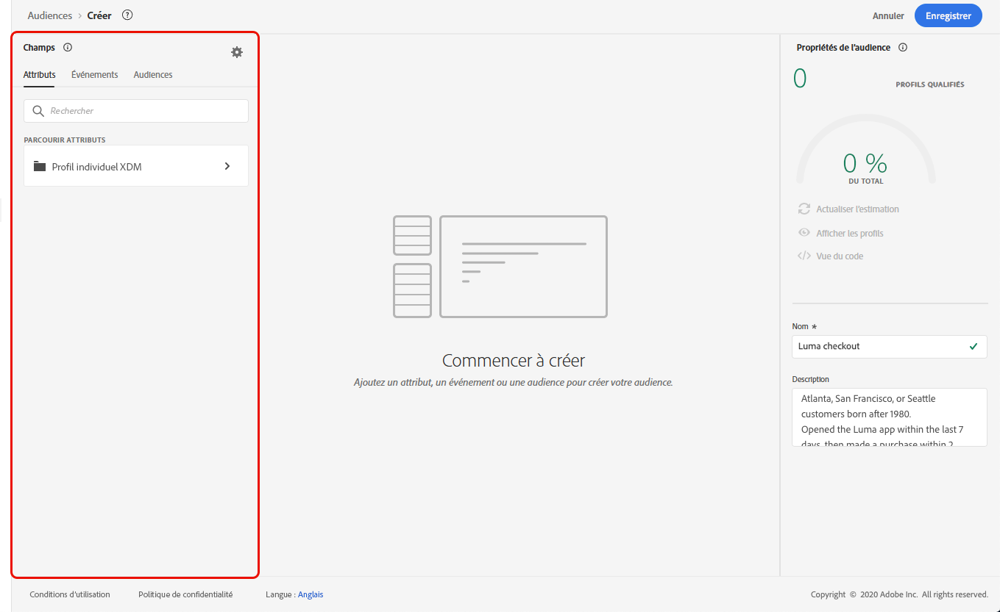
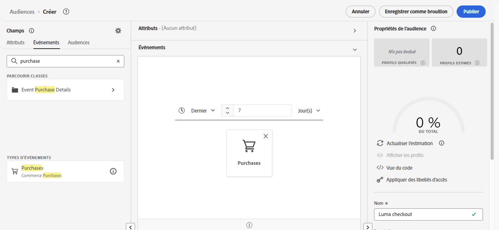
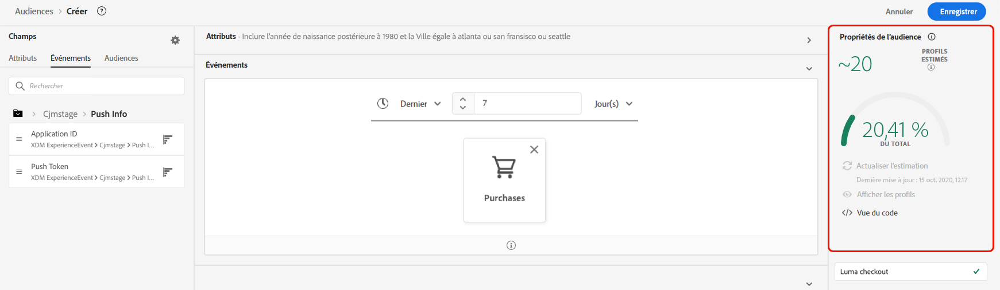

# Création de définitions de segment {#build-segments}

>[!CONTEXTUALHELP]
>id="ajo_ao_create_rule"
>title="Créer une règle"
>abstract="La méthode de création de règle Créer vous permet de créer une définition d’audience à l’aide du service d’audience Adobe Experience Platform."

Dans cet exemple, nous allons créer une audience afin de cibler tous les clients habitant à Atlanta, San Francisco ou Seattle, nés après 1980. Tous ces clients doivent avoir ouvert l&#39;application Luma dans les 7 derniers jours, puis fait un achat dans les 2 heures suivant l&#39;ouverture de l&#39;application.

➡️ [Découvrez comment créer des audiences dans cette vidéo](#video-segment)

1. Accédez au **[!UICONTROL Audiences]** , puis cliquez sur **[!UICONTROL Créer une audience]** bouton .

   

   L’écran de définition de segment vous permet de configurer tous les champs requis pour définir votre audience. Découvrez comment configurer des audiences dans le [Documentation de Segmentation Service](https://experienceleague.adobe.com/docs/experience-platform/segmentation/ui/overview.html?lang=fr){target="_blank"}.

   

1. Dans le **[!UICONTROL Propriétés d’audience]** , indiquez un nom et une description (facultatif) pour l’audience.

   

1. Réalisez un glisser-déposer dans les champs de votre choix depuis le volet de gauche vers l’espace de travail central, puis configurez-les en fonction de vos besoins.

   >[!NOTE]
   >
   >Notez que les champs disponibles dans le volet de gauche varient selon la configuration des schémas **profil individuel XDM** et **XDM ExperienceEvent** pour votre organisation.  En savoir plus dans la section [Documentation du modèle de données d’expérience (XDM)](https://experienceleague.adobe.com/docs/experience-platform/xdm/home.html?lang=fr){target="_blank"}.

   

   Dans cet exemple, nous devons nous fier à **Attributs** et **Événements** champs pour créer l’audience :

   * **Attributs** : profils qui vivent à Atlanta, San Francisco ou Seattle, nés après 1980

     

   * **Événements** : profils qui ont ouvert l&#39;application Luma au cours des 7 derniers jours, puis effectué un achat dans les 2 heures suivant l&#39;ouverture de l&#39;application.

     

1. À mesure que vous ajoutez et configurez de nouveaux champs dans l’espace de travail, la variable **[!UICONTROL Propriétés de l’audience]** Le volet est automatiquement mis à jour avec des informations sur l’estimation des profils appartenant à l’audience.

   

1. Une fois que l’audience est prête, cliquez sur **[!UICONTROL Enregistrer]**. Il s’affiche dans la liste des audiences Adobe Experience Platform. Notez qu’une barre de recherche est disponible pour vous aider à rechercher une audience spécifique dans la liste.

L’audience peut maintenant être utilisée dans vos parcours. Voir à ce propos [cette section](../audience/about-audiences.md).

## Vidéo pratique{#video-segment}

Découvrez comment créer des audiences.

>[!VIDEO](https://video.tv.adobe.com/v/334281?quality=12)
