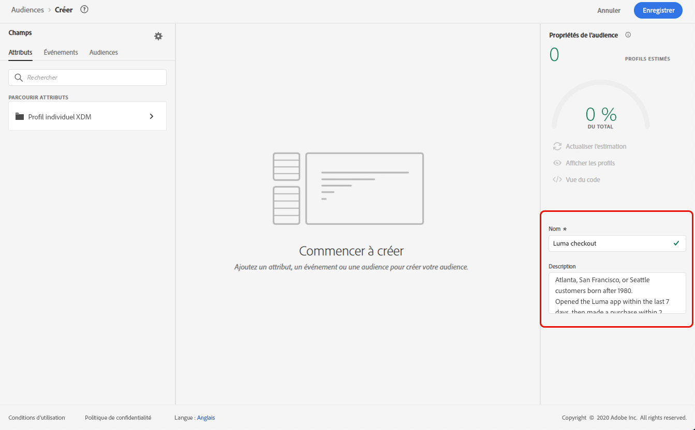
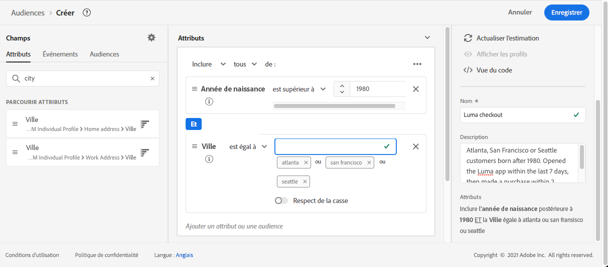

# Créer des définitions de segment {#build-segments}

>[!CONTEXTUALHELP]
>id="ajo_ao_create_rule"
>title="Créer une règle"
>abstract="La méthode de création Créer une règle vous permet de créer une définition d’audience à l’aide du service de segmentation d’Adobe Experience Platform."

## Création d’une définition de segment {#create}

Dans cet exemple, vous allez créer une audience pour cibler tous les clients qui vivent à Atlanta, San Francisco ou Seattle et qui sont nés après 1980. Tous ces clients doivent avoir effectué un achat au cours des 7 derniers jours.

➡️ [Découvrez comment créer des audiences dans cette vidéo](#video-segment)

1. Dans le menu **[!UICONTROL Audiences]**, cliquez sur le bouton **[!UICONTROL Créer une audience]** et sélectionnez **[!UICONTROL Créer une règle]**.

   

   L’écran de définition de segment vous permet de configurer tous les champs requis pour définir votre audience. Découvrez comment configurer des audiences dans la [documentation du service de segmentation](https://experienceleague.adobe.com/fr/docs/experience-platform/segmentation/methods/overview){target="_blank"}.

   

1. Dans le volet **[!UICONTROL Propriétés d’audience]**, indiquez un nom et une description (facultatif) pour l’audience.

   

1. Réalisez un glisser-déposer dans les champs de votre choix depuis le volet de gauche vers l’espace de travail central, puis configurez-les en fonction de vos besoins.

   Les blocs de création de base des définitions de segment sont les **attributs** et les **événements**. En outre, les attributs et les événements contenus dans les audiences existantes peuvent être utilisés comme éléments de nouvelles définitions. [En savoir plus dans la documentation du service de segmentation](https://experienceleague.adobe.com/fr/docs/experience-platform/segmentation/ui/segment-builder#building-blocks){target="_blank"}

   >[!NOTE]
   >
   >Notez que les champs disponibles dans le volet de gauche varient selon la configuration des schémas **profil individuel XDM** et **XDM ExperienceEvent** pour votre organisation.  Pour en savoir plus, consultez la [documentation Modèle de données d’expérience (XDM)](https://experienceleague.adobe.com/docs/experience-platform/xdm/home.html?lang=fr){target="_blank"}.

   

   Dans cet exemple, nous devons nous baser sur les champs **Attributs** et **Événements** pour créer l’audience :

   * **Attributs** : profils vivant à Atlanta, San Francisco ou Seattle, nés après 1980

     

   * **Événements** : profils ayant effectué un achat au cours des 7 derniers jours.

     

1. À mesure que vous ajoutez et configurez de nouveaux champs dans l’espace de travail, le volet **[!UICONTROL Propriétés d’audience]** est automatiquement mis à jour avec des informations sur l’estimation des profils appartenant à l’audience.

   

1. Une fois l’audience prête, cliquez sur **[!UICONTROL Enregistrer]**. Elle s’affiche dans la liste des audiences Adobe Experience Platform. Notez qu’une barre de recherche est disponible pour vous aider à rechercher une audience spécifique dans la liste.

L’audience est maintenant prête à être utilisée dans vos parcours. Voir à ce sujet [cette section](../audience/about-audiences.md).

## Méthodes d’évaluation d’audience {#evaluation-method-in-journey-optimizer}

Dans Adobe Journey Optimizer, les audiences sont générées à partir des définitions de segment à l’aide de l’une des trois méthodes d’évaluation ci-dessous :

+++ Segmentation par streaming

La liste des profils de l’audience est actualisée en temps réel pendant que de nouvelles données affluent dans le système.

La segmentation par flux est un processus continu de sélection des données qui met à jour vos audiences en réponse à l’activité des utilisateurs et utilisatrices. Une fois qu’une définition de segment a été créée et que l’audience obtenue a été enregistrée, la définition du segment s’applique aux données entrantes dans Journey Optimizer. Cela signifie que des personnes sont ajoutées ou supprimées de l’audience au fur et à mesure que leurs données de profil changent, permettant de toujours assurer la pertinence de votre audience cible. [En savoir plus dans Adobe Expe](https://experienceleague.adobe.com/docs/experience-platform/segmentation/ui/streaming-segmentation.html?lang=fr){target="_blank"}.

>[!IMPORTANT]
>
>Depuis le 1er novembre 2024, la segmentation du streaming ne prendra plus en charge l’utilisation des événements d’**envoi** et d’**ouverture** provenant des jeux de données de tracking et de retour de Journey Optimizer.
>
>* Cette modification s’applique à l’ensemble des sandbox et organisations de nos clientes et clients.
>* Seuls les événements d’envoi et d’ouverture sont affectés : les clics et les autres événements de suivi restent disponibles pour la segmentation du streaming.
>* Cette modification s’applique uniquement à la segmentation du streaming. Les événements d’envoi et d’ouverture peuvent toujours être utilisés dans les segments par lots, mais s’ils sont inclus dans un segment en flux continu, ils sont évalués par lots. En outre, les événements d’exclusion et les événements de rebond/retard résultant d’événements d’envoi sont également concernés par cette modification.
>* La collecte des données de tracking n’est pas concernée. Les événements d’envoi et d’ouverture continueront à être collectés comme d’habitude.
>* Les événements de réaction dans les parcours ne sont pas concernés par cette modification.

+++

+++ Segmentation par lots

L’évaluation de la liste des profils de l’audience se fait toutes les 24 heures.

La segmentation par lots traite toutes les données de profil à la fois par le biais de définitions de segment, créant un instantané de l’audience qui peut être enregistré et exporté pour utilisation. Contrairement à la segmentation par flux, la segmentation par lots ne met pas à jour la liste des audiences en temps réel. Les nouvelles données qui entrent après le traitement par lots ne sont pas répercutées dans l’audience jusqu’au traitement par lots suivant. Les tentatives de forcer une mise à jour immédiate ne remplacent pas le cycle quotidien. Pour des mises à jour incrémentielles immédiates, pensez à utiliser les options de streaming ou de segmentation à la demande.

Pour plus d’informations, consultez la documentation du service de segmentation de Adobe Experience Platform [&#128279;](https://experienceleague.adobe.com/docs/experience-platform/segmentation/home.html?lang=fr#batch){target="_blank"}

+++

+++ Segmentation Edge

La segmentation Edge permet d’évaluer les segments dans Adobe Experience Platform instantanément [sur le serveur Edge](https://experienceleague.adobe.com/docs/experience-platform/edge/home.html?lang=fr){target="_blank"}, en activant les cas d’utilisation de la personnalisation sur une même page et sur la page suivante. Actuellement, seuls certains types de requête peuvent être évalués avec la segmentation Edge. Pour plus d’informations, consultez la documentation du service de segmentation de Adobe Experience Platform [&#128279;](https://experienceleague.adobe.com/docs/experience-platform/segmentation/ui/edge-segmentation.html?lang=fr#query-types){target="_blank"}

+++

Si vous connaissez la méthode d’évaluation à utiliser, sélectionnez-la à l’aide de la liste déroulante. Vous pouvez également cliquer sur l’icône Parcourir du dossier (loupe) pour afficher la liste des méthodes d’évaluation de la définition de segment disponibles. Pour plus d’informations, consultez la documentation du service de segmentation de Adobe Experience Platform [&#128279;](https://experienceleague.adobe.com/docs/experience-platform/segmentation/ui/segment-builder.html?lang=fr#segment-properties){target="_blank"}.

<!--The determination between batch segmentation and streaming segmentation is made by the system for each audience, based on the complexity and the cost of evaluating the segment definition rule. You can view the evaluation method for each audience in the **[!UICONTROL Evaluation method]** column of the audience list.
    

>[!NOTE]
>
>If the **[!UICONTROL Evaluation method]** column does not display, you  need to add it using configuration button on the top right of the list.-->

Une fois que vous avez défini une audience, les profils sont ajoutés à l’audience lorsqu’ils remplissent les critères. Le renvoi de l’audience à partir de données antérieures peut prendre jusqu’à 24 heures. Une fois l’audience renvoyée, elle est constamment tenue à jour et toujours prête pour le ciblage.

## Évaluation d’audience flexible {#flexible}

Adobe Experience Platform Audience Portal vous permet d’exécuter une tâche de segmentation à la demande pour des audiences sélectionnées, en vous assurant de toujours disposer des données d’audience les plus récentes avant de les cibler dans les parcours et campagnes Journey Optimizer.

Grâce à l’évaluation flexible des audiences, vous pouvez effectuer les opérations suivantes :

1. Créer un segment en fonction de vos dernières données
1. Évaluer l’audience en temps réel pour garantir sa précision Pour ce faire, choisissez les audiences que vous souhaitez évaluer et sélectionnez « Évaluer les audiences », à condition qu’elles répondent à des critères spécifiques (par exemple, basé sur les personnes, origine du service de segmentation).
1. Utiliser l’audience évaluée dans les campagnes ou parcours Adobe Journey Optimizer pour un ciblage précis

Vous pouvez évaluer jusqu’à 20 audiences à la fois. Les audiences non éligibles sont automatiquement exclues. Pour en savoir plus, consultez la [documentation du service de segmentation d’Adobe Experience Platform](https://experienceleague.adobe.com/fr/docs/experience-platform/segmentation/ui/audience-portal#flexible-audience-evaluation).

## Vidéo pratique{#video-segment}

Découvrez comment Journey Optimizer utilise des règles pour générer des audiences et comment utiliser des attributs, des événements et des audiences existantes pour créer une audience.

>[!VIDEO](https://video.tv.adobe.com/v/3425020?quality=12)
