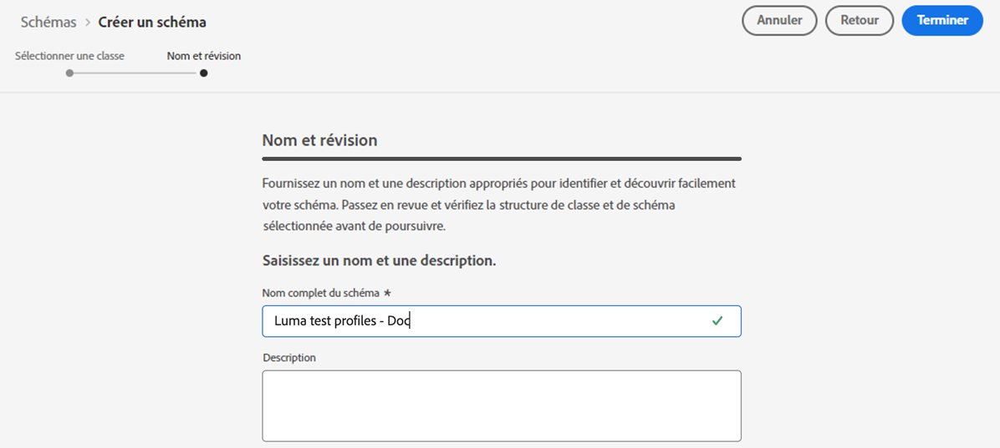
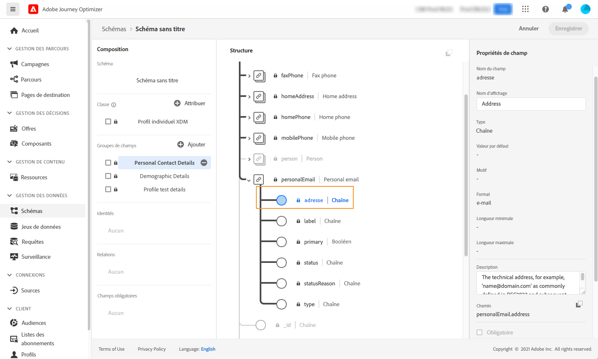
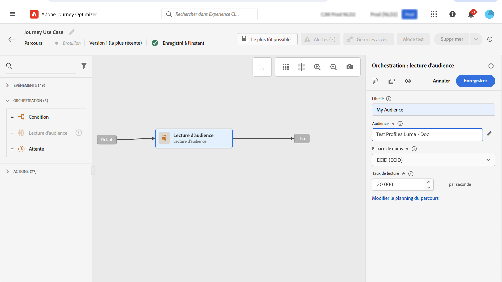
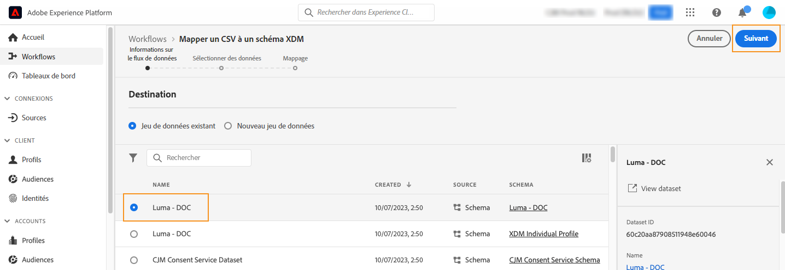

# Créer des profils de test {#create-test-profiles}

Les profils de test sont requis lors de l’utilisation du [mode test](../building-journeys/testing-the-journey.md) dans un parcours ainsi que pour [prévisualiser et tester le contenu](../content-management/preview-test.md).

>[!NOTE]
>
>[!DNL Journey optimizer] permet de tester différentes variantes de votre contenu en les prévisualisant et en envoyant des BAT à l’aide de données d’entrée d’exemple chargées depuis un fichier CSV ou JSON, ou ajoutées manuellement. [Découvrir comment tester votre contenu à l’aide d’exemples de données d’entrée](../test-approve/simulate-sample-input.md)

Il existe plusieurs façons de créer des profils de test. Vous trouverez sur cette page des informations détaillées pour :

* Transformer un [profil existant](#turning-profile-into-test) en profil de test.

* Créer des profils de test en chargeant un fichier [CSV](#create-test-profiles-csv) ou en utilisant des [appels API](#create-test-profiles-api).

  Adobe Journey Optimizer propose également un [cas d’utilisation intégré au produit](#use-case-1) spécifique pour faciliter la création de profils de test.

Vous pouvez charger un fichier JSON dans un jeu de données existant. Pour plus d’informations, consultez la [documentation sur l’ingestion de données](https://experienceleague.adobe.com/docs/experience-platform/ingestion/tutorials/ingest-batch-data.html?lang=fr#add-data-to-dataset){target="_blank"}.

Veuillez noter que la création d&#39;un profil de test est similaire à la création de profils classiques dans Adobe Experience Platform. Pour plus d&#39;informations, consultez la [documentation du profil client en temps réel](https://experienceleague.adobe.com/docs/experience-platform/profile/home.html?lang=fr){target="_blank"}.

➡️ [Découvrez comment créer des profils de test dans cette vidéo.](#video)

## Conditions préalables {#test-profile-prerequisites}

Pour créer des profils, vous devez d’abord créer un schéma et un jeu de données dans Adobe [!DNL Journey Optimizer].

### Créer un schéma

Pour **créer un schéma**, procédez comme suit :

1. Dans la section du menu Gestion des données, cliquez sur **[!UICONTROL Schémas]**.
   
1. Cliquez sur **[!UICONTROL Créer un schéma]**, dans le coin supérieur droit, sélectionnez un type de schéma, par exemple **Profil individuel** et cliquez sur **Suivant**.
   
1. Saisissez le nom de votre schéma, puis cliquez sur **Terminer**.
   
1. Dans la section **Groupes de champs**, à gauche, cliquez sur **Ajouter** et sélectionnez les groupe de champs appropriés. Veillez à ajouter le groupe de champs **Détails du profil de test**.
   
Une fois que vous avez terminé, cliquez sur **[!UICONTROL Ajouter des groupes de champs]** : la liste des groupes de champs s&#39;affiche dans l&#39;écran aperçu du schéma.
   

   >[!NOTE]
   >
   >Cliquez sur le nom du schéma pour mettre à jour ses propriétés.

1. Dans la liste des champs, cliquez sur le champ que vous souhaitez définir comme identité principale.
   
1. Dans le volet de droite **[!UICONTROL Propriétés du champ]**, vérifiez les options **[!UICONTROL Identité]** et **[!UICONTROL Identité principale]**, puis sélectionnez un espace de noms. Si vous souhaitez que l&#39;identité principale soit une adresse e-mail, choisissez l&#39;espace de noms **[!UICONTROL E-mail]**. Cliquez sur **[!UICONTROL Appliquer]**.
   
1. Sélectionnez le schéma et activez l&#39;option **[!UICONTROL Profil]** dans le volet **[!UICONTROL Propriétés du schéma]**.
   
1. Cliquez sur **Enregistrer**.

>[!NOTE]
>
>Pour plus d&#39;informations sur la création de schémas, consultez la [documentation XDM](https://experienceleague.adobe.com/docs/experience-platform/xdm/ui/resources/schemas.html?lang=fr#prerequisites){target="_blank"}.

### Créer un jeu de données

Vous devez ensuite **créer le jeu de données** dans lequel les profils seront importés. Procédez comme suit :

1. Accédez à **[!UICONTROL Jeux de données]**, puis cliquez sur **[!UICONTROL Créer un jeu de données]**.
   
1. Choisissez **[!UICONTROL Créer un jeu de données à partir d&#39;un schéma]**.
   
1. Sélectionnez le schéma créé précédemment, puis cliquez sur **[!UICONTROL Suivant]**.
   
1. Choisissez un nom, puis cliquez sur **[!UICONTROL Terminer]**.
   
1. Activez l&#39;option **[!UICONTROL Profil]**.
   

>[!NOTE]
>
> Pour plus d&#39;informations sur la création de jeux de données, consultez la [documentation du service de catalogue](https://experienceleague.adobe.com/docs/experience-platform/catalog/datasets/user-guide.html?lang=fr#getting-started){target="_blank"}.

## Cas d’utilisation interne au produit{#use-case-1}

Depuis la page d’accueil d&#39;Adobe Journey Optimizer, vous pouvez exploiter le cas d’utilisation interne au produit des profils de test. Ce cas pratique facilite la création de profils de test utilisés pour les parcours de test avant la publication.


Cliquez sur le bouton **[!UICONTROL Commencer]** pour lancer le cas d’utilisation.

Les informations affichées sont requises :

1. **Espace de noms d’identité** : [espace de noms d’identité](../audience/get-started-identity.md) utilisé pour identifier de manière unique les profils de test. Par exemple, si l&#39;e-mail est utilisé pour identifier les profils de test, l’espace de noms d’identité **E-mail** doit être sélectionné. Si l’identifiant unique est le numéro de téléphone, l’espace de noms d’identité **Téléphone** doit être sélectionné.

2. **Fichier CSV** : fichier séparé par des virgules contenant la liste des profils de test à créer. Le cas d’utilisation exige un format prédéfini pour le fichier CSV contenant la liste des profils de test à créer. Chaque ligne du fichier doit inclure les champs suivants dans l’ordre correct :

   1. **ID de personne** : identifiant unique du profil de test. Les valeurs de ce champ doivent refléter l’espace de noms d’identité sélectionné. (Par exemple, si **Téléphone** est sélectionné pour l’espace de noms d’identité, les valeurs de ce champ doivent être des numéros de téléphone. De même, si **E-mail** est sélectionné, les valeurs de ce champ doivent être des e-mails.)
   1. **Adresse e-mail** : adresse e-mail du profil de test. (Le champ **ID de personne** et le champ **Adresse e-mail** peuvent potentiellement contenir les mêmes valeurs si **E-mail** est sélectionné comme espace de noms d’identité.)
   1. **Prénom** : prénom du profil de test.
   1. **Nom** : nom du profil de test.
   1. **Ville** : ville de résidence du profil de test.
   1. **Pays** : pays de résidence du profil de test.
   1. **Genre** : genre du profil de test. Les valeurs disponibles sont **homme**, **femme** et **non_spécifié**

Après avoir sélectionné l’espace de noms d’identité et fourni le fichier CSV au format ci-dessus, cliquez sur le bouton **[!UICONTROL Exécuter]** en haut à droite. Le cas d’utilisation peut prendre quelques minutes. Lorsque le cas d’utilisation a terminé le traitement et la création des profils de test, une notification est envoyée à l’utilisateur.

>[!NOTE]
>
>Les profils de test peuvent remplacer les profils existants. Avant d’exécuter le cas d’utilisation, assurez-vous que le fichier CSV contient uniquement des profils de test et qu’il est exécuté sur le bon sandbox.

<!-- Removed as asked in DOCAC-13605 AJO Test Profiles Using a Journey should be removed
## Turn a profile into a test profile{#turning-profile-into-test}

You can turn an existing profile into a test profile: you can update profiles attributes in the same way as when you create a profile. 

A simple way to do this is by using an **[!UICONTROL Update Profile]** action activity in a journey and change the **testProfile** boolean field from false to true.

Your journey will be composed of a **[!UICONTROL Read Audience]** and an **[!UICONTROL Update Profile]** activity. You first need to create an audience targeting the profiles you want to turn into test profiles. 

>[!NOTE]
>
> Since you will be updating the **testProfile** field, the chosen profiles must include this field. The related schema must have the **Profile test details** field group. See [this section](../audience/creating-test-profiles.md#create-test-profiles).

1. Browse to **Audiences**, then **Create audience**, in the top right.
     
1. Define a name for your audience and build the audience: choose the field(s) and value(s) to target the profiles you want.
     
1. Click **Save** and check that the profiles are correctly targeted by the audience.
     

    >[!NOTE]
    >
    > Audience calculation can take some time. Learn more about audiences in [this section](../audience/about-audiences.md).

1. Now create a new journey and start with a **[!UICONTROL Read Audience]** orchestration activity.
1. Choose the previously created audience and the namespace that your profiles use.
    
1. Add an **[!UICONTROL Update Profile]** action activity. 
1. Select the schema, the **testProfiles** field, the dataset and set the value to **True**. To perform this, in the **[!UICONTROL VALUE]** field, click the **Pen** icon on the right, select **[!UICONTROL Advanced mode]** and enter **true**.
    
1. Click **[!UICONTROL Publish]**.
1. In the **[!UICONTROL Audiences]** section, check that the profiles have been correctly updated.
    

    >[!NOTE]
    >
    > For more information on the **[!UICONTROL Update Profile]** activity, refer to [this section](../building-journeys/update-profiles.md).
-->

## Création d&#39;un profil de test à l&#39;aide d&#39;un fichier CSV{#create-test-profiles-csv}

Dans Adobe Experience Platform, vous pouvez créer des profils en téléchargeant un fichier CSV contenant les différents champs de profil dans votre jeu de données. Cette méthode est la plus simple.

1. Créez un fichier CSV simple à l&#39;aide d&#39;un tableur.
1. Ajoutez une colonne pour chaque champ nécessaire. Assurez-vous d&#39;ajouter le champ de l&#39;identité principale (« personID » dans l&#39;exemple ci-dessus) et le champ « testProfile » défini sur « true ».
   
1. Ajoutez une ligne par profil et remplissez les valeurs de chaque champ.
   
1. Enregistrez la feuille de calcul au format CSV. Assurez-vous que les virgules sont utilisées comme séparateurs.
1. Accédez aux **workflows** d&#39; Adobe Experience Platform.
   
1. Sélectionnez **Mapper un CSV à un schéma XDM**, puis cliquez sur **Lancer**.
   
1. Sélectionnez le jeu de données dans lequel vous souhaitez importer les profils. Cliquez sur **Suivant**.
   
1. Cliquez sur **Choisir les fichiers** et sélectionnez votre fichier CSV. Une fois le fichier téléchargé, cliquez sur **Suivant**.
   
1. Mappez les champs CSV source aux champs du schéma, puis cliquez sur **Terminer**.
   
1. L&#39;import de données démarre. Le statut passe de **Traitement** à **Succès**. Cliquez sur **Aperçu du jeu de données**, dans le coin supérieur droit.
   
1. Vérifiez que les profils de test ont été correctement ajoutés.
   

Vos profils de test sont ajoutés et peuvent désormais être utilisés lors du test d&#39;un parcours. Reportez-vous à [cette section](../building-journeys/testing-the-journey.md).


>[!NOTE]
>
>Pour plus d&#39;informations sur les imports de fichiers CSV, consultez la [documentation sur l&#39;ingestion de données](https://experienceleague.adobe.com/docs/experience-platform/ingestion/tutorials/map-a-csv-file.html?lang=fr#tutorials){target="_blank"}.
>


## Création de profils de test à l&#39;aide d&#39;appels d&#39;API{#create-test-profiles-api}

Vous pouvez également créer des profils de test au moyen d&#39;appels d&#39;API. Pour en savoir plus, consultez la [documentation d’Adobe Experience Platform](https://experienceleague.adobe.com/docs/experience-platform/profile/home.html?lang=fr){target="_blank"}.

Vous devez utiliser un schéma de profil contenant le groupe de champs « Détails du test de profil ». L&#39;indicateur testProfile fait partie de ce groupe de champs.
Lors de la création d&#39;un profil, veillez à transmettre la valeur : testProfile = true.

Veuillez noter que vous pouvez également mettre à jour un profil existant pour remplacer son indicateur testProfile par « true ».

Voici un exemple d&#39;appel API pour créer un profil de test :

```
curl -X POST \
'https://dcs.adobedc.net/collection/xxxxxxxxxxxxxx' \
-H 'Cache-Control: no-cache' \
-H 'Content-Type: application/json' \
-H 'Postman-Token: xxxxx' \
-H 'cache-control: no-cache' \
-H 'x-api-key: xxxxx' \
-H 'x-gw-ims-org-id: xxxxx' \
-d '{
"header": {
"msgType": "xdmEntityCreate",
"msgId": "xxxxx",
"msgVersion": "xxxxx",
"xactionid":"xxxxx",
"datasetId": "xxxxx",
"imsOrgId": "xxxxx",
"source": {
"name": "Postman"
},
"schemaRef": {
"id": "https://example.adobe.com/mobile/schemas/xxxxx",
"contentType": "application/vnd.adobe.xed-full+json;version=1"
}
},
"body": {
"xdmMeta": {
"schemaRef": {
"contentType": "application/vnd.adobe.xed-full+json;version=1"
}
},
"xdmEntity": {
"_id": "xxxxx",
"_mobile":{
"ECID": "xxxxx"
},
"testProfile":true
}
}
}'
```

## Vidéo pratique {#video}

Découvrez comment créer des profils de test.

>[!VIDEO](https://video.tv.adobe.com/v/3416331?captions=fre_fr&quality=12)
