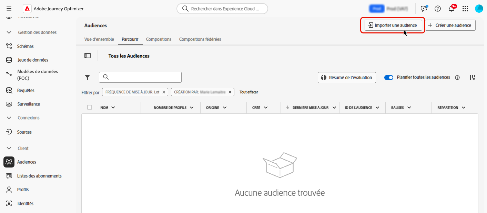

# Chargement personnalisé {#custom-upload}

Le portail Audience d’Adobe Experience Platform permet d’importer une audience à l’aide d’un fichier CSV.

Pendant le processus de chargement personnalisé, spécifiez l’attribut CSV à utiliser comme identité et l’identité de profil à laquelle il correspond. Cela établit un lien entre les données de l’audience et le profil. Si le fichier CSV contient une valeur d’identité introuvable dans le profil, un nouveau profil est créé avec cette valeur d’identité.

>[!NOTE]
>
>Pour les audiences de chargement personnalisé, si l’option « Lecture incrémentielle » est activée dans un parcours récurrent, les profils ne sont récupérés que lors de la première périodicité, car ces audiences sont fixes.

Des informations détaillées sur l’import des audiences sont disponibles dans la [documentation du service de segmentation](https://experienceleague.adobe.com/fr/docs/experience-platform/segmentation/ui/audience-portal#import-audience) d’Adobe Experience Platform{target="_blank"}.

Découvrez comment charger des audiences au format CSV dans cette vidéo :

>[!VIDEO](https://video.tv.adobe.com/v/3421714?quality=12)
