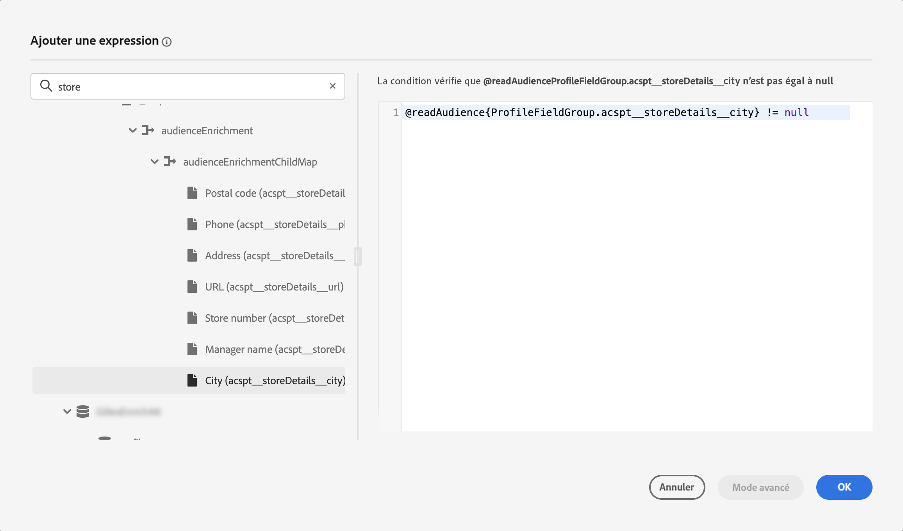
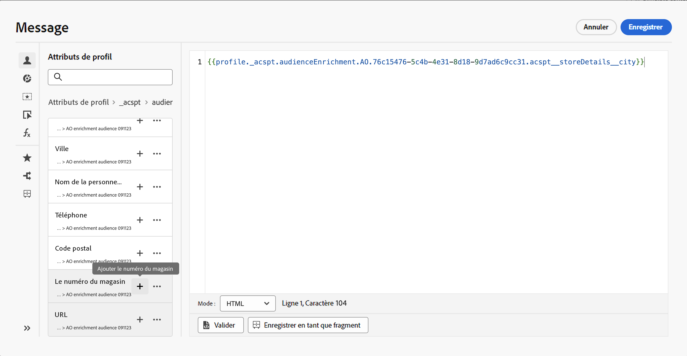

# Utiliser les attributs d’enrichissement d’audiences {#enrichment}

Lors du ciblage d’une audience générée à l’aide de workflows de composition, d’une audience personnalisée (fichier CSV) ou d’une composition d’audiences fédérées, vous pouvez utiliser les attributs d’enrichissement de ces audiences pour créer votre parcours et personnaliser vos messages.

>[!NOTE]
>
>Les audiences créées par le chargement personnalisé d’un fichier CSV avant le 1er octobre 2024 ne peuvent pas être personnalisées. Pour utiliser les attributs de ces audiences et tirer pleinement parti de cette fonctionnalité, créez et chargez à nouveau toute audience CSV externe importée avant cette date.
>
>Les politiques de consentement ne prennent pas en charge les attributs d’enrichissement. Par conséquent, toutes les règles de politique de consentement doivent être basées uniquement sur les attributs trouvés dans le profil.

Voici les actions que vous pouvez effectuer à l’aide des attributs d’enrichissement des audiences :

* **Créez plusieurs chemins dans un parcours** en fonction de règles qui utilisent les attributs d’enrichissement de l’audience ciblée. Pour ce faire, ciblez l’audience à l’aide d’une activité [Lecture d’audience](../building-journeys/read-audience.md), puis créez des règles dans une activité [Condition](../building-journeys/condition-activity.md) basée sur les attributs d’enrichissement de l’audience.

  {width="70%" zoomable="yes"}

* **Personnalisez vos messages** dans les parcours ou les campagnes en ajoutant les attributs d’enrichissement de l’audience ciblée dans l’éditeur de personnalisation. [Découvrir comment utiliser l’éditeur de personnalisation](../personalization/personalization-build-expressions.md)

  {width="70%" zoomable="yes"}

>[!IMPORTANT]
>
>Pour utiliser les attributs d’enrichissement des audiences créées à l’aide de workflows de composition, assurez-vous qu’ils sont ajoutés à un groupe de champs dans la source de données « ExperiencePlatform ».
>
>+++ Découvrez comment ajouter des attributs d’enrichissement à un groupe de champs.
>
>1. Accédez à « Administration » > « Configuration » > « Sources de données ».
>1. Sélectionnez « Experience Platform » et créez ou modifiez un groupe de champs.
>1. Dans le sélecteur de schéma, sélectionnez le schéma approprié. Le nom du schéma sera au format suivant : « Schéma pour audienceId: » + identifiant de l’audience. L’identifiant de l’audience se trouve dans l’écran des détails de l’audience de l’inventaire de l’audience.
>1. Ouvrez le sélecteur de champ, recherchez les attributs d’enrichissement que vous souhaitez ajouter, puis cochez la case en regard de ces attributs.
>1. Enregistrez vos modifications.
>1. Une fois les attributs d’enrichissement ajoutés à un groupe de champs, vous pouvez les utiliser dans Journey Optimizer aux emplacements répertoriés ci-dessus.
>
>Des informations détaillées sur les sources de données sont disponibles dans les sections suivantes :
>
>* [Utiliser la source de données Adobe Experience Platform](../datasource/adobe-experience-platform-data-source.md)
>* [Configurer une source de données](../datasource/configure-data-sources.md)
>
>+++

## Questions fréquentes {#faq-enrichment}

Vous trouverez ci-dessous les questions fréquentes sur les attributs d’enrichissement.

Vous avez besoin de plus d’informations ? Utilisez les options de commentaires au bas de cette page pour poser votre question ou contacter la [communauté Adobe Journey Optimizer](https://experienceleaguecommunities.adobe.com/t5/adobe-journey-optimizer/ct-p/journey-optimizer?profile.language=fr){target="_blank"}.

+++ Que sont les attributs d’enrichissement ?

Les attributs d’enrichissement sont des attributs supplémentaires qui sont contextuels et spécifiques à une audience. Ils ne sont pas associés au profil et sont généralement utilisés à des fins de personnalisation.

Les attributs d’enrichissement sont liés à une audience via une activité d’enrichissement dans la composition d’audiences ou par le biais du processus de chargement personnalisé.

+++

+++ Où puis-je utiliser les attributs d’enrichissement dans Journey Optimizer ?

Les attributs d’enrichissement provenant de la composition d’audiences peuvent être utilisés dans les zones suivantes. [Découvrir comment utiliser les attributs d’enrichissement des audiences](#enrichment)

* Activité de condition (parcours)
* Attributs d’action personnalisée (parcours)
* Personnalisation des messages (parcours et campagnes)

+++

+++ Comment activer les attributs d’enrichissement dans des parcours ?

Pour utiliser les attributs d’enrichissement d’audiences créés à l’aide de workflows de composition, assurez-vous qu’ils sont ajoutés à un groupe de champs dans la source de données « ExperiencePlatform ». Vous trouverez des informations sur l’ajout d’attributs d’enrichissement à un groupe de champs dans [cette section](#enrichment).

+++

+++ Les valeurs d’attribut d’enrichissement sont-elles mises à jour après le démarrage d’un parcours ?

Actuellement, non. Même après des nœuds d’attente ou d’événement, les valeurs d’attributs d’enrichissement restent identiques à ce qu’elles étaient au début du parcours.

+++
