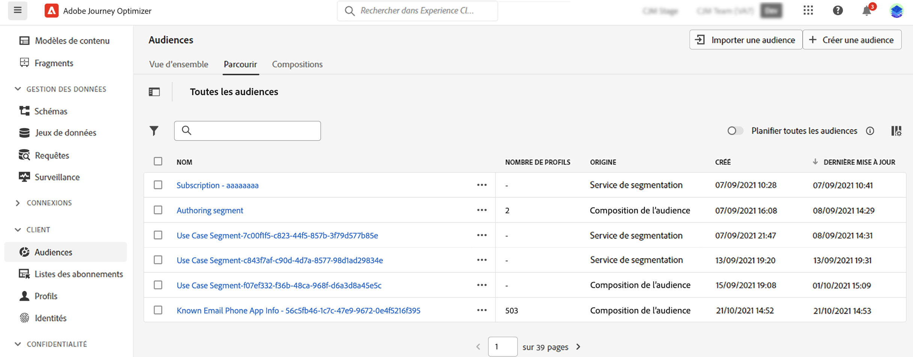
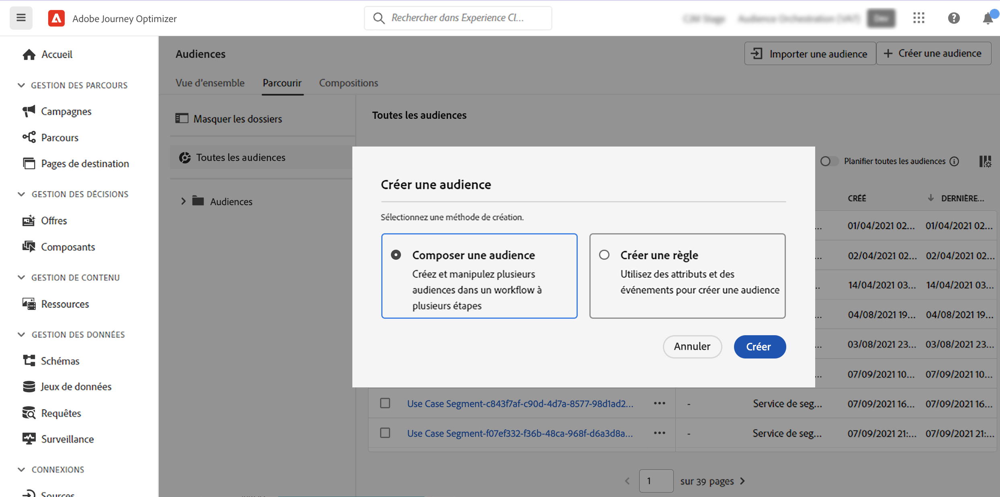
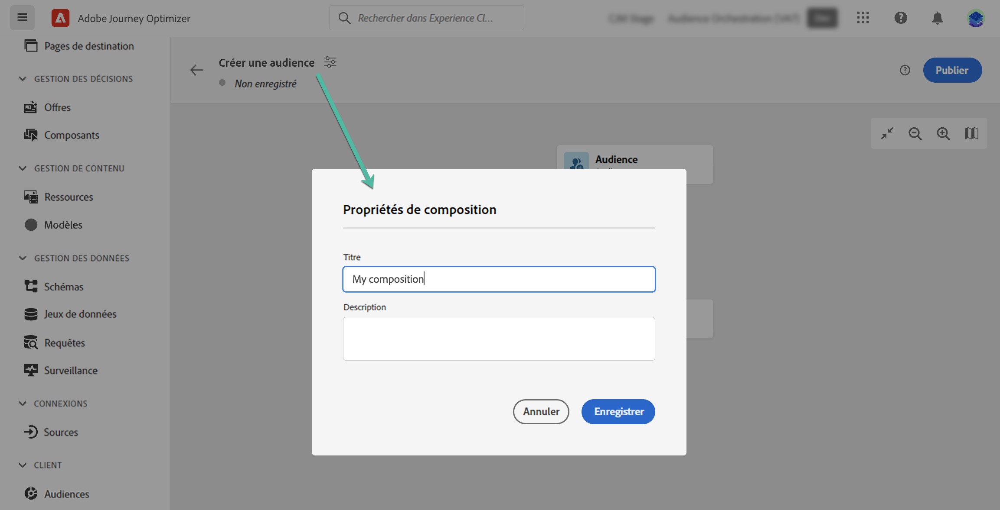
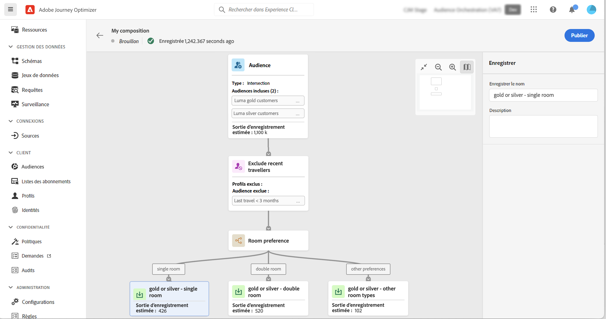
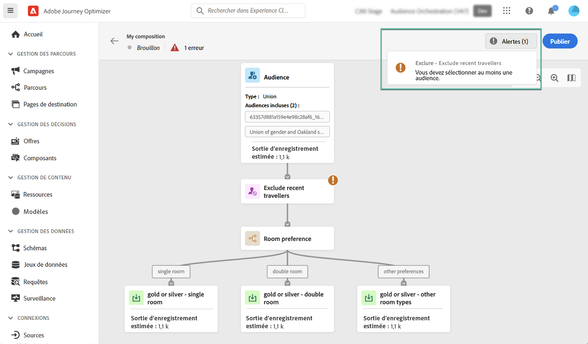
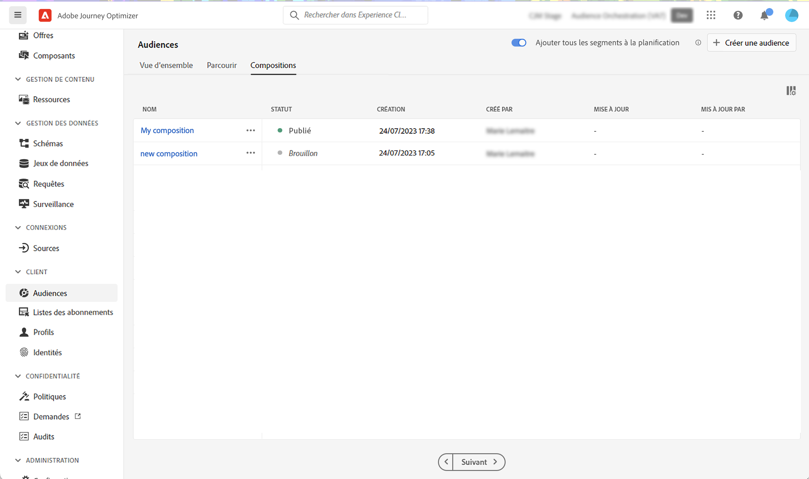

# Commencer avec la composition d’audiences {#get-start-audience-composition}

>[!CONTEXTUALHELP]
>id="ajo_ao_create_composition"
>title="Créer une composition"
>abstract="Créez un workflow de composition afin de combiner les audiences d’Adobe Experience Platform existantes dans une zone de travail visuelle et d’exploiter diverses activités (telles que le partage, l’exclusion…) pour créer de nouvelles audiences."

>[!CONTEXTUALHELP]
>id="ajo_ao_publish"
>title="Publier votre audience"
>abstract="Publiez votre composition pour enregistrer les audiences obtenues dans Adobe Experience Platform."

>[!CONTEXTUALHELP]
>id="ajo_ao_audience"
>title="Activité Audience"
>abstract="L’activité Audience permet d’inclure dans votre composition des profils supplémentaires appartenant à une audience existante."

>[!CONTEXTUALHELP]
>id="ajo_ao_merge_types"
>title="Types de fusion"
>abstract="Indiquez le mode de fusion des profils des audiences sélectionnées."

>[!CONTEXTUALHELP]
>id="ajo_ao_exclude_type"
>title="Type d’exclusion"
>abstract="Utilisez le type Exclure l’audience pour exclure les profils appartenant à une audience existante. Le type Exclure en utilisant l’attribut permet d’exclure des profils en fonction d’un attribut spécifique."

>[!CONTEXTUALHELP]
>id="ajo_ao_exclude"
>title="Exclure l’activité"
>abstract="L’activité Exclure permet d’exclure des profils de votre composition en sélectionnant une audience existante ou en utilisant une règle."

>[!CONTEXTUALHELP]
>id="ajo_ao_enrich"
>title="Activité Enrichir"
>abstract="Utilisez l’activité Enrichir pour enrichir votre audience avec des attributs supplémentaires provenant de jeux de données d’Adobe Experience Platform. Par exemple, vous pouvez ajouter des informations sur le produit acheté (comme le nom, le prix ou l’identifiant de fabricant) afin de personnaliser les diffusions envoyées à l’audience."

>[!CONTEXTUALHELP]
>id="ajo_ao_enrich_dataset"
>title="Jeu de données d’enrichissement"
>abstract="Sélectionnez le jeu de données d’enrichissement contenant les données à associer à l’audience."

>[!CONTEXTUALHELP]
>id="ajo_ao_enrich_criteria"
>title="Critères d’enrichissement"
>abstract="Sélectionnez les champs à utiliser comme clé de réconciliation entre le jeu de données source (l’audience) et le jeu de données d’enrichissement."

>[!CONTEXTUALHELP]
>id="ajo_ao_enrich_attributes"
>title="Attributs d’enrichissement"
>abstract="Sélectionnez un ou plusieurs attributs du jeu de données d’enrichissement à associer à l’audience. Une fois la composition publiée, ces attributs sont associés à l’audience. Ils peuvent ensuite être utilisés dans les campagnes Journey Optimizer pour personnaliser les diffusions."

>[!CONTEXTUALHELP]
>id="ajo_ao_ranking"
>title="Activité Classement"
>abstract="L’activité Classement vous permet de classer les profils en fonction d’un attribut spécifique et de les inclure dans votre composition. Par exemple, incluez les 50 profils présentant le plus grand nombre de points de fidélité."

>[!CONTEXTUALHELP]
>id="ajo_ao_rank_profilelimit_text"
>title="Ajouter une limite de profil"
>abstract="Activez cette option pour spécifier un nombre maximum de profils à inclure dans la composition."

<!-- [!CONTEXTUALHELP]
>id="ajo_ao_control_group_text"
>title="Control Group"
>abstract="Use control groups to isolate a portion of the profiles. This allows you to measure the impact of a marketing activity and make a comparison with the behavior of the rest of the population."-->

>[!CONTEXTUALHELP]
>id="ajo_ao_split"
>title="Activité Partage"
>abstract="L’activité Partage permet de diviser votre composition en plusieurs chemins d’accès. Lors de la publication de la composition, une audience est enregistrée dans Adobe Experience Platform pour chaque chemin d’accès."

>[!CONTEXTUALHELP]
>id="ajo_ao_split_type"
>title="Type Partage"
>abstract="Utilisez le type Partage en pourcentage pour partager les profils de manière aléatoire en plusieurs chemins d’accès. Le type de partage des attributs permet de partager les profils en fonction d’un attribut spécifique."

>[!CONTEXTUALHELP]
>id="ajo_ao_split_otherprofiles_text"
>title="Autres profils"
>abstract="Activez cette option pour créer un chemin d’accès supplémentaire avec les profils restants qui ne correspondent à aucune des conditions spécifiées dans les autres chemins d’accès."

>[!BEGINSHADEBOX]

Cette documentation fournit des informations détaillées sur l’utilisation de la composition d’audiences dans Adobe Journey Optimizer. Si vous êtes un client ou une cliente Profil client en temps réel uniquement et que vous n’utilisez pas Adobe Journey Optimizer, [cliquez ici](https://experienceleague.adobe.com/docs/experience-platform/segmentation/ui/audience-composition.html?lang=fr){target="_blank"}.

>[!ENDSHADEBOX]

La composition d’audiences vous permet de créer des **workflows de composition**, où vous pouvez combiner des audiences Adobe Experience Platform existantes en une zone de travail visuelle et utiliser diverses activités (telles que le partage, l’exclusion...) pour créer de nouvelles audiences.

Une fois cette opération terminée, les **audiences obtenues** sont enregistrées dans Adobe Experience Platform avec les audiences existantes et peuvent être utilisées dans des campagnes et parcours Journey Optimizer pour cibler des clientes et des clients. Découvrir comment cibler des audiences dans Journey Optimizer

>[!IMPORTANT]
>
>* L’utilisation des audiences et des attributs de la composition d’audiences est actuellement indisponible avec Healthcare Shield ou Privacy and Security Shield.
>
>* Les attributs d’enrichissement ne sont pas encore intégrés au service d’application des politiques. Par conséquent, les libellés d’utilisation des données que vous appliquez à vos attributs d’enrichissement ne sont pas implémentés dans les campagnes et les parcours Journey Optimizer.

La composition d’audiences est accessible à partir du menu **[!UICONTROL Audiences]** d’Adobe Journey Optimizer :

* L’onglet **[!UICONTROL Vue d’ensemble]** se compose d’un tableau de bord dédié avec des mesures clés liées aux données d’audience de votre organisation. Pour en savoir plus, consultez le [guide des tableaux de bord d’Adobe Experience Platform](https://experienceleague.adobe.com/docs/experience-platform/dashboards/guides/segments.html?lang=fr).

* L’onglet **[!UICONTROL Parcourir]** répertorie toutes les audiences existantes stockées dans Adobe Experience Platform.

* L’onglet **[!UICONTROL Compositions]** vous permet de créer des workflows de composition dans lesquels vous pouvez combiner et organiser des audiences pour en créer de nouvelles.

## Créer un workflow de composition {#create}

Pour créer un workflow de composition, procédez comme suit :

1. Accédez au menu **[!UICONTROL Audiences]** et sélectionnez **[!UICONTROL Créer une audience]**.

1. Sélectionnez **[!UICONTROL Composer l’audience]**.

   

1. La zone de travail de composition s’affiche avec deux activités par défaut :

   * **[!UICONTROL Audience]** : le point de départ de votre composition. Cette activité permet de sélectionner une ou plusieurs audiences comme base de votre workflow,

   * **[!UICONTROL Enregistrer]** : la dernière étape de votre composition. Cette activité permet d&#39;enregistrer le résultat de votre workflow dans une nouvelle audience.

1. Ouvrez les propriétés de la composition pour spécifier un titre et une description.

   Si aucun titre n’est défini dans les propriétés, le libellé de la composition comporte le terme « Composition », suivi de sa date et de son heure de création.

   

1. Configurez votre composition en ajoutant autant d’activités que nécessaire entre les activités **[!UICONTROL Audience]** et **[!UICONTROL Enregistrer]**. Pour plus d’informations sur la création d’une composition, reportez-vous à la [documentation sur la composition d’audiences](https://experienceleague.adobe.com/fr/docs/experience-platform/segmentation/ui/audience-composition).

   

1. Une fois votre composition prête, cliquez sur le bouton **[!UICONTROL Publier]** pour la publier et enregistrez les audiences obtenues dans Adobe Experience Platform.

   >[!IMPORTANT]
   >
   >Vous pouvez publier jusqu’à 10 compositions dans une sandbox donnée. Si vous avez atteint ce seuil, vous devez supprimer une composition pour libérer de l’espace et en publier une nouvelle.

   Si une erreur se produit lors de la publication, des alertes s’affichent avec des informations sur la façon de résoudre le problème.

   

1. La composition est publiée. Les audiences qui en résultent sont enregistrées dans Adobe Experience Platform et sont prêtes à être ciblées dans Journey Optimizer. [Découvrir comment cibler des audiences dans Journey Optimizer](../audience/about-audiences.md#about-segments)

>[!NOTE]
>
>Les audiences issues de la **composition d’audiences** sont exécutées tous les jours ; il se peut donc que vous deviez attendre jusqu’à 24 heures pour les utiliser dans Journey Optimizer. Les attributs enrichis dans les audiences issues de la composition d’audiences sont aussi récents que la dernière exécution de la composition, qui peut aller jusqu’à 24 heures dans le passé.

## Accéder aux compositions {#access}

Toutes les compositions créées sont accessibles à partir de l’onglet **[!UICONTROL Compositions]**. Vous pouvez dupliquer ou supprimer une composition existante à tout moment à l’aide du bouton représentant des points de suspension dans la liste.

Les compositions peuvent avoir plusieurs statuts :

* **[!UICONTROL Brouillon]** : la composition est en cours et n’a pas été publiée.
* **[!UICONTROL Publié]** : la composition a été publiée, les audiences qui en résultent ont été enregistrées et peuvent être utilisées.

>[!NOTE]
>
>La composition d’audiences n’est actuellement pas intégrée à la fonctionnalité de réinitialisation des sandbox. Avant de réinitialiser un sandbox, vous devez supprimer vos compositions manuellement pour vous assurer que les données d’audience associées sont correctement nettoyées. Des informations détaillées sont disponibles dans la [documentation sur les sandbox](https://experienceleague.adobe.com/docs/experience-platform/sandbox/ui/user-guide.html?lang=fr#delete-audience-compositions) d’Adobe Experience Platform.
