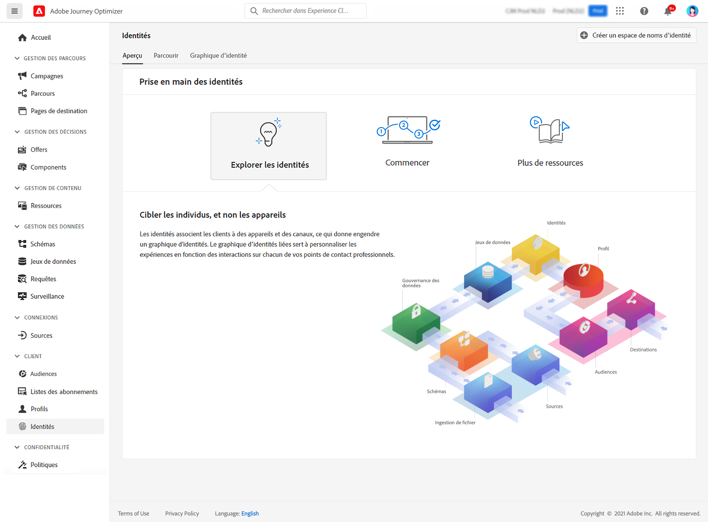

# Prise en main des identités {#identities-gs}

Une identité est une donnée propre à une entité, généralement un objet du monde réel, tel qu’une personne, un périphérique matériel ou un navigateur web. Une identité entièrement qualifiée se compose de deux éléments :

* La variable **espace de noms d’identité** sert d’indicateur du contexte auquel une identité se rapporte.
* La variable **valeur d’identité** est une chaîne qui représente une entité.

Prenons le numéro 555-555-1234. Dans cet exemple, la chaîne &quot;555-555-1234&quot; est une **valeur d’identité**, qui peut être classé dans un &quot;Téléphone&quot; **espace de noms d’identité**.

La variable **Identités** dans [!DNL Adobe Journey Optimizer] vous permet de parcourir efficacement les différents identifiants qui composent les clients de votre base de données.

Il fournit une **Graphique d’identités**, qui est une carte des relations entre les différentes identités d’un client particulier, vous fournissant une représentation visuelle de la manière dont votre client interagit avec votre marque sur différents canaux. Tous les graphiques d’identités de client sont gérés et mis à jour collectivement par Adobe Experience Platform Identity Service, en réponse à l’activité des clients.

Vous trouverez des informations détaillées sur l’utilisation des identités dans la section [Documentation d’Identity Service](https://experienceleague.adobe.com/docs/experience-platform/identity/home.html?lang=fr){target="_blank"}.
