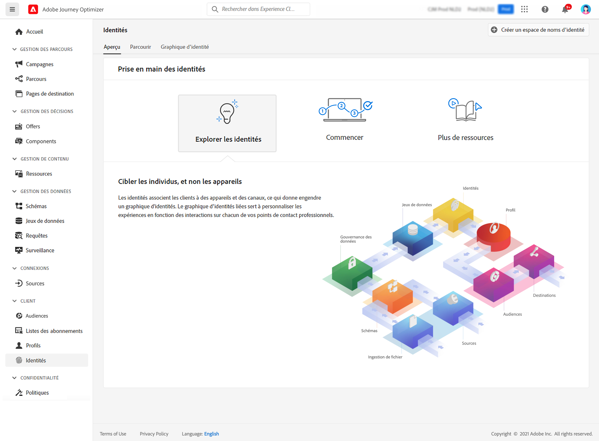

# Prise en main des identités {#identities-gs}

Une identité correspond à des données propres à une entité, généralement un objet du monde réel, tel qu’une personne, un appareil matériel ou un navigateur web. Une identité complète se compose de deux éléments :

* L’**espace de noms d’identité** sert d’indicateur du contexte auquel une identité se rapporte.
* La **valeur d’identité** est une chaîne qui représente une entité.

Prenons l’exemple du numéro de téléphone 555-555-1234. Dans ce cas, la chaîne « 555-555-1234 » est une **valeur d’identité** qui peut être classée dans un « Téléphone » **espace de noms d’identité**.

Le menu **Identités** de [!DNL Adobe Journey Optimizer] permet aux utilisateurs de parcourir efficacement les différents identifiants qui constituent les clients dans leur base de données.

Il fournit un **graphique d’identités**, qui est une carte des relations entre différentes identités pour un client particulier. Ce graphique offre une représentation visuelle de la manière dont un client interagit avec une marque sur différents canaux. Tous les graphiques d’identités client sont gérés et mis à jour collectivement par Adobe Experience Platform Identity Service en réponse à l’activité du client.

Vous trouverez des informations détaillées sur l’utilisation des identités dans la [documentation du service d’identités](https://experienceleague.adobe.com/docs/experience-platform/identity/home.html){target="_blank"}.

>[!MORELIKETHIS]
>
>* [Prise en main de la gestion des données dans Journey Optimizer](../data/gs-data.md)
>* [Prise en main des profils](get-started-profiles.md)
>* [Documentation Identity Service](https://experienceleague.adobe.com/docs/experience-platform/identity/home.html){target="_blank"}