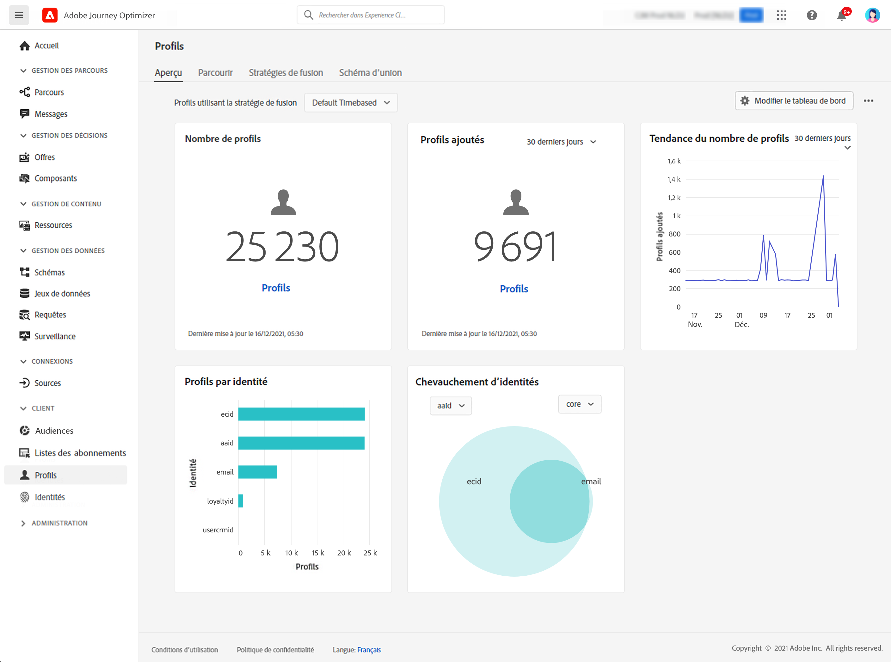

# Prise en main des profils {#profiles-gs}

## À propos des profils

Tirez profit du profil client en temps réel dans [!DNL Adobe Journey Optimizer] pour obtenir une vue d’ensemble de chaque client en combinant des données issues de plusieurs canaux, notamment des données en ligne, hors ligne, CRM et tierces. Les **profils** vous permettent de consolider vos données client en une vue unifiée offrant un compte horodaté et exploitable de chaque interaction client.

➡️ [Découvrez cette fonctionnalité en vidéo.](#video)

**Profil client en temps réel** : intégrez les attributs et les événements clients provenant de sources en ligne, hors ligne et pseudonymes dans un profil unique et unifié.Utilisez le profil pour impliquer les clientes et clients avec des expériences personnalisées en temps réel sur plusieurs points de contact.

**Ingestion de données** : connectez-vous à diverses sources de données pour ingérer des données comportementales, transactionnelles, financières et opérationnelles. Ingérez des données en temps réel ou par le biais de chargements par lots pour maintenir les profils à jour en permanence.

>[!NOTE]
>
>Lors de l’ingestion de données, les adresses e-mail respectent la casse. Cela signifie que des profils peuvent être créés en double (par exemple, un profil pour John.Greene@luma.com, un autre pour john.greene@luma.com) et utilisés lors du ciblage du destinataire correspondant dans vos parcours et campagnes [!DNL Journey Optimizer].

**Graphique d’identité** : combinez des données provenant de différentes sources à l’aide d’identités de clientes et clients, telles que des identifiants de fidélité ou des identifiants de système CRM.Créez une vue d’ensemble exhaustive du client ou de la cliente en mappant les relations entre les différentes identités dans les jeux de données d’une marque.

**Engagement de la cliente ou du client** : utilisez le profil client en temps réel pour offrir des expériences contextuelles et personnalisées, telles que des offres et des messages ciblés.Interagissez avec les clients et les clientes sur différents canaux, notamment les campagnes marketing, le service clientèle et les mises à jour transactionnelles.

**Partage de données** : partagez des profils clients avec les principaux fournisseurs d’espace de stockage dans le cloud tels qu’Amazon Web Services, Microsoft Azure et Google Cloud. Utilisez des profils partagés pour la création de rapports, l’archivage données ou une analyse plus approfondie avec des outils de Business Intelligence.

>[!MORELIKETHIS]
>
>* [Documentation sur le profil client en temps réel](https://experienceleague.adobe.com/fr/docs/experience-platform/query/home){target="_blank"}
>* [Mécanismes de sécurisation par défaut pour les données de profil client en temps réel et la segmentation](https://experienceleague.adobe.com/fr/docs/experience-platform/profile/guardrails){target="_blank"}
>* [Documentation sur l’ingestion de données](https://experienceleague.adobe.com/fr/docs/experience-platform/ingestion/home){target="_blank"}

## Tableau de bord des profils

Pour accéder aux profils, accédez au menu **[!UICONTROL Client ou cliente]**/**[!UICONTROL Profils]** dans le volet de navigation de gauche.

>[!NOTE]
>
>Si votre organisation débute avec [!DNL Adobe Journey Optimizer] et ne dispose pas encore de jeux de données ou de politiques de fusion actifs, le tableau de bord **Profils** n’est pas visible. À la place, l’onglet **Vue d’ensemble** affiche des liens vers la documentation d’Adobe Experience Platform pour vous aider à commencer à utiliser le profil client en temps réel. Pour découvrir comment utiliser le **tableau de bord du profil**, ainsi que pour obtenir des informations détaillées sur les mesures affichées dans le tableau de bord, consultez [cette section](https://experienceleague.adobe.com/docs/experience-platform/profile/ui/user-guide.html?lang=fr){target="_blank"}.

Vous pouvez rassembler des données issues de plusieurs sources et les combiner pour obtenir une vue complète de chacun de vos clients ou chacune de vos clientes. Lors de la combinaison de ces données, les politiques de fusion sont les règles utilisées pour déterminer quelle est la priorité des données et quelles données sont combinées pour créer cette vue unifiée. En savoir plus sur les **politiques de fusion** dans cette [documentation](https://experienceleague.adobe.com/docs/experience-platform/profile/merge-policies/ui-guide.html?lang=fr){target="_blank"}.

## Vidéo pratique {#video}

Découvrez comment Adobe Experience Platform assemble et met à jour des profils clients en temps réel et la façon dont vous pouvez y accéder et les utiliser.

>[!VIDEO](https://video.tv.adobe.com/v/31639?captions=fre_fr&quality=12)
