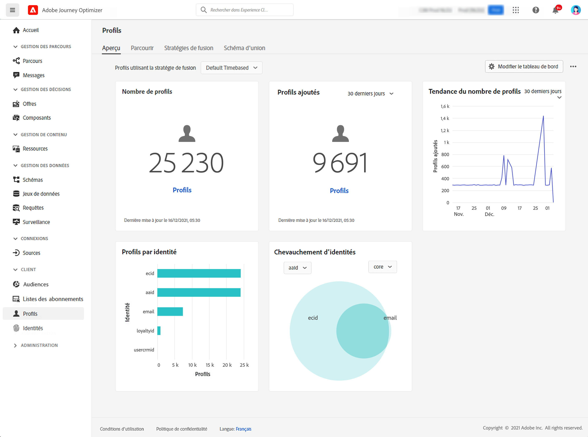

# Prise en main des profils {#profiles-gs}

>[!BEGINSHADEBOX]

**Sur cette page :** découvrez comment le profil client en temps réel dans Adobe Journey Optimizer unifie les données client provenant de sources en ligne, hors ligne et tierces en une seule vue et comment accéder au tableau de bord des profils.

>[!ENDSHADEBOX]

## À propos des profils

Tirez profit du profil client en temps réel dans [!DNL Adobe Journey Optimizer] pour obtenir une vue d’ensemble de chaque client en combinant des données issues de plusieurs canaux, notamment des données en ligne, hors ligne, CRM et tierces. Les **profils** vous permettent de consolider vos données client en une vue unifiée offrant un compte horodaté et exploitable de chaque interaction client.

➡️ [Découvrez cette fonctionnalité en vidéo.](#video)

**Real-time Customer Profile&#x200B;** - Intégrez les attributs et les événements du client provenant de sources en ligne, hors ligne et pseudonymes dans un profil unique et unifié. &#x200B;Utilisez le profil pour impliquer les clients avec des expériences personnalisées en temps réel sur plusieurs points de contact. &#x200B;

**Ingestion de données** : connectez-vous à diverses sources de données pour ingérer des données comportementales, transactionnelles, financières et opérationnelles. Ingérez des données en temps réel ou par le biais de chargements par lots pour maintenir les profils à jour en permanence. Les profils ne sont pas créés directement dans l’interface [!DNL Journey Optimizer] ; ils sont automatiquement créés ou mis à jour dans Adobe Experience Platform lors de l’ingestion des données.

>[!NOTE]
>
>Lors de l’ingestion de données, les e-mails sont sensibles à la casse. Cela signifie que des profils peuvent être créés en double (par exemple, un profil pour John.Greene@luma.com, un autre pour john.greene@luma.com) et utilisés lors du ciblage du destinataire correspondant dans vos parcours et campagnes [!DNL Journey Optimizer].

**Graphique d’identités** - Combinez des données provenant de différentes sources à l’aide des identités du client, telles que les identifiants de fidélité ou les identifiants système CRM. &#x200B;Créez une vue d’ensemble complète du client en mappant les relations entre les différentes identités dans les jeux de données d’une marque. &#x200B;

**Engagement client** - Utilisez le profil client en temps réel pour offrir des expériences contextuelles personnalisées, telles que des offres et des messages ciblés. &#x200B;Impliquez les clients sur différents canaux, notamment les campagnes marketing, le service clientèle et les mises à jour transactionnelles. &#x200B;

**Partage de données** : partagez des profils clients avec les principaux fournisseurs d’espace de stockage dans le cloud tels qu’Amazon Web Services, Microsoft Azure et Google Cloud. Utilisez des profils partagés pour la création de rapports, l’archivage données ou une analyse plus approfondie avec des outils de Business Intelligence.

## Profils et utilisation des licences engageables {#engageable-profiles}

Un **profil engageable** est un enregistrement d’informations représentant un individu qui est stocké dans le service de profil et qui a été engagé par des parcours ou des campagnes. Il s’agit de la mesure de licence clé pour [!DNL Adobe Journey Optimizer].

Caractéristiques principales :

* **Fenêtre dynamique de 12 mois** : le nombre reflète les profils uniques que vous avez tenté d’impliquer au cours des 12 derniers mois à l’aide des fonctionnalités de création, de prise de décision, de diffusion, d’expérimentation ou d’orchestration de Journey Optimizer.
* **Comptabilisé une fois par sandbox** : un profil qui accède à plusieurs parcours ou campagnes dans un sandbox est comptabilisé comme un seul profil engageable pour ce sandbox.
* **En fonction de votre audience adressable** : les profils engageables sont calculés à partir de votre audience adressable. Le nombre représente l’audience engagée au cours des 12 derniers mois à l’aide de l’une des fonctionnalités de Journey Optimizer, sur l’ensemble de votre audience adressable.
* **Comportement de la mesure** : nombre de profils engageables :
   * Peut augmenter lorsque de nouveaux profils sont engagés par le biais de parcours ou de campagnes
   * Diminution impossible sauf s’il n’y a aucun engagement avec certains profils pendant plus de 12 mois
   * Peut diminuer lorsque des profils pseudonymes sont regroupés en profils connus

>[!TIP]
>
>Lors du ciblage de profils pseudonymes (visiteurs non authentifiés) avec des canaux entrants tels que des expériences web, in-app ou basées sur du code, pensez à définir une durée de vie (TTL) pour la suppression automatique des profils afin de gérer le nombre de profils pouvant être engagés et les coûts associés. [En savoir plus sur les mécanismes de sécurisation du canal entrant](../start/guardrails.md#profile-management-inbound)

Surveillez à tout moment le nombre de profils engageables de votre entreprise depuis **[!UICONTROL Administration]** > **[!UICONTROL Utilisation de la licence]**. Si vous constatez un pic soudain dans le nombre de problèmes, reportez-vous à la [section Dépannage](license-usage.md#troubleshooting-engageable-profiles) pour obtenir des conseils détaillés. [En savoir plus sur le tableau de bord Utilisation des licences](license-usage.md)

>[!MORELIKETHIS]
>
>* [Commencer avec la gestion des données dans Journey Optimizer](../data/gs-data.md)
>* [Documentation sur le profil client en temps réel](https://experienceleague.adobe.com/docs/experience-platform/query/home.html?lang=fr){target="_blank"}
>* [Mécanismes de sécurisation par défaut pour les données de profil client en temps réel et la segmentation](https://experienceleague.adobe.com/fr/docs/experience-platform/profile/guardrails){target="_blank"}
>* [Documentation sur l’ingestion de données](https://experienceleague.adobe.com/fr/docs/experience-platform/ingestion/home){target="_blank"}

## Tableau de bord des profils

Pour accéder aux profils, accédez au menu **[!UICONTROL Client ou cliente]**/**[!UICONTROL Profils]** dans le volet de navigation de gauche.

>[!NOTE]
>
>Si votre organisation débute avec [!DNL Adobe Journey Optimizer] et ne dispose pas encore de jeux de données ou de politiques de fusion actifs, le tableau de bord **Profils** n’est pas visible. À la place, l’onglet **Vue d’ensemble** affiche des liens vers la documentation d’Adobe Experience Platform pour vous aider à commencer à utiliser le profil client en temps réel. Pour découvrir comment utiliser le **tableau de bord du profil**, ainsi que pour obtenir des informations détaillées sur les mesures affichées dans le tableau de bord, consultez [cette section](https://experienceleague.adobe.com/docs/experience-platform/profile/ui/user-guide.html?lang=fr){target="_blank"}.

Vous pouvez rassembler des données issues de plusieurs sources et les combiner pour obtenir une vue complète de chacun de vos clients ou chacune de vos clientes. Lors de la combinaison de ces données, les politiques de fusion sont les règles utilisées pour déterminer quelle est la priorité des données et quelles données sont combinées pour créer cette vue unifiée. En savoir plus sur les **politiques de fusion** dans cette [documentation](https://experienceleague.adobe.com/docs/experience-platform/profile/merge-policies/ui-guide.html?lang=fr){target="_blank"}.

## Vidéo pratique {#video}

Découvrez comment Adobe Experience Platform assemble et met à jour des profils clients en temps réel et la façon dont vous pouvez y accéder et les utiliser.

>[!VIDEO](https://video.tv.adobe.com/v/27251?quality=12)
