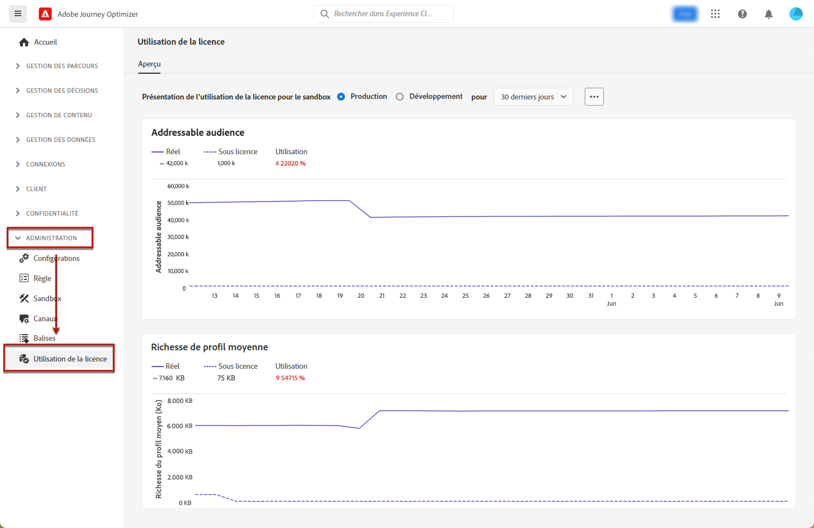

# Tableau de bord d’utilisation des licences {#license-usage}

L’[interface d’utilisation](../start/user-interface.md) d’[!DNL Adobe Journey Optimizer] fournit un tableau de bord qui affiche des informations importantes sur l’utilisation des licences de votre entreprise, telles qu’elles sont capturées lors d’un instantané quotidien.

Pour accéder à ce tableau de bord, accédez à **[!UICONTROL Administration]** > **[!UICONTROL Utilisation des licences]**. L’onglet **[!UICONTROL Vue d’ensemble]** s’ouvre alors. Il affiche le tableau de bord.

>[!NOTE]
>
>* Pour afficher le tableau de bord, vous devez disposer de l’autorisation [Afficher le tableau de bord d’utilisation des licences](https://experienceleague.adobe.com/docs/experience-platform/dashboards/permissions.html?lang=fr#available-permissions){target="_blank"}.
>
>* Certaines mesures (par exemple, les heures de calcul, les e-mails) ne sont pas affichées pour les sandbox de développement, comme indiqué par `N/A` dans la colonne quota. Seules les valeurs non nulles sont affichées dans le tableau de bord : lorsque les mesures sont nulles ou proches de zéro, elles ne sont pas renseignées.

Pour [!DNL Adobe Journey Optimizer], le tableau de bord permet de consulter le nombre de **profils engageables**. Un profil engageable est un enregistrement d’informations représentant une personne, stocké dans le service de profil. Ces enregistrements sont des profils avec lesquels vous avez tenté d’interagir à l’aide des fonctionnalités de création, de prise de décision, de diffusion, d’expérimentation ou d’orchestration de Journey Optimizer au cours des 12 derniers mois.

Pour en savoir plus, consultez la documentation Adobe Experience Platform :

* [Vue d’ensemble du tableau de bord d’utilisation des licences](https://experienceleague.adobe.com/docs/experience-platform/dashboards/guides/license-usage.html?lang=fr){target="_blank"}
* [Exploration du tableau de bord d’utilisation des licences](https://experienceleague.adobe.com/docs/experience-platform/dashboards/guides/license-usage.html?lang=fr#exploring-the-license-usage-dashboard){target="_blank"}
* [Mesures disponibles](https://experienceleague.adobe.com/docs/experience-platform/dashboards/guides/license-usage.html?lang=fr#available-metrics){target="_blank"}
